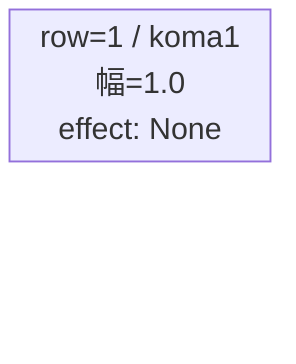
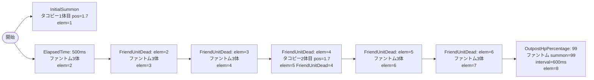

# vd_tak_boss_00001 インゲームデータ詳細解説

> 参照リポジトリ: `projects/glow-masterdata`
> リリースキー: 202604010

## インゲーム要件テキスト

ボスはタコピー（`c_tak_00001_vd_Boss_Blue`、HP=10000、青属性、Defenseロール）が開幕 InitialSummon で砦付近（position=1.7）に配置される。タコピーはダメージを受けるまで静止し（move_start=Damage:1）、戦闘開始の緊張感を演出する。ElapsedTime=500ms からファントム（`e_glo_00001_vd_Normal_Colorless`）が interval=500ms で3体ずつ押し寄せ、倒すたびに次のファントムウェーブが連鎖する（FriendUnitDead=1/3/5 で各3体追加）。ファントムを8体倒すと2体目のタコピーが FriendUnitDead でチェーン登場し、さらに15体倒したタイミングで OutpostHpPercentage=99 が発火、ファントムが interval=600ms で無限補充（summon_count=99）に切り替わる。UR対抗キャラ「ハッピー星からの使者 タコピー」に対し、タコピー自身がボスとして繰り返し出現する「自己対峙」設計。

コマは1行構成（bossブロック固定）。幅1.0の1コマフル構成（パターン1）。コマアセットキーは `glo_00004`（tak作品向けアセット）、back_ground_offset は `0.0`（仮値）。

UR対抗キャラ（ハッピー星からの使者 タコピー / `chara_tak_00001`）が bosskill 対象であり、タコピーが敵ボスとして二重で登場する構造が対抗の狙いとなる。プレイヤーは自分が持つタコピーで、敵タコピーを撃退するという「タコピー vs タコピー」の対決演出を体験する。

---

## レベルデザイン

### 敵キャラ設計

#### 敵キャラ選定（MstEnemyCharacter）

| mst_enemy_character_id | 日本語名 | 役割 | 備考 |
|------------------------|---------|------|------|
| `chara_tak_00001` | ハッピー星からの使者 タコピー | ボス | VD専用パラメータ `c_tak_00001_vd_Boss_Blue` を使用 |
| `enemy_glo_00001` | ファントム | 雑魚 | VD汎用ファントム `e_glo_00001_vd_Normal_Colorless` を使用 |

#### 敵キャラステータス（MstEnemyStageParameter）

> 既存の `vd_all/data/MstEnemyStageParameter.csv` から参照

| MstEnemyStageParameter ID | 日本語名 | kind | role | color | base_hp | base_atk | base_spd | well_dist | knockback | combo | drop_bp |
|--------------------------|---------|------|------|-------|---------|----------|----------|-----------|-----------|-------|---------|
| `c_tak_00001_vd_Boss_Blue` | ハッピー星からの使者 タコピー | Boss | Defense | Blue | 10000 | 300 | 25 | 0.17 | 4 | 5 | 400 |
| `e_glo_00001_vd_Normal_Colorless` | ファントム | Normal | Attack | Colorless | 5000 | 100 | 34 | 0.22 | 3 | 1 | 150 |

---

### コマ設計

| row | height | 選択パターン | コマ数 | 各幅 | 幅合計 |
|-----|--------|------------|-------|------|--------|
| 1 | 1.0 | パターン1 | 1 | 1.0 | 1.0 |

---

### 敵キャラシーケンス設計

> **c_キャラ同時出現ルール（プランナー確認済み）**: c_キャラ（`c_` プレフィックス）が複数体登場する場合、
> 初回のみ `ElapsedTime` または `InitialSummon`、2体目以降は `FriendUnitDead`（前の c_キャラの sequence_element_id を
> condition_value に指定）でチェーンすること。また c_キャラの `summon_count` は必ず `1` とすること。`e_glo_*` は対象外。

#### どのフェーズで、どの敵を、いつ、どこに、どのくらい出現させるか

| elem | 出現タイミング | 敵 | 数 | 召喚位置 |
|------|-------------|---|---|---------|
| 1 | InitialSummon=0 | タコピー（Boss） | 1 | position=1.7 |
| 2 | ElapsedTime=500ms | ファントム | 3 | ランダム |
| 3 | FriendUnitDead=2 | ファントム | 3 | ランダム |
| 4 | FriendUnitDead=3 | ファントム | 3 | ランダム |
| 5 | FriendUnitDead=4 | タコピー2体目（Boss） | 1 | position=1.7 |
| 6 | FriendUnitDead=5 | ファントム | 3 | ランダム |
| 7 | FriendUnitDead=6 | ファントム | 3 | ランダム |
| 8 | OutpostHpPercentage=99 | ファントム（無限補充） | 99 | ランダム |

#### 敵キャラの固有ステータス調整（hp_coef / atk_coef）

| フェーズ | 敵 | base_hp | hp_coef | 実HP | base_atk | atk_coef | 実ATK |
|---------|---|---------|---------|------|----------|----------|-------|
| ボス初期配置 | タコピー | 10000 | 1.0 | 10000 | 300 | 1.0 | 300 |
| 雑魚ウェーブ | ファントム | 5000 | 1.0 | 5000 | 100 | 1.0 | 100 |
| ボス2体目 | タコピー | 10000 | 1.0 | 10000 | 300 | 1.0 | 300 |
| 無限補充 | ファントム | 5000 | 1.0 | 5000 | 100 | 1.0 | 100 |

#### フェーズ切り替えはあるか

なし（VDではSwitchSequenceGroup使用禁止）

---

## 演出

### アセット

#### 背景

| 設定箇所 | アセットキー | 備考 |
|---------|------------|------|
| loop_background_asset_key | `""` | tak作品はBossでも空文字（未定作品の場合は空文字） |

#### BGM

| 設定 | 値 | 備考 |
|-----|---|------|
| bgm_asset_key | `SSE_SBG_003_004` | bossブロック固定BGM |
| boss_bgm_asset_key | `""` | 空文字固定（VD共通） |

---

### 敵キャラオーラ

| オーラ種別 | 使用箇所 |
|----------|---------|
| `Boss` | タコピー（elem=1, elem=5）の召喚時。全作品共通「降臨ボスオーラ1」 |
| `Default` | ファントム（elem=2〜8）の召喚時 |

---

### 敵キャラ召喚アニメーション

- InitialSummon（elem=1）: タコピーが砦付近（position=1.7）に Boss オーラ付きで出現。ダメージを受けるまで静止。
- ElapsedTime=500ms（elem=2）: ファントム3体が interval=500ms で順次ランダム位置に出現。
- FriendUnitDead チェーン（elem=3〜7）: ファントムを倒すたびに次のファントムが3体ずつ補充。elem=5でタコピー2体目が再びBossオーラで登場。
- OutpostHpPercentage=99（elem=8）: 拠点に初ダメージが入った瞬間、ファントムが interval=600ms で無限補充に切り替わる。

---

## MstInGame 設定値まとめ

| カラム | 値 |
|--------|---|
| id | `vd_tak_boss_00001` |
| release_key | `202604010` |
| mst_auto_player_sequence_id | `""` |
| mst_auto_player_sequence_set_id | `vd_tak_boss_00001` |
| bgm_asset_key | `SSE_SBG_003_004` |
| boss_bgm_asset_key | `""` |
| loop_background_asset_key | `""` |
| player_outpost_asset_key | `""` |
| mst_page_id | `vd_tak_boss_00001` |
| mst_enemy_outpost_id | `vd_tak_boss_00001` |
| mst_defense_target_id | `__NULL__` |
| boss_mst_enemy_stage_parameter_id | `c_tak_00001_vd_Boss_Blue` |
| boss_count | （空） |
| normal_enemy_hp_coef | `1.0` |
| normal_enemy_attack_coef | `1.0` |
| normal_enemy_speed_coef | `1.0` |
| boss_enemy_hp_coef | `1.0` |
| boss_enemy_attack_coef | `1.0` |
| boss_enemy_speed_coef | `1.0` |

## MstEnemyOutpost 設定値まとめ

| カラム | 値 |
|--------|---|
| id | `vd_tak_boss_00001` |
| release_key | `202604010` |
| hp | `100` |
| outpost_asset_key | `""` |
| artwork_asset_key | `""` |
| is_damage_invalidation | （空） |

## MstPage 設定値まとめ

| カラム | 値 |
|--------|---|
| id | `vd_tak_boss_00001` |
| release_key | `202604010` |

## MstKomaLine 設定値まとめ

| カラム | 値 | 備考 |
|--------|---|------|
| id | `vd_tak_boss_00001_1` | row=1のみ（bossブロックは1行固定） |
| release_key | `202604010` | |
| mst_page_id | `vd_tak_boss_00001` | |
| row | `1` | |
| height | `1.0` | |
| koma_line_layout_asset_key | `1` | パターン1（1コマフル幅） |
| koma1_asset_key | `glo_00004` | series-koma-assets.csv より tak→glo_00004 |
| koma1_back_ground_offset | `0.0` | tak実績データなし。仮値（koma-background-offset.md参照） |
| koma1_effect_type | `None` | |
| koma1_effect_parameter1 | `0` | |
| koma1_effect_parameter2 | `0` | |
| koma1_effect_target_colors | `All` | |
| koma1_effect_target_roles | `All` | |
| koma2_effect_type | `None` | |
| koma3_effect_type | `None` | |
| koma4_effect_type | `None` | |

## MstAutoPlayerSequence 設定値まとめ

| id | sequence_set_id | sequence_group_id | sequence_element_id | condition_type | condition_value | action_type | action_value | summon_count | summon_interval | summon_animation_type | summon_position | move_start_condition_type | move_start_condition_value | aura_type | death_type | enemy_hp_coef | enemy_attack_coef | enemy_speed_coef | defeated_score | move_stop_condition_type | move_restart_condition_type | deactivation_condition_type |
|----|-----------------|-------------------|---------------------|---------------|-----------------|-------------|--------------|-------------|----------------|----------------------|----------------|--------------------------|---------------------------|-----------|------------|--------------|-------------------|-----------------|----------------|--------------------------|----------------------------|-----------------------------|
| vd_tak_boss_00001_1 | vd_tak_boss_00001 | | 1 | InitialSummon | 0 | SummonEnemy | c_tak_00001_vd_Boss_Blue | 1 | 0 | None | 1.7 | Damage | 1 | Boss | Normal | 1.0 | 1.0 | 1.0 | 0 | None | None | None |
| vd_tak_boss_00001_2 | vd_tak_boss_00001 | | 2 | ElapsedTime | 50 | SummonEnemy | e_glo_00001_vd_Normal_Colorless | 3 | 500 | None | | None | | Default | Normal | 1.0 | 1.0 | 1.0 | 0 | None | None | None |
| vd_tak_boss_00001_3 | vd_tak_boss_00001 | | 3 | FriendUnitDead | 2 | SummonEnemy | e_glo_00001_vd_Normal_Colorless | 3 | 500 | None | | None | | Default | Normal | 1.0 | 1.0 | 1.0 | 0 | None | None | None |
| vd_tak_boss_00001_4 | vd_tak_boss_00001 | | 4 | FriendUnitDead | 3 | SummonEnemy | e_glo_00001_vd_Normal_Colorless | 3 | 500 | None | | None | | Default | Normal | 1.0 | 1.0 | 1.0 | 0 | None | None | None |
| vd_tak_boss_00001_5 | vd_tak_boss_00001 | | 5 | FriendUnitDead | 4 | SummonEnemy | c_tak_00001_vd_Boss_Blue | 1 | 0 | None | 1.7 | Damage | 1 | Boss | Normal | 1.0 | 1.0 | 1.0 | 0 | None | None | None |
| vd_tak_boss_00001_6 | vd_tak_boss_00001 | | 6 | FriendUnitDead | 5 | SummonEnemy | e_glo_00001_vd_Normal_Colorless | 3 | 500 | None | | None | | Default | Normal | 1.0 | 1.0 | 1.0 | 0 | None | None | None |
| vd_tak_boss_00001_7 | vd_tak_boss_00001 | | 7 | FriendUnitDead | 6 | SummonEnemy | e_glo_00001_vd_Normal_Colorless | 3 | 500 | None | | None | | Default | Normal | 1.0 | 1.0 | 1.0 | 0 | None | None | None |
| vd_tak_boss_00001_8 | vd_tak_boss_00001 | | 8 | OutpostHpPercentage | 99 | SummonEnemy | e_glo_00001_vd_Normal_Colorless | 99 | 600 | None | | None | | Default | Normal | 1.0 | 1.0 | 1.0 | 0 | None | None | None |
