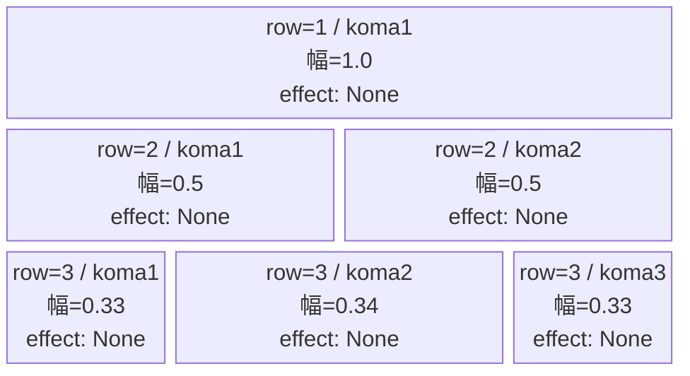
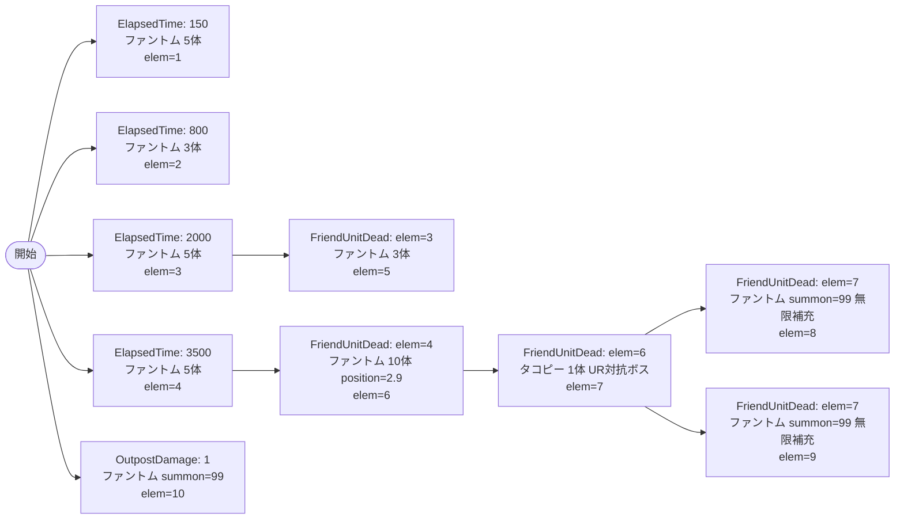

# vd_tak_normal_00001 インゲームデータ詳細解説

> 参照リポジトリ: `projects/glow-masterdata`
> リリースキー: 202604010

## インゲーム要件テキスト

タコピーの原罪作品の雑魚はファントム（`e_glo_00001_vd_Normal_Colorless`）を中心に構成し、序盤はElapsedTimeで定期的に送り込んだあと、倒した数に応じてFriendUnitDeadで段階的に強化。elem=4のファントムが1体倒された時点で後方（position=2.9）に10体の大波が押し寄せ、さらにその1体が倒されるとUR対抗キャラである「ハッピー星からの使者 タコピー」（`c_tak_00001_vd_Boss_Blue`）が登場する設計。タコピー撃破後に無限補充ラッシュへ移行し、合計雑魚出現数は31体（summon_count=99×3本含む）を達成。

コマは3行構成。行1は1コマ全幅でエフェクトなし、行2は2コマ（0.5:0.5の均等割り）でエフェクトなし、行3は3コマ（0.33:0.34:0.33の3等分）でエフェクトなし。コマアセットキーは`glo_00004`（takシリーズ用）。

「ハッピー星からの使者 タコピー」（Blue・Bossオーラ）は「UR タコピー（`chara_tak_00001`）」の対抗ユニットとして設計されており、倒すほど強くなる圧力設計によって「タコピーURを使わないと止まらない」体験を目指している。

---

## レベルデザイン

### 敵キャラ設計

#### 敵キャラ選定（MstEnemyCharacter）

| mst_enemy_character_id | 日本語名 | 役割 | 備考 |
|------------------------|---------|------|------|
| enemy_glo_00001 | ファントム | 雑魚 | VD汎用ファントム |
| chara_tak_00001 | ハッピー星からの使者 タコピー | UR対抗ボス | UR `chara_tak_00001` の対抗 |

#### 敵キャラステータス（MstEnemyStageParameter）

> vd_all/data/MstEnemyStageParameter.csv より参照（release_key=202604010）

| MstEnemyStageParameter ID | 日本語名 | kind | role | color | base_hp | base_atk | base_spd | well_dist | knockback | combo | drop_bp |
|--------------------------|---------|------|------|-------|---------|----------|----------|-----------|-----------|-------|---------|
| e_glo_00001_vd_Normal_Colorless | ファントム | Normal | Attack | Colorless | 5000 | 100 | 34 | 0.22 | 3 | 1 | 150 |
| c_tak_00001_vd_Boss_Blue | ハッピー星からの使者 タコピー | Boss | Defense | Blue | 10000 | 300 | 25 | 0.17 | 4 | 5 | 400 |

---

### コマ設計

※ columns は1つのみ。各行のスパン合計 = 4 になること。

| row | height | 選択パターン | コマ数 | 各幅 | 幅合計 |
|-----|--------|------------|-------|------|--------|
| 1 | 0.33 | パターン1 | 1 | 1.0 | 1.0 |
| 2 | 0.33 | パターン6 | 2 | 0.5, 0.5 | 1.0 |
| 3 | 0.34 | パターン7 | 3 | 0.33, 0.34, 0.33 | 1.0 |

---

### 敵キャラシーケンス設計

> **c_キャラ同時出現ルール（プランナー確認済み）**: c_キャラ（`c_` プレフィックス）が複数体登場する場合、
> 初回のみ `ElapsedTime`、2体目以降は `FriendUnitDead`（前の c_キャラの sequence_element_id を
> condition_value に指定）でチェーンすること。また c_キャラの `summon_count` は必ず `1` とすること。`e_glo_*` は対象外。

#### どのフェーズで、どの敵を、いつ、どこに、どのくらい出現させるか

| elem | 出現タイミング | 敵 | 数 | 累計出現数/召喚位置 |
|------|-------------|---|---|-----------------|
| 1 | ElapsedTime=150 (1500ms) | ファントム (e_glo_00001_vd_Normal_Colorless) | 5 | 5体 / random |
| 2 | ElapsedTime=800 (8000ms) | ファントム (e_glo_00001_vd_Normal_Colorless) | 3 | 8体 / random |
| 3 | ElapsedTime=2000 (20000ms) | ファントム (e_glo_00001_vd_Normal_Colorless) | 5 | 13体 / random |
| 4 | ElapsedTime=3500 (35000ms) | ファントム (e_glo_00001_vd_Normal_Colorless) | 5 | 18体 / random |
| 5 | FriendUnitDead=3 (elem=3のキャラが1体倒された時) | ファントム (e_glo_00001_vd_Normal_Colorless) | 3 | 21体 / random |
| 6 | FriendUnitDead=4 (elem=4のキャラが1体倒された時) | ファントム (e_glo_00001_vd_Normal_Colorless) | 10 | 31体 / position=2.9 |
| 7 | FriendUnitDead=6 (elem=6のキャラが1体倒された時) | ハッピー星からの使者 タコピー (c_tak_00001_vd_Boss_Blue) | 1 | 32体 / random |
| 8 | FriendUnitDead=7 (elem=7のキャラが1体倒された時) | ファントム (e_glo_00001_vd_Normal_Colorless) | 99 | +99体 / random, interval=500 |
| 9 | FriendUnitDead=7 (elem=7のキャラが1体倒された時) | ファントム (e_glo_00001_vd_Normal_Colorless) | 99 | +99体 / position=2.9, interval=750 |
| 10 | OutpostDamage=1 (拠点に1ダメ入ったら) | ファントム (e_glo_00001_vd_Normal_Colorless) | 99 | +99体 / random, interval=1000 |

**シーケンス設計ポイント:**
- elem=1〜4: ElapsedTimeで序盤から定期的にファントムを送り込む（合計18体）
- elem=5: elem=3のファントムが1体倒されたら3体追加（倒し進めるほど補充される構造）
- elem=6: elem=4のファントムが1体倒されたら後方（position=2.9）に10体一気に押し出す強化ウェーブ
- elem=7: elem=6の1体が倒されたらUR対抗ボス「タコピー」が登場（c_キャラ・summon_count=1）
- elem=8&9: タコピー（elem=7）が1体倒されたらファントム無限補充2本が同時スタート（interval違いで密度を演出）
- elem=10: 拠点に初ダメージが入ったら独立した99補充が発動（バックアップ）

#### 敵キャラの固有ステータス調整（hp_coef / atk_coef）

| 波/フェーズ | 敵 | base_hp | hp_coef | 実HP | base_atk | atk_coef | 実ATK |
|-----------|---|---------|---------|------|----------|----------|-------|
| 序盤(elem1-4) | ファントム | 5000 | 1.0 | 5000 | 100 | 1.0 | 100 |
| 中盤強化(elem5-6) | ファントム | 5000 | 1.0 | 5000 | 100 | 1.0 | 100 |
| UR対抗ボス(elem7) | タコピー | 10000 | 1.0 | 10000 | 300 | 1.0 | 300 |
| 終盤無限補充(elem8-10) | ファントム | 5000 | 1.0 | 5000 | 100 | 1.0 | 100 |

#### フェーズ切り替えはあるか

なし（VDではSwitchSequenceGroup使用禁止）

---

## 演出

### アセット

#### 背景

| 設定箇所 | アセットキー | 備考 |
|---------|------------|------|
| loop_background_asset_key | （空文字） | tak Normalは背景アセットなし |
| koma1_asset_key | glo_00004 | takシリーズ用コマアセット |

#### BGM

| 設定 | 値 | 備考 |
|-----|---|------|
| bgm_asset_key | SSE_SBG_003_010 | Normalブロック固定BGM |
| boss_bgm_asset_key | （空文字） | VD固定・切り替えなし |

---

### 敵キャラオーラ

| オーラ種別 | 使用箇所 |
|----------|---------|
| Default | elem=1〜6 雑魚ファントム全般 |
| Boss | elem=7 タコピー（UR対抗ボス登場演出） |
| Default | elem=8〜10 終盤無限補充ファントム |

---

### 敵キャラ召喚アニメーション

elem=1〜4: ElapsedTimeで通常召喚（summon_animation_type=None）。序盤から着実にファントムが現れる。
elem=5〜6: FriendUnitDeadで追加召喚（None）。倒した直後に補充される緊張感。
elem=7: FriendUnitDeadで「ハッピー星からの使者 タコピー」が登場（None）。Bossオーラ付きで圧倒的存在感を演出。
elem=8〜10: タコピー撃破後・拠点ダメージを契機に無限補充開始。ファントムが途切れなく出現し続けるクライマックス。

---

## テーブル設定まとめ

### MstInGame

| カラム | 値 |
|-------|---|
| ENABLE | e |
| id | vd_tak_normal_00001 |
| release_key | 202604010 |
| mst_auto_player_sequence_id | （空文字） |
| mst_auto_player_sequence_set_id | vd_tak_normal_00001 |
| bgm_asset_key | SSE_SBG_003_010 |
| boss_bgm_asset_key | （空文字） |
| loop_background_asset_key | （空文字） |
| player_outpost_asset_key | （空文字） |
| mst_page_id | vd_tak_normal_00001 |
| mst_enemy_outpost_id | vd_tak_normal_00001 |
| mst_defense_target_id | __NULL__ |
| boss_mst_enemy_stage_parameter_id | （空文字） |
| boss_count | （空） |
| normal_enemy_hp_coef | 1.0 |
| normal_enemy_attack_coef | 1.0 |
| normal_enemy_speed_coef | 1.0 |
| boss_enemy_hp_coef | 1.0 |
| boss_enemy_attack_coef | 1.0 |
| boss_enemy_speed_coef | 1.0 |

> **注意**: VD Normalブロックのため `boss_mst_enemy_stage_parameter_id` は空文字。タコピー（UR対抗ボス）は MstAutoPlayerSequence の elem=7 （FriendUnitDead トリガー）でのみ召喚。

### MstPage

| カラム | 値 |
|-------|---|
| ENABLE | e |
| id | vd_tak_normal_00001 |
| release_key | 202604010 |

### MstEnemyOutpost

| カラム | 値 |
|-------|---|
| ENABLE | e |
| id | vd_tak_normal_00001 |
| hp | 100 |
| is_damage_invalidation | （空） |
| outpost_asset_key | （空） |
| artwork_asset_key | （要確認） |
| release_key | 202604010 |

### MstKomaLine（3行）

| id | mst_page_id | row | height | koma_line_layout_asset_key | koma1_asset_key | koma1_width | koma1_back_ground_offset | koma1_effect_type | koma1_effect_parameter1 | koma1_effect_parameter2 | koma1_effect_target_side | koma1_effect_target_colors | koma1_effect_target_roles | koma2_effect_type | koma3_effect_type | koma4_effect_type |
|----|------------|-----|--------|---------------------------|----------------|------------|--------------------------|------------------|------------------------|------------------------|--------------------------|--------------------------|--------------------------|------------------|------------------|------------------|
| vd_tak_normal_00001_1 | vd_tak_normal_00001 | 1 | 0.33 | 1 | glo_00004 | 1.0 | -1.0 | None | 0 | 0 | All | All | All | None | None | None |
| vd_tak_normal_00001_2 | vd_tak_normal_00001 | 2 | 0.33 | 6 | glo_00004 | 0.5 | -1.0 | None | 0 | 0 | All | All | All | None | None | None |
| vd_tak_normal_00001_3 | vd_tak_normal_00001 | 3 | 0.34 | 7 | glo_00004 | 0.33 | -1.0 | None | 0 | 0 | All | All | All | None | None | None |

> koma2_width（row2）= 0.5、koma2_width（row3）= 0.34、koma3_width（row3）= 0.33
> koma1_back_ground_offset = -1.0（takシリーズのデフォルト仮値。アセット担当者確認推奨）

### MstAutoPlayerSequence（10行）

| id | sequence_set_id | sequence_group_id | sequence_element_id | condition_type | condition_value | action_type | action_value | summon_count | summon_interval | summon_animation_type | summon_position | move_start_condition_type | move_stop_condition_type | move_restart_condition_type | aura_type | death_type | enemy_hp_coef | enemy_attack_coef | enemy_speed_coef | defeated_score | deactivation_condition_type | release_key |
|----|----------------|------------------|---------------------|---------------|----------------|-------------|-------------|-------------|----------------|----------------------|----------------|--------------------------|-------------------------|----------------------------|-----------|-----------|--------------|------------------|-----------------|---------------|----------------------------|------------|
| vd_tak_normal_00001_1 | vd_tak_normal_00001 | （空） | 1 | ElapsedTime | 150 | SummonEnemy | e_glo_00001_vd_Normal_Colorless | 5 | 0 | None | （空） | None | None | None | Default | Normal | 1.0 | 1.0 | 1.0 | 0 | None | 202604010 |
| vd_tak_normal_00001_2 | vd_tak_normal_00001 | （空） | 2 | ElapsedTime | 800 | SummonEnemy | e_glo_00001_vd_Normal_Colorless | 3 | 0 | None | （空） | None | None | None | Default | Normal | 1.0 | 1.0 | 1.0 | 0 | None | 202604010 |
| vd_tak_normal_00001_3 | vd_tak_normal_00001 | （空） | 3 | ElapsedTime | 2000 | SummonEnemy | e_glo_00001_vd_Normal_Colorless | 5 | 0 | None | （空） | None | None | None | Default | Normal | 1.0 | 1.0 | 1.0 | 0 | None | 202604010 |
| vd_tak_normal_00001_4 | vd_tak_normal_00001 | （空） | 4 | ElapsedTime | 3500 | SummonEnemy | e_glo_00001_vd_Normal_Colorless | 5 | 0 | None | （空） | None | None | None | Default | Normal | 1.0 | 1.0 | 1.0 | 0 | None | 202604010 |
| vd_tak_normal_00001_5 | vd_tak_normal_00001 | （空） | 5 | FriendUnitDead | 3 | SummonEnemy | e_glo_00001_vd_Normal_Colorless | 3 | 0 | None | （空） | None | None | None | Default | Normal | 1.0 | 1.0 | 1.0 | 0 | None | 202604010 |
| vd_tak_normal_00001_6 | vd_tak_normal_00001 | （空） | 6 | FriendUnitDead | 4 | SummonEnemy | e_glo_00001_vd_Normal_Colorless | 10 | 300 | None | 2.9 | None | None | None | Default | Normal | 1.0 | 1.0 | 1.0 | 0 | None | 202604010 |
| vd_tak_normal_00001_7 | vd_tak_normal_00001 | （空） | 7 | FriendUnitDead | 6 | SummonEnemy | c_tak_00001_vd_Boss_Blue | 1 | 0 | None | （空） | None | None | None | Boss | Normal | 1.0 | 1.0 | 1.0 | 0 | None | 202604010 |
| vd_tak_normal_00001_8 | vd_tak_normal_00001 | （空） | 8 | FriendUnitDead | 7 | SummonEnemy | e_glo_00001_vd_Normal_Colorless | 99 | 500 | None | （空） | None | None | None | Default | Normal | 1.0 | 1.0 | 1.0 | 0 | None | 202604010 |
| vd_tak_normal_00001_9 | vd_tak_normal_00001 | （空） | 9 | FriendUnitDead | 7 | SummonEnemy | e_glo_00001_vd_Normal_Colorless | 99 | 750 | None | 2.9 | None | None | None | Default | Normal | 1.0 | 1.0 | 1.0 | 0 | None | 202604010 |
| vd_tak_normal_00001_10 | vd_tak_normal_00001 | （空） | 10 | OutpostDamage | 1 | SummonEnemy | e_glo_00001_vd_Normal_Colorless | 99 | 1000 | None | （空） | None | None | None | Default | Normal | 1.0 | 1.0 | 1.0 | 0 | None | 202604010 |

> **整合性チェック**:
> - sequence_set_id = vd_tak_normal_00001 = MstInGame.id ✓
> - c_tak_00001_vd_Boss_Blue（elem=7）の summon_count = 1 ✓
> - c_キャラの複数体同時出現なし（elem=7のみ） ✓
> - 雑魚合計: elem1(5)+elem2(3)+elem3(5)+elem4(5)+elem5(3)+elem6(10) = 31体（99体補充除く） > 15体 ✓
> - SwitchSequenceGroup 未使用 ✓
> - mst_defense_target_id = __NULL__ ✓
> - mst_auto_player_sequence_id = 空文字 ✓
> - 全coefカラム = 1.0 ✓
