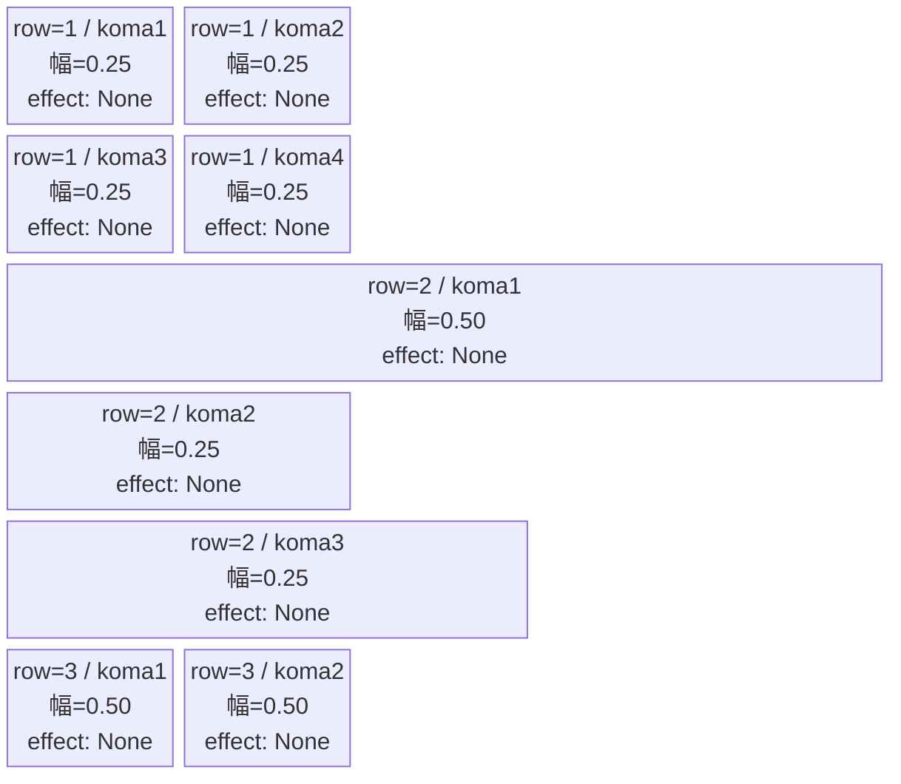
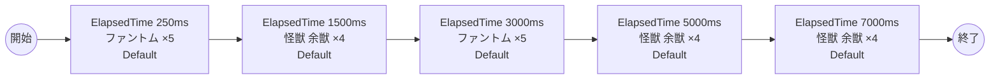

# vd_kai_normal_00001 インゲームデータ詳細解説

> 参照リポジトリ: `projects/glow-masterdata`
> リリースキー: 202604010

## インゲーム要件テキスト

怪獣8号の世界観を反映したノーマルブロックです。ステージに登場するのは、怪獣8号の作品に登場する「怪獣 余獣」（enemy_kai_00101）と、共通敵の「ファントム」（enemy_glo_00001）の2種類です。

難易度設計としては、開幕にファントムを複数体出現させてプレイヤーの初動を促し、その後時間差で余獣が複数波にわたって登場する構成をとっています。余獣とファントムはいずれも `e_` プレフィックスの純粋な敵キャラクターのため、c_キャラ召喚の制約（同一トリガーでの瞬間複数召喚禁止）は適用されず、各波で複数体まとめて出現させることができます。

合計5行のシーケンス構成で、ファントム2波＋余獣3波が交互に登場し、合計22体の出現を保証しています。序盤はファントムで軽快なテンポを作り、中盤以降は防御型の余獣（Defense ロール・Yellow 属性）が登場することで、色属性の対策を求める適度な緊張感のあるプレイ体験を目指しています。

---

## レベルデザイン

### 敵キャラ設計

#### 敵キャラ選定（MstEnemyCharacter）

| mst_enemy_character_id | 日本語名 | 役割 | 備考 |
|------------------------|---------|------|------|
| enemy_kai_00101 | 怪獣 余獣 | 雑魚 | Yellow属性・Defenseロール。怪獣8号作品の登場敵 |
| enemy_glo_00001 | ファントム | 雑魚（共通） | Colorless属性・Attackロール |

#### 敵キャラステータス（MstEnemyStageParameter）

> 既存参照: `domain/tasks/20260310_115400_vd_ingame_masterdata_generation/generated/ファントムマスター/MstEnemyStageParameter.csv` (release_key: 202509010)
> `e_glo_00001_vd_Normal_Colorless` は既存登録済み。`e_kai_00101_vd_Normal_Yellow` は今回バッチで新規生成。

| MstEnemyStageParameter ID | 日本語名 | character_unit_kind | role_type | color | hp | attack_power | move_speed | well_distance | damage_knock_back_count | attack_combo_cycle | drop_battle_point |
|--------------------------|---------|---------------------|-----------|-------|----|-------------|-----------|---------------|------------------------|-------------------|------------------|
| e_kai_00101_vd_Normal_Yellow | 怪獣 余獣 | Normal | Defense | Yellow | 25,000 | 350 | 45 | 0.11 | 1 | 1 | 10 |
| e_glo_00001_vd_Normal_Colorless | ファントム | Normal | Attack | Colorless | 5,000 | 100 | 34 | 0.22 | 3 | 1 | 150 |

---

### コマ設計

各行独立ランダム抽選（12パターンから）の結果（`koma1_asset_key`: `kai_00001`、`koma1_back_ground_offset`: `-1.0`）:

> 注: mermaid block-beta は列数制御の都合上、各行を columns 宣言で切り替えて表現しています。

| row | height | 選択パターン | コマ数 | 各幅 | 幅合計 | koma1_asset_key | koma1_back_ground_offset |
|-----|--------|------------|-------|------|--------|----------------|-------------------------|
| 1 | 0.33 | パターン12「4等分」 | 4コマ | 0.25, 0.25, 0.25, 0.25 | 1.0 | kai_00001 | -1.0 |
| 2 | 0.33 | パターン8「右広い」 | 3コマ | 0.50, 0.25, 0.25 | 1.0 | kai_00001 | -1.0 |
| 3 | 0.34 | パターン6「2等分」 | 2コマ | 0.50, 0.50 | 1.0 | kai_00001 | -1.0 |

---

### 敵キャラシーケンス設計

#### どのフェーズで、どの敵を、いつ、どこに、どのくらい出現させるか

| elem | 出現タイミング | 敵 | 数 | 累計出現数 |
|------|-------------|---|---|---------|
| 1 | ElapsedTime 250ms | ファントム (e_glo_00001_vd_Normal_Colorless) | 5 | 5 |
| 2 | ElapsedTime 1500ms | 怪獣 余獣 (e_kai_00101_vd_Normal_Yellow) | 4 | 9 |
| 3 | ElapsedTime 3000ms | ファントム (e_glo_00001_vd_Normal_Colorless) | 5 | 14 |
| 4 | ElapsedTime 5000ms | 怪獣 余獣 (e_kai_00101_vd_Normal_Yellow) | 4 | 18 |
| 5 | ElapsedTime 7000ms | 怪獣 余獣 (e_kai_00101_vd_Normal_Yellow) | 4 | 22 |

合計: **22体**（要件「最低15体以上」を満たす）

> **c_キャラ召喚ガードレール確認**: 登場する全キャラ（enemy_kai_00101・enemy_glo_00001）は `e_` プレフィックスの純粋な敵キャラクターです。c_キャラ召喚制約（同一トリガーで summon_count >= 2 かつ summon_interval = 0 の瞬間複数召喚禁止）は適用されません。

#### 敵キャラの固有ステータス調整（hp_coef / atk_coef）

MstAutoPlayerSequenceの `enemy_hp_coef` / `enemy_attack_coef` はすべてデフォルト値（1.0）を使用します。

| 波 | 敵 | hp | hp_coef | 実HP | attack_power | atk_coef | 実ATK |
|---|---|-----|---------|------|-------------|----------|-------|
| 1 | ファントム | 5,000 | 1.0 | 5,000 | 100 | 1.0 | 100 |
| 2 | 怪獣 余獣 | 25,000 | 1.0 | 25,000 | 350 | 1.0 | 350 |
| 3 | ファントム | 5,000 | 1.0 | 5,000 | 100 | 1.0 | 100 |
| 4 | 怪獣 余獣 | 25,000 | 1.0 | 25,000 | 350 | 1.0 | 350 |
| 5 | 怪獣 余獣 | 25,000 | 1.0 | 25,000 | 350 | 1.0 | 350 |

#### フェーズ切り替えはあるか

なし（VDではSwitchSequenceGroup使用禁止）

---

## 演出

### アセット

#### 背景

| 設定箇所 | アセットキー | 備考 |
|---------|------------|------|
| loop_background_asset_key | （空） | VDの背景切り替えはゲームロジック側で管理 |
| フロア0以上 | koma_background_vd_00001 | クライアント側でフロア係数に応じて切り替え |
| フロア20以上 | koma_background_vd_00003 | 同上 |
| フロア40以上 | koma_background_vd_00005 | 同上 |

#### BGM

| 設定 | 値 | 備考 |
|-----|---|------|
| bgm_asset_key | SSE_SBG_003_010 | ノーマルブロック用BGM |
| boss_bgm_asset_key | （空） | ノーマルブロックはボスBGMなし |

---

### 敵キャラオーラ

| オーラ種別 | 使用箇所 |
|----------|---------|
| Default | 全敵キャラ（ノーマルブロックはボスなし、全行Default） |

---

### 敵キャラ召喚アニメーション

全キャラ `SummonEnemy` アクションによる ElapsedTime トリガーでの召喚。InitialSummonは使用しない（normalブロックはボスなし）。

怪獣 余獣・ファントムはいずれも `e_` プレフィックスの敵専用キャラクターであり、各波で複数体まとめて召喚します（summon_interval=0）。召喚演出はデフォルトのSummonEnemy演出が適用されます。

---

## 生成テーブルまとめ

| テーブル | 状態 | 備考 |
|---------|------|------|
| MstEnemyStageParameter | 新規/既存参照 | `e_kai_00101_vd_Normal_Yellow`（新規）・`e_glo_00001_vd_Normal_Colorless`（既存 release_key=202509010） |
| MstEnemyOutpost | 新規生成 | HP=100固定、is_damage_invalidation=空、id=vd_kai_normal_00001 |
| MstPage | 新規生成 | id=vd_kai_normal_00001 |
| MstKomaLine | 新規生成 | 3行固定（row=1〜3）、パターン12/8/6 |
| MstAutoPlayerSequence | 新規生成 | 5要素（合計22体、sequence_set_id=vd_kai_normal_00001） |
| MstInGame | 新規生成 | content_type=Dungeon、stage_type=vd_normal、ボスなし、release_key=202604010 |

---

## ID一覧

| テーブル | カラム | 値 |
|---------|--------|-----|
| MstInGame | id | vd_kai_normal_00001 |
| MstAutoPlayerSequence | sequence_set_id | vd_kai_normal_00001 |
| MstPage | id | vd_kai_normal_00001 |
| MstEnemyOutpost | id | vd_kai_normal_00001 |
| MstKomaLine | id（row1） | vd_kai_normal_00001_1 |
| MstKomaLine | id（row2） | vd_kai_normal_00001_2 |
| MstKomaLine | id（row3） | vd_kai_normal_00001_3 |
| MstAutoPlayerSequence | id（elem1） | vd_kai_normal_00001_1 |
| MstAutoPlayerSequence | id（elem2） | vd_kai_normal_00001_2 |
| MstAutoPlayerSequence | id（elem3） | vd_kai_normal_00001_3 |
| MstAutoPlayerSequence | id（elem4） | vd_kai_normal_00001_4 |
| MstAutoPlayerSequence | id（elem5） | vd_kai_normal_00001_5 |
