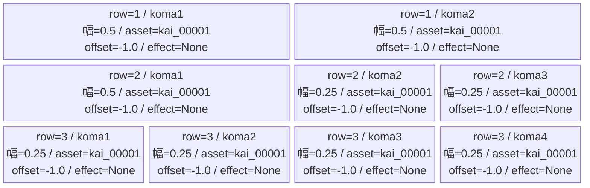
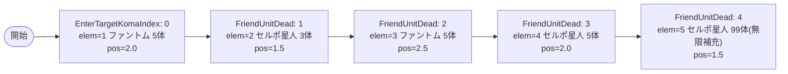

# vd_kai_normal_00001 インゲームデータ詳細解説

> 参照リポジトリ: `projects/glow-masterdata`
> リリースキー: 202604010

## インゲーム要件テキスト

danシリーズのノーマル雑魚2種（セルポ星人・ファントム）で構成するkaiブロックNormalステージ。セルポ星人（Green/中堅）とファントム（Green/軽量）が交互に波状出現し、倒すたびに次の波が強化されて押し寄せる。最終的にセルポ星人の無限補充で終盤プレッシャーをかける設計。

コマは3行構成で、行ごとにパターン6（2コマ均等）・パターン8（3コマ左広め）・パターン12（4コマ均等）と変化させ、行ごとに異なる戦略を生み出す。全コマ効果はNone。コマアセットキーは `kai_00001`（back_ground_offset=-1.0）。

対抗キャラはオカルン（chara_dan_00001/Red）。abilityなしのため、コマ効果・ダメージ種別の特性連動はなし。

---

## レベルデザイン

### 敵キャラ設計

#### 敵キャラ選定（MstEnemyCharacter）
| mst_enemy_character_id | 日本語名 | 役割 | 備考 |
|------------------------|---------|------|------|
| enemy_dan_00001 | セルポ星人 | 雑魚 | danシリーズのメイン雑魚敵 |
| enemy_glo_00001 | ファントム | 雑魚 | GLOW汎用雑魚（danブロック専用Green色） |

#### 敵キャラステータス（MstEnemyStageParameter）
> 全て新規設計（VDでは既存MstEnemyStageParameterを参照せず、各ブロックで新規作成）

| MstEnemyStageParameter ID | 日本語名 | kind | role | color | base_hp | base_atk | base_spd | well_dist | knockback | combo | drop_bp |
|--------------------------|---------|------|------|-------|---------|----------|----------|-----------|-----------|-------|---------|
| e_dan_00001_vd_Normal_Green | セルポ星人 | Normal | Attack | Green | 25000 | 500 | 45 | 0.2 | 0 | 3 | 20 |
| e_glo_00001_vd_Normal_Green | ファントム | Normal | Balance | Green | 15000 | 300 | 50 | 0.2 | 0 | 2 | 10 |

#### 行動パターン（MstAttack / MstAttackElement）

| 敵キャラID | 攻撃名 | 攻撃種別 | ダメージ種別 | 効果 | 対象 | 射程 | 備考 |
|-----------|-------|---------|-----------|------|------|------|------|
| e_dan_00001_vd_Normal_Green | 宇宙エネルギー砲 | Normal | None | None | Single | 2.0 | 中距離攻撃 |
| e_glo_00001_vd_Normal_Green | 呪縛 | Normal | None | None | Single | 1.5 | 近接攻撃 |

> 対抗キャラ（オカルン/chara_dan_00001）はabilityなしのため、damage_type/effect_type連動なし

---

### コマ設計

※ columns は1つのみ。各行のスパン合計 = 4。row=1: height=0.33 / row=2: height=0.33 / row=3: height=0.34

---

### 敵キャラシーケンス設計

#### どのフェーズで、どの敵を、いつ、どこに、どのくらい出現させるか

> 合計出現数: elem=1〜4 で最低18体出現。elem=5以降はセルポ星人が800ms間隔で無限補充。

| elem | 出現タイミング | 敵 | 召喚数 | 召喚間隔(ms) | 召喚位置 | 備考 |
|------|-------------|---|-------|------------|---------|------|
| 1 | EnterTargetKomaIndex:0 | ファントム | 5 | 0 | 2.0 | コマindex=0進入時に5体同時出現 |
| 2 | FriendUnitDead:1 | セルポ星人 | 3 | 0 | 1.5 | ファントム(elem=1)を1体倒すと3体同時出現 |
| 3 | FriendUnitDead:2 | ファントム | 5 | 0 | 2.5 | セルポ星人(elem=2)を1体倒すと5体同時出現 |
| 4 | FriendUnitDead:3 | セルポ星人 | 5 | 0 | 2.0 | ファントム(elem=3)を1体倒すと5体同時出現 |
| 5 | FriendUnitDead:4 | セルポ星人 | 99 | 800 | 1.5 | セルポ星人(elem=4)を1体倒すと800ms間隔で最大99体補充 |

#### 敵キャラの固有ステータス調整（hp_coef / atk_coef）
| 波/フェーズ | 敵 | base_hp | hp_coef | 実HP | base_atk | atk_coef | 実ATK |
|-----------|---|---------|---------|------|----------|----------|-------|
| elem=1 | ファントム | 15,000 | 1.0 | 15,000 | 300 | 1.0 | 300 |
| elem=2 | セルポ星人 | 25,000 | 1.0 | 25,000 | 500 | 1.0 | 500 |
| elem=3 | ファントム | 15,000 | 1.2 | 18,000 | 300 | 1.2 | 360 |
| elem=4 | セルポ星人 | 25,000 | 1.3 | 32,500 | 500 | 1.3 | 650 |
| elem=5 | セルポ星人 | 25,000 | 1.5 | 37,500 | 500 | 1.5 | 750 |

---

## 演出

### アセット

#### 背景
| 設定箇所 | アセットキー | 備考 |
|---------|------------|------|
| loop_background_asset_key | `""` | kai Normal・例外なし、空文字 |

#### BGM
| 設定 | 値 | 備考 |
|-----|---|------|
| bgm_asset_key | `SSE_SBG_003_010` | VD Normalブロック固定値 |
| boss_bgm_asset_key | `""` | VD全ブロック固定（空文字） |

---

### 敵キャラオーラ
| オーラ種別 | 使用箇所 |
|----------|---------|
| Default | 雑魚キャラ全員（e_dan_00001_vd_Normal_Green, e_glo_00001_vd_Normal_Green） |

---

### 敵キャラ召喚アニメーション
VD全ブロック共通: `summon_animation_type=None`（召喚アニメーションなし）
