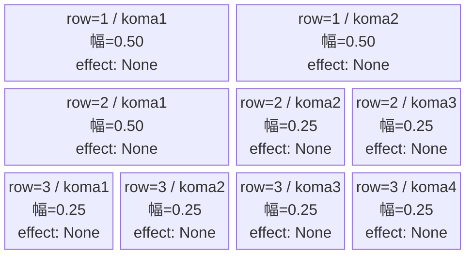
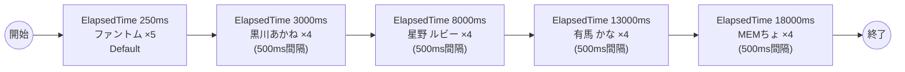

# vd_osh_normal_00001 インゲームデータ詳細解説

> 参照リポジトリ: `projects/glow-masterdata`
> リリースキー: 202604010

## インゲーム要件テキスト

ファントム（Colorless/Attack・HP5,000・ATK100・SPD34）が開幕250msに5体で序盤テンポを作り、その後【推しの子】Green属性キャラ4種（c_osh_00501→c_osh_00201→c_osh_00401→c_osh_00301の順）がHP10,000〜50,000で続く5波構成、合計21体。ファントムは`e_`キャラのため瞬時まとめ召喚、c_キャラは`summon_interval=500ms`で1体ずつ間隔を空けて召喚する。

コマは3行固定。row1=2等分2コマ（0.50, 0.50）・row2=右広い3コマ（0.50, 0.25, 0.25）・row3=4等分4コマ（0.25×4）。コマアセット: osh_00001（back_ground_offset: -1.0）。

UR対抗キャラ「B小町不動のセンター アイ」（chara_osh_00001）対抗。序盤ファントムで多属性対応を試しつつ、中盤以降はGreen属性対策コマが主軸となる設計。

---

## レベルデザイン

### 敵キャラ設計

#### 敵キャラ選定（MstEnemyCharacter）

| mst_enemy_character_id | 日本語名 | 役割 | 備考 |
|------------------------|---------|------|------|
| enemy_glo_00001 | ファントム | 雑魚（共通） | Colorless属性・Attack。序盤テンポ担当 |
| chara_osh_00501 | 黒川あかね | 雑魚 | Green属性・Technical。HP低め（10,000） |
| chara_osh_00201 | 星野 ルビー | 雑魚 | Green属性・Attack。HP50,000 |
| chara_osh_00401 | 有馬 かな | 雑魚 | Green属性・Technical。HP50,000 |
| chara_osh_00301 | MEMちょ | 雑魚 | Green属性・Support。HP50,000、最高well_distance |

#### 敵キャラステータス（MstEnemyStageParameter）

> 全エントリ既存参照: `vd_all/data/MstEnemyStageParameter.csv`（release_key: 202604010）

| MstEnemyStageParameter ID | 日本語名 | character_unit_kind | role_type | color | hp | attack_power | move_speed | well_distance | damage_knock_back_count | attack_combo_cycle | drop_battle_point |
|--------------------------|---------|---------------------|-----------|-------|----|-------------|-----------|---------------|------------------------|-------------------|------------------|
| e_glo_00001_vd_Normal_Colorless | ファントム | Normal | Attack | Colorless | 5,000 | 100 | 34 | 0.22 | 3 | 1 | 150 |
| c_osh_00501_vd_Normal_Green | 黒川あかね | Normal | Technical | Green | 10,000 | 300 | 30 | 0.26 | 3 | 4 | 500 |
| c_osh_00201_vd_Normal_Green | 星野 ルビー | Normal | Attack | Green | 50,000 | 300 | 30 | 0.22 | 3 | 5 | 500 |
| c_osh_00401_vd_Normal_Green | 有馬 かな | Normal | Technical | Green | 50,000 | 300 | 32 | 0.24 | 3 | 4 | 500 |
| c_osh_00301_vd_Normal_Green | MEMちょ | Normal | Support | Green | 50,000 | 300 | 30 | 0.27 | 3 | 4 | 500 |

---

### コマ設計

コマは3行固定（`koma1_asset_key`: `osh_00001`、`koma1_back_ground_offset`: `-1.0`）:

| row | height | 選択パターン | コマ数 | 各幅 | 幅合計 | koma1_asset_key | koma1_back_ground_offset |
|-----|--------|------------|-------|------|--------|----------------|-------------------------|
| 1 | 0.33 | パターン6「2等分」 | 2コマ | 0.50, 0.50 | 1.0 | osh_00001 | -1.0 |
| 2 | 0.33 | パターン8「右広い」 | 3コマ | 0.50, 0.25, 0.25 | 1.0 | osh_00001 | -1.0 |
| 3 | 0.34 | パターン12「4等分」 | 4コマ | 0.25, 0.25, 0.25, 0.25 | 1.0 | osh_00001 | -1.0 |

---

### 敵キャラシーケンス設計

#### どのフェーズで、どの敵を、いつ、どこに、どのくらい出現させるか

| elem | 出現タイミング | 敵 | summon_count | summon_interval | 累計出現数 |
|------|-------------|---|--------------|----------------|---------|
| 1 | ElapsedTime 250ms | ファントム (e_glo_00001_vd_Normal_Colorless) | 5 | 0ms | 5 |
| 2 | ElapsedTime 3000ms | 黒川あかね (c_osh_00501_vd_Normal_Green) | 4 | 500ms | 9 |
| 3 | ElapsedTime 8000ms | 星野 ルビー (c_osh_00201_vd_Normal_Green) | 4 | 500ms | 13 |
| 4 | ElapsedTime 13000ms | 有馬 かな (c_osh_00401_vd_Normal_Green) | 4 | 500ms | 17 |
| 5 | ElapsedTime 18000ms | MEMちょ (c_osh_00301_vd_Normal_Green) | 4 | 500ms | 21 |

合計: **21体**（要件「最低15体以上」を満たす）

> **c_キャラ召喚ガードレール確認**: osh_00501/00201/00401/00301は`c_`プレフィックスのキャラクターです。同一トリガーで瞬間複数召喚禁止の制約があるため、各波は`summon_interval=500ms`を設定します。ファントム（`e_glo_00001`）は`e_`プレフィックスの純粋な敵キャラクターのため、`summon_interval=0`での瞬時まとめ召喚が可能です。

#### 敵キャラの固有ステータス調整（hp_coef / atk_coef）

MstAutoPlayerSequenceの `enemy_hp_coef` / `enemy_attack_coef` はすべてデフォルト値（1.0）を使用します。

| 波 | 敵 | hp | hp_coef | 実HP | attack_power | atk_coef | 実ATK |
|---|---|-----|---------|------|-------------|----------|-------|
| 1 | ファントム | 5,000 | 1.0 | 5,000 | 100 | 1.0 | 100 |
| 2 | 黒川あかね | 10,000 | 1.0 | 10,000 | 300 | 1.0 | 300 |
| 3 | 星野 ルビー | 50,000 | 1.0 | 50,000 | 300 | 1.0 | 300 |
| 4 | 有馬 かな | 50,000 | 1.0 | 50,000 | 300 | 1.0 | 300 |
| 5 | MEMちょ | 50,000 | 1.0 | 50,000 | 300 | 1.0 | 300 |

#### フェーズ切り替えはあるか

なし（VDではSwitchSequenceGroup使用禁止）

---

## 演出

### アセット

#### 背景

| 設定箇所 | アセットキー | 備考 |
|---------|------------|------|
| loop_background_asset_key | （空） | VDの背景切り替えはゲームロジック側で管理 |
| フロア0以上 | koma_background_vd_00001 | クライアント側でフロア係数に応じて切り替え |
| フロア20以上 | koma_background_vd_00003 | 同上 |
| フロア40以上 | koma_background_vd_00005 | 同上 |

#### BGM

| 設定 | 値 | 備考 |
|-----|---|------|
| bgm_asset_key | SSE_SBG_003_010 | ノーマルブロック用BGM |
| boss_bgm_asset_key | （空） | ノーマルブロックはボスBGMなし |

---

### 敵キャラオーラ

| オーラ種別 | 使用箇所 |
|----------|---------|
| Default | 全敵キャラ（ノーマルブロックはボスなし、全行Default） |

---

### 敵キャラ召喚アニメーション

全キャラ `SummonEnemy` アクションによる ElapsedTime トリガーでの召喚。InitialSummonは使用しない（normalブロックはボスなし）。

ファントム（`e_glo_00001`）は`e_`キャラのため `summon_interval=0` で5体同時召喚。osh雑魚4種（`c_`キャラ）は各波 `summon_interval=500ms` で1体ずつ間隔を空けて召喚します。召喚演出はすべてデフォルトのSummonEnemy演出が適用されます。

---

## 生成テーブルまとめ

| テーブル | 状態 | 備考 |
|---------|------|------|
| MstEnemyStageParameter | 既存参照 | `vd_all/data/MstEnemyStageParameter.csv` の5エントリを使用（新規生成なし） |
| MstEnemyOutpost | 新規生成 | HP=100固定、is_damage_invalidation=空、id=vd_osh_normal_00001 |
| MstPage | 新規生成 | id=vd_osh_normal_00001 |
| MstKomaLine | 新規生成 | 3行固定（row=1〜3）、パターン6/8/12 |
| MstAutoPlayerSequence | 新規生成 | 5要素（合計20体、sequence_set_id=vd_osh_normal_00001） |
| MstInGame | 新規生成 | content_type=Dungeon、stage_type=vd_normal、ボスなし、release_key=202604010 |

---

## ID一覧

| テーブル | カラム | 値 |
|---------|--------|-----|
| MstInGame | id | vd_osh_normal_00001 |
| MstAutoPlayerSequence | sequence_set_id | vd_osh_normal_00001 |
| MstPage | id | vd_osh_normal_00001 |
| MstEnemyOutpost | id | vd_osh_normal_00001 |
| MstKomaLine | id（row1） | vd_osh_normal_00001_1 |
| MstKomaLine | id（row2） | vd_osh_normal_00001_2 |
| MstKomaLine | id（row3） | vd_osh_normal_00001_3 |
| MstAutoPlayerSequence | id（elem1） | vd_osh_normal_00001_1 |
| MstAutoPlayerSequence | id（elem2） | vd_osh_normal_00001_2 |
| MstAutoPlayerSequence | id（elem3） | vd_osh_normal_00001_3 |
| MstAutoPlayerSequence | id（elem4） | vd_osh_normal_00001_4 |
| MstAutoPlayerSequence | id（elem5） | vd_osh_normal_00001_5 |
