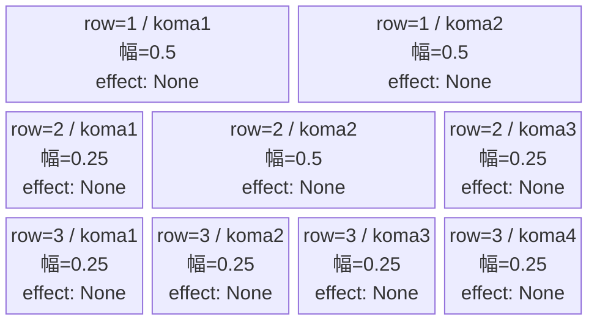

# vd_osh_normal_00001 インゲームデータ詳細解説

> 参照リポジトリ: `projects/glow-masterdata`
> リリースキー: 202604010

## インゲーム要件テキスト

【推しの子】ノーマルブロック。雑魚は全員 Green 属性の c_ キャラ（黒川あかね/星野 ルビー/MEMちょ/有馬 かな）とファントムの計16体。序盤に体力低めの黒川あかねを3体連続、5秒後にファントム3体が同時出現し序盤を賑わせる。その後 星野 ルビー（Attack）×3→MEMちょ（Support）×3→有馬 かな（Technical）×4 と段階的に体力の高い敵が現れ難化する。c_ キャラは同時1体制約により FriendUnitDead チェーンで1体ずつ召喚。ステータスは既存データ（hp_coef / atk_coef = 1.0）をそのまま使用。

コマは3行構成。row1はパターン6（2コマ均等 0.5/0.5）、row2はパターン9（3コマ 中央広め 0.25/0.5/0.25）、row3はパターン12（4コマ均等 0.25×4）。コマアセットキーは `osh_00001`（back_ground_offset = -1.0）。UR対抗キャラは B小町不動のセンター アイ（`chara_osh_00001`）で、Green 属性の強敵連続出現により対抗キャラの属性有利・スキル発動を促す設計。

---

## レベルデザイン

### 敵キャラ設計

#### 敵キャラ選定（MstEnemyCharacter）

| mst_enemy_character_id | 日本語名 | 役割 | 備考 |
|------------------------|---------|------|------|
| chara_osh_00501 | 黒川あかね | 序盤雑魚 | 体力低め（base_hp 10,000）で序盤の足慣らし |
| enemy_glo_00001 | ファントム | 序盤補助 | 体力低め（base_hp 5,000）、c_ 制約対象外 |
| chara_osh_00201 | 星野 ルビー | 中盤雑魚 | Attack 型（base_hp 50,000） |
| chara_osh_00301 | MEMちょ | 後半雑魚 | Support 型（base_hp 50,000） |
| chara_osh_00401 | 有馬 かな | 終盤雑魚 | Technical 型（base_hp 50,000）、4体で締め |

#### 敵キャラステータス（MstEnemyStageParameter）

> 全て `vd_all/data/MstEnemyStageParameter.csv` の既存データを参照

| MstEnemyStageParameter ID | 日本語名 | kind | role | color | base_hp | base_atk | base_spd | well_dist | knockback | combo | drop_bp |
|--------------------------|---------|------|------|-------|---------|----------|----------|-----------|-----------|-------|---------|
| c_osh_00501_vd_Normal_Green | 黒川あかね | Normal | Technical | Green | 10,000 | 300 | 30 | 0.26 | 3 | 4 | 500 |
| e_glo_00001_vd_Normal_Colorless | ファントム | Normal | Attack | Colorless | 5,000 | 100 | 34 | 0.22 | 3 | 1 | 150 |
| c_osh_00201_vd_Normal_Green | 星野 ルビー | Normal | Attack | Green | 50,000 | 300 | 30 | 0.22 | 3 | 5 | 500 |
| c_osh_00301_vd_Normal_Green | MEMちょ | Normal | Support | Green | 50,000 | 300 | 30 | 0.27 | 3 | 4 | 500 |
| c_osh_00401_vd_Normal_Green | 有馬 かな | Normal | Technical | Green | 50,000 | 300 | 32 | 0.24 | 3 | 4 | 500 |

---

### コマ設計

※ columns は1つのみ。各行のスパン合計 = 4。

| row | height | 選択パターン | コマ数 | 各幅 | 幅合計 |
|-----|--------|------------|-------|------|--------|
| 1 | 0.33 | パターン6 | 2 | 0.5, 0.5 | 1.0 |
| 2 | 0.33 | パターン9 | 3 | 0.25, 0.5, 0.25 | 1.0 |
| 3 | 0.34 | パターン12 | 4 | 0.25, 0.25, 0.25, 0.25 | 1.0 |

---

### 敵キャラシーケンス設計

> **c_キャラ同時出現ルール（プランナー確認済み）**: c_キャラ（`c_` プレフィックス）が複数体登場する場合、
> 初回のみ `InitialSummon`、2体目以降は `FriendUnitDead`（前の c_キャラの sequence_element_id を
> condition_value に指定）でチェーンすること。また c_キャラの `summon_count` は必ず `1` とすること。`e_glo_*` は対象外。

#### どのフェーズで、どの敵を、いつ、どこに、どのくらい出現させるか

```mermaid
flowchart LR
  Start([開始]) --> E1[InitialSummon\n黒川あかね ×1\nelem=1]
  Start --> E4[ElapsedTime 5s\nファントム ×3\nelem=4]
  E1 --> E2[FriendUnitDead: elem=1\n黒川あかね ×1\nelem=2]
  E2 --> E3[FriendUnitDead: elem=2\n黒川あかね ×1\nelem=3]
  E3 --> E5[FriendUnitDead: elem=3\n星野 ルビー ×1\nelem=5]
  E5 --> E6[FriendUnitDead: elem=5\n星野 ルビー ×1\nelem=6]
  E6 --> E7[FriendUnitDead: elem=6\n星野 ルビー ×1\nelem=7]
  E7 --> E8[FriendUnitDead: elem=7\nMEMちょ ×1\nelem=8]
  E8 --> E9[FriendUnitDead: elem=8\nMEMちょ ×1\nelem=9]
  E9 --> E10[FriendUnitDead: elem=9\nMEMちょ ×1\nelem=10]
  E10 --> E11[FriendUnitDead: elem=10\n有馬 かな ×1\nelem=11]
  E11 --> E12[FriendUnitDead: elem=11\n有馬 かな ×1\nelem=12]
  E12 --> E13[FriendUnitDead: elem=12\n有馬 かな ×1\nelem=13]
  E13 --> E14[FriendUnitDead: elem=13\n有馬 かな ×1\nelem=14]
```

| elem | 出現タイミング | 敵（ID） | 数 | 累計出現数/召喚位置 |
|------|-------------|---------|---|-----------------|
| 1 | InitialSummon | 黒川あかね（c_osh_00501） | 1 | 1体目 / 初期配置（中央） |
| 2 | FriendUnitDead (elem=1) | 黒川あかね（c_osh_00501） | 1 | 2体目 / 中央 |
| 3 | FriendUnitDead (elem=2) | 黒川あかね（c_osh_00501） | 1 | 3体目 / 中央 |
| 4 | ElapsedTime 5s | ファントム（e_glo_00001） | 3 | 3体 / ランダム（c_制約外） |
| 5 | FriendUnitDead (elem=3) | 星野 ルビー（c_osh_00201） | 1 | 4体目 / 中央 |
| 6 | FriendUnitDead (elem=5) | 星野 ルビー（c_osh_00201） | 1 | 5体目 / 中央 |
| 7 | FriendUnitDead (elem=6) | 星野 ルビー（c_osh_00201） | 1 | 6体目 / 中央 |
| 8 | FriendUnitDead (elem=7) | MEMちょ（c_osh_00301） | 1 | 7体目 / 中央 |
| 9 | FriendUnitDead (elem=8) | MEMちょ（c_osh_00301） | 1 | 8体目 / 中央 |
| 10 | FriendUnitDead (elem=9) | MEMちょ（c_osh_00301） | 1 | 9体目 / 中央 |
| 11 | FriendUnitDead (elem=10) | 有馬 かな（c_osh_00401） | 1 | 10体目 / 中央 |
| 12 | FriendUnitDead (elem=11) | 有馬 かな（c_osh_00401） | 1 | 11体目 / 中央 |
| 13 | FriendUnitDead (elem=12) | 有馬 かな（c_osh_00401） | 1 | 12体目 / 中央 |
| 14 | FriendUnitDead (elem=13) | 有馬 かな（c_osh_00401） | 1 | 13体目 / 中央 |

**合計**: 黒川あかね ×3 + ファントム ×3 + 星野 ルビー ×3 + MEMちょ ×3 + 有馬 かな ×4 = **16体**

#### 敵キャラの固有ステータス調整（hp_coef / atk_coef）

| 波/フェーズ | 敵 | base_hp | hp_coef | 実HP | base_atk | atk_coef | 実ATK |
|-----------|---|---------|---------|------|----------|----------|-------|
| 序盤 | 黒川あかね（c_osh_00501） | 10,000 | 1.0 | 10,000 | 300 | 1.0 | 300 |
| 序盤（補） | ファントム（e_glo_00001） | 5,000 | 1.0 | 5,000 | 100 | 1.0 | 100 |
| 中盤 | 星野 ルビー（c_osh_00201） | 50,000 | 1.0 | 50,000 | 300 | 1.0 | 300 |
| 後半 | MEMちょ（c_osh_00301） | 50,000 | 1.0 | 50,000 | 300 | 1.0 | 300 |
| 終盤 | 有馬 かな（c_osh_00401） | 50,000 | 1.0 | 50,000 | 300 | 1.0 | 300 |

#### フェーズ切り替えはあるか

なし（VDではSwitchSequenceGroup使用禁止）

---

## 演出

### アセット

#### 背景

| 設定箇所 | アセットキー | 備考 |
|---------|------------|------|
| MstInGame.background_asset_key | （要確認） | osh作品の背景アセット。アセット担当者に確認 |

#### BGM

| 設定 | 値 | 備考 |
|-----|---|------|
| bgm_asset_key | SSE_SBG_003_010 | normalブロック固定値 |

---

### 敵キャラオーラ

| オーラ種別 | 使用箇所 |
|----------|---------|
| なし | normalブロックのためボスオーラなし |

---

### 敵キャラ召喚アニメーション

InitialSummon で黒川あかね（c_osh_00501）が1体初期配置される。その後 FriendUnitDead チェーンで各 c_ キャラ（黒川あかね→星野 ルビー→MEMちょ→有馬 かな）が1体ずつ召喚される。ファントム（e_glo_00001）はステージ開始5秒後に3体が一斉出現。全エントリの `summon_animation_type = None`（VD標準）。
