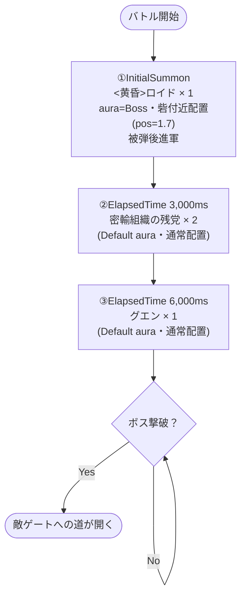

# dungeon_spy_boss_00001 詳細解説

## 概要

| 項目 | 値 |
|------|-----|
| インゲームID | `dungeon_spy_boss_00001` |
| コンテンツ種別 | dungeon（限界チャレンジ）ボスブロック |
| シリーズ | SPY×FAMILY（spy）|
| BGM | SSE_SBG_003_002 |
| 背景アセット | spy_00005 |
| ボスキャラ | `<黄昏> ロイド`（chara_spy_00101）|
| ボスHP | 50,000 |
| ボス攻撃力 | 15,000 |
| ボス移動速度 | 55（少し速い）|
| ボスオーラ | Boss（強敵オーラ）|
| MstEnemyOutpost HP | 1,000（dungeon_boss固定値）|
| コマ行数 | 1行（dungeon_boss固定値）|
| 生成日 | 2026-03-01 |

---

## 関連テーブル設定

### MstInGame

| カラム | 値 |
|--------|-----|
| id | dungeon_spy_boss_00001 |
| bgm_asset_key | SSE_SBG_003_002 |
| loop_background_asset_key | spy_00005 |
| boss_mst_enemy_stage_parameter_id | c_spy_00101_spy_dungeon_boss_Boss_Colorless |
| boss_count | 1 |
| normal_enemy_hp_coef | 1 |
| normal_enemy_attack_coef | 1 |
| boss_enemy_hp_coef | 1 |
| boss_enemy_attack_coef | 1 |

### MstEnemyOutpost

| カラム | 値 |
|--------|-----|
| id | dungeon_spy_boss_00001 |
| hp | **1,000**（dungeon_boss固定値）|
| is_damage_invalidation | **1**（ボス撃破まで敵ゲートはダメージ無効）|
| artwork_asset_key | spy_0001 |

### MstPage + MstKomaLine

| id | row | height | koma_line_layout_asset_key | koma1_asset_key | koma1_width |
|----|-----|--------|--------------------------|-----------------|-------------|
| dungeon_spy_boss_00001_1 | 1 | 0.55 | 1 | spy_00005 | 1.0（全幅）|

---

## 使用する敵パラメータ一覧

### ボス

| カラム | 値 |
|--------|-----|
| id | c_spy_00101_spy_dungeon_boss_Boss_Colorless |
| mst_enemy_character_id | chara_spy_00101（`<黄昏> ロイド`）|
| character_unit_kind | Boss |
| role_type | Attack |
| hp | **50,000** |
| attack_power | **15,000** |
| move_speed | **55**（少し速い）|
| well_distance | 0.35 |
| damage_knock_back_count | 3 |
| attack_combo_cycle | 7（ボスコンボ・必殺ワザ表現）|
| drop_battle_point | 500 |

### 護衛雑魚（normalブロックと共用）

| id | mst_enemy_character_id | hp | attack_power | move_speed |
|----|----------------------|-----|-------------|-----------|
| e_spy_00001_spy_dungeon_Normal_Colorless | enemy_spy_00001（密輸組織の残党）| 1,000 | 5,000 | 45 |
| e_spy_00101_spy_dungeon_Normal_Colorless | enemy_spy_00101（グエン）| 1,000 | 5,000 | 42 |

---

## グループ構造の全体フロー

---

## 全3行の詳細データ

### 行1: ロイドボス（InitialSummon）

| カラム | 値 |
|--------|-----|
| id | dungeon_spy_boss_00001_1 |
| condition_type | InitialSummon |
| condition_value | 0 |
| action_type | SummonEnemy |
| action_value | c_spy_00101_spy_dungeon_boss_Boss_Colorless |
| summon_count | 1 |
| summon_position | 1.7（砦付近）|
| move_start_condition_type | Damage |
| move_start_condition_value | 1（1ダメージで進軍開始）|
| aura_type | **Boss**（強敵オーラ）|
| death_type | Normal |
| enemy_hp_coef / enemy_attack_coef / enemy_speed_coef | 1 / 1 / 1 |

### 行2: 護衛A（3秒後）

| カラム | 値 |
|--------|-----|
| id | dungeon_spy_boss_00001_2 |
| condition_type | ElapsedTime |
| condition_value | 3,000（ms）|
| action_type | SummonEnemy |
| action_value | e_spy_00001_spy_dungeon_Normal_Colorless |
| summon_count | 2 |
| aura_type | Default |

### 行3: 護衛B（6秒後）

| カラム | 値 |
|--------|-----|
| id | dungeon_spy_boss_00001_3 |
| condition_type | ElapsedTime |
| condition_value | 6,000（ms）|
| action_type | SummonEnemy |
| action_value | e_spy_00101_spy_dungeon_Normal_Colorless |
| summon_count | 1 |
| aura_type | Default |

---

## 設計パターン解説

### dungeon_boss ブロックの特徴

1. **ボス先行配置型**: InitialSummon でロイドを砦付近（1.7）に配置。プレイヤーが攻撃を当てるまで動かない緊張感のある演出
2. **被弾進軍トリガー**: `move_start_condition_type=Damage / value=1` により、プレイヤーが最初のダメージを与えた瞬間にボスが動き出す
3. **強敵オーラ（Boss aura）**: ロイドに専用の強敵演出を付与。プレイヤーが「強い敵だ」と直感できる
4. **護衛雑魚で攻守分断**: 3秒・6秒後に雑魚が出現し、ボスへの集中を妨害する

### is_damage_invalidation=1 の意味

ボス生存中は `mst_enemy_outpost_id` に対する直接攻撃が無効化される（dungeon_boss仕様）。
プレイヤーはボスを倒さない限り敵ゲートを直接攻撃できない。

---

## 注意事項

- **release_key**: 現在 `999999999`（開発テスト用）。正式投入前に正しいリリースキーに変更すること
- **護衛雑魚パラメータ**: `e_spy_00001_spy_dungeon_Normal_Colorless` と `e_spy_00101_spy_dungeon_Normal_Colorless` は `dungeon_spy_normal_00001` と共用。DB投入時に重複エラーが出る場合は normalブロック CSV と統合して1回のバッチで投入すること
- **mst_unit_ability_id1**: SPY×FAMILY専用の敵アビリティが存在しないため未設定。将来的に専用アビリティが追加された場合は要更新
