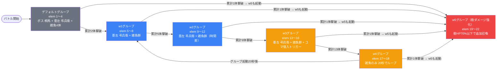

# event_jig1_savage_00001 インゲームデータ詳細解説

> 参照リポジトリ: `projects/glow-masterdata`
> リリースキー: 202601010
> 本ファイルはMstAutoPlayerSequenceが32行のイベントクエスト（savage）全データ設定を解説する

---

## 概要

**jig1シリーズのイベントクエスト・サベッジ（上級）難度**（砦破壊型バトル）。

- 砦のHP 100,000 でダメージ有効（砦を壊してクリアするモード）
- BGM: `SSE_SBG_003_009` / ボスBGMなし
- MstInGame の `boss_mst_enemy_stage_parameter_id` に `1` が設定されているが、ボスはすべてMstAutoPlayerSequenceから召喚
- グループ: デフォルト + w1〜w5 の6グループ（w4→w1ループ構造）
- **スピードアタックルールあり**（早くクリアすると報酬獲得）
- 使用する敵の種類: 4種類（`c_jig_00501` ボス1種 + `c_jig_00401` 中ボス1種 + `e_jig_00001` 雑魚2種）
- 各グループに `groupchange_6: FriendUnitDead(1) → w5` が共通設定されており、最初の1体撃破でw5グループが並行起動

---

## 関連テーブル設定

### MstInGame

| カラム | 値 |
|--------|-----|
| `id` | `event_jig1_savage_00001` |
| `mst_auto_player_sequence_set_id` | `event_jig1_savage_00001` |
| `bgm_asset_key` | `SSE_SBG_003_009` |
| `boss_bgm_asset_key` | （空） |
| `mst_page_id` | `event_jig1_savage_00001` |
| `mst_enemy_outpost_id` | `event_jig1_savage_00001` |
| `boss_mst_enemy_stage_parameter_id` | `1` ← ボスはシーケンスで出す |
| `boss_count` | （空） |
| `normal_enemy_hp_coef` | `1` |
| `normal_enemy_attack_coef` | `1` |
| `normal_enemy_speed_coef` | `1` |
| `boss_enemy_hp_coef` | `1` |
| `boss_enemy_attack_coef` | `1` |
| `boss_enemy_speed_coef` | `1` |

### MstEnemyOutpost（敵砦）

| カラム | 値 | 意味 |
|--------|-----|------|
| `id` | `event_jig1_savage_00001` | |
| `hp` | `100000` | 10万HP（破壊可能） |
| `is_damage_invalidation` | （空） | **ダメージ有効**（砦が壊れるノーマルモード） |
| `artwork_asset_key` | `event_jig_0002` | 背景アートワーク |

### MstPage + MstKomaLine（コマフィールド）

4行構成。2・3段目にコマ効果あり。

```
row=1  height=0.55  layout=1  (1コマ: 1.0)
  koma1: jig_00002  width=1.0   bg_offset=+0.3  effect=None

row=2  height=0.55  layout=5  (2コマ: 0.25 / 0.75)  ← コマ効果あり
  koma1: jig_00002  width=0.25  bg_offset=+0.7  effect=Poison       ← 毒（param1=4500, param2=3, target=Player）
  koma2: jig_00002  width=0.75  bg_offset=+0.7  effect=Gust         ← 突風（param1=1000, param2=0.5, target=Player）

row=3  height=0.55  layout=1  (1コマ: 1.0)           ← コマ効果あり
  koma1: jig_00002  width=1.0   bg_offset=+0.3  effect=Gust         ← 突風（param1=1000, param2=0.5, target=Player）

row=4  height=0.55  layout=12  (4コマ: 0.25 / 0.25 / 0.25 / 0.25)
  koma1〜4: jig_00002  width=0.25  effect=None（4つとも効果なし）
```

> **コマ効果はすべて `target=Player`（自軍への影響）**。プレイヤーキャラが通過するとダメージや状態異常を受ける。

### MstInGameI18n（バトル説明文）

**result_tips（バトルヒント）:**
> 強敵の『山田浅ェ門 桐馬』を倒すと『賊王 亜左 弔兵衛』の出現が止まるぞ!

**description（ステージ説明）:**
> 【属性情報】
> 黄属性の敵が登場するので緑属性のキャラは有利に戦うこともできるぞ!
> さらに、無属性の敵も登場するぞ!
>
> 【コマ効果情報】
> 毒コマ、突風コマが登場するぞ!
> 特性で毒ダメージ軽減や突風コマ無効化を持っているキャラを編成しよう!
>
> 【ギミック情報】
> 敵全体の攻撃UPをしてくる敵や
> 敵全体に被ダメージカットを付与する敵や
> 敵全体の体力を回復する攻撃をしてくる敵や
> 弱体化攻撃をしてくる敵や
> ノックバック無効化の特性を持つ敵が登場するぞ!
>
> 無属性の『賊王 亜左 弔兵衛』は倒しても時間経過で再度出現するぞ!
> 強敵の『山田浅ェ門 桐馬』を倒すと『賊王 亜左 弔兵衛』の出現が止まるぞ!
>
> また、このステージではスピードアタックルールがあるぞ!
> 早くクリアすると報酬ゲット!

---

## 使用する敵パラメータ（MstEnemyStageParameter）一覧

4種類の敵パラメータを使用。`c_` プレフィックスはキャラ個別ID、`e_` は汎用敵。
IDの命名規則: `{c_/e_}{キャラID}_jig1_savage_{kind}_{color}`

### カラム解説

| カラム名（略称） | DBカラム名 | 説明 |
|---------------|-----------|------|
| id | id | MstEnemyStageParameterの主キー |
| キャラID | mst_enemy_character_id | 紐付くキャラモデル・スキルの参照元 |
| kind | character_unit_kind | `Normal`（通常敵）/ `Boss`（ボス）。UIオーラ表示に影響 |
| role | role_type | 属性相性の役職（Attack/Technical/Defense/Support） |
| color | color | 属性色（Red/Yellow/Green/Blue/Colorless） |
| sort_order | sort_order | ゲーム内表示順 |
| base_hp | hp | ベースHP（`enemy_hp_coef` 乗算前の素値） |
| base_atk | attack_power | ベース攻撃力（`enemy_attack_coef` 乗算前の素値） |
| base_spd | move_speed | 移動速度（数値が大きいほど速い） |
| well_dist | well_distance | 攻撃射程（コマ単位） |
| combo | attack_combo_cycle | 攻撃コンボ数（1=単発、3=3コンボ） |
| knockback | damage_knock_back_count | 被攻撃時ノックバック回数（0=ノックバックなし） |
| ability | mst_unit_ability_id1 | 特殊アビリティID |
| drop_bp | drop_battle_point | 基本ドロップバトルポイント |

### 全4種類の詳細パラメータ

| MstEnemyStageParameter ID | 日本語名 | キャラID | kind | role | color | sort | base_hp | base_atk | base_spd | well_dist | combo | knockback | ability | drop_bp |
|--------------------------|---------|---------|------|------|-------|------|---------|---------|---------|-----------|-------|-----------|---------|---------|
| `c_jig_00501_jig1_savage_Boss_Yellow` | 山田浅ェ門 桐馬 | chara_jig_00501 | Boss | Support | Yellow | 15 | 10,000 | 100 | 35 | 0.21 | 4 | 2 | （空） | 300 |
| `c_jig_00401_jig1_savage_Normal_Colorless` | 賊王 亜左 弔兵衛 | chara_jig_00401 | Normal | Technical | Colorless | 18 | 1,000 | 100 | 30 | 0.31 | 3 | **0** | `enemy_ability_knockback_block` | 100 |
| `e_jig_00001_jig1_savage_Normal_Colorless` | 門神（無属性） | enemy_jig_00001 | Normal | Attack | Colorless | 21 | 1,000 | 100 | 27 | 0.21 | 1 | 1 | （空） | 50 |
| `e_jig_00001_jig1_savage_Normal_Yellow` | 門神（黄属性） | enemy_jig_00001 | Normal | Defense | Yellow | 22 | 1,000 | 100 | 27 | 0.21 | 1 | 3 | （空） | 50 |

> **実際のHP・ATKは `base × MstAutoPlayerSequence.enemy_hp_coef` で決まる。**
> 例: 亜左 弔兵衛（base_hp=1,000）を hp倍100 で出すと実HP = **100,000**（砦と同等）

### 敵パラメータの特性解説

#### 山田浅ェ門 桐馬（ボス）vs 亜左 弔兵衛（中ボス） 比較

| 項目 | 桐馬（Boss_Yellow） | 亜左 弔兵衛（Normal_Colorless） |
|------|---------------------|-------------------------------|
| kind | Boss | **Normal**（ボスオーラなし） |
| base_hp | 10,000 | 1,000 |
| role | Support（サポート） | Technical（技巧） |
| color | **Yellow** | **Colorless** |
| base_spd | 35（速め） | 30 |
| well_dist | 0.21 | **0.31**（より遠い） |
| combo | 4 | 3 |
| knockback | 2 | **0**（ノックバックしない！） |
| ability | なし | **`enemy_ability_knockback_block`**（ノックバック無効） |
| drop_bp | 300 | 100 |

> **亜左 弔兵衛の最大の特徴**: `damage_knock_back_count=0` かつ `mst_unit_ability_id1=enemy_ability_knockback_block`。ノックバック攻撃を受けても後退しない。MstInGameI18n でも「ノックバック無効化の特性を持つ敵」と明記。
>
> **桐馬はデフォルトグループのみ登場**。倒すと亜左 弔兵衛の出現が止まるとUIに表示（result_tips）。

#### jig雑魚2種の比較

| 項目 | jig雑魚（無属性/Normal） | jig雑魚（黄属性/Normal） |
|------|---------------------|---------------------|
| role | Attack（攻撃型） | **Defense**（防御型） |
| color | Colorless | Yellow |
| base_spd | 27（同じ） | 27（同じ） |
| combo | 1（単発） | 1（単発） |
| knockback | **1** | **3**（ノックバックされやすい） |
| drop_bp | 50 | 50 |

> 黄属性雑魚は `knockback_count=3` と高く、プレイヤーキャラが攻撃を受けると大きく弾き飛ばされる。緑属性キャラで挑むと属性有利で倒しやすい（explanation: 黄属性に緑属性は有利）。

---

## グループ構造の全体フロー



> **w4→w1 のループ**: グループ起動から20,000ms（20秒）後に自動でw1へ戻る。以降はw1→w2→w3→w4→w1を繰り返す。
>
> **w5 は各グループから並行起動**: 最初の1体撃破時に `groupchange_6` でw5が起動。w5では `OutpostHpPercentage(70)` （砦HP70%以下）で追加敵を投入する。w5は終端グループ（それ以上のgroupchangeなし）。

---

## 全32行の詳細データ

### デフォルトグループ（elem 1〜4, groupchange_1, groupchange_6）

バトル開始と同時に雑魚を流し、4.5秒後に亜左 弔兵衛、6秒後にボス 桐馬 が登場。**2体倒すとw1へ切り替わる**。

| id | elem | 条件（バトル開始からの経過時間） | アクション | 召喚数 | interval | aura | hp倍 | atk倍 | override_bp | 説明 |
|----|------|------|-----------|--------|---------|------|------|------|------------|------|
| `_1` | 1 | ElapsedTime(600) | `c_jig_00501_...Boss_Yellow` | 1 | — | Default | 80 | 12 | 300 | バトル開始6000ms後に桐馬（Boss_Yellow）1体出現。実HP=800,000 |
| `_2` | 2 | ElapsedTime(450) | `c_jig_00401_...Normal_Colorless` | 1 | — | Default | 70 | 7 | 100 | バトル開始4500ms後に亜左 弔兵衛（Normal）1体出現。実HP=70,000 |
| `_3` | 3 | ElapsedTime(100) | `e_jig_00001_...Normal_Yellow` | 2 | 750 | Default | 50 | 6 | 100 | バトル開始1000ms後にjig雑魚（黄/Normal）を750ms間隔で2体召喚。実HP=50,000 |
| `_4` | 4 | ElapsedTime(0) | `e_jig_00001_...Normal_Colorless` | 2 | 1000 | Default | 100 | 20 | 100 | バトル開始直後にjig雑魚（無属性/Normal）を1000ms間隔で2体召喚。実HP=100,000 |
| `_5` | groupchange_6 | **FriendUnitDead(1)** | SwitchSequenceGroup(**w5**) | — | — | — | — | — | — | 累計1体撃破でw5グループを起動（action_delay=50ms） |
| `_6` | groupchange_1 | **FriendUnitDead(2)** | SwitchSequenceGroup(w1) | — | — | — | — | — | — | 累計2体撃破でw1グループへ切り替え |

**ポイント:**
- elem4（雑魚_無属性）がバトル開始即時で最初に出てくる。実HP=100,000 と非常に高く、倒すのに時間がかかる
- elem1（桐馬ボス）は6秒遅れで登場。hp倍80 で実HP=800,000 の超強敵
- groupchange_6 と groupchange_1 は並行評価されるため、「1体撃破→w5起動」と「2体撃破→w1へ」が同時に設定されている

---

### w1グループ（elem 5〜8, groupchange_2, groupchange_6）

切り替え直後に亜左 弔兵衛が1体入場し、時間差で雑魚群が続く。累計5体でw2へ。

| id | elem | 条件（グループ切替後の経過時間 or 条件） | アクション | 召喚数 | interval | summon_pos | aura | hp倍 | atk倍 | override_bp | score | 説明 |
|----|------|------|-----------|--------|---------|------|------|------|------|------------|-------|------|
| `_7` | 5 | GroupActivated(0) | `c_jig_00401_...Normal_Colorless` | 1 | — | — | Default | 80 | 7 | 100 | 0 | グループ開始直後に亜左 弔兵衛（Normal）1体出現。実HP=80,000 |
| `_8` | 6 | GroupActivated(300) | `e_jig_00001_...Normal_Yellow` | 3 | 750 | — | Default | 110 | 6 | 75 | 0 | グループ開始3000ms後にjig雑魚（黄/Normal）を750ms間隔で3体召喚。実HP=110,000 |
| `_9` | 7 | GroupActivated(500) | `e_jig_00001_...Normal_Colorless` | 3 | 750 | — | Default | 60 | 20 | 75 | 0 | グループ開始5000ms後にjig雑魚（無属性/Normal）を750ms間隔で3体召喚。実HP=60,000 |
| `_10` | 8 | **EnterTargetKomaIndex(2)** | `e_jig_00001_...Normal_Colorless` | 2 | 50 | **0.8** | Default | 60 | 20 | 75 | **50** | プレイヤーが**コマ2番目に到達**したとき、jig雑魚（無属性/Normal）をpos=0.8にFall0で2体追加 |
| `_11` | groupchange_6 | **FriendUnitDead(1)** | SwitchSequenceGroup(**w5**) | — | — | — | — | — | — | — | — | 累計1体撃破でw5グループ起動 |
| `_12` | groupchange_2 | **FriendUnitDead(5)** | SwitchSequenceGroup(w2) | — | — | — | — | — | — | — | — | 累計5体撃破でw2グループへ切り替え |

**ポイント:**
- elem8（`EnterTargetKomaIndex(2)`）: プレイヤーが前進してコマ2番目に入ったとき仕掛けが発動。後方（pos=0.8）からFall0（落下演出）で2体追加。`defeated_score=50` が設定されており、これらを倒すとスコア加点される唯一の条件
- 黄雑魚の hp倍が 50→110 に大幅上昇

---

### w2グループ（elem 9〜12, groupchange_3, groupchange_6）

時間差で亜左 弔兵衛 + 黄雑魚 + 無属性雑魚を順次投入。累計9体でw3へ。

| id | elem | 条件 | アクション | 召喚数 | interval | hp倍 | atk倍 | override_bp | 説明 |
|----|------|------|-----------|--------|---------|------|------|------------|------|
| `_13` | 9 | GroupActivated(0) | `c_jig_00401_...Normal_Colorless` | 1 | — | 90 | 7 | 100 | グループ開始直後に亜左 弔兵衛1体。実HP=90,000 |
| `_14` | 10 | GroupActivated(300) | `e_jig_00001_...Normal_Yellow` | 2 | 50 | 120 | 6 | 50 | グループ開始3000ms後にjig雑魚（黄/Normal）を50ms間隔で2体召喚。実HP=120,000 |
| `_15` | 11 | GroupActivated(1500) | `e_jig_00001_...Normal_Yellow` | 3 | 1200 | 120 | 6 | 50 | グループ開始15000ms後にjig雑魚（黄/Normal）を1200ms間隔で3体召喚（遅め・時間差あり） |
| `_16` | 12 | GroupActivated(600) | `e_jig_00001_...Normal_Colorless` | 3 | 1800 | 65 | 20 | 50 | グループ開始6000ms後にjig雑魚（無属性/Normal）を1800ms間隔で3体召喚（かなり間隔あり） |
| `_17` | groupchange_6 | **FriendUnitDead(1)** | SwitchSequenceGroup(**w5**) | — | — | — | — | — | w5グループ起動 |
| `_18` | groupchange_3 | **FriendUnitDead(9)** | SwitchSequenceGroup(w3) | — | — | — | — | — | 累計9体撃破でw3へ。action_delay=500ms（0.5秒遅延あり） |

**ポイント:**
- elem11: 15秒後に3体を1.2秒間隔で召喚（合計約17秒かかる）。最後まで撃破数が溜まりにくい設計
- elem12: 無属性雑魚を1.8秒間隔（3体で計3.6秒）と長い間隔で送り込む。ノックバックで押せない囮として機能
- groupchange_3 の action_delay=500ms: 500ms遅れてからw3に移行（演出的な猶予）

---

### w3グループ（elem 13〜16, groupchange_4, groupchange_6）

コマ侵入トリガーが追加。累計13体でw4へ。

| id | elem | 条件 | アクション | 召喚数 | interval | hp倍 | atk倍 | override_bp | 説明 |
|----|------|------|-----------|--------|---------|------|------|------------|------|
| `_19` | 13 | GroupActivated(0) | `c_jig_00401_...Normal_Colorless` | 1 | — | 100 | 7 | **200** | グループ開始直後に亜左 弔兵衛1体。実HP=100,000（砦と同HP）。bp=200に倍増 |
| `_20` | 14 | GroupActivated(300) | `e_jig_00001_...Normal_Yellow` | 3 | 750 | 90 | 6 | 50 | グループ開始3000ms後にjig雑魚（黄/Normal）を750ms間隔で3体召喚 |
| `_21` | 15 | GroupActivated(500) | `e_jig_00001_...Normal_Colorless` | 3 | 750 | 130 | 20 | 50 | グループ開始5000ms後にjig雑魚（無属性/Normal）を750ms間隔で3体召喚。実HP=130,000 |
| `_22` | 16 | **EnterTargetKomaIndex(3)** | `e_jig_00001_...Normal_Colorless` | 2 | 50 | 130 | 20 | 50 | プレイヤーが**コマ3番目に到達**したとき、jig雑魚（無属性/Normal）2体追加 |
| `_23` | groupchange_6 | **FriendUnitDead(1)** | SwitchSequenceGroup(**w5**) | — | — | — | — | — | w5グループ起動 |
| `_24` | groupchange_4 | **FriendUnitDead(13)** | SwitchSequenceGroup(w4) | — | — | — | — | — | 累計13体撃破でw4へ |

**ポイント:**
- elem13: 亜左 弔兵衛の hp倍が100に達し、実HP=100,000（砦と同等）。さらに bp=200 に増加している
- elem16（`EnterTargetKomaIndex(3)`）: コマ3番目到達トリガー。w1のコマ2番目より前進した位置で追加敵が発動。プレイヤーが砦に迫るほど敵が増える設計

---

### w4グループ（elem 17〜18, groupchange_5, groupchange_6）← ループ起点フェーズ

**亜左 弔兵衛が出現せず雑魚のみ**。20秒経過するとw1へループ。

| id | elem | 条件 | アクション | 召喚数 | interval | hp倍 | atk倍 | override_bp | 説明 |
|----|------|------|-----------|--------|---------|------|------|------------|------|
| `_25` | 17 | GroupActivated(500) | `e_jig_00001_...Normal_Yellow` | 2 | 150 | 90 | 6 | 50 | グループ開始5000ms後にjig雑魚（黄/Normal）を150ms間隔で2体召喚 |
| `_26` | 18 | GroupActivated(0) | `e_jig_00001_...Normal_Colorless` | 2 | 50 | 140 | 20 | 50 | グループ開始直後にjig雑魚（無属性/Normal）を50ms間隔で2体召喚。実HP=140,000 |
| `_27` | groupchange_6 | **FriendUnitDead(1)** | SwitchSequenceGroup(**w5**) | — | — | — | — | — | w5グループ起動 |
| `_28` | groupchange_5 | **GroupActivated(2000)** | SwitchSequenceGroup(**w1**) | — | — | — | — | — | グループ起動20,000ms（20秒）後にw1へ**ループ** |

**ポイント:**
- w4では亜左 弔兵衛が出現しない唯一のグループ。雑魚のみで構成
- groupchange_5 の条件が `ElapsedTimeSinceSequenceGroupActivated(2000)` = 20秒後に自動でw1へ戻る。**撃破数に関係なくタイマーでループ**する
- 無属性雑魚の hp倍が140に達しており（実HP=140,000）、砦を超えるHP

---

### w5グループ（elem 19〜22）← 砦ダメージ強化フェーズ

最初の1体撃破で各グループから並行起動されるグループ。**砦HP70%以下になると追加敵を大量投入**。

| id | elem | 条件 | アクション | 召喚数 | interval | summon_pos | hp倍 | atk倍 | override_bp | score | 説明 |
|----|------|------|-----------|--------|---------|------|------|------|------------|-------|------|
| `_29` | 19 | GroupActivated(0) | `e_jig_00001_...Normal_Colorless` | 3 | 500 | — | 90 | 20 | 50 | 0 | グループ起動直後にjig雑魚（無属性/Normal）を500ms間隔で3体召喚 |
| `_30` | 20 | **EnterTargetKomaIndex(5)** | `e_jig_00001_...Normal_Colorless` | 3 | 50 | **0.8** | 90 | 20 | 50 | **50** | プレイヤーが**コマ5番目に到達**したとき、Fall0でpos=0.8から3体追加 |
| `_31` | 21 | **OutpostHpPercentage(70)** | `e_jig_00001_...Normal_Yellow` | 3 | 50 | — | **150** | 6 | 50 | 0 | 砦HP70%以下になったときjig雑魚（黄/Normal）を50ms間隔で3体。hp倍150=実HP150,000 |
| `_32` | 22 | **OutpostHpPercentage(70)** | `e_jig_00001_...Normal_Colorless` | 3 | 50 | — | 90 | 20 | 50 | 0 | 砦HP70%以下になったときjig雑魚（無属性/Normal）を50ms間隔で3体 |

**ポイント:**
- elem19: グループ起動後すぐに雑魚3体を流す（グループ起動直後の即時攻勢）
- elem20（`EnterTargetKomaIndex(5)`）: コマ5番目（最前線に近い）到達で後方からFall0で3体追加。`defeated_score=50`
- elem21,22（`OutpostHpPercentage(70)`）: 砦が70%以下になると同時に黄＋無属性雑魚を計6体投入。砦が削られるほど守りが固くなる
- **w5にはgroupchangeがない**（終端グループ）。一度起動されたら次のグループへの遷移はない

---

## グループ切り替えの累計撃破数まとめ

| 切り替え | 条件 | 遷移先 |
|---------|----------------------|--------|
| デフォルト → w5（並行） | **FriendUnitDead(1)** | w5（並行起動） |
| デフォルト → w1 | **FriendUnitDead(2)** | w1 |
| w1 → w5（並行） | **FriendUnitDead(1)** | w5（並行起動） |
| w1 → w2 | **FriendUnitDead(5)** | w2 |
| w2 → w5（並行） | **FriendUnitDead(1)** | w5（並行起動） |
| w2 → w3 | **FriendUnitDead(9)** | w3 |
| w3 → w5（並行） | **FriendUnitDead(1)** | w5（並行起動） |
| w3 → w4 | **FriendUnitDead(13)** | w4 |
| w4 → w5（並行） | **FriendUnitDead(1)** | w5（並行起動） |
| w4 → w1（ループ） | **GroupActivated(2000)** = 20秒経過 | w1 |

各ウェーブで倒すべき目安:
- デフォルト: 2体（すぐw1へ）
- w1: 5-2=3体（でw2へ）
- w2: 9-5=4体（でw3へ）
- w3: 13-9=4体（でw4へ）
- w4: 撃破数条件なし（20秒タイマーでw1ループ）

---

## スコア体系

バトルポイントは `override_drop_battle_point`（MstAutoPlayerSequence設定値）が優先される。

| 敵の種類 | override_bp（獲得バトルポイント） | 備考 |
|---------|----------------------------------|------|
| ボス 桐馬（Boss_Yellow） | 300 | デフォルトグループのみ |
| 中ボス 亜左 弔兵衛（Normal_Colorless） | 100〜200 | ウェーブが進むほど増加（w3で200） |
| jig雑魚（両種） | 50〜100 | デフォルトが100、w1以降は50〜75 |

| コマ侵入トリガー敵 | `defeated_score` | 特記 |
|-------------------|-----------------|------|
| w1 コマ2到達追加敵 | 50 | EnterTargetKomaIndex(2) |
| w5 コマ5到達追加敵 | 50 | EnterTargetKomaIndex(5) |

> **スピードアタックルール**: クリアまでの時間が早いほど追加報酬がある（`result_tips` 記載）。砦HP 100,000 を早期に削ることが高報酬の鍵。

---

## この設定から読み取れる設計パターン

### 1. 砦破壊型 + スピードアタックの二重目標
`is_damage_invalidation` が空（通常ダメージ有効）で砦HP=100,000。プレイヤーは砦を**破壊することが目的**。さらにスピードアタックルールで「速さ」も評価される。

### 2. w5 の並行グループ設計
各ウェーブで最初の1体撃破と同時に `w5` グループが起動する。w5は `OutpostHpPercentage(70)` トリガーを持ち、砦が30%削られると大量の援軍を送り込む。砦を攻め続けるほど防衛が強化されていく逆比例設計。

### 3. hp倍率の段階的スケーリング
亜左 弔兵衛（中ボス）の `enemy_hp_coef` がウェーブごとに70→80→90→100と増加し、砦HP（100,000）に近づいていく。プレイヤーへの圧力がウェーブ経過で線形に上昇する。

```
デフォルト: 亜左 弔兵衛 hp倍70 / 桐馬 hp倍80
w1:         亜左 弔兵衛 hp倍80 / 雑魚 hp倍60〜110
w2:         亜左 弔兵衛 hp倍90 / 雑魚 hp倍65〜120
w3:         亜左 弔兵衛 hp倍100（砦HP=実HP一致） / 雑魚 hp倍90〜130
w4:         亜左 弔兵衛 なし / 雑魚 hp倍90〜140
w5(砦70%以下): 雑魚 hp倍90〜150
```

### 4. ノックバック無効の中ボス設計
亜左 弔兵衛は `damage_knock_back_count=0` + `enemy_ability_knockback_block` を持ち、いかなるノックバック攻撃も無効。倒しても一定時間後に再出現する仕様（ゲーム内説明文で明記）。砦を守る「壁役」として機能している。

### 5. コマ侵入トリガーによる進撃抑制
`EnterTargetKomaIndex` 条件（w1/w3/w5）でプレイヤーが前進するたびに後方から援軍が落下してくる。砦に近づくほど敵が増える仕組みで、無計画な突撃を抑制する設計。

### 6. w4のタイマーループ
w4のみ撃破数ではなく**20秒タイマー**でw1に戻る。w4では亜左 弔兵衛が出現しないため倒せる敵が少なく、意図的にグループ進行が停滞しやすく設計されている。タイマーによって無限ループを防ぎ、ウェーブが強制的にリセットされる。
