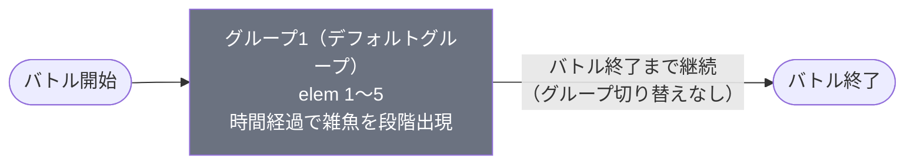

# dungeon_jig_01 インゲームデータ詳細解説

> 参照リポジトリ: `projects/glow-masterdata`
> リリースキー: `202509010`
> 本ファイルはMstAutoPlayerSequenceが5行の「雑魚大量発生・ボスなし・通常難易度」の全データ設定を解説する

---

## 概要

**地獄楽（jig）シリーズのダンジョンステージ（通常難易度・Lv1相当）**（雑魚敵のみを大量出現させるボスなし構成）。

- 砦のHP: `60,000` でダメージ有効（`is_damage_invalidation = 0`）
- BGM: `SSE_SBG_003_003`
- グループ: グループ1のみ（ループなし・全5エレメント）
- 使用する敵の種類: 3種類（全て `Normal` 通常敵、ボス敵なし）
- バトル開幕から時間経過に応じて段階的に敵が追加召喚される設計

---

## セクション2: 関連テーブル設定

### MstInGame

| カラム | 値 |
|--------|-----|
| `id` | `dungeon_jig_01` |
| `mst_auto_player_sequence_set_id` | `dungeon_jig_01` |
| `bgm_asset_key` | `SSE_SBG_003_003` |
| `boss_bgm_asset_key` | （空欄）|
| `mst_page_id` | `dungeon_jig_01` |
| `mst_enemy_outpost_id` | `dungeon_jig_01` |
| `boss_mst_enemy_stage_parameter_id` | （空欄・ボスなし）|
| `normal_enemy_hp_coef` | `1` |
| `normal_enemy_attack_coef` | `1` |
| `normal_enemy_speed_coef` | `1` |
| `boss_enemy_hp_coef` | `1` |
| `boss_enemy_attack_coef` | `1` |
| `boss_enemy_speed_coef` | `1` |

### MstEnemyOutpost（敵砦）

| カラム | 値 | 意味 |
|--------|-----|------|
| `id` | `dungeon_jig_01` | |
| `hp` | `60,000` | 通常難易度の砦HP |
| `is_damage_invalidation` | `0` | **ダメージ有効**（プレイヤーの攻撃が砦に通る） |
| `artwork_asset_key` | `jig_0001` | 地獄楽シリーズ背景アートワーク |

### MstPage + MstKomaLine（コマフィールド）

2行構成。

```
row=1  height=1  layout=2  (2コマ: jig_001 × 1.0 幅, jig_002 × 1.0 幅)
  koma1: jig_001  width=1  effect=None
  koma2: jig_002  width=1  effect=None

row=2  height=1  layout=1  (1コマ: jig_003 × 1.0 幅)
  koma1: jig_003  width=1  effect=None
```

> **コマ効果の補足**: 全コマのエフェクトタイプは `None`（無効果）。ターゲットサイドは全て `All`。コマ効果なしのシンプルなフィールド構成。

### MstInGameI18n（バトル説明文）

**result_tips（バトルヒント）:**
> （空欄）

**description（ステージ説明）:**
> 次元の裂け目に敵が出現。無色属性が中心。

---

## セクション3: 使用する敵パラメータ（MstEnemyStageParameter）一覧

3種類の敵パラメータを使用。`c_` プレフィックスはキャラ個別IDを示す。
IDの命名規則: `c_{作品ID}_{キャラID}_{コンテンツID}_{kind}_{color}`

### カラム解説

| カラム名（略称） | DBカラム名 | 説明 |
|---------------|-----------|------|
| id | id | MstEnemyStageParameterの主キー |
| キャラID | mst_enemy_character_id | 紐付くキャラモデル・スキルの参照元 |
| kind | character_unit_kind | `Normal`（通常敵）/ `Boss`（ボス）。UIオーラ表示に影響 |
| role | role_type | 属性相性の役職（Attack/Technical/Defense/Support） |
| color | color | 属性色（Red/Yellow/Green/Blue/Colorless） |
| sort_order | sort_order | ゲーム内表示順 |
| base_hp | hp | ベースHP（`enemy_hp_coef` 乗算前の素値） |
| base_atk | attack_power | ベース攻撃力（`enemy_attack_coef` 乗算前の素値） |
| base_spd | move_speed | 移動速度（数値が大きいほど速い） |
| well_dist | well_distance | 攻撃射程（コマ単位） |
| combo | attack_combo_cycle | 攻撃コンボ数（1=単発） |
| knockback | damage_knock_back_count | 被攻撃時ノックバック回数（0=ノックバックなし） |
| ability | mst_unit_ability_id1 | 特殊アビリティID |
| drop_bp | drop_battle_point | 基本ドロップバトルポイント |

### 全3種類の詳細パラメータ

| MstEnemyStageParameter ID | 日本語名 | キャラID | kind | role | color | sort | base_hp | base_atk | base_spd | well_dist | combo | knockback | ability | drop_bp |
|--------------------------|---------|---------|------|------|-------|------|---------|---------|---------|-----------|-------|-----------|---------|---------|
| `c_jig_00001_jig1_1d1c_Normal_Colorless` | がらんの画眉丸 | `chara_jig_00001` | Normal | Technical | Colorless | 1 | 10,000 | 100 | 41 | 0.24 | 6 | 2 | （なし） | 300 |
| `c_jig_00101_mainquest_Normal_Green` | 山田浅ェ門 佐切 | `chara_jig_00101` | Normal | Attack | Green | 101 | 5,000 | 200 | 34 | 0.22 | 6 | 3 | （なし） | 300 |
| `c_jig_00301_mainquest_Normal_Green` | 山田浅ェ門 仙汰 | `chara_jig_00301` | Normal | Defense | Green | 103 | 5,000 | 200 | 21 | 0.18 | 5 | 1 | （なし） | 100 |

> **実際のHP・ATKは `base × MstAutoPlayerSequence.enemy_hp_coef` で決まる。** 本ステージは全行 `enemy_hp_coef=1` / `enemy_attack_coef=1` なので、上記の素値がそのまま適用される。

### 敵パラメータの特性解説

| 比較軸 | がらんの画眉丸 | 山田浅ェ門 佐切 | 山田浅ェ門 仙汰 |
|-------|-------------|--------------|--------------|
| HP | 10,000（最高） | 5,000 | 5,000 |
| ATK | 100（最低） | 200 | 200 |
| 移動速度 | 41（最速） | 34（中速） | 21（最遅） |
| ノックバック | 2回 | 3回（最多） | 1回（最少） |
| ドロップBP | 300 | 300 | 100（低い） |

**設計上の特徴**:
- 「がらんの画眉丸」（Colorless/Technical）は最高HPかつ最速の前衛アタッカー的存在。ノックバック耐性は中程度。
- 「山田浅ェ門 佐切」（Green/Attack）は高攻撃力・中速でノックバックが最も多い（3回）。
- 「山田浅ェ門 仙汰」（Green/Defense）は低速・低射程の後衛型。ドロップBPが100と低く、スコア効率が悪い敵。

---

## セクション4: グループ構造の全体フロー（Mermaid）



> グループ切り替えは存在しない。グループ1のみで全バトルが完結するシンプルな構成。
> `InitialSummon` で開幕4体 → `ElapsedTime` 条件で順次追加召喚される。

---

## セクション5: 全5行の詳細データ（グループ単位）

### グループ1（elem 1〜5）

ボスなし・グループ切り替えなしのシンプルな雑魚大量出現ステージ。バトル開始時に4体の「がらんの画眉丸」を召喚し、その後15秒おきに段階的に敵を追加召喚する。

| id | elem | 条件 | アクション | 召喚数 | interval | aura | hp倍 | atk倍 | override_bp | 説明 |
|----|------|------|-----------|--------|---------|------|------|------|------------|------|
| dungeon_jig_01_001 | 1 | InitialSummon | SummonEnemy: `c_jig_00001_jig1_1d1c_Normal_Colorless` | 4 | 0 | Normal | 1 | 1 | 100 | 開幕4体：がらんの画眉丸（Colorless/Technical） |
| dungeon_jig_01_002 | 2 | ElapsedTime(15000) = 15秒 | SummonEnemy: `c_jig_00101_mainquest_Normal_Green` | 3 | 0 | Normal | 1 | 1 | 100 | 15秒後3体：山田浅ェ門 佐切（Green/Attack） |
| dungeon_jig_01_003 | 3 | ElapsedTime(30000) = 30秒 | SummonEnemy: `c_jig_00301_mainquest_Normal_Green` | 3 | 0 | Normal | 1 | 1 | 100 | 30秒後3体：山田浅ェ門 仙汰（Green/Defense） |
| dungeon_jig_01_004 | 4 | ElapsedTime(45000) = 45秒 | SummonEnemy: `c_jig_00001_jig1_1d1c_Normal_Colorless` | 3 | 0 | Normal | 1 | 1 | 100 | 45秒後3体：がらんの画眉丸（Colorless/Technical）追加 |
| dungeon_jig_01_005 | 5 | ElapsedTime(60000) = 60秒 | SummonEnemy: `c_jig_00101_mainquest_Normal_Green` | 4 | 0 | Normal | 1 | 1 | 100 | 60秒後4体：山田浅ェ門 佐切（Green/Attack）増量 |

**ポイント:**
- 全5行で合計17体の敵が召喚される（elem1:4体、elem2:3体、elem3:3体、elem4:3体、elem5:4体）
- `override_drop_battle_point = 100` に統一（MstEnemyStageParameter の drop_bp と同値）
- `summon_interval = 0` なので、各召喚波は指定体数を即座に一括出現させる
- 「山田浅ェ門 仙汰」（elem3: 30秒）のみ登場1回だけでその後再出現なし
- 「がらんの画眉丸」はelem1（開幕4体）とelem4（45秒後3体）で計7体
- 「山田浅ェ門 佐切」はelem2（15秒後3体）とelem5（60秒後4体）で計7体
- グループ切り替え（SwitchSequenceGroup）は一切なし。ボスは存在しない

---

## セクション6: グループ切り替えまとめ表

| 切り替え | 条件 | 遷移先 |
|---------|------|--------|
| （切り替えなし） | 本ステージはグループ1のみで完結 | — |

グループ切り替えは発生しない。バトル開始から終了まで同一グループで動作する。

各グループで倒すべき目安:
- グループ1: 全17体（ステージ完走）

---

## セクション7: スコア体系

バトルポイントは `override_drop_battle_point`（MstAutoPlayerSequence設定値）が優先される。

| 敵の種類 | override_bp（獲得バトルポイント） | 備考 |
|---------|----------------------------------|------|
| がらんの画眉丸（Colorless/Technical） | 100 | drop_bp=300より低い設定値で上書き |
| 山田浅ェ門 佐切（Green/Attack） | 100 | drop_bp=300より低い設定値で上書き |
| 山田浅ェ門 仙汰（Green/Defense） | 100 | drop_bp=100と同値 |

全敵が一律100BPで統一されている。最大獲得BP（全17体撃破）= **1,700BP**。

---

## セクション8: この設定から読み取れる設計パターン

### 1. 「雑魚大量発生」特化ステージの構成原則

本ステージは `boss_mst_enemy_stage_parameter_id` が空欄・`boss_bgm_asset_key` も空欄であり、完全にボスなし設計。グループも1つだけで切り替えなし。他の作品の `_01` ステージ（例: `dungeon_spy_01`, `dungeon_aka_01`）と同様のパターンで、シリーズ最初の入門ステージとして敵出現のみを楽しめる構成になっている。

### 2. 時間経過による段階的難易度上昇

`InitialSummon`（開幕4体）→ `ElapsedTime(15000)`（15秒おき）という等間隔スケジューリングにより、プレイヤーは序盤の余裕から徐々に圧力が高まる体験を得る。elem5（60秒後）では4体と召喚数が増加しており、終盤に向けて明確な難易度上昇が設計されている。

### 3. 属性設計：Colorless と Green の2色構成

「がらんの画眉丸」（Colorless）と「山田浅ェ門 佐切・仙汰」（Green）の2属性のみ使用。プレイヤーは Green 属性対策（弱点色）を意識しつつも、Colorless に対する汎用攻撃も必要となる。属性の多様性を2色に抑えることで、初級者が属性相性を学ぶ教育的ステージとして機能している。

### 4. 役職（role_type）の3種完備

Technical（画眉丸）・Attack（佐切）・Defense（仙汰）の3役職が登場することで、役職相性（Attack > Defense > Technical > Attack）を自然に体験できる。ただしSupportは登場しないためシンプルさを保持している。

### 5. override_drop_battle_point による BP 均一化

MstEnemyStageParameter 上の `drop_battle_point` は 300/300/100 と差があるが、MstAutoPlayerSequence の `override_drop_battle_point` を一律 100 に設定することでスコアを均等化している。これにより特定の敵を狙い撃ちするスコア最適化プレイを排除し、全敵撃破を促す設計になっている。

### 6. 砦HP 60,000 の位置付け

MstEnemyOutpost の HP は `60,000`。同シリーズの難易度比較では `dungeon_jig_02`（90,000）・`dungeon_jig_03`（150,000）と段階的に増加しており、`_01` は最も低いHP設定。ボスなし・グループ切り替えなし・砦HP 60,000 の三拍子が揃ったエントリーステージとして設計されている。
