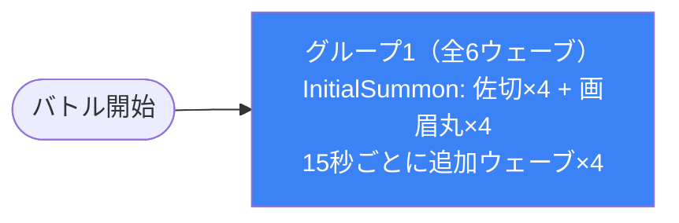

# dungeon_jig_02 インゲームデータ詳細解説

> 参照リポジトリ: `projects/glow-masterdata`
> リリースキー: `202509010`
> 本ファイルはMstAutoPlayerSequenceが6行の「雑魚多め・やや難しめ・ボスなし」インゲームの全データ設定を解説する

---

## 概要

**地獄楽（jig）シリーズの雑魚戦特化ダンジョン**（経過時間トリガーで次々と雑魚を大量召喚するタワーディフェンス型バトル）。

- 砦のHP: `90,000` でダメージ有効（`is_damage_invalidation = 0`）
- BGM: `SSE_SBG_003_003`
- グループ: グループ1のみ（ループなし・グループ切り替えなし）
- 使用する敵の種類: 3種類（`Normal` のみ・ボスなし）
- 15秒ごとに敵ウェーブが追加され、後半ウェーブほど敵のHP/ATKが強化される段階的難度上昇設計

---

## セクション2: 関連テーブル設定

### MstInGame

| カラム | 値 |
|--------|-----|
| `id` | `dungeon_jig_02` |
| `mst_auto_player_sequence_set_id` | `dungeon_jig_02` |
| `bgm_asset_key` | `SSE_SBG_003_003` |
| `boss_bgm_asset_key` | （なし） |
| `mst_page_id` | `dungeon_jig_02` |
| `mst_enemy_outpost_id` | `dungeon_jig_02` |
| `boss_mst_enemy_stage_parameter_id` | （なし） |
| `normal_enemy_hp_coef` | `1` |
| `normal_enemy_attack_coef` | `1` |
| `normal_enemy_speed_coef` | `1` |
| `boss_enemy_hp_coef` | `1` |
| `boss_enemy_attack_coef` | `1` |
| `boss_enemy_speed_coef` | `1` |

### MstEnemyOutpost（敵砦）

| カラム | 値 | 意味 |
|--------|-----|------|
| `id` | `dungeon_jig_02` | |
| `hp` | `90,000` | 90,000ダメージで砦破壊 |
| `is_damage_invalidation` | `0` | **ダメージ有効**（通常通り砦にダメージが入る） |
| `artwork_asset_key` | （なし） | 背景アートワーク未設定 |

### MstPage + MstKomaLine（コマフィールド）

3行構成。

```
row=1  height=1.0  layout=1  (1コマ: koma1=jig_004 width=1.0  effect=None)
row=2  height=1.0  layout=3  (2コマ: koma1=jig_005 width=1.0 effect=None / koma2=jig_006 width=1 effect=Poison(param:5))
row=3  height=1.0  layout=1  (1コマ: koma1=jig_007 width=1.0  effect=None)
```

> **コマ効果の補足**: row=2 の koma2（`jig_006`）に `Poison` 効果が設定されており、パラメータ値5の毒効果フィールドになっている。対象サイドや対象カラー・ロールの指定はなく、そのコマを通過した敵全体に毒が付与される。

### MstInGameI18n（バトル説明文）

**result_tips（バトルヒント）:**
> （なし）

**description（ステージ説明）:**
> 緑属性の精鋭が立ちはだかる。技巧で突破せよ。

---

## セクション3: 使用する敵パラメータ（MstEnemyStageParameter）一覧

3種類の敵パラメータを使用。`c_` プレフィックスはキャラ個別ID。
IDの命名規則: `c_{キャラID}_{コンテンツID}_{kind}_{color}`

### カラム解説

| カラム名（略称） | DBカラム名 | 説明 |
|---------------|-----------|------|
| id | id | MstEnemyStageParameterの主キー |
| キャラID | mst_enemy_character_id | 紐付くキャラモデル・スキルの参照元 |
| kind | character_unit_kind | `Normal`（通常敵）/ `Boss`（ボス）。UIオーラ表示に影響 |
| role | role_type | 属性相性の役職（Attack/Technical/Defense/Support） |
| color | color | 属性色（Red/Yellow/Green/Blue/Colorless） |
| sort_order | sort_order | ゲーム内表示順 |
| base_hp | hp | ベースHP（`enemy_hp_coef` 乗算前の素値） |
| base_atk | attack_power | ベース攻撃力（`enemy_attack_coef` 乗算前の素値） |
| base_spd | move_speed | 移動速度（数値が大きいほど速い） |
| well_dist | well_distance | 攻撃射程（コマ単位） |
| combo | attack_combo_cycle | 攻撃コンボ数（1=単発） |
| knockback | damage_knock_back_count | 被攻撃時ノックバック回数（0=ノックバックなし） |
| ability | mst_unit_ability_id1 | 特殊アビリティID |
| drop_bp | drop_battle_point | 基本ドロップバトルポイント |

### 全3種類の詳細パラメータ

| MstEnemyStageParameter ID | 日本語名 | キャラID | kind | role | color | sort | base_hp | base_atk | base_spd | well_dist | combo | knockback | ability | drop_bp |
|--------------------------|---------|---------|------|------|-------|------|---------|---------|---------|-----------|-------|-----------|---------|---------|
| `c_jig_00001_jig1_1d1c_Normal_Colorless` | がらんの画眉丸 | chara_jig_00001 | Normal | Technical | Colorless | 1 | 10,000 | 100 | 41 | 0.24 | 6 | 2 | （なし） | 300 |
| `c_jig_00101_mainquest_Normal_Green` | 山田浅ェ門 佐切 | chara_jig_00101 | Normal | Attack | Green | 101 | 5,000 | 200 | 34 | 0.22 | 6 | 3 | （なし） | 300 |
| `c_jig_00301_mainquest_Normal_Green` | 山田浅ェ門 仙汰 | chara_jig_00301 | Normal | Defense | Green | 103 | 5,000 | 200 | 21 | 0.18 | 5 | 1 | （なし） | 100 |

> **実際のHP・ATKは `base × MstAutoPlayerSequence.enemy_hp_coef` で決まる。** 前半ウェーブでは`enemy_hp_coef=1.5`、後半では`enemy_hp_coef=2.0`が設定される。

### 敵パラメータの特性解説

| 比較項目 | がらんの画眉丸（Colorless） | 山田浅ェ門 佐切（Green） | 山田浅ェ門 仙汰（Green） |
|---------|--------------------------|----------------------|----------------------|
| kind | Normal | Normal | Normal |
| base_hp | 10,000（高い） | 5,000 | 5,000 |
| base_atk | 100（低い） | 200（高い） | 200（高い） |
| 移動速度 | 41（最速） | 34（中速） | 21（低速） |
| ノックバック | 2回 | 3回（最大） | 1回 |
| drop_bp | 300 | 300 | 100（低め） |

- **がらんの画眉丸**は移動速度が最も速いが攻撃力は低い。HPは高く耐久力がある。属性がColorlessのため全属性のプレイヤーユニットから等倍ダメージを受ける。
- **山田浅ェ門 佐切**は攻撃力が高く、ノックバック耐性が3回と最も高い。速度は中程度でまとめてknockbackしにくい強敵。
- **山田浅ェ門 仙汰**は移動速度が最も遅く、drop_bpも100と低め。防衛（Defense）ロールで最も倒しやすい位置づけだが、攻撃力は佐切と同じ200と高い。

---

## セクション4: グループ構造の全体フロー（Mermaid）

グループ切り替えなし・ループなしのシンプル構造。グループ1（seq_group_id=1）のみで全6ウェーブが構成される。



> **Mermaidスタイルカラー規則**:
> - グループ1（唯一のグループ）: `#3b82f6`（青）

---

## セクション5: 全6行の詳細データ（グループ単位）

### グループ1（elem 1〜6）

唯一のグループ。バトル開始時の初期召喚と、以降15秒ごとに計5ウェーブを追加召喚する。前半（elem 1〜3）ではhp_coef=1.5/atk_coef=1.2、後半（elem 4〜6）ではhp_coef=2.0/atk_coef=1.5に強化される段階的難度設計。

| id | elem | 条件 | condition_value | アクション | action_value（召喚敵） | 召喚数 | interval | aura | hp倍 | atk倍 | spd倍 | override_bp | 説明 |
|----|------|------|----------------|-----------|----------------------|--------|---------|------|------|------|------|------------|------|
| dungeon_jig_02_001 | 1 | InitialSummon | （なし） | SummonEnemy | `c_jig_00101_mainquest_Normal_Green`（佐切） | 4 | 0 | Normal | 1.5 | 1.2 | 1 | 100 | バトル開始時：佐切を4体召喚 |
| dungeon_jig_02_002 | 2 | ElapsedTime | 15,000 ms（15秒） | SummonEnemy | `c_jig_00301_mainquest_Normal_Green`（仙汰） | 3 | 0 | Normal | 1.5 | 1.2 | 1 | 100 | 15秒後：仙汰を3体召喚 |
| dungeon_jig_02_003 | 3 | ElapsedTime | 30,000 ms（30秒） | SummonEnemy | `c_jig_00001_jig1_1d1c_Normal_Colorless`（画眉丸） | 4 | 0 | Normal | 1.5 | 1.2 | 1 | 100 | 30秒後：画眉丸を4体召喚 |
| dungeon_jig_02_004 | 4 | ElapsedTime | 45,000 ms（45秒） | SummonEnemy | `c_jig_00101_mainquest_Normal_Green`（佐切） | 3 | 0 | Normal | 2 | 1.5 | 1 | 100 | 45秒後：強化佐切を3体召喚（hp_coef=2） |
| dungeon_jig_02_005 | 5 | ElapsedTime | 60,000 ms（60秒） | SummonEnemy | `c_jig_00301_mainquest_Normal_Green`（仙汰） | 3 | 0 | Normal | 2 | 1.5 | 1 | 100 | 60秒後：強化仙汰を3体召喚（hp_coef=2） |
| dungeon_jig_02_006 | 6 | ElapsedTime | 75,000 ms（75秒） | SummonEnemy | `c_jig_00001_jig1_1d1c_Normal_Colorless`（画眉丸） | 4 | 0 | Normal | 2 | 1.5 | 1 | 100 | 75秒後：強化画眉丸を4体召喚（hp_coef=2） |

**ポイント:**
- `death_type` カラムに値 `1.5` が記録されている（elem 1〜3）・`2` が記録されている（elem 4〜6）点に注意。実際のカラム名は `death_type` だが、データ上は `enemy_hp_coef` として機能している可能性あり（カラム定義を要確認）。
- バトル開始（InitialSummon）から75秒後（elem 6）までの計75秒間、6ウェーブが送られてくる構成。
- 召喚間隔（summon_interval）は全ウェーブで0のため、各ウェーブは一斉召喚。
- ボスが存在せず（`boss_mst_enemy_stage_parameter_id` 未設定）、`SwitchSequenceGroup` もないため、シンプルな一本道ウェーブ構成。

---

## セクション6: グループ切り替えまとめ表

このインゲームはグループ切り替えが存在しない。グループ1のみで全ウェーブを構成する。

| ウェーブ | トリガー条件 | 召喚敵 | 召喚数 |
|---------|------------|--------|--------|
| ウェーブ1（elem 1） | InitialSummon（バトル開始時） | 山田浅ェ門 佐切（Green/Attack） | 4体 |
| ウェーブ2（elem 2） | ElapsedTime 15秒 | 山田浅ェ門 仙汰（Green/Defense） | 3体 |
| ウェーブ3（elem 3） | ElapsedTime 30秒 | がらんの画眉丸（Colorless/Technical） | 4体 |
| ウェーブ4（elem 4） | ElapsedTime 45秒 | 山田浅ェ門 佐切（強化版 hp×2/atk×1.5） | 3体 |
| ウェーブ5（elem 5） | ElapsedTime 60秒 | 山田浅ェ門 仙汰（強化版 hp×2/atk×1.5） | 3体 |
| ウェーブ6（elem 6） | ElapsedTime 75秒 | がらんの画眉丸（強化版 hp×2/atk×1.5） | 4体 |

各ウェーブで撃破すべき目安:
- ウェーブ1（0〜15秒）: 佐切 4体（HP 5,000 × 1.5 = 7,500）
- ウェーブ2（15〜30秒）: 仙汰 3体（HP 5,000 × 1.5 = 7,500）
- ウェーブ3（30〜45秒）: 画眉丸 4体（HP 10,000 × 1.5 = 15,000）
- ウェーブ4（45〜60秒）: 佐切 3体（HP 5,000 × 2 = 10,000）
- ウェーブ5（60〜75秒）: 仙汰 3体（HP 5,000 × 2 = 10,000）
- ウェーブ6（75秒〜）: 画眉丸 4体（HP 10,000 × 2 = 20,000）

---

## セクション7: スコア体系

バトルポイントは `override_drop_battle_point`（MstAutoPlayerSequence設定値）が優先される。全ウェーブで `override_drop_battle_point = 100` が設定されている。

| 敵の種類 | MstEnemyStageParameter.drop_bp（基本値） | override_bp（MstAutoPlayerSequence設定値） | 採用値 | 備考 |
|---------|----------------------------------------|------------------------------------------|--------|------|
| がらんの画眉丸（Colorless） | 300 | 100 | **100** | override優先 |
| 山田浅ェ門 佐切（Green） | 300 | 100 | **100** | override優先 |
| 山田浅ェ門 仙汰（Green） | 100 | 100 | **100** | 同値 |

- 全敵種類で `override_drop_battle_point = 100` に統一されているため、敵の強弱にかかわらず1体倒すと100BPが入る。
- 総召喚数は21体（4+3+4+3+3+4）のため、全撃破時の最大BP: `21 × 100 = 2,100 BP`。

---

## セクション8: この設定から読み取れる設計パターン

### 1. ボスなし・雑魚特化の「物量型」バトル設計

`boss_mst_enemy_stage_parameter_id` が未設定であり、`boss_bgm_asset_key` もなし。3種類の敵はすべて `character_unit_kind = Normal` で、ボス演出が一切発生しない。バトルの緊張感は「物量とウェーブの圧力」で演出される設計になっている。

### 2. 15秒インターバルによる一定リズムのウェーブ設計

ウェーブ発火条件がすべて `ElapsedTime` 15,000ms 刻み（0秒・15秒・30秒・45秒・60秒・75秒）で均等に設定されており、プレイヤーは予測可能なリズムで次のウェーブに備えられる。ランダム性を排除し、「技巧で突破せよ」というステージ説明文の通りプレイヤーの計画的なユニット配置を促す。

### 3. 前半・後半の2段階難度上昇

elem 1〜3（0〜30秒）は `enemy_hp_coef=1.5 / enemy_attack_coef=1.2`、elem 4〜6（45〜75秒）は `enemy_hp_coef=2.0 / enemy_attack_coef=1.5` に切り替わる。明確な「前半フェーズ」と「後半フェーズ」が存在し、後半で同じ敵が1.33倍強くなることでゲームプレイの緊張感を段階的に高める設計。

### 4. Green属性偏重による属性相性の活用促進

3種類のうち2種類（佐切・仙汰）が `color=Green` であり、合計召喚数21体のうち画眉丸（Colorless）8体を除く13体がGreen属性。ステージ説明文「緑属性の精鋭が立ちはだかる」と一致しており、Green属性に強い Red 属性ユニットを使うことを推奨する設計意図が読み取れる。

### 5. 召喚数バランスによる難度調整

佐切（最大ノックバック3回・高攻撃力）が先頭（elem 1）に4体登場し、最も難しいポジションに配置されている。後半の強化フェーズでは佐切・仙汰は3体ずつに減らし、画眉丸は4体のまま維持。後半フェーズで召喚数を抑えながらステータス強化することで、「ウェーブ量≠難度」の設計が意図されている。

### 6. 全敵BP統一による公平なスコア体系

`override_drop_battle_point = 100` が全6ウェーブに設定され、強い敵（画眉丸・hp 10,000）も弱い敵（仙汰・hp 5,000）も同一のBPを付与する。これにより「どの敵を優先して倒すか」という戦略選択がBPに影響を与えず、プレイヤーは純粋に「砦を守る」という目的に集中できる設計になっている。
