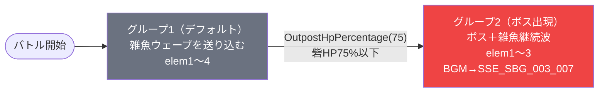

# dungeon_jig_03 インゲームデータ詳細解説

> 参照リポジトリ: `projects/glow-masterdata`
> リリースキー: `202509010`
> 本ファイルはMstAutoPlayerSequenceが7行の「ボス出現型ダンジョン（1行コマフィールド）」の全データ設定を解説する

---

## 概要

**地獄楽（jig）シリーズのダンジョン最終ステージ**（強力なボスが出現するシングルレーン構成）。

- 砦のHP: `150,000` でダメージ有効（`is_damage_invalidation = 0`）
- BGM: `SSE_SBG_003_003`（通常BGM）/ ボスBGM: `SSE_SBG_003_007`（SwitchSequenceGroup後に切り替わる）
- グループ: デフォルト（グループ1） + ボスグループ（グループ2）の2グループ構成（ループなし）
- 使用する敵の種類: 4種類（`c_jig_00001_jig1_1d1c_Normal_Colorless`、`c_jig_00101_mainquest_Normal_Green`、`c_jig_00301_mainquest_Normal_Green`、`c_jig_00001_mainquest_Boss_Red`）
- コマフィールド: 1行のみ（3コマ構成・シングルレーン）。OutpostHpPercentage 75% でボスグループに切り替わりBGM変化

---

## セクション2: 関連テーブル設定

### MstInGame

| カラム | 値 |
|--------|-----|
| `id` | `dungeon_jig_03` |
| `mst_auto_player_sequence_set_id` | `dungeon_jig_03` |
| `bgm_asset_key` | `SSE_SBG_003_003` |
| `boss_bgm_asset_key` | `SSE_SBG_003_007` |
| `mst_page_id` | `dungeon_jig_03` |
| `mst_enemy_outpost_id` | `dungeon_jig_03` |
| `boss_mst_enemy_stage_parameter_id` | `c_jig_00001_mainquest_Boss_Red` |
| `normal_enemy_hp_coef` | `1` |
| `normal_enemy_attack_coef` | `1` |
| `normal_enemy_speed_coef` | `1` |
| `boss_enemy_hp_coef` | `1` |
| `boss_enemy_attack_coef` | `1` |
| `boss_enemy_speed_coef` | `1` |

### MstEnemyOutpost（敵砦）

| カラム | 値 | 意味 |
|--------|-----|------|
| `id` | `dungeon_jig_03` | |
| `hp` | `150,000` | 高耐久砦（jig_03シリーズ最大値） |
| `is_damage_invalidation` | `0` | **ダメージ有効**（通常通りHPが減少） |
| `artwork_asset_key` | `jig_0003` | 地獄楽ボスステージ背景アートワーク |

### MstPage + MstKomaLine（コマフィールド）

1行構成（シングルレーン）。

```
row=1  height=1  layout=8  (3コマ: jig_008 / jig_009 / jig_010)
  koma1: jig_008  width=1  effect=None
  koma2: jig_009  width=1  effect=None
  koma3: jig_010  width=1  effect=None
```

> **コマ効果の補足**: 全3コマともエフェクトなし（`None`）。レイアウト8（3コマ横並び均等）を使用し、特殊コマ効果を持たないシンプルな構成。地獄楽_03は「コマ効果なし・敵の強さで勝負する」設計。

### MstInGameI18n（バトル説明文）

**result_tips（バトルヒント）:**
> （設定なし）

**description（ステージ説明）:**
> 次元の支配者が最奥に。赤属性のボスに備えよ。

---

## セクション3: 使用する敵パラメータ（MstEnemyStageParameter）一覧

4種類の敵パラメータを使用。`c_` プレフィックスはキャラ個別ID。
IDの命名規則: `c_{キャラID}_{コンテンツID}_{kind}_{color}`

### カラム解説

| カラム名（略称） | DBカラム名 | 説明 |
|---------------|-----------|------|
| id | id | MstEnemyStageParameterの主キー |
| キャラID | mst_enemy_character_id | 紐付くキャラモデル・スキルの参照元 |
| kind | character_unit_kind | `Normal`（通常敵）/ `Boss`（ボス）。UIオーラ表示に影響 |
| role | role_type | 属性相性の役職（Attack/Technical/Defense/Support） |
| color | color | 属性色（Red/Yellow/Green/Blue/Colorless） |
| sort_order | sort_order | ゲーム内表示順 |
| base_hp | hp | ベースHP（`enemy_hp_coef` 乗算前の素値） |
| base_atk | attack_power | ベース攻撃力（`enemy_attack_coef` 乗算前の素値） |
| base_spd | move_speed | 移動速度（数値が大きいほど速い） |
| well_dist | well_distance | 攻撃射程（コマ単位） |
| combo | attack_combo_cycle | 攻撃コンボ数（1=単発） |
| knockback | damage_knock_back_count | 被攻撃時ノックバック回数（0=ノックバックなし） |
| ability | mst_unit_ability_id1 | 特殊アビリティID |
| drop_bp | drop_battle_point | 基本ドロップバトルポイント |

### 全4種類の詳細パラメータ

| MstEnemyStageParameter ID | 日本語名 | キャラID | kind | role | color | sort | base_hp | base_atk | base_spd | well_dist | combo | knockback | ability | drop_bp |
|--------------------------|---------|---------|------|------|-------|------|---------|---------|---------|-----------|-------|-----------|---------|---------|
| c_jig_00001_jig1_1d1c_Normal_Colorless | がらんの画眉丸 | chara_jig_00001 | Normal | Technical | Colorless | 1 | 10,000 | 2 | 41 | 0.24 | 100 | 6 | (なし) | 300 |
| c_jig_00101_mainquest_Normal_Green | 山田浅ェ門 佐切 | chara_jig_00101 | Normal | Attack | Green | 101 | 5,000 | 3 | 34 | 0.22 | 200 | 6 | (なし) | 300 |
| c_jig_00301_mainquest_Normal_Green | 山田浅ェ門 仙汰 | chara_jig_00301 | Normal | Defense | Green | 103 | 5,000 | 1 | 21 | 0.18 | 200 | 5 | (なし) | 100 |
| c_jig_00001_mainquest_Boss_Red | がらんの画眉丸（ボス） | chara_jig_00001 | Boss | Technical | Red | 1 | 5,000 | 2 | 41 | 0.24 | 100 | 5 | (なし) | 400 |

> **実際のHP・ATKは `base × MstAutoPlayerSequence.enemy_hp_coef` で決まる。**
> ※ dungeon_jig_03はすべてhp_coef=1（または1.5）のため、グループ2の elem3のhp_coef=1.5指定を除き素値がそのまま適用される。

### 敵パラメータの特性解説

| 比較項目 | 通常敵（画眉丸Colorless） | 通常敵（佐切/仙汰・Green） | ボス（画眉丸Red） |
|---------|------------------------|--------------------------|----------------|
| kind | Normal | Normal | Boss |
| color | Colorless | Green | Red |
| base_hp | 10,000（高い） | 5,000 | 5,000（低め） |
| base_atk | 2 | 3 / 1 | 2 |
| move_speed | 41（高速） | 34 / 21（中〜低速） | 41（高速） |
| drop_bp | 300 | 300 / 100 | 400（override_bpで500に上書き） |

- ボス（c_jig_00001_mainquest_Boss_Red）はbase_hpが5,000と低いが、`enemy_hp_coef` は MstAutoPlayerSequence 側で制御され、MstInGameの`boss_mst_enemy_stage_parameter_id`に指定されているため、ゲーム内での特殊演出（ボスオーラ）が付与される
- 序盤雑魚の画眉丸Colorless（c_jig_00001_jig1_1d1c）はhpが10,000と高くmove_speed=41で高速移動するため、序盤から圧力が高い設計

---

## セクション4: グループ構造の全体フロー（Mermaid）



> **Mermaid スタイルカラー規則**:
> - デフォルトグループ（グループ1）: `#6b7280`（グレー）
> - ボスグループ（グループ2）: `#ef4444`（赤）
>
> グループ切り替えトリガーは「砦HPが75%以下になった時点」。ループなし終端型フロー。

---

## セクション5: 全7行の詳細データ（グループ単位）

### グループ1（デフォルト）（elem 1〜4, sequence_group_id=1）

バトル開始直後から砦HP75%になるまで、雑魚ウェーブを時間経過で送り込み続けるフェーズ。elem4でSwitchSequenceGroupが発動するとボスグループへ移行する。

| id | elem | 条件 | 条件値 | アクション | 召喚数 | interval | aura | hp倍 | atk倍 | override_bp | 説明 |
|----|------|------|-------|-----------|--------|---------|------|------|------|------------|------|
| dungeon_jig_03_001 | 1 | InitialSummon | - | SummonEnemy: c_jig_00001_jig1_1d1c_Normal_Colorless | 4 | 0 | Default | 1 | 1 | 100 | バトル開始直後に画眉丸Colorless（Normal）を4体即時召喚 |
| dungeon_jig_03_002 | 2 | ElapsedTime | 15,000ms | SummonEnemy: c_jig_00101_mainquest_Normal_Green | 3 | 0 | Default | 1 | 1 | 100 | 15秒後に佐切（Green・Attack）を3体召喚 |
| dungeon_jig_03_003 | 3 | ElapsedTime | 30,000ms | SummonEnemy: c_jig_00301_mainquest_Normal_Green | 3 | 0 | Default | 1.5 | 1 | 100 | 30秒後に仙汰（Green・Defense）を3体召喚（HP1.5倍強化） |
| dungeon_jig_03_004 | 4 | OutpostHpPercentage | 75 | SwitchSequenceGroup: 2 | - | - | - | - | - | - | 砦HP75%以下でグループ2へ切り替え |

**ポイント:**
- elem1はInitialSummonで即時4体召喚。sequence_group_id=1のデフォルトグループで開幕から強い圧力を演出。
- elem3（仙汰）は`enemy_hp_coef=1.5`が設定されており、HP1.5倍（通常HP 5,000 → 7,500相当）でタフな壁役として登場。
- elem4（SwitchSequenceGroup）は条件 `OutpostHpPercentage=75` で発動する。砦HP75%は敵の攻撃が進むとすぐ達成されるため、比較的早期にボス出現が起こる設計。
- summon_interval=0のため全員が一斉に出現（間隔なし）。

---

### グループ2（ボス出現）（elem 1〜3, sequence_group_id=2）

砦HP75%以下でトリガーされるボスグループ。ボス（がらんの画眉丸 Red）が即座に登場し、BGMがボス用（SSE_SBG_003_007）に切り替わる。雑魚も継続して召喚される。

| id | elem | 条件 | 条件値 | アクション | 召喚数 | interval | aura | hp倍 | atk倍 | override_bp | 説明 |
|----|------|------|-------|-----------|--------|---------|------|------|------|------------|------|
| dungeon_jig_03_005 | 1 | InitialSummon | - | SummonEnemy: c_jig_00001_mainquest_Boss_Red | 1 | 0 | Boss | 1 | 1 | 500 | グループ切り替え直後にボス（画眉丸Red）を1体召喚。aura=Boss |
| dungeon_jig_03_006 | 2 | ElapsedTime | 10,000ms | SummonEnemy: c_jig_00101_mainquest_Normal_Green | 3 | 0 | Default | 1 | 1 | 100 | ボス出現10秒後に佐切（Green・Attack）を3体追加召喚 |
| dungeon_jig_03_007 | 3 | ElapsedTime | 25,000ms | SummonEnemy: c_jig_00301_mainquest_Normal_Green | 3 | 0 | Default | 1.5 | 1 | 100 | ボス出現25秒後に仙汰（Green・Defense）を3体追加召喚（HP1.5倍） |

**ポイント:**
- elem1のボス召喚は `aura_type=Boss` でUIオーラ演出が付与される。`last_boss_trigger=Boss` かつ `death_type=Normal`。
- `override_drop_battle_point=500` でボスを倒した際の獲得BPが500に上書き（通常base: 400）。
- elem2・elem3はグループ1のelem2・elem3と同じ敵を再度送り込む構成。ボスがいる中でも雑魚の継続波が追加プレッシャーを与える。
- グループ2はループせず終端型。ボスを倒すことがバトル目標の核心。

---

## セクション6: グループ切り替えまとめ表

| 切り替え | 条件 | 条件値 | 遷移先 |
|---------|------|-------|--------|
| グループ1 → グループ2 | **OutpostHpPercentage(75)** | 砦HP75%以下 | グループ2（ボス出現） |

各グループで目安となるイベント:
- グループ1（デフォルト）: 砦HPを75%以下まで削る（=25%以上ダメージを与える）とボスフェーズへ移行
- グループ2（ボス）: ボス（がらんの画眉丸 Red）を撃破すると実質クリア方向へ

> **補足**: `OutpostHpPercentage` の条件値は `75` であり、敵砦HP（150,000）の75% = 112,500以下になった時点でSwitchSequenceGroupが発動する。enemy_hp_coef・attack_coefはすべて1.0倍であるため、プレイヤーの攻撃力次第で移行タイミングが決まる。

---

## セクション7: スコア体系

バトルポイントは `override_drop_battle_point`（MstAutoPlayerSequence設定値）が優先される。

| 敵の種類 | override_bp（獲得バトルポイント） | 備考 |
|---------|----------------------------------|------|
| c_jig_00001_jig1_1d1c_Normal_Colorless（画眉丸 Colorless） | 100 | グループ1 elem1、4体召喚 |
| c_jig_00101_mainquest_Normal_Green（佐切 Green） | 100 | グループ1 elem2・グループ2 elem2、各3体 |
| c_jig_00301_mainquest_Normal_Green（仙汰 Green） | 100 | グループ1 elem3・グループ2 elem3、各3体、HP1.5倍 |
| c_jig_00001_mainquest_Boss_Red（画眉丸ボス Red） | 500 | グループ2 elem1、1体召喚。override_bpで500に上書き |

> **理論最大BP（全敵撃破時）**:
> - グループ1: 4×100 + 3×100 + 3×100 = 1,000 BP
> - グループ2: 1×500 + 3×100 + 3×100 = 1,100 BP
> - 合計最大: **2,100 BP**（全員撃破かつ両グループ全到達の場合）
>
> ※グループ1のSwitchSequenceGroup行（elem4）は敵召喚ではないためBPなし。

---

## セクション8: この設定から読み取れる設計パターン

### 1. 「砦HP75%閾値」によるボス出現タイミングの均一化

`OutpostHpPercentage=75` を採用することで、プレイヤーの攻撃力に関わらず「砦にある程度ダメージが蓄積したら必ずボスが出現する」仕組みになっている。HP70%や50%ではなく75%という高めの閾値設定は、「比較的早い段階でボスと雑魚を同時に相手にする緊張感」を演出する意図が読み取れる。dungeon_jig_03シリーズの_03（最終ステージ）としてボス登場を早めることで難易度を引き上げている。

### 2. 同一キャラIDを複数バリアントで使い回す設計

`chara_jig_00001`（がらんの画眉丸）が `c_jig_00001_jig1_1d1c_Normal_Colorless`（序盤雑魚・無色・Normal）と `c_jig_00001_mainquest_Boss_Red`（ボス・赤・Boss）の2バリアントとして登場する。同一キャラのビジュアルで属性とkindを変えることにより、「序盤の雑魚として戦ったキャラが最終的にボスとして立ちはだかる」という演出を実現している。これは地獄楽シリーズの作品イメージ（変化・変容）とも合致した設計パターン。

### 3. コマフィールド1行構成によるシングルレーン集中バトル

dungeon_jig_03のMstKomaLine（dungeon_jig_03_1）は `row=1・layout=8・3コマ` の1行構成。jig_01（2行）やjig_02（3行）と異なり、コマフィールドが1行のみに集中している。シングルレーンにすることで敵が1列にまとまり、プレイヤーが全コマに敵が押し寄せる「包囲感」と「防衛の集中」を体験できる。ボスステージの緊張感を増す意図が明確。

### 4. HP1.5倍コーエフ（仙汰）による「壁役」の意図的配置

仙汰（c_jig_00301_mainquest_Normal_Green）のみ `enemy_hp_coef=1.5` が設定されており、HP 5,000 × 1.5 = 7,500 として登場する。Defenseロールの仙汰にHPブーストを加えることで「盾役・壁役」として機能させ、プレイヤーが雑魚処理に時間を取られる中でボスも相手にする複合的な難易度を設計している。グループ1（30秒後）とグループ2（25秒後）の両方で同様に登場するため、フェーズを通じて一貫した圧力を形成。

### 5. ボスBGM分離による演出強化

`bgm_asset_key=SSE_SBG_003_003`（通常BGM）と `boss_bgm_asset_key=SSE_SBG_003_007`（ボスBGM）を分離し、SwitchSequenceGroupと連動してBGMが切り替わる。音楽的な演出変化がボス出現のシグナルとなり、プレイヤーに「局面が変わった」ことを音で伝える。jig_01・jig_02にはboss_bgm_asset_keyが設定されていないため、_03限定の上位ステージ演出であることがわかる。

### 6. グループ2の雑魚継続召喚による終盤プレッシャー設計

グループ2（ボスフェーズ）に移行後も、elem2（10秒後に佐切3体）とelem3（25秒後に仙汰3体HP1.5倍）が継続して召喚される。ボスだけを相手にする単純なボス戦ではなく、「ボス＋継続する雑魚ウェーブ」を同時処理させることで、プレイヤーに選択を迫る戦略的プレッシャーを維持している。この設計はdungeon_jig_03シリーズの最終ステージとしての総合的な難易度設計を体現している。
