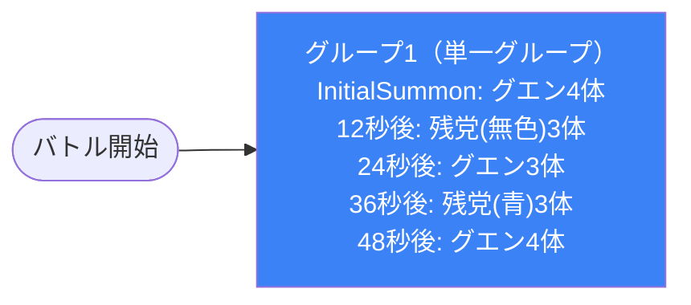

# dungeon_spy_01 インゲームデータ詳細解説

> 参照リポジトリ: `domain/tasks/masterdata-entry/in-game-tables/generated/v2`
> リリースキー: `202509010`
> 本ファイルはMstAutoPlayerSequenceが5行のダンジョン（雑魚大量発生・ボスなし・通常難易度）の全データ設定を解説する

---

## 概要

**SPY×FAMILYの世界観をテーマにしたダンジョン型インゲーム**（スパイたちが潜む街の探索・通常難易度）。

- 砦のHP: `15,000` でダメージ有効（`is_damage_invalidation = 0`）
- BGM: `SSE_SBG_003_002`（ボスBGMなし）
- グループ: グループ1のみ（ループなし・グループ切り替えなし）
- 使用する敵の種類: 3種類（`Normal` のみ、ボスなし）
  - `e_spy_00101_general_n_Normal_Colorless`（グエン・無属性）
  - `e_spy_00001_general_n_Normal_Colorless`（密輸組織の残党・無属性）
  - `e_spy_00001_general_n_Normal_Blue`（密輸組織の残党・青属性）
- **雑魚大量発生型**：ElapsedTime（経過時間）トリガーで定期的に複数体ずつ召喚
- ボスなし・グループ切り替えなし・シンプルな時系列ウェーブ構成

---

## 関連テーブル設定

### MstInGame

| カラム | 値 |
|--------|-----|
| `id` | `dungeon_spy_01` |
| `mst_auto_player_sequence_set_id` | `dungeon_spy_01` |
| `bgm_asset_key` | `SSE_SBG_003_002` |
| `boss_bgm_asset_key` | （なし） |
| `mst_page_id` | `dungeon_spy_01` |
| `mst_enemy_outpost_id` | `dungeon_spy_01` |
| `boss_mst_enemy_stage_parameter_id` | （なし） |
| `normal_enemy_hp_coef` | `1` |
| `normal_enemy_attack_coef` | `1` |
| `normal_enemy_speed_coef` | `1` |
| `boss_enemy_hp_coef` | `1` |
| `boss_enemy_attack_coef` | `1` |
| `boss_enemy_speed_coef` | `1` |
| `release_key` | `202509010` |

### MstEnemyOutpost（敵砦）

| カラム | 値 | 意味 |
|--------|-----|------|
| `id` | `dungeon_spy_01` | インゲームIDと同一 |
| `hp` | `15,000` | 砦の耐久値（ダメージ蓄積で破壊目的） |
| `is_damage_invalidation` | `0` | **ダメージ有効**（敵が砦にダメージを与える） |
| `artwork_asset_key` | `spy_0001` | 背景アートワーク（SPY×FAMILYシリーズ背景） |

### MstPage + MstKomaLine（コマフィールド）

3行構成。

```
row=1  height=0.52  layout=3  (2コマ: spy_001×0.4 + spy_002×0.6)
  koma1: spy_001  width=0.4  effect=None
  koma2: spy_002  width=0.6  effect=None

row=2  height=0.52  layout=1  (1コマ: spy_003×1.0)
  koma1: spy_003  width=1.0  effect=None

row=3  height=0.52  layout=4  (2コマ: spy_004×0.5 + spy_005×0.5)
  koma1: spy_004  width=0.5  effect=AttackPowerUp(param1=30, target_side=Ally, colors=All, roles=All)
  koma2: spy_005  width=0.5  effect=None
```

> **コマ効果の補足**: row=3のkoma1（`spy_004`）に `AttackPowerUp` 効果が設定されている。`target_side=Ally`・`colors=All`・`roles=All` のため、味方全体の攻撃力が30%アップするコマ効果。このコマに味方ユニットが侵入すると全属性・全役職の味方の攻撃力が強化される。

### MstInGameI18n（バトル説明文）

**result_tips（バトルヒント）:**
> （設定なし）

**description（ステージ説明）:**
> スパイたちが潜む街を探索せよ。無色属性の敵が多い。

---

## 使用する敵パラメータ（MstEnemyStageParameter）一覧

3種類の敵パラメータを使用。`e_` プレフィックスは汎用敵（ボスなし）。
IDの命名規則: `e_{キャラID}_{コンテンツID}_{kind}_{color}`

### カラム解説

| カラム名（略称） | DBカラム名 | 説明 |
|---------------|-----------|------|
| id | id | MstEnemyStageParameterの主キー |
| キャラID | mst_enemy_character_id | 紐付くキャラモデル・スキルの参照元 |
| kind | character_unit_kind | `Normal`（通常敵）/ `Boss`（ボス）。UIオーラ表示に影響 |
| role | role_type | 属性相性の役職（Attack/Technical/Defense/Support） |
| color | color | 属性色（Red/Yellow/Green/Blue/Colorless） |
| sort_order | sort_order | ゲーム内表示順 |
| base_hp | hp | ベースHP（`enemy_hp_coef` 乗算前の素値） |
| base_atk | attack_power | ベース攻撃力（`enemy_attack_coef` 乗算前の素値） |
| base_spd | move_speed | 移動速度（数値が大きいほど速い） |
| well_dist | well_distance | 攻撃射程（コマ単位） |
| combo | attack_combo_cycle | 攻撃コンボ数（1=単発） |
| knockback | damage_knock_back_count | 被攻撃時ノックバック回数（0=ノックバックなし） |
| ability | mst_unit_ability_id1 | 特殊アビリティID |
| drop_bp | drop_battle_point | 基本ドロップバトルポイント |

### 全3種類の詳細パラメータ

| MstEnemyStageParameter ID | 日本語名 | キャラID | kind | role | color | sort | base_hp | base_atk | base_spd | well_dist | combo | knockback | ability | drop_bp |
|--------------------------|---------|---------|------|------|-------|------|---------|---------|---------|-----------|-------|-----------|---------|---------|
| `e_spy_00101_general_n_Normal_Colorless` | グエン | `enemy_spy_00101` | Normal | Attack | Colorless | 1 | 1,000 | 50 | 31 | 0.2 | 1 | 0 | （なし） | 200 |
| `e_spy_00001_general_n_Normal_Colorless` | 密輸組織の残党 | `enemy_spy_00001` | Normal | Attack | Colorless | 4 | 1,000 | 50 | 34 | 0.4 | 1 | 0 | （なし） | 300 |
| `e_spy_00001_general_n_Normal_Blue` | 密輸組織の残党（青） | `enemy_spy_00001` | Normal | Defense | Blue | 5 | 1,000 | 50 | 34 | 0.4 | 1 | 0 | （なし） | 400 |

> **実際のHP・ATKは `base × MstAutoPlayerSequence.enemy_hp_coef` で決まる。** 本インゲームは全行 `enemy_hp_coef = 1`・`enemy_attack_coef = 1` のため、素値がそのまま適用される（HP=1,000、ATK=50）。

### 敵パラメータの特性解説

| 特性 | グエン | 密輸組織の残党（無色） | 密輸組織の残党（青） |
|------|--------|---------------------|------------------|
| キャラモデル | `enemy_spy_00101`（グエン専用） | `enemy_spy_00001`（共通） | `enemy_spy_00001`（共通） |
| 役職 | Attack（攻撃型） | Attack（攻撃型） | Defense（防御型） |
| 移動速度 | 31（やや遅め） | 34（速め） | 34（速め） |
| 射程 | 0.2コマ（近接） | 0.4コマ（標準） | 0.4コマ（標準） |
| ドロップBP | 200 | 300 | 400 |
| ノックバック | なし（0） | なし（0） | なし（0） |

- **全3種 `Normal` kind・ボスなし**: このインゲームはボスを持たない純粋な雑魚大量発生型。
- **無属性中心**: 説明文に「無色属性の敵が多い」と明記されており、グエン・残党（無色）の2種類が無属性。青属性の残党はアクセント的に1波のみ登場。
- **全員同HP（1,000）・同ATK（50）**: ベースパラメータが均一で、単純に数量で攻撃力を担保する設計。
- **ドロップBPの差**: グエン（200） < 残党（無色）（300） < 残党（青）（400）と、珍しさや属性の希少性でBPに差をつける設計。

---

## グループ構造の全体フロー（Mermaid）



> **グループ構成の注意**: このインゲームはグループ切り替え（SwitchSequenceGroup）が一切なく、`sequence_group_id = 1` の単一グループのみで完結する。バトル開始から終了まで同一グループが継続して動作し、ElapsedTimeトリガーによる時系列の波状攻撃が行われる。

> **Mermaid スタイルカラー規則**:
> - w1相当（最初の主グループ）: `#3b82f6`（青）

---

## 全5行の詳細データ（グループ単位）

### グループ1（sequence_group_id = 1, elem 1〜5, グループ切り替えなし）

バトル開始から48秒間にわたる5回の敵召喚ウェーブ。グループ切り替えは一切なく、単一グループで全ウェーブを管理する。InitialSummonによる即時召喚から始まり、12秒間隔で敵が波状に送り込まれる。

| id | elem | 条件 | アクション | 召喚数 | interval | aura | hp倍 | atk倍 | override_bp | 説明 |
|----|------|------|-----------|--------|---------|------|------|------|------------|------|
| dungeon_spy_01_001 | 1 | InitialSummon | SummonEnemy: `e_spy_00101_general_n_Normal_Colorless` | 4 | 1,000ms | Normal | 1 | 1 | （なし） | バトル開始直後にグエン4体を即時召喚。1秒間隔で順次出現 |
| dungeon_spy_01_002 | 2 | ElapsedTime(12000) | SummonEnemy: `e_spy_00001_general_n_Normal_Colorless` | 3 | 1,000ms | Normal | 1 | 1 | （なし） | 開始12秒後に密輸組織の残党（無色）3体を召喚 |
| dungeon_spy_01_003 | 3 | ElapsedTime(24000) | SummonEnemy: `e_spy_00101_general_n_Normal_Colorless` | 3 | 1,000ms | Normal | 1 | 1 | （なし） | 開始24秒後にグエン3体を再召喚 |
| dungeon_spy_01_004 | 4 | ElapsedTime(36000) | SummonEnemy: `e_spy_00001_general_n_Normal_Blue` | 3 | 1,000ms | Normal | 1 | 1 | （なし） | 開始36秒後に密輸組織の残党（青）3体を召喚。唯一の青属性波 |
| dungeon_spy_01_005 | 5 | ElapsedTime(48000) | SummonEnemy: `e_spy_00101_general_n_Normal_Colorless` | 4 | 1,000ms | Normal | 1 | 1 | （なし） | 開始48秒後にグエン4体を最終召喚。最多召喚数の波 |

**ポイント:**
- **InitialSummonで即戦闘開始**: elem=1は `InitialSummon` トリガーのため、バトル開始と同時にグエン4体が出現。プレイヤーはカウントダウン終了直後から敵対応が必要。
- **12秒間隔の定期召喚**: elem=2〜5はすべて12,000ミリ秒（12秒）間隔のElapsedTime。合計で0秒・12秒・24秒・36秒・48秒の5波構成。
- **全波 summon_interval=1,000ms**: 複数体召喚時は1秒ごとに1体ずつ出現。4体なら4秒かけて全員が入場。
- **elem=4のみ青属性**: 36秒時点のみ `Defense`ロール・青属性の残党が登場。ステージ単調になりにくい属性アクセント。
- **倍率は全行1倍固定**: `enemy_hp_coef=1`・`enemy_attack_coef=1` で全ウェーブ通じてパラメータスケーリングなし。難易度上昇は数量のみで表現。

---

## グループ切り替えまとめ表

このインゲームはグループ切り替え（SwitchSequenceGroup）が**一切存在しない**。

| 切り替え | 条件 | 遷移先 |
|---------|------|--------|
| （なし） | （なし） | （なし） |

グループは `sequence_group_id = 1` の1グループのみで、バトル開始から終了まで同一グループが動作し続ける。

各グループで召喚される総数:
- グループ1（全体）: 合計17体（elem=1: 4体 + elem=2: 3体 + elem=3: 3体 + elem=4: 3体 + elem=5: 4体）

---

## スコア体系

バトルポイントは `override_drop_battle_point`（MstAutoPlayerSequence設定値）が優先されるが、このインゲームは全行 `override_drop_battle_point` が未設定のため、MstEnemyStageParameter の `drop_battle_point` がそのまま適用される。

| 敵の種類 | override_bp（シーケンス上書き） | 基本drop_bp | 実際の獲得BP | 備考 |
|---------|--------------------------------|------------|------------|------|
| グエン（無色） | （なし・未設定） | 200 | 200 | elem=1・3・5で登場。合計11体 |
| 密輸組織の残党（無色） | （なし・未設定） | 300 | 300 | elem=2で登場。合計3体 |
| 密輸組織の残党（青） | （なし・未設定） | 400 | 400 | elem=4のみ登場。合計3体 |

**理論上の最大獲得BP（全敵撃破時）:**
- グエン11体 × 200 = 2,200
- 残党（無色）3体 × 300 = 900
- 残党（青）3体 × 400 = 1,200
- **合計: 4,300 BP**

---

## この設定から読み取れる設計パターン

### 1. シングルグループ・時系列ウェーブ設計（ダンジョン通常難易度の基本形）

グループ切り替えを一切使わず、ElapsedTimeトリガーだけでウェーブを制御するシンプルな構成。通常難易度のダンジョンとして「グループ管理の複雑さなし」「時計通りに敵が出現し続ける」という設計で、プレイヤーへの学習コストを最小化する。`dungeon_spy_01` はダンジョンシリーズの入門コンテンツとして機能することが想定される。

### 2. 雑魚大量発生・ボスなし設計によるプレッシャー維持

全5波・合計17体（うち11体がグエン）を12秒間隔で継続投入するため、前波の処理が終わる前に次波が到着する。これにより「ボスという明確な脅威」ではなく「数による継続的なプレッシャー」でゲームプレイを成立させる設計。HP=1,000・ATK=50の均一なパラメータが「数で攻める」コンセプトを反映している。

### 3. 無属性中心の敵構成と属性アクセント配置

説明文「無色属性の敵が多い」の通り、17体中14体が無属性（グエン＋残党無色）。唯一の青属性ウェーブ（elem=4, 36秒時点）が中盤後半のアクセントとして機能する。プレイヤーに「主に無属性対策が有効だが、青属性対応の予備手段も意識させる」というパーティ編成の示唆を与える設計。

### 4. ドロップBPの希少性グラデーション設計

グエン（200）< 残党無色（300）< 残党青（400）とBPに格差を設けることで、「青属性の敵は優先的に撃破するとスコア効率が上がる」というプレイヤーへの誘導が機能する。全敵同一BPにしないことで、戦略的な優先順位付けを促す設計。

### 5. コマフィールドの攻撃力強化コマによる進軍インセンティブ

row=3のkoma1（`spy_004`）に `AttackPowerUp(30%, 全味方対象)` が設定されており、前方コマへ積極的に進軍するプレイヤーにボーナスを与える。雑魚大量発生型でプレイヤーが後退しがちな状況に対し、「前に出れば火力が上がる」という進軍インセンティブを与え、攻守のバランスを生み出す。

### 6. 48秒ウェーブ完了後の自然終了設計

最終波（elem=5）は開始48秒後の召喚で、その後の追加トリガーは存在しない。全17体を撃破すれば敵の増援は止まり、残敵のみとなる。タイムリミット型でもなく延々ループでもない「完全時系列有限設計」で、ダンジョン通常難易度としての適度なゲームプレイ時間（概ね1〜2分）を設計している。
