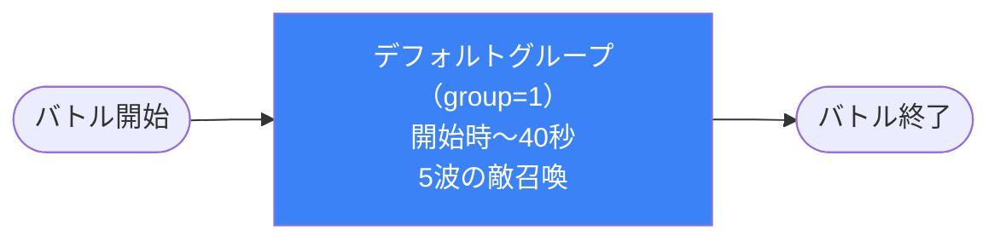

# dungeon_spy_02 インゲームデータ詳細解説

> 参照リポジトリ: `projects/glow-masterdata`
> リリースキー: `202509010`
> 本ファイルはMstAutoPlayerSequenceが5行の雑魚戦（ボスなし・やや難しめ）の全データ設定を解説する

---

## 概要

**SPY×FAMILY世界観の精鋭スパイが立ちはだかるインゲーム**（タワーディフェンス型バトル）。

- 砦のHP: `40,000` でダメージ有効（is_damage_invalidation=0）
- BGM: `SSE_SBG_003_002`
- グループ: デフォルト（sequence_group_id=1）のみ（ループなし）
- 使用する敵の種類: 3種類（無色×2種・青×1種）
- ボスなし・雑魚多め設計。バトル開始から40秒かけて段階的に敵が増強される

---

## セクション2: 関連テーブル設定

### MstInGame

| カラム | 値 |
|--------|-----|
| `id` | `dungeon_spy_02` |
| `mst_auto_player_sequence_set_id` | `dungeon_spy_02` |
| `bgm_asset_key` | `SSE_SBG_003_002` |
| `boss_bgm_asset_key` | （なし） |
| `mst_page_id` | `dungeon_spy_02` |
| `mst_enemy_outpost_id` | `dungeon_spy_02` |
| `boss_mst_enemy_stage_parameter_id` | （なし） |
| `normal_enemy_hp_coef` | `1` |
| `normal_enemy_attack_coef` | `1` |
| `normal_enemy_speed_coef` | `1` |
| `boss_enemy_hp_coef` | `1` |
| `boss_enemy_attack_coef` | `1` |
| `boss_enemy_speed_coef` | `1` |

### MstEnemyOutpost（敵砦）

| カラム | 値 | 意味 |
|--------|-----|------|
| `id` | `dungeon_spy_02` | |
| `hp` | `40,000` | 中程度のHP（_01の15,000より高く、_03の100,000より低い） |
| `is_damage_invalidation` | `0` | **ダメージ有効**（プレイヤーの攻撃が砦に通る） |
| `artwork_asset_key` | `spy_0001` | SPY×FAMILYシリーズの背景アートワーク（01と同じ背景） |

### MstPage + MstKomaLine（コマフィールド）

2行構成。

```
row=1  height=0.52  layout=7  (3コマ: 0.3 / 0.3 / 0.4)
  koma1: spy_006  width=0.3  effect=None
  koma2: spy_007  width=0.3  effect=None
  koma3: spy_008  width=0.4  effect=None

row=2  height=0.52  layout=1  (1コマ: 1.0)
  koma1: spy_009  width=1    effect=None
```

> **コマ効果の補足**: 全コマともeffect=Noneであり、バフ・デバフ効果なし。Row1は3分割レイアウト（layout=7）で視覚的に変化をつけ、Row2は全幅の単独コマ（layout=1）。

### MstInGameI18n（バトル説明文）

**result_tips（バトルヒント）:**
> （未設定）

**description（ステージ説明）:**
> 精鋭スパイが立ちはだかる。青属性に注意。

---

## セクション3: 使用する敵パラメータ（MstEnemyStageParameter）一覧

3種類の敵パラメータを使用。`e_` プレフィックスは汎用敵。
IDの命名規則: `e_{キャラID}_{コンテンツID}_{kind}_{color}`

### カラム解説

| カラム名（略称） | DBカラム名 | 説明 |
|---------------|-----------|------|
| id | id | MstEnemyStageParameterの主キー |
| キャラID | mst_enemy_character_id | 紐付くキャラモデル・スキルの参照元 |
| kind | character_unit_kind | `Normal`（通常敵）/ `Boss`（ボス）。UIオーラ表示に影響 |
| role | role_type | 属性相性の役職（Attack/Technical/Defense/Support） |
| color | color | 属性色（Red/Yellow/Green/Blue/Colorless） |
| sort_order | sort_order | ゲーム内表示順 |
| base_hp | hp | ベースHP（`enemy_hp_coef` 乗算前の素値） |
| base_atk | attack_power | ベース攻撃力（`enemy_attack_coef` 乗算前の素値） |
| base_spd | move_speed | 移動速度（数値が大きいほど速い） |
| well_dist | well_distance | 攻撃射程（コマ単位） |
| combo | attack_combo_cycle | 攻撃コンボ数（1=単発） |
| knockback | damage_knock_back_count | 被攻撃時ノックバック回数（0=ノックバックなし） |
| ability | mst_unit_ability_id1 | 特殊アビリティID |
| drop_bp | drop_battle_point | 基本ドロップバトルポイント |

### 全3種類の詳細パラメータ

| MstEnemyStageParameter ID | 日本語名 | キャラID | kind | role | color | sort | base_hp | base_atk | base_spd | well_dist | combo | knockback | ability | drop_bp |
|--------------------------|---------|---------|------|------|-------|------|---------|---------|---------|-----------|-------|-----------|---------|---------|
| e_spy_00101_general_n_Normal_Colorless | グエン | enemy_spy_00101 | Normal | Attack | Colorless | 1 | 1,000 | 50 | 31 | 0.2 | 1 | （なし） | （なし） | 200 |
| e_spy_00001_general_n_Normal_Colorless | 密輸組織の残党 | enemy_spy_00001 | Normal | Attack | Colorless | 4 | 1,000 | 50 | 34 | 0.4 | 1 | （なし） | （なし） | 300 |
| e_spy_00001_general_n_Normal_Blue | 密輸組織の残党（青） | enemy_spy_00001 | Normal | Defense | Blue | 5 | 1,000 | 50 | 34 | 0.4 | 1 | （なし） | （なし） | 400 |

> **実際のHP・ATKはMstAutoPlayerSequenceの `enemy_hp_coef` が乗算される。** 本インゲームではelemごとにhp_coef=1.5〜2.0が設定されている（詳細はセクション5参照）。

### 敵パラメータの特性解説

| 比較項目 | グエン（無色） | 密輸組織の残党（無色） | 密輸組織の残党（青） |
|---------|-------------|---------------------|------------------|
| base_hp | 1,000 | 1,000 | 1,000 |
| base_atk | 50 | 50 | 50 |
| base_spd | 31（やや遅め） | 34（標準） | 34（標準） |
| well_dist | 0.2（近接） | 0.4（中距離） | 0.4（中距離） |
| role | Attack | Attack | **Defense** |
| drop_bp | 200 | 300 | **400** |

- 全敵共通でbase_hp=1,000・base_atk=50と均一設計。HPの差はseq側のenemy_hp_coefで表現する
- グエン（spy_00101）はsorter順=1で序盤に配置され、移動速度が若干遅くwell_distも短い
- 密輸組織の残党（青）はrole=Defenseであり、Attackロール持ちのフレンドに対して相性不利の防御役として機能
- 青属性の敵はdrop_bp=400と最も高く、倒すメリットが大きい

---

## セクション4: グループ構造の全体フロー（Mermaid）

本インゲームはグループが1つのみ（sequence_group_id=1）で、グループ切り替えなし。
時間経過（ElapsedTime）によって敵の波が増強される単純進行型。



> **Mermaid スタイルカラー規則**:
> - グループが1つのみのためシングルフロー。group=1はw1相当として青（#3b82f6）で表示。

---

## セクション5: 全5行の詳細データ（グループ単位）

### デフォルトグループ（elem 1〜5, sequence_group_id=1）

バトル開始から40秒かけて5波の敵を召喚する。ボス召喚なし・グループ切り替えなしのシンプルな構成。
序盤は無色の「グエン」から始まり、10秒ごとに波を追加。途中から青属性も加わり、40秒時点で強化版の青属性が登場する。

| id | elem | 条件 | アクション | 召喚数 | interval(ms) | aura | hp倍 | atk倍 | override_bp | 説明 |
|----|------|------|-----------|--------|-------------|------|------|------|------------|------|
| dungeon_spy_02_001 | 1 | InitialSummon | SummonEnemy: e_spy_00101_general_n_Normal_Colorless | 3 | 1,000 | Normal | 1.5 | 1 | （なし） | バトル開始直後、グエン（無色）を3体召喚。hp_coef=1.5で強化 |
| dungeon_spy_02_002 | 2 | ElapsedTime(10000) | SummonEnemy: e_spy_00001_general_n_Normal_Colorless | 3 | 1,000 | Normal | 1.5 | 1 | （なし） | 10秒後、密輸組織の残党（無色）を3体追加召喚 |
| dungeon_spy_02_003 | 3 | ElapsedTime(20000) | SummonEnemy: e_spy_00001_general_n_Normal_Blue | 3 | 800 | Normal | 1.5 | 1 | （なし） | 20秒後、密輸組織の残党（青）を3体召喚。interval短縮で密度アップ |
| dungeon_spy_02_004 | 4 | ElapsedTime(30000) | SummonEnemy: e_spy_00101_general_n_Normal_Colorless | 4 | 800 | Normal | 1.5 | 1 | （なし） | 30秒後、グエン（無色）を4体召喚（1体増）。interval=800で密度維持 |
| dungeon_spy_02_005 | 5 | ElapsedTime(40000) | SummonEnemy: e_spy_00001_general_n_Normal_Blue | 3 | 800 | Normal | **2.0** | 1 | （なし） | 40秒後、密輸組織の残党（青）をhp_coef=2.0で強化して3体召喚。最終波 |

**ポイント:**
- 全5波すべてがSummonEnemyであり、SwitchSequenceGroupなし（グループ切り替えなし）
- hp_coefは序盤1.5→最終波2.0に上昇（最終HP: 1,000×2.0=2,000）
- summon_intervalは1〜2波の1,000msから3〜5波の800msに短縮され、後半ほど密集して押し寄せる
- 最終波（elem5）の青属性はdrop_bp=400と高いため、スコア狙いのプレイヤーには優先ターゲット

---

## セクション6: グループ切り替えまとめ表

本インゲームはグループが1つのみであり、グループ切り替えは存在しない。

| 切り替え | 条件 | 遷移先 |
|---------|------|--------|
| （切り替えなし） | - | - |

各グループで召喚される敵の合計:
- グループ1（全体）: 合計16体（elem1〜5の合計: 3+3+3+4+3）

波ごとの内訳:
- 第1波（0秒）: グエン（無色）×3体
- 第2波（10秒）: 密輸組織の残党（無色）×3体
- 第3波（20秒）: 密輸組織の残党（青）×3体
- 第4波（30秒）: グエン（無色）×4体
- 第5波（40秒）: 密輸組織の残党（青、強化）×3体

---

## セクション7: スコア体系

バトルポイントはMstAutoPlayerSequence.override_drop_battle_pointが全行で未設定（空）のため、MstEnemyStageParameterの`drop_battle_point`が適用される。

| 敵の種類 | drop_bp（獲得バトルポイント） | 備考 |
|---------|----------------------------------|------|
| e_spy_00101_general_n_Normal_Colorless（グエン・無色） | 200 | 序盤・30秒時点に登場。低bp |
| e_spy_00001_general_n_Normal_Colorless（密輸組織の残党・無色） | 300 | 10秒時点に登場。中bp |
| e_spy_00001_general_n_Normal_Blue（密輸組織の残党・青） | 400 | 20秒・40秒時点に登場。最高bp |

バトル全体の理論最大スコア（全16体撃破時）:
- グエン×7体（elem1の3体 + elem4の4体）: 200×7 = 1,400
- 密輸組織の残党（無色）×3体（elem2）: 300×3 = 900
- 密輸組織の残党（青）×6体（elem3の3体 + elem5の3体）: 400×6 = 2,400
- **合計: 4,700 バトルポイント**

---

## セクション8: この設定から読み取れる設計パターン

### 1. シングルグループ・時間進行型の難易度スケーリング

本インゲームはSwitchSequenceGroupを一切使わず、ElapsedTimeによる時間トリガーのみで5波を制御している。グループ切り替えがないため「突然の難易度急変」がなく、プレイヤーは一定のペースで押し寄せる敵の波に対応できる。これはシリーズ第2弾（_02）として、_01より歯ごたえを増しつつも「ボスなし」で比較的とっつきやすい設計意図と一致する。

### 2. hp_coefによるHP強化を序盤から適用し、全波1.5倍スタート

dungeon_spy_01はhp_coef設定がなく（MstInGameのnormal_enemy_hp_coef=1）、各敵のbase_hpそのままで登場するが、dungeon_spy_02はMstAutoPlayerSequenceのenemy_hp_coef=1.5を序盤から適用している。base_hp=1,000が全敵共通であるため、実際のHPは第1〜4波が1,500・最終波が2,000となり、明確な難易度の引き上げとなっている。

### 3. 属性多様化による難易度演出（無色→青混在）

第1・2波は無色属性のみで構成されているが、第3波（20秒）から青属性（Defense role）の敵が加わる。これにより序盤は属性を問わず対応できるが、中盤以降は属性相性を意識した編成が有利になる。ステージ説明文「青属性に注意」はこの設計と対応している。

### 4. summon_intervalの段階的短縮による圧力増大

elem1〜2はinterval=1,000ms（1秒間隔）、elem3〜5はinterval=800ms（0.8秒間隔）で召喚される。HPの強化に加えてintervalの短縮が重なる後半は、同時に複数の敵が押し寄せてくる密度が増し、プレイヤーへの視覚的・戦略的プレッシャーが高まる設計になっている。

### 5. スコア誘導設計（青属性 drop_bp=400 が最高）

無色（200・300）に対して青（400）のdrop_bpが最大2倍と高い。後半に登場する青属性を優先的に倒すことでスコアが伸びる設計は、スコアアタック型プレイヤーに対して「青を狙え」という戦略的選択肢を提示している。最終波（elem5）の強化青（hp_coef=2.0）は最も撃破難度が高い一方で最大スコアをもたらす、リスク・リターンのバランスが設計されている。

### 6. アートワーク・BGMのシリーズ統一

artwork_asset_key=`spy_0001`はdungeon_spy_01と共通であり、BGM=`SSE_SBG_003_002`もdungeon_spy_01・dungeon_rik_01・dungeon_rik_02・dungeon_bat_01・dungeon_bat_02などと同一のBGMトラックを使用している。SPY×FAMILYシリーズの3ステージ（_01〜_03）のうち_01・_02はアートワークを共有し、_03（ボス戦）のみ異なるアセット（spy_0003）を使用するという段階的な演出設計が読み取れる。
