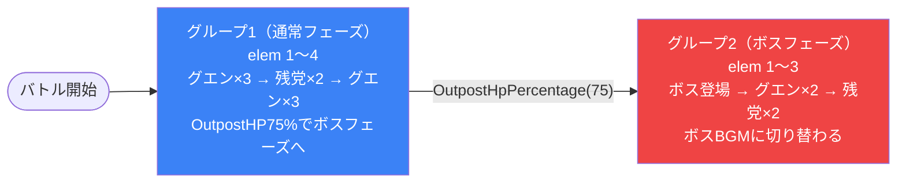

# dungeon_spy_03 インゲームデータ詳細解説

> 参照リポジトリ: `projects/glow-masterdata`
> リリースキー: `202509010`
> 本ファイルはMstAutoPlayerSequenceが7行の「強ボス登場型ダンジョン」の全データ設定を解説する

---

## 概要

**SPY×FAMILYシリーズのダンジョン型バトルコンテンツ**（1行コマフィールド構成・強力なボスが最奥に待ち構えるステージ）。

- 砦のHP: `100,000` でダメージ有効（`is_damage_invalidation = 0`）
- BGM: 通常フェーズ `SSE_SBG_003_002` / ボスフェーズ `SSE_SBG_003_007`
- グループ: グループ1（通常フェーズ） + グループ2（ボスフェーズ）の2段階構成
- 使用する敵の種類: 4種類（`Normal` 3種類、`Boss` 1種類）
- 砦HP75%到達時に `SwitchSequenceGroup` でボスフェーズへ強制移行する設計

---

## セクション2: 関連テーブル設定

### MstInGame

| カラム | 値 |
|--------|-----|
| `id` | `dungeon_spy_03` |
| `mst_auto_player_sequence_set_id` | `dungeon_spy_03` |
| `bgm_asset_key` | `SSE_SBG_003_002` |
| `boss_bgm_asset_key` | `SSE_SBG_003_007` |
| `mst_page_id` | `dungeon_spy_03` |
| `mst_enemy_outpost_id` | `dungeon_spy_03` |
| `boss_mst_enemy_stage_parameter_id` | `c_spy_00101_general_n_Boss_Red` |
| `normal_enemy_hp_coef` | `1` |
| `normal_enemy_attack_coef` | `1` |
| `normal_enemy_speed_coef` | `1` |
| `boss_enemy_hp_coef` | `1` |
| `boss_enemy_attack_coef` | `1` |
| `boss_enemy_speed_coef` | `1` |

### MstEnemyOutpost（敵砦）

| カラム | 値 | 意味 |
|--------|-----|------|
| `id` | `dungeon_spy_03` | |
| `hp` | `100,000` | 砦の耐久値 |
| `is_damage_invalidation` | `0` | **ダメージ有効**（通常通りダメージが入る） |
| `artwork_asset_key` | `spy_0003` | 背景アートワーク（SPY×FAMILYシリーズ第3弾） |

### MstPage + MstKomaLine（コマフィールド）

1行構成（コマ行1行のみのシンプルレイアウト）。

```
row=1  height=0.52  layout=1  (1コマ: 幅1.0)
  koma1: spy_010  width=1.0  effect=None（効果なし）
    target_side=All  target_colors=All  target_roles=All
```

> **コマ効果の補足**: `koma1_effect_type = None` のため特殊効果なし。`koma_effect_target_side = All` / `target_colors = All` / `target_roles = All` はデフォルト全対象設定。コマアセット `spy_010` はSPY×FAMILYシリーズのフィールド背景。

### MstInGameI18n（バトル説明文）

**result_tips（バトルヒント）:**
> （未設定）

**description（ステージ説明）:**
> 最奥にボスが待ち構える。赤属性のボスに備えよ。

---

## セクション3: 使用する敵パラメータ（MstEnemyStageParameter）一覧

4種類の敵パラメータを使用。`c_` プレフィックスはキャラ個別ID、`e_` は汎用敵。
IDの命名規則: `{c_/e_}{キャラID}_{コンテンツID}_{kind}_{color}`

### カラム解説

| カラム名（略称） | DBカラム名 | 説明 |
|---------------|-----------|------|
| id | id | MstEnemyStageParameterの主キー |
| キャラID | mst_enemy_character_id | 紐付くキャラモデル・スキルの参照元 |
| kind | character_unit_kind | `Normal`（通常敵）/ `Boss`（ボス）。UIオーラ表示に影響 |
| role | role_type | 属性相性の役職（Attack/Technical/Defense/Support） |
| color | color | 属性色（Red/Yellow/Green/Blue/Colorless） |
| sort_order | sort_order | ゲーム内表示順 |
| base_hp | hp | ベースHP（`enemy_hp_coef` 乗算前の素値） |
| base_atk | attack_power | ベース攻撃力（`enemy_attack_coef` 乗算前の素値） |
| base_spd | move_speed | 移動速度（数値が大きいほど速い） |
| well_dist | well_distance | 攻撃射程（コマ単位） |
| combo | attack_combo_cycle | 攻撃コンボ数（1=単発） |
| knockback | damage_knock_back_count | 被攻撃時ノックバック回数（0=ノックバックなし） |
| ability | mst_unit_ability_id1 | 特殊アビリティID |
| drop_bp | drop_battle_point | 基本ドロップバトルポイント |

### 全4種類の詳細パラメータ

| MstEnemyStageParameter ID | 日本語名 | キャラID | kind | role | color | sort | base_hp | base_atk | base_spd | well_dist | combo | knockback | ability | drop_bp |
|--------------------------|---------|---------|------|------|-------|------|---------|---------|---------|-----------|-------|-----------|---------|---------|
| `e_spy_00101_general_n_Normal_Colorless` | グエン（無色） | `enemy_spy_00101` | Normal | Attack | Colorless | 1 | 1,000 | 50 | 31 | 0.2 | 1 | 0 | （なし） | 200 |
| `e_spy_00001_general_n_Normal_Colorless` | 密輸組織の残党（無色） | `enemy_spy_00001` | Normal | Attack | Colorless | 4 | 1,000 | 50 | 34 | 0.4 | 1 | 0 | （なし） | 300 |
| `e_spy_00001_general_n_Normal_Blue` | 密輸組織の残党（青） | `enemy_spy_00001` | Normal | Defense | Blue | 5 | 1,000 | 50 | 34 | 0.4 | 1 | 0 | （なし） | 400 |
| `c_spy_00101_general_n_Boss_Red` | <黄昏> ロイド（赤ボス） | `chara_spy_00101` | Boss | Attack | Red | 8 | 10,000 | 50 | 31 | 0.5 | 7 | 1 | （なし） | 500 |

> **実際のHP・ATKは `base × MstAutoPlayerSequence.enemy_hp_coef` で決まる。** このステージではすべての `enemy_hp_coef = 1`、`enemy_attack_coef = 1` のため、上記の素値がそのままゲーム内数値となる。

### 敵パラメータの特性解説

| 比較項目 | 通常敵（グエン/残党） | ボス（<黄昏> ロイド） |
|---------|-------------------|--------------------|
| HP | 1,000 | **10,000**（通常敵の10倍） |
| ATK | 50 | 50（同値） |
| SPD | 31〜34 | 31 |
| コンボ | 1（単発） | **7**（7連コンボ） |
| ノックバック | なし | **あり**（1回） |
| drop_bp | 200〜400 | **500** |

**設計上の特徴:**
- ボスのHP（10,000）は通常敵（1,000）の10倍と大幅に高く、ボスフェーズへの移行後の戦闘は長期戦になる
- ボスの攻撃コンボ数が7と非常に高く、コンボ継続中の防衛コストが高い
- ノックバックにより味方ユニットが後退させられるため、前線維持が難しくなる
- ボスは`Red`（赤）属性・`Attack`ロールのため、色相性で対抗するには緑属性ユニットが有効

---

## セクション4: グループ構造の全体フロー（Mermaid）



> **Mermaid スタイルカラー規則**:
> - グループ1（通常フェーズ）: `#3b82f6`（青）
> - グループ2（ボスフェーズ）: `#ef4444`（赤）

---

## セクション5: 全7行の詳細データ（グループ単位）

### グループ1（通常フェーズ）（elem 1〜4、sequence_group_id=1）

砦HP75%に達するまでの通常フェーズ。グエン（無色）と密輸組織の残党（青）を順次召喚しながらプレイヤーを消耗させ、条件達成時にボスフェーズへ切り替える。

| id | elem | 条件 | アクション | 召喚数 | interval | aura | hp倍 | atk倍 | override_bp | 説明 |
|----|------|------|-----------|--------|---------|------|------|------|------------|------|
| dungeon_spy_03_001 | 1 | InitialSummon | SummonEnemy: `e_spy_00101_general_n_Normal_Colorless` | 3 | 1,000ms | Normal | 1 | 1 | （なし） | 開幕グエン（無色）3体召喚 |
| dungeon_spy_03_002 | 2 | ElapsedTime(10000) | SummonEnemy: `e_spy_00001_general_n_Normal_Blue` | 2 | 1,000ms | Normal | 1 | 1 | （なし） | 10秒後に残党（青）2体召喚 |
| dungeon_spy_03_003 | 3 | ElapsedTime(20000) | SummonEnemy: `e_spy_00101_general_n_Normal_Colorless` | 3 | 1,000ms | Normal | 1 | 1 | （なし） | 20秒後にグエン（無色）3体追加召喚 |
| dungeon_spy_03_004 | 4 | OutpostHpPercentage(75) | SwitchSequenceGroup: `2` | — | — | Default | — | — | — | 砦HP75%到達でグループ2へ切り替え（ボスフェーズ移行） |

**ポイント:**
- `InitialSummon` でバトル開幕から即座に3体召喚し、序盤からプレッシャーをかける
- 10秒後に青属性（Defense役）の残党2体を追加し、グリーン属性の弱点を突く構成
- 20秒後に再びグエン（無色）3体を追加召喚し、フィールドを圧迫
- `OutpostHpPercentage(75)` はelement_id=4として常時監視しており、砦HPが75%以下になった瞬間グループ2へ切り替わる（時間制限なし）

---

### グループ2（ボスフェーズ）（elem 1〜3、sequence_group_id=2）

砦HP75%到達後のボスフェーズ。BGMが `SSE_SBG_003_007` に切り替わり、最強の敵である <黄昏> ロイド（赤ボス）が登場。その後も通常敵の支援部隊が出現し続ける。

| id | elem | 条件 | アクション | 召喚数 | interval | aura | hp倍 | atk倍 | override_bp | 説明 |
|----|------|------|-----------|--------|---------|------|------|------|------------|------|
| dungeon_spy_03_005 | 1 | InitialSummon | SummonEnemy: `c_spy_00101_general_n_Boss_Red` | 1 | 0ms | Normal | 1 | 1 | （なし） | グループ開始即座にボス（赤）1体登場 |
| dungeon_spy_03_006 | 2 | ElapsedTime(15000) | SummonEnemy: `e_spy_00101_general_n_Normal_Colorless` | 2 | 1,000ms | Normal | 1 | 1 | （なし） | ボス登場15秒後にグエン（無色）2体追加 |
| dungeon_spy_03_007 | 3 | ElapsedTime(30000) | SummonEnemy: `e_spy_00001_general_n_Normal_Colorless` | 2 | 1,000ms | Normal | 1 | 1 | （なし） | ボス登場30秒後に残党（無色）2体追加 |

**ポイント:**
- `InitialSummon` でグループ切り替え即座にボスが登場する緊張感のある演出
- ボスは `last_boss_trigger = Boss` として設定され、専用のボスBGM切り替えトリガーとして機能
- 15秒後・30秒後に支援の通常敵が出現し、ボスへの集中を妨害する設計
- グループ2にはループ設定がなく、30秒以降は新規召喚なし（ボスを倒し切る構成）

---

## セクション6: グループ切り替えまとめ表

| 切り替え | 条件 | 遷移先 |
|---------|------|--------|
| グループ1 → グループ2 | **OutpostHpPercentage(75)**（砦HP75%以下） | グループ2（ボスフェーズ） |

各グループで倒すべき目安:
- グループ1: 砦HPを75%まで削る（開幕3体 + 10秒2体 + 20秒3体の計8体が最大出現）
- グループ2: ボス（HP 10,000）+ 支援通常敵（最大4体）を撃破してクリア

---

## セクション7: スコア体系

バトルポイントは `override_drop_battle_point`（MstAutoPlayerSequence設定値）が優先される。このステージでは全行 `override_drop_battle_point` が未設定のため、`MstEnemyStageParameter.drop_battle_point` の値が基本ドロップとなる。

| 敵の種類 | override_bp（獲得バトルポイント） | 備考 |
|---------|----------------------------------|------|
| グエン（無色）`e_spy_00101_general_n_Normal_Colorless` | 200 | override未設定、base値適用 |
| 密輸組織の残党（無色）`e_spy_00001_general_n_Normal_Colorless` | 300 | override未設定、base値適用 |
| 密輸組織の残党（青）`e_spy_00001_general_n_Normal_Blue` | 400 | override未設定、base値適用 |
| <黄昏> ロイド（赤ボス）`c_spy_00101_general_n_Boss_Red` | 500 | override未設定、base値適用 |

**最大獲得バトルポイント試算:**
- グループ1出現敵: グエン×6（200×6=1,200） + 残党（青）×2（400×2=800） = 2,000
- グループ2出現敵: ボス×1（500×1=500） + グエン×2（200×2=400） + 残党（無色）×2（300×2=600） = 1,500
- **理論合計: 3,500 バトルポイント**

---

## セクション8: この設定から読み取れる設計パターン

### 1. HP閾値トリガーによる緊張感のあるフェーズ移行

グループ1のelem_id=4が `OutpostHpPercentage(75)` を常時監視し、砦HPが25%削られた瞬間にボスフェーズへ移行する。時間制限ではなくダメージ量に連動した切り替えであるため、プレイヤーの砦防衛状況がそのままボス登場タイミングを左右する。砦を早く削るほど早くボスが出現し、守りに徹するほどボス出現を遅らせられる設計。

### 2. ボス登場と同時のBGM切り替えによる演出強化

`boss_bgm_asset_key = SSE_SBG_003_007` が設定されており、グループ2移行（ボス登場）と同時にBGMが切り替わる。`last_boss_trigger = Boss` として設定されたボス（elem1の `c_spy_00101_general_n_Boss_Red`）がBGM切り替えのトリガーとなり、戦況の転換点を音楽で強調する演出設計。

### 3. コマ行1行のシンプルフィールドと高難度ボスの対比

`MstKomaLine` のコマ行は1行（row=1、コマ数1）のみで、フィールド構造は非常にシンプル。その一方でボスのHP10,000（通常敵の10倍）・コンボ数7・ノックバック持ちという高スペックを設定することで、フィールドの複雑さではなく敵パラメータの強さでチャレンジ性を演出している。

### 4. 属性多様化による戦略の強制

グループ1の通常敵はColorless（無色）とBlue（青）の2属性が混在する。Blue=Defenseロールは通常の物理攻撃耐性が高く、Colorlessとは異なるユニットで対応する必要がある。その後ボスフェーズではRed（赤）属性のAttackロールが登場するため、プレイヤーは複数の属性に対応したデッキ構成が求められる。

### 5. グループ2ではループなし・終末型の波状設計

グループ2（ボスフェーズ）は30秒以降の召喚設定がなく、ループ構造も持たない。ボスが登場し、支援部隊が出現した後は新規召喚がないため「出てきた敵をすべて倒せばクリア」という明確な終了条件を持つ。長期戦を嫌うプレイヤーにも分かりやすい設計。

### 6. 通常フェーズの段階的な圧迫からボスへの集中という流れ

グループ1では開幕3体 → 10秒後2体 → 20秒後3体と段階的に敵数を増やし、プレイヤーリソースを消耗させる。砦HP75%を削り切った段階でボスが単体で登場するため、「ここから本番」という心理的な区切りが明確。グループ1での消耗とグループ2でのボス集中撃破という、難易度設計の教科書的な構造。
