# raid_osh1_00001 インゲームデータ詳細解説

> 参照リポジトリ: `projects/glow-masterdata`
> リリースキー: 202512020
> 本ファイルはMstAutoPlayerSequenceが最多行数（60行）のインゲームの全データ設定を解説する

---

## 概要

**oshシリーズのレイドバトル**（降臨バトル的なスコアアタック型バトル）。

- 砦のHPは100万で**ダメージ無効**（砦を壊せない＝時間制限で終わるタイプ）
- BGM: `SSE_SBG_003_006`
- MstInGameのboss設定なし（ボスはすべてMstAutoPlayerSequenceから召喚）
- グループ: デフォルト + w1〜w6 の7グループ（w6→w1ループ構造）
- 使用する敵の種類: 9種類

---

## 関連テーブル設定

### MstInGame

| カラム | 値 |
|--------|-----|
| `id` | `raid_osh1_00001` |
| `mst_auto_player_sequence_set_id` | `raid_osh1_00001` |
| `bgm_asset_key` | `SSE_SBG_003_006` |
| `boss_bgm_asset_key` | （空） |
| `mst_page_id` | `raid_osh1_00001` |
| `mst_enemy_outpost_id` | `raid_osh1_00001` |
| `boss_mst_enemy_stage_parameter_id` | （空）← ボスはシーケンスで出す |
| `boss_count` | （空） |
| `normal_enemy_hp_coef` | `1`（個別倍率はシーケンス側で制御） |
| `normal_enemy_attack_coef` | `1` |
| `normal_enemy_speed_coef` | `1` |
| `boss_enemy_hp_coef` | `1` |
| `boss_enemy_attack_coef` | `1` |
| `boss_enemy_speed_coef` | `1` |

### MstEnemyOutpost（敵砦）

| カラム | 値 | 意味 |
|--------|-----|------|
| `id` | `raid_osh1_00001` | |
| `hp` | `1000000` | 100万HP（実質壊せない） |
| `is_damage_invalidation` | `1` | **ダメージ無効**（砦が壊れない） |
| `artwork_asset_key` | `event_osh_0001` | 背景アートワーク |

### MstPage + MstKomaLine（コマフィールド）

4行構成。上3段が移動コマ、最下段にコマ効果あり。

```
row=1  height=0.55  layout=9  (3コマ: 0.25 / 0.5 / 0.25)
  koma1: osh_00001  width=0.25  effect=None
  koma2: osh_00001  width=0.5   effect=None
  koma3: osh_00001  width=0.25  effect=None

row=2  height=0.55  layout=6  (2コマ: 0.5 / 0.5)
  koma1: osh_00001  width=0.5   effect=None
  koma2: osh_00001  width=0.5   effect=None

row=3  height=0.55  layout=1  (1コマ: 1.0)
  koma1: osh_00001  width=1.0   effect=None

row=4  height=0.55  layout=10  (3コマ: 0.25 / 0.25 / 0.5)  ← コマ効果あり
  koma1: osh_00001  width=0.25  effect=Burn         ← 火傷
  koma2: osh_00001  width=0.25  effect=Poison        ← 毒
  koma3: osh_00001  width=0.5   effect=SlipDamage    ← スリップダメージ
```

### MstInGameI18n（バトル説明文）

> このステージは、4段で構成されているぞ!
>
> 【ギミック情報】
> ノックバック攻撃をしてくる敵や火傷攻撃をしてくる敵や
> 敵自身の攻撃UPをしてくる敵や
> 味方の攻撃DOWNをしてくる敵が登場するぞ!
> 特性で火傷ダメージ軽減を持っているキャラを編成しよう!
>
> 無属性の『有馬 かな』は
> 火傷攻撃をしてくるぞ!
>
> 敵を多く倒して、スコアを稼ごう!

---

## 使用する敵パラメータ（MstEnemyStageParameter）一覧

9種類の敵パラメータを使用。`c_` プレフィックスはキャラ個別ID、`e_` は汎用敵。

| id（action_value） | キャラID | 日本語名 | kind | role | color | base_hp | base_atk | base_spd | knockback | drop_bp |
|-------------------|---------|---------|------|------|-------|---------|---------|---------|-----------|---------|
| 星野 ルビー（Normal） | chara_osh_00201 | 星野 ルビー | Normal | Attack | Red | 1,000 | 100 | 37 | 1 | 50 |
| 星野 ルビー（Boss） | chara_osh_00201 | 星野 ルビー | Boss | Attack | Red | 10,000 | 100 | 31 | 1 | 100 |
| MEMちょ（Normal） | chara_osh_00301 | MEMちょ | Normal | Technical | Yellow | 1,000 | 100 | 37 | 1 | 50 |
| MEMちょ（Boss） | chara_osh_00301 | MEMちょ | Boss | Technical | Yellow | 10,000 | 100 | 31 | 1 | 100 |
| 有馬 かな（Normal） | chara_osh_00401 | 有馬 かな | Normal | Technical | Colorless | 1,000 | 100 | 37 | 1 | 50 |
| 有馬 かな（Boss） | chara_osh_00401 | 有馬 かな | Boss | Technical | Colorless | 10,000 | 100 | 31 | 1 | 100 |
| 推し活ファントム（緑/Normal） | enemy_glo_00002 | 推し活ファントム | Normal | Attack | Green | 1,000 | 100 | 47 | 1 | 50 |
| 推し活ファントム（無属性/Normal） | enemy_glo_00002 | 推し活ファントム | Normal | Defense | Colorless | 1,000 | 100 | 20 | 0 | 5 |
| 推し活ファントム（緑/Boss） | enemy_glo_00002 | 推し活ファントム | Boss | Attack | Green | 10,000 | 100 | 45 | 1 | 100 |

> **実際のHP・ATKは `base × MstAutoPlayerSequence.enemy_hp_coef` で決まる。**
> 例: MEMちょ（Normal）（base_hp=1000）を elem=36 で出すと
>     `enemy_hp_coef=300` なので **実際HP = 300,000**

---

## グループ構造の全体フロー

```mermaid
flowchart LR
    START([バトル開始]) --> DEF

    DEF["デフォルトグループ<br/>elem 1〜8<br/>InitialSummon×7体<br/>+ 雑魚10体"]
    DEF -- "累計2体撃破" --> W1

    W1["w1グループ<br/>elem 9〜14<br/>AdventBoss1 + 雑魚群"]
    W1 -- "累計9体撃破" --> W2

    W2["w2グループ<br/>elem 15〜20<br/>AdventBoss1 + 雑魚群"]
    W2 -- "累計15体撃破" --> W3

    W3["w3グループ<br/>elem 21〜28<br/>AdventBoss2 + 雑魚群"]
    W3 -- "累計21体撃破" --> W4

    W4["w4グループ<br/>elem 29〜35<br/>AdventBoss2 + 雑魚群"]
    W4 -- "累計29体撃破" --> W5

    W5["w5グループ<br/>elem 36〜45<br/>最終ボス3体同時 + 雑魚群"]
    W5 -- "累計37体撃破" --> W6

    W6["w6グループ<br/>elem 46〜50<br/>AdventBoss3 + 雑魚群"]
    W6 -- "累計47体撃破" --> W1

    style DEF fill:#6b7280,color:#fff
    style W1 fill:#3b82f6,color:#fff
    style W2 fill:#3b82f6,color:#fff
    style W3 fill:#f59e0b,color:#fff
    style W4 fill:#f59e0b,color:#fff
    style W5 fill:#ef4444,color:#fff
    style W6 fill:#8b5cf6,color:#fff
```



> **w6→w1 のループに注意**: 47体撃破で w1 に戻る。以降は w1→w2→...→w6→w1 を繰り返す。

---

## 全60行の詳細データ

### デフォルトグループ（elem 1〜8, groupchange_1）

バトル開始と同時に7体を各位置に配置し、追加で雑魚10体を流す。**2体倒すとw1へ切り替わる**。

| id | elem | 条件 | アクション | 召喚数 | 召喚位置 | anim | aura | hp倍 | atk倍 | 移動開始条件 | score | override_bp | 説明 |
|----|------|------|-----------|--------|---------|------|------|------|------|------------|-------|------------|------|
| `_1` | 1 | InitialSummon | `c_osh_00301_...Normal_Yellow` | 1 | **2.3** | None | Default | 3 | 0.5 | ElapsedTime(250) | 50 | 250 | バトル開始時にMEMちょ（Normal）を位置2.3に1体出現。HP×3/ATK×0.5、2500ms後に移動開始 |
| `_2` | 2 | InitialSummon | `c_osh_00401_...Normal_Colorless` | 1 | **2.5** | None | Default | 5 | 1 | ElapsedTime(250) | 50 | 500 | バトル開始時に有馬 かな（Normal）を位置2.5に1体出現。HP×5/ATK×1、2500ms後に移動開始 |
| `_3` | 3 | InitialSummon | `c_osh_00201_...Normal_Red` | 1 | **2.7** | None | Default | 3 | 1.5 | ElapsedTime(250) | 50 | 250 | バトル開始時に星野 ルビー（Normal）を位置2.7に1体出現。HP×3/ATK×1.5、2500ms後に移動開始 |
| `_4` | 4 | InitialSummon | `e_glo_00002_...Normal_Colorless` | 1 | **2.1** | None | Default | 2 | 0.5 | ElapsedTime(200) | 20 | 10 | バトル開始時に推し活ファントム（無属性/Normal）を位置2.1に1体出現。HP×2/ATK×0.5、2000ms後に移動開始 |
| `_5` | 5 | InitialSummon | `e_glo_00002_...Normal_Colorless` | 1 | **2.9** | None | Default | 2 | 0.5 | ElapsedTime(250) | 20 | 10 | バトル開始時に推し活ファントム（無属性/Normal）を位置2.9に1体出現。HP×2/ATK×0.5、2500ms後に移動開始 |
| `_6` | 6 | InitialSummon | `e_glo_00002_...Normal_Colorless` | 1 | **0.9** | None | Default | 2 | 0.5 | EnterTargetKoma(1) | 20 | 10 | バトル開始時に推し活ファントム（無属性/Normal）を位置0.9（最前列付近）に1体出現。コマ1到達後に移動開始（特殊設定） |
| `_7` | 7 | InitialSummon | `e_glo_00002_...Normal_Colorless` | 1 | **1.3** | None | Default | 2 | 0.5 | ElapsedTime(500) | 20 | 10 | バトル開始時に推し活ファントム（無属性/Normal）を位置1.3に1体出現。HP×2/ATK×0.5、5000ms後に移動開始 |
| `_8` | 8 | ElapsedTime(0) | `e_glo_00002_...Normal_Green` | **10** | （空） | None | Default | 1 | 1 | None | 10 | 50 | バトル開始直後（0ms）に推し活ファントム（緑/Normal）を10体一斉召喚。HP×1/ATK×1の最弱雑魚、即移動開始 |
| `_9` | groupchange_1 | **FriendUnitDead(2)** | SwitchSequenceGroup(w1) | — | — | — | — | — | — | — | — | — | 累計2体撃破でw1グループへ切り替え |

**ポイント:**
- elem1〜3: oshシリーズの3キャラ（Normal種別）を位置2.3/2.5/2.7に分散配置。ElapsedTime(250)=2500ms後に移動開始
- elem4〜7: 無属性の遅い雑魚を位置ばらばらに配置（elem6はコマ1に到達したら移動開始する特殊設定）
- elem8: 緑属性雑魚10体を時間0で流す（interval空=同時召喚）
- groupchange_1: **累計2体** 倒せばすぐにw1へ移行（デフォルトの敵を全滅させなくてよい）

---

### w1グループ（elem 9〜14, groupchange_2）

切り替え直後に AdventBoss1 のボスを投入。累計9体で w2 へ。

| id | elem | 条件（グループ切替後の経過時間 or 累計撃破数） | アクション | 召喚数 | 召喚位置 | anim | aura | hp倍 | atk倍 | score | override_bp | 説明 |
|----|------|------|-----------|--------|---------|------|------|------|------|-------|------------|------|
| `_10` | 9 | GroupActivated(0) | `e_glo_00002_...Boss_Green` | 1 | **1.8** | **Fall0** | **AdventBoss1** | 5 | 3 | 50 | 300 | グループ開始直後に推し活ファントム（緑/Boss、AdventBoss1オーラ）を位置1.8へ落下召喚。HP×5/ATK×3 |
| `_11` | 10 | GroupActivated(250) | `e_glo_00002_...Normal_Green` | **10** | （空） | None | Default | 8 | 2.5 | 10 | 50 | グループ開始2500ms後に推し活ファントム（緑/Normal）を10体一斉召喚。HP×8/ATK×2.5 |
| `_12` | 11 | GroupActivated(0) | `e_glo_00002_...Normal_Green` | **3** | **2.5** | **Fall0** | Default | 8 | 2.5 | 10 | 50 | グループ開始直後に推し活ファントム（緑/Normal）を3体まとめて位置2.5へ落下召喚。HP×8/ATK×2.5 |
| `_13` | 12 | GroupActivated(0) | `e_glo_00002_...Normal_Colorless` | 1 | **2.2** | **Fall0** | Default | 10 | 0.5 | 20 | 10 | グループ開始直後に推し活ファントム（無属性/Normal）を位置2.2へ1体落下召喚。HP×10/ATK×0.5（elem12の1行目） |
| `_14` | 12 | GroupActivated(0) | `e_glo_00002_...Normal_Colorless` | 1 | **2.4** | **Fall0** | Default | 10 | 0.5 | 20 | 10 | グループ開始直後に推し活ファントム（無属性/Normal）を位置2.4へ1体落下召喚。HP×10/ATK×0.5（elem12の2行目） |
| `_15` | 12 | GroupActivated(0) | `e_glo_00002_...Normal_Colorless` | 1 | **2.6** | **Fall0** | Default | 10 | 0.5 | 20 | 10 | グループ開始直後に推し活ファントム（無属性/Normal）を位置2.6へ1体落下召喚。HP×10/ATK×0.5（elem12の3行目） |
| `_16` | 12 | GroupActivated(0) | `e_glo_00002_...Normal_Colorless` | 1 | **2.8** | **Fall0** | Default | 10 | 0.5 | 20 | 10 | グループ開始直後に推し活ファントム（無属性/Normal）を位置2.8へ1体落下召喚。HP×10/ATK×0.5（elem12の4行目） |
| `_17` | 13 | **FriendUnitDead(12)** | `e_glo_00002_...Normal_Green` | 2 | （空） | None | Default | 8 | 2.5 | 30 | 50 | 累計12体撃破後に推し活ファントム（緑/Normal）を2体追加召喚。HP×8/ATK×2.5 |
| `_18` | 14 | **FriendUnitDead(12)** | `e_glo_00002_...Normal_Green` | **5** | **2.5** | **Fall0** | Default | 8 | 2.5 | 30 | 50 | 累計12体撃破後に推し活ファントム（緑/Normal）を5体まとめて位置2.5へ落下召喚。HP×8/ATK×2.5 |
| `_19` | groupchange_2 | **FriendUnitDead(9)** | SwitchSequenceGroup(w2) | — | — | — | — | — | — | — | — | 累計9体撃破でw2グループへ切り替え |

**ポイント:**
- elem9: 推し活ファントム（緑/Boss、AdventBoss1オーラ, hp倍5, atk倍3）。Fall0アニメで落下演出つき
- elem10,11: 雑魚を同時に多数流す（hp倍8）
- elem12が **4行ある**（`sequence_element_id`が全て`12`）: 同一条件・同一タイミングで推し活ファントム（無属性/Normal）4体を異なる位置(2.2/2.4/2.6/2.8)に個別召喚。**element_idが重複しているが動作する**
- elem13,14: 累計12体倒されたとき雑魚7体追加召喚
- groupchange_2: **累計9体** 倒したらw2へ（elem8の10体を倒し切る前にw1になっているため）

---

### w2グループ（elem 15〜20, groupchange_3）

w1より強いAdventBoss1ボスを投入。累計15体でw3へ。

| id | elem | 条件 | アクション | 召喚数 | 召喚位置 | anim | aura | hp倍 | atk倍 | score | override_bp | 説明 |
|----|------|------|-----------|--------|---------|------|------|------|------|-------|------------|------|
| `_20` | 15 | GroupActivated(0) | `c_osh_00301_...Boss_Yellow` | 1 | **2.5** | **Fall0** | **AdventBoss1** | **10** | **4** | 100 | 300 | グループ開始直後にMEMちょ（Boss、AdventBoss1オーラ）を位置2.5へ落下召喚。HP×10/ATK×4 |
| `_21` | 16 | GroupActivated(0) | `e_glo_00002_...Normal_Green` | 3 | （空） | None | Default | **20** | **3** | 10 | 50 | グループ開始直後に推し活ファントム（緑/Normal）を3体一斉召喚。HP×20/ATK×3（w1から大幅強化） |
| `_22` | 17 | GroupActivated(500) | `e_glo_00002_...Normal_Green` | 5 | （空） | None | Default | 20 | 3 | 10 | 50 | グループ開始5000ms後に推し活ファントム（緑/Normal）を5体一斉召喚。HP×20/ATK×3 |
| `_23` | 18 | FriendUnitDead(19) | `e_glo_00002_...Normal_Green` | 5 | （空） | None | Default | 20 | 3 | 30 | 50 | 累計19体撃破後に推し活ファントム（緑/Normal）を5体追加召喚。HP×20/ATK×3 |
| `_24` | 19 | GroupActivated(0) | `e_glo_00002_...Normal_Green` | 2 | **2.2** | **Fall0** | Default | 20 | 3 | 10 | 50 | グループ開始直後に推し活ファントム（緑/Normal）を2体まとめて位置2.2へ落下召喚。HP×20/ATK×3 |
| `_25` | 20 | GroupActivated(750) | `e_glo_00002_...Normal_Green` | 2 | **1.7** | **Fall0** | Default | 20 | 3 | 10 | 50 | グループ開始7500ms後に推し活ファントム（緑/Normal）を2体まとめて位置1.7へ落下召喚。HP×20/ATK×3 |
| `_26` | groupchange_3 | **FriendUnitDead(15)** | SwitchSequenceGroup(w3) | — | — | — | — | — | — | — | — | 累計15体撃破でw3グループへ切り替え |

**ポイント:**
- w1から敵のHP倍率が大幅強化（hp倍8→20、atk倍2.5→3）
- ボスが MEMちょ（Boss、Yellow・Technical）に変わる。スコアも50→100に倍増
- elem19: 累計19体倒したとき雑魚5体追加（より遅いタイミングで補充）

---

### w3グループ（elem 21〜28, groupchange_4）

**AdventBoss2** に格上げ。ボスの撃破スコアが大幅増加。累計21体でw4へ。

| id | elem | 条件 | アクション | 召喚数 | 召喚位置 | anim | aura | hp倍 | atk倍 | score | override_bp | 説明 |
|----|------|------|-----------|--------|---------|------|------|------|------|-------|------------|------|
| `_27` | 21 | GroupActivated(0) | `c_osh_00201_...Boss_Red` | 1 | **2.5** | **Fall0** | **AdventBoss2** | **15** | **8** | 100 | 300 | グループ開始直後に星野 ルビー（Boss、AdventBoss2オーラ）を位置2.5へ落下召喚。HP×15/ATK×8 |
| `_28` | 22 | GroupActivated(0) | `e_glo_00002_...Normal_Green` | 2 | **2.2** | **Fall0** | Default | **30** | **6** | 10 | 50 | グループ開始直後に推し活ファントム（緑/Normal）を2体まとめて位置2.2へ落下召喚。HP×30/ATK×6（さらに強化） |
| `_29` | 23 | GroupActivated(500) | `e_glo_00002_...Normal_Green` | 5 | **2.8** | **Fall0** | Default | 30 | 6 | 10 | 50 | グループ開始5000ms後に推し活ファントム（緑/Normal）を5体まとめて位置2.8へ落下召喚。HP×30/ATK×6 |
| `_30` | 24 | GroupActivated(1000) | `e_glo_00002_...Normal_Green` | 4 | （空） | None | Default | 30 | 6 | 10 | 50 | グループ開始10000ms後に推し活ファントム（緑/Normal）を4体一斉召喚。HP×30/ATK×6 |
| `_31` | 25 | FriendUnitDead(23) | `e_glo_00002_...Normal_Green` | 2 | **3.2** | **Fall0** | Default | 30 | 6 | 10 | 50 | 累計23体撃破後に推し活ファントム（緑/Normal）を2体まとめて位置3.2（後方）へ落下召喚。HP×30/ATK×6 |
| `_32` | 26 | FriendUnitDead(24) | `e_glo_00002_...Normal_Green` | 3 | （空） | None | Default | 30 | 6 | 10 | 50 | 累計24体撃破後に推し活ファントム（緑/Normal）を3体一斉召喚。HP×30/ATK×6 |
| `_33` | 27 | FriendUnitDead(22) | `e_glo_00002_...Normal_Colorless` | 1 | **2.5** | **Fall0** | Default | **20** | **1** | 20 | 10 | 累計22体撃破後に推し活ファントム（無属性/Normal）を位置2.5へ1体落下召喚。HP×20/ATK×1（攻撃弱い囮役） |
| `_34` | 28 | FriendUnitDead(27) | `e_glo_00002_...Normal_Colorless` | **10** | （空） | None | Default | 20 | 1 | 30 | 10 | 累計27体撃破後に推し活ファントム（無属性/Normal）を10体一斉召喚。HP×20/ATK×1（大量の囮） |
| `_35` | groupchange_4 | **FriendUnitDead(21)** | SwitchSequenceGroup(w4) | — | — | — | — | — | — | — | — | 累計21体撃破でw4グループへ切り替え |

**ポイント:**
- ボスが 星野 ルビー（Boss、Red・Attack）。hp倍15, atk倍8と一段と強化
- 雑魚のhp倍も20→30に上昇
- elem27: 累計22体倒したとき推し活ファントム（無属性/Normal）1体（hp倍20だが atk倍1=攻撃は弱い）→砦へ向かうが倒せない「タンク」的な役割
- elem28: 累計27体倒したとき無属性タンク10体を一気に召喚

---

### w4グループ（elem 29〜35, groupchange_5）

AdventBoss2が緑ボスに変わる。累計29体でw5へ。

| id | elem | 条件 | アクション | 召喚数 | 召喚位置 | anim | aura | hp倍 | atk倍 | score | override_bp | 説明 |
|----|------|------|-----------|--------|---------|------|------|------|------|-------|------------|------|
| `_36` | 29 | GroupActivated(0) | `e_glo_00002_...Boss_Green` | 1 | **2.5** | **Fall0** | **AdventBoss2** | **20** | **9** | 50 | 300 | グループ開始直後に推し活ファントム（緑/Boss、AdventBoss2オーラ）を位置2.5へ落下召喚。HP×20/ATK×9 |
| `_37` | 30 | GroupActivated(0) | `e_glo_00002_...Normal_Green` | 2 | **1.8** | **Fall0** | Default | **50** | **7** | 10 | 50 | グループ開始直後に推し活ファントム（緑/Normal）を2体まとめて位置1.8へ落下召喚。HP×50/ATK×7（hp倍が一気に50へ） |
| `_38` | 31 | GroupActivated(0) | `e_glo_00002_...Normal_Green` | 3 | **2.9** | **Fall0** | Default | 50 | 7 | 10 | 50 | グループ開始直後に推し活ファントム（緑/Normal）を3体まとめて位置2.9へ落下召喚。HP×50/ATK×7 |
| `_39` | 32 | GroupActivated(250) | `e_glo_00002_...Normal_Green` | **10** | （空） | None | Default | 50 | 7 | 10 | 50 | グループ開始2500ms後に推し活ファントム（緑/Normal）を10体一斉召喚。HP×50/ATK×7（大ラッシュ） |
| `_40` | 33 | GroupActivated(1000) | `e_glo_00002_...Normal_Green` | 3 | （空） | None | Default | 50 | 7 | 10 | 50 | グループ開始10000ms後に推し活ファントム（緑/Normal）を3体一斉召喚。HP×50/ATK×7（遅延追加） |
| `_41` | 34 | FriendUnitDead(31) | `e_glo_00002_...Normal_Colorless` | 1 | （空） | None | Default | 20 | 2 | 20 | 10 | 累計31体撃破後に推し活ファントム（無属性/Normal）を1体召喚。HP×20/ATK×2 |
| `_42` | 35 | FriendUnitDead(34) | `e_glo_00002_...Normal_Colorless` | **10** | （空） | None | Default | 20 | 2 | 30 | 10 | 累計34体撃破後に推し活ファントム（無属性/Normal）を10体一斉召喚。HP×20/ATK×2（大量の囮） |
| `_43` | groupchange_5 | **FriendUnitDead(29)** | SwitchSequenceGroup(w5) | — | — | — | — | — | — | — | — | 累計29体撃破でw5グループへ切り替え |

**ポイント:**
- 雑魚のhp倍が30→**50**に急上昇（base_hp=1000 × 50 = 実HP50,000）
- 雑魚の atk倍も6→7。大量召喚（elem32: 10体）でラッシュ感が増す
- w1〜w4はいずれも同構造：**AdventBoss + 時間差雑魚 + FriendUnitDeadトリガーの追加雑魚**

---

### w5グループ（elem 36〜45, groupchange_6）← 最終ボスフェーズ

**3体の強化キャラを同時投入**（oshシリーズの全員集合）。最高難度フェーズ。

| id | elem | 条件 | アクション | 召喚数 | 召喚位置 | anim | aura | hp倍 | atk倍 | score | override_bp | 説明 |
|----|------|------|-----------|--------|---------|------|------|------|------|-------|------------|------|
| `_44` | 36 | GroupActivated(250) | `c_osh_00301_...Normal_Yellow` | 1 | **2.3** | **Fall0** | Default | **300** | **10** | 50 | 250 | グループ開始2500ms後にMEMちょ（Normal）を位置2.3へ落下召喚。HP×300/ATK×10（超強敵、Normal種別） |
| `_45` | 37 | GroupActivated(0) | `c_osh_00401_...Boss_Colorless` | 1 | **2.5** | **Fall0** | **AdventBoss3** | **50** | **12** | **300** | 300 | グループ開始直後に有馬 かな（Boss、AdventBoss3オーラ）を位置2.5へ落下召喚。HP×50/ATK×12、最高スコア300 |
| `_46` | 38 | GroupActivated(250) | `c_osh_00201_...Normal_Red` | 1 | **2.7** | **Fall0** | Default | **350** | **15** | 50 | 150 | グループ開始2500ms後に星野 ルビー（Normal）を位置2.7へ落下召喚。HP×350/ATK×15（全データ中最大hp倍率） |
| `_47` | 39 | GroupActivated(500) | `e_glo_00002_...Normal_Colorless` | 1 | **2.1** | **Fall0** | Default | 20 | 3 | 20 | 10 | グループ開始5000ms後に推し活ファントム（無属性/Normal）を位置2.1へ1体落下召喚。HP×20/ATK×3 |
| `_48` | 40 | GroupActivated(500) | `e_glo_00002_...Normal_Colorless` | 1 | **2.9** | **Fall0** | Default | 20 | 3 | 20 | 10 | グループ開始5000ms後に推し活ファントム（無属性/Normal）を位置2.9へ1体落下召喚。HP×20/ATK×3（elem39と同時・左右対称） |
| `_49` | 41 | GroupActivated(750) | `e_glo_00002_...Normal_Colorless` | 1 | **3.4** | None | Default | 20 | 3 | 20 | 10 | グループ開始7500ms後に推し活ファントム（無属性/Normal）を位置3.4（後方）へ1体出現（Fallなし）。HP×20/ATK×3 |
| `_50` | 42 | FriendUnitDead(41) | `e_glo_00002_...Normal_Colorless` | **10** | （空） | None | Default | 20 | 3 | 20 | 10 | 累計41体撃破後に推し活ファントム（無属性/Normal）を10体一斉召喚。HP×20/ATK×3（遅延追加） |
| `_51` | 43 | GroupActivated(0) | `e_glo_00002_...Normal_Green` | 3 | （空） | None | Default | **60** | **10** | 10 | 50 | グループ開始直後に推し活ファントム（緑/Normal）を3体一斉召喚。HP×60/ATK×10（前グループの50→60に強化） |
| `_52` | 44 | GroupActivated(1000) | `e_glo_00002_...Normal_Green` | 4 | （空） | None | Default | 60 | 10 | 10 | 50 | グループ開始10000ms後に推し活ファントム（緑/Normal）を4体一斉召喚。HP×60/ATK×10 |
| `_53` | 45 | GroupActivated(250) | `e_glo_00002_...Normal_Green` | 2 | **1.8** | **Fall0** | Default | 60 | 10 | 10 | 50 | グループ開始2500ms後に推し活ファントム（緑/Normal）を2体まとめて位置1.8へ落下召喚。HP×60/ATK×10 |
| `_54` | groupchange_6 | **FriendUnitDead(37)** | SwitchSequenceGroup(w6) | — | — | — | — | — | — | — | — | 累計37体撃破でw6グループへ切り替え |

**ポイント:**
- elem36,46: Normal種別だが **hp倍300/350**（実HP: 300,000〜350,000）。Normal扱いなので「ボス」演出はないが事実上の超強敵
- elem37: 有馬 かな（Boss、Colorless）が AdventBoss3 オーラで登場。score=300（最高値）
- 3体が位置2.3/2.5/2.7に分散配置され、250msずつずらして落下（壮観な演出）
- 雑魚もhp倍60と大幅強化。累計41体倒したとき推し活ファントム（無属性/Normal）10体追加
- **累計37体** 倒したらw6へ（w5の強敵全員を倒さなくてもよい）

---

### w6グループ（elem 46〜50, groupchange_7）← ループ開始フェーズ

AdventBoss3が2体登場。累計47体でw1へ戻りループ。

| id | elem | 条件 | アクション | 召喚数 | 召喚位置 | anim | aura | hp倍 | atk倍 | score | override_bp | 説明 |
|----|------|------|-----------|--------|---------|------|------|------|------|-------|------------|------|
| `_55` | 46 | GroupActivated(0) | `c_osh_00401_...Boss_Colorless` | 1 | **2.5** | **Fall0** | **AdventBoss3** | **60** | **15** | **300** | 250 | グループ開始直後に有馬 かな（Boss、AdventBoss3オーラ）を位置2.5へ落下召喚。HP×60/ATK×15 |
| `_56` | 47 | GroupActivated(250) | `e_glo_00002_...Boss_Green` | 1 | （空） | None | Default | **70** | **20** | 50 | 250 | グループ開始2500ms後に推し活ファントム（緑/Boss）を1体一斉召喚。HP×70/ATK×20（ゲーム内最大atk倍率） |
| `_57` | 48 | GroupActivated(500) | `e_glo_00002_...Normal_Green` | 3 | **2.2** | **Fall0** | Default | **70** | **12** | 10 | 50 | グループ開始5000ms後に推し活ファントム（緑/Normal）を3体まとめて位置2.2へ落下召喚。HP×70/ATK×12 |
| `_58` | 49 | FriendUnitDead(48) | `e_glo_00002_...Normal_Green` | **10** | （空） | None | Default | 70 | 12 | 10 | 50 | 累計48体撃破後に推し活ファントム（緑/Normal）を10体一斉召喚。HP×70/ATK×12（ループ後半の大ラッシュ） |
| `_59` | 50 | FriendUnitDead(46) | `e_glo_00002_...Normal_Green` | （空） | （空） | None | Default | 70 | 12 | 10 | 50 | 累計46体撃破後に推し活ファントム（緑/Normal）を召喚。HP×70/ATK×12 |
| `_60` | groupchange_7 | **FriendUnitDead(47)** | SwitchSequenceGroup(**w1**) | — | — | — | — | — | — | — | — | 累計47体撃破でw1グループへ戻る（ループ開始） |

**ポイント:**
- elem46: 有馬 かな（Boss、AdventBoss3オーラ, Colorless）。hp倍60（実HP600,000）・atk倍15
- elem47: 推し活ファントム（緑/Boss、hp倍70=700,000, atk倍20）。こちらにはauraなし。実質最強の雑魚
- groupchange_7: **w1 に戻る**（ループ）。以降 w1→w2→w3→w4→w5→w6→w1 を繰り返す

---

## グループ切り替えの累計撃破数まとめ

| 切り替え | 条件（FriendUnitDead） | 遷移先 |
|---------|----------------------|--------|
| デフォルト → w1 | **2体** | w1 |
| w1 → w2 | **9体** | w2 |
| w2 → w3 | **15体** | w3 |
| w3 → w4 | **21体** | w4 |
| w4 → w5 | **29体** | w5 |
| w5 → w6 | **37体** | w6 |
| w6 → w1（ループ） | **47体** | w1 |

各グループで倒すべき目安:
- デフォルト: 2体（すぐ終わる）
- w1: 9-2=7体
- w2: 15-9=6体
- w3: 21-15=6体
- w4: 29-21=8体
- w5: 37-29=8体
- w6: 47-37=10体（ループ1週=47体）

---

## スコア体系

バトルポイントは `override_drop_battle_point`（MstAutoPlayerSequence設定値）が優先される。

| 敵の種類 | score（敗北後表示） | override_bp（獲得バトルポイント） |
|---------|---------------------|----------------------------------|
| 通常雑魚（Green: Normal） | 10〜30 | 50 |
| 無属性タンク（Colorless: Normal） | 20〜30 | 10 |
| ボス中級（AdventBoss1/2クラス） | 50〜100 | 300 |
| oshキャラ（Normal種別・高倍率） | 50 | 150〜500 |
| 大型ボス（AdventBoss3） | **300** | 250〜300 |

> `score` はバトル終了時の成績表示などに使うUI用の値。
> `override_drop_battle_point` はガチャ等の排出に使うバトルポイントの実獲得量。

---

## この設定から読み取れる設計パターン

### 1. 砦ダメージ無効 + 時間制限型
`is_damage_invalidation=1` で砦破壊が不可能。プレイヤーは砦を守るのではなく**スコアを稼ぐことが目的**のモードになる。

### 2. グループ切り替えによるウェーブ制
敵を「ウェーブ制」で管理。各グループ内の `ElapsedTimeSinceSequenceGroupActivated` で切り替え直後の出現タイミングを制御し、`FriendUnitDead` でウェーブ進行を制御する二重管理。

### 3. hp倍率でフェーズごとの難易度を段階設定
敵の基本ステータス（base_hp=1000, base_atk=100）を固定し、`enemy_hp_coef` / `enemy_attack_coef` でフェーズごとに強さをスケーリング：

```
デフォルト: hp×1〜5   / atk×0.5〜1.5
w1:         hp×5〜10  / atk×2.5〜3
w2:         hp×10〜20 / atk×3〜4
w3:         hp×15〜30 / atk×6〜8
w4:         hp×20〜50 / atk×7〜9
w5:         hp×20〜350/ atk×10〜15  ← Normal種別で超強力
w6:         hp×60〜70 / atk×12〜20
```

### 4. Normal種別でも超強敵を作れる
w5の MEMちょ（Normal, hp倍300）や 星野 ルビー（Normal, hp倍350）はkind=Normal。
ボスオーラはないが実質的にボスより強い。演出を抑えつつ高難度を実現する手法。

### 5. 同一 sequence_element_id で複数行
w1の elem12 が4行ある。同一条件・同時発火でそれぞれ異なる位置に1体ずつ配置するテクニック。
interval を使わず位置を分散させたいときに有効。
