# インゲーム マスタデータ リレーション図

> 参照リリースキー: 202602015

---

## 1. 全体構造（4層の概要）

```mermaid
flowchart TD
    subgraph QUEST["🗂️ クエスト層（コンテンツ入口）"]
        MstEvent["MstEvent<br/>イベント"]
        MstQuest["MstQuest<br/>クエスト"]
        MstQuestI18n["MstQuestI18n<br/>名称・テキスト"]
        MstQuestBonusUnit["MstQuestBonusUnit<br/>ユニットボーナス"]
        MstQuestEventBonusSchedule["MstQuestEventBonusSchedule<br/>イベントボーナス"]
    end

    subgraph STAGE["⚔️ ステージ層（個別バトル設定）"]
        MstStage["MstStage<br/>ステージ"]
        MstStageI18n["MstStageI18n<br/>名称"]
        MstStageEventSetting["MstStageEventSetting<br/>期間・制限設定"]
        MstStageEventReward["MstStageEventReward<br/>ドロップ報酬"]
        MstStageClearTimeReward["MstStageClearTimeReward<br/>タイムアタック報酬"]
        MstStageEndCondition["MstStageEndCondition<br/>終了条件"]
        MstInGameSpecialRule["MstInGameSpecialRule<br/>特別ルール"]
    end

    subgraph INGAME["🏟️ インゲーム層（バトルフィールド設定）"]
        MstInGame["MstInGame<br/>インゲーム"]
        MstInGameI18n["MstInGameI18n<br/>説明文・ティップス"]
    end

    subgraph FIELD["🗺️ フィールド層（地形）"]
        MstPage["MstPage<br/>ページ"]
        MstKomaLine["MstKomaLine<br/>コマ配置・効果"]
    end

    subgraph ENEMY["👾 敵層"]
        MstAutoPlayerSequence["MstAutoPlayerSequence<br/>敵出現シーケンス"]
        MstEnemyStageParameter["MstEnemyStageParameter<br/>敵パラメータ"]
        MstEnemyCharacter["MstEnemyCharacter<br/>敵キャラ"]
        MstEnemyCharacterI18n["MstEnemyCharacterI18n<br/>名称"]
        MstEnemyOutpost["MstEnemyOutpost<br/>敵砦"]
        MstInGameGimmickObject["MstInGameGimmickObject<br/>ギミックオブジェクト"]
    end

    MstEvent --> MstQuest
    MstQuest --> MstQuestI18n
    MstQuest --> MstQuestBonusUnit
    MstQuest --> MstQuestEventBonusSchedule
    MstQuest --> MstStage

    MstStage --> MstStageI18n
    MstStage --> MstStageEventSetting
    MstStage --> MstStageEventReward
    MstStage --> MstStageClearTimeReward
    MstStage --> MstStageEndCondition
    MstStage -->|target_id| MstInGameSpecialRule
    MstStage --> MstInGame

    MstInGame --> MstInGameI18n
    MstInGame --> MstPage
    MstInGame --> MstEnemyOutpost
    MstInGame -->|boss_mst_enemy_stage_parameter_id| MstEnemyStageParameter
    MstInGame -->|sequence_set_id| MstAutoPlayerSequence

    MstPage --> MstKomaLine

    MstAutoPlayerSequence -->|action_value| MstEnemyStageParameter
    MstAutoPlayerSequence -->|action_value| MstInGameGimmickObject
    MstEnemyStageParameter --> MstEnemyCharacter
    MstEnemyCharacter --> MstEnemyCharacterI18n
```

---

## 2. クエスト〜ステージ層 ER図

```mermaid
erDiagram
    MstEvent {
        string id PK
        string asset_key
        datetime start_date
        datetime end_date
    }

    MstQuest {
        string id PK
        string quest_type "Normal/Event/Enhance/Tutorial"
        string mst_event_id FK
        int sort_order
        string asset_key
        string quest_group
        string difficulty
        datetime start_date
        datetime end_date
    }

    MstQuestI18n {
        string id PK
        string mst_quest_id FK
        string language
        string name
        string category_name
        string flavor_text
    }

    MstQuestBonusUnit {
        int id PK
        string mst_quest_id FK
        string mst_unit_id FK
        float coin_bonus_rate
        datetime start_at
        datetime end_at
    }

    MstQuestEventBonusSchedule {
        int id PK
        string mst_quest_id FK
        string event_bonus_group_id
        datetime start_at
        datetime end_at
    }

    MstStage {
        string id PK
        string mst_quest_id FK
        string mst_in_game_id FK
        int stage_number
        int recommended_level
        int cost_stamina
        int exp
        int coin
        string prev_mst_stage_id FK
        string auto_lap_type "NULL/AfterClear"
        int max_auto_lap_count
        int sort_order
        string asset_key
        datetime start_at
        datetime end_at
    }

    MstStageI18n {
        string id PK
        string mst_stage_id FK
        string language
        string name
        string category_name
    }

    MstStageEventSetting {
        int id PK
        string mst_stage_id FK
        string reset_type "NULL/Daily"
        int clearable_count
        int ad_challenge_count
        datetime start_at
        datetime end_at
        string background_asset_key
    }

    MstStageEventReward {
        int id PK
        string mst_stage_id FK
        string reward_category "FirstClear/Random"
        string resource_type
        string resource_id
        int resource_amount
        int percentage
        int sort_order
    }

    MstStageClearTimeReward {
        string id PK
        string mst_stage_id FK
        int upper_clear_time_ms
        string resource_type
        string resource_id
        int resource_amount
    }

    MstStageEndCondition {
        string id PK
        string mst_stage_id FK
        string stage_end_type "Victory/Defeat/Finish"
        string condition_type
        string condition_value1
        string condition_value2
    }

    MstInGameSpecialRule {
        string id PK
        string content_type "Stage/AdventBattle/Pvp"
        string target_id FK
        string rule_type
        string rule_value
        datetime start_at
        datetime end_at
    }

    MstEvent ||--o{ MstQuest : "mst_event_id"
    MstQuest ||--o{ MstQuestI18n : "mst_quest_id"
    MstQuest ||--o{ MstQuestBonusUnit : "mst_quest_id"
    MstQuest ||--o{ MstQuestEventBonusSchedule : "mst_quest_id"
    MstQuest ||--o{ MstStage : "mst_quest_id"
    MstStage ||--o{ MstStageI18n : "mst_stage_id"
    MstStage ||--o{ MstStageEventSetting : "mst_stage_id"
    MstStage ||--o{ MstStageEventReward : "mst_stage_id"
    MstStage ||--o{ MstStageClearTimeReward : "mst_stage_id"
    MstStage |o--o{ MstStageEndCondition : "mst_stage_id"
    MstStage |o--o{ MstInGameSpecialRule : "target_id"
    MstStage |o--o| MstStage : "prev_mst_stage_id(自己参照)"
```

---

## 3. インゲーム〜敵設定層 ER図

---

## 4. IDの命名パターンとID連鎖

```mermaid
flowchart LR
    subgraph CONVENTION["同一IDを共有するテーブル群"]
        A["MstInGame.id<br/>= event_you1_charaget01_00001"]
        B["MstAutoPlayerSequence<br/>.sequence_set_id<br/>= event_you1_charaget01_00001"]
        C["MstStage.mst_in_game_id<br/>= event_you1_charaget01_00001"]
        D["MstPage.id<br/>= event_you1_charaget01_00001"]
        E["MstEnemyOutpost.id<br/>= event_you1_charaget01_00001"]
        F["MstInGameI18n.mst_in_game_id<br/>= event_you1_charaget01_00001"]

        A -.->|同一ID| B
        A -.->|同一ID| D
        A -.->|同一ID| E
        C -->|FK参照| A
        F -->|FK参照| A
    end
```

---

## 5. 敵出現シーケンス構造

```mermaid
flowchart TD
    SET["sequence_set_id<br/>= MstInGame.id<br/>（ステージ単位のグループ）"]

    SET --> GROUP_DEFAULT["sequence_group_id = 空<br/>（デフォルトグループ）"]
    SET --> GROUP_NEXT["sequence_group_id = 'phase2'<br/>（フェーズ切り替え後）"]

    GROUP_DEFAULT --> E1["element_id=1<br/>条件: InitialSummon<br/>アクション: SummonEnemy(ボス)"]
    GROUP_DEFAULT --> E2["element_id=2<br/>条件: ElapsedTime(500ms)<br/>アクション: SummonEnemy(雑魚×5)"]
    GROUP_DEFAULT --> E3["element_id=3<br/>条件: ElapsedTime(3000ms)<br/>アクション: SummonEnemy(別雑魚×11)"]
    GROUP_DEFAULT --> E4["...<br/>条件: OutpostHpPercentage<br/>アクション: SwitchSequenceGroup(phase2)"]

    GROUP_NEXT --> E5["element_id=1<br/>条件: InitialSummon<br/>アクション: SummonEnemy(強化ボス)"]

    style SET fill:#4a9eff,color:#fff
    style GROUP_DEFAULT fill:#22c55e,color:#fff
    style GROUP_NEXT fill:#f97316,color:#fff
```

---

## 6. 特別ルール（MstInGameSpecialRule）の設定パターン

```mermaid
flowchart LR
    STAGE["MstStage.id<br/>（チャレンジ/サベージ系）"]

    STAGE --> R1["SpeedAttack<br/>rule_value=1000<br/>（タイムアタック）"]
    STAGE --> R2["NoContinue<br/>rule_value=1<br/>（コンティニュー禁止）"]
    STAGE --> R3["PartySeries<br/>rule_value=spy<br/>（使用可能シリーズ制限）"]
    STAGE --> R4["PartySeries<br/>rule_value=mag<br/>（複数設定=複数シリーズ可）"]

    style STAGE fill:#8b5cf6,color:#fff
    style R1 fill:#ef4444,color:#fff
    style R2 fill:#ef4444,color:#fff
    style R3 fill:#f59e0b,color:#fff
    style R4 fill:#f59e0b,color:#fff
```

---

## 7. コマフィールド構造（MstPage → MstKomaLine）

```mermaid
flowchart TD
    PAGE["MstPage<br/>（バトルフィールド1面分）"]

    PAGE --> ROW1["MstKomaLine row=1<br/>上段"]
    PAGE --> ROW2["MstKomaLine row=2<br/>下段"]

    ROW1 --> K1["koma1<br/>asset: you_00004<br/>width: 0.4<br/>effect: None"]
    ROW1 --> K2["koma2<br/>asset: you_00004<br/>width: 0.6<br/>effect: None"]
    ROW2 --> K3["koma3<br/>asset: you_00004<br/>width: 1.0<br/>effect: AttackPowerDown<br/>target: Enemy,All"]

    style PAGE fill:#0ea5e9,color:#fff
    style ROW1 fill:#10b981,color:#fff
    style ROW2 fill:#10b981,color:#fff
```

---

## リレーション記号の凡例

| 記号 | 意味 |
|------|------|
| `\|\|` | 必須（1件） |
| `\|o` | 任意（0または1件） |
| `o{` | 0以上（オプション） |
| `\|{` | 1以上（必須） |
| `→` | 参照方向（FK側から参照先） |
| `←` | 被参照（参照される側） |
