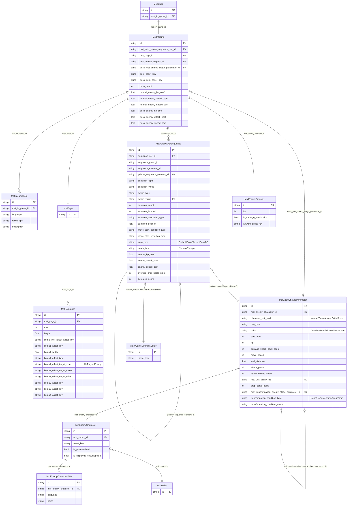

# インゲーム マスタデータ リレーション図

> 参照リリースキー: 202602015

---

## 1. 全体構造（4層の概要）

---

## 2. クエスト〜ステージ層 ER図

---

## 3. インゲーム〜敵設定層 ER図

---

## 4. IDの命名パターンとID連鎖

---

## 5. 敵出現シーケンス構造

---

## 6. 特別ルール（MstInGameSpecialRule）の設定パターン

---

## 7. コマフィールド構造（MstPage → MstKomaLine）

---

## リレーション記号の凡例

| 記号 | 意味 |
|------|------|
| `\|\|` | 必須（1件） |
| `\|o` | 任意（0または1件） |
| `o{` | 0以上（オプション） |
| `\|{` | 1以上（必須） |
| `→` | 参照方向（FK側から参照先） |
| `←` | 被参照（参照される側） |
