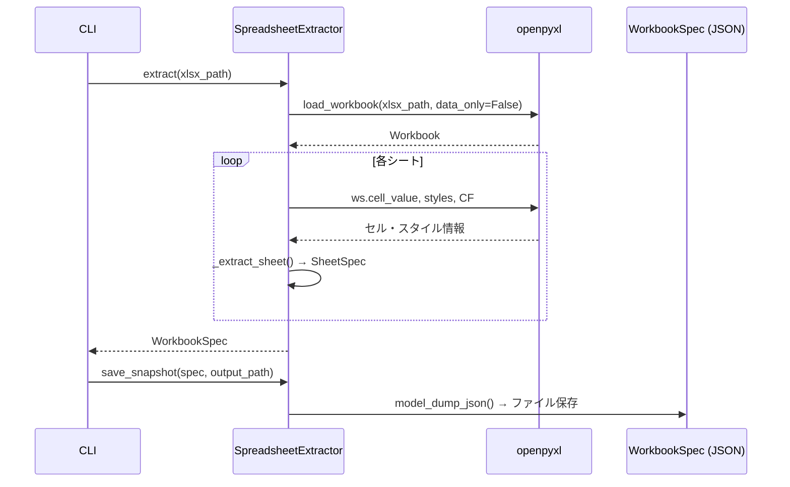
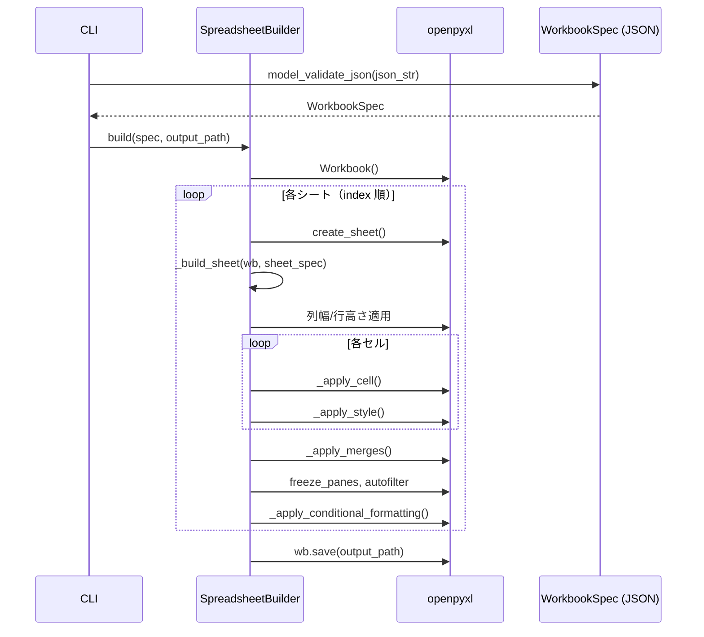

# Spreadsheet IaC 完全再現基盤 — 実装設計書

作成日: 2026-02-28
参照仕様書: `.claude/plans/spreadsheet-iac-complete-reproduction-spec.md`

---

## 1. 概要

### 目的

既存の XLSX ファイルを **Snapshot → IaC JSON → Git 管理 → Build → 完全再生成** というパイプラインで管理できる Python ツール基盤を構築する。

### スコープ

| コンポーネント | 役割 |
|---|---|
| **Snapshot Engine** | 既存 XLSX を読み取り、IaC JSON（WorkbookSpec）へ変換・保存 |
| **Build Engine** | IaC JSON（WorkbookSpec）から XLSX を完全再生成 |
| **Diff Engine** | 2 つの WorkbookSpec を比較し、Markdown レポートを生成 |

### 現在の実装状況

新規実装（既存コードなし）

---

## 2. プロジェクト構造

```
domain/tools/spreadsheet-iac/
├── src/
│   └── spreadsheet_iac/
│       ├── __init__.py
│       ├── models/
│       │   ├── __init__.py
│       │   ├── common.py         # FontSpec, BorderSide, AlignmentSpec
│       │   ├── cell.py           # CellSpec, StyleSpec
│       │   ├── sheet.py          # SheetSpec, ConditionalFormatRule
│       │   └── workbook.py       # WorkbookSpec
│       ├── snapshot/
│       │   ├── __init__.py
│       │   └── extractor.py      # SpreadsheetExtractor
│       ├── builder/
│       │   ├── __init__.py
│       │   └── builder.py        # SpreadsheetBuilder
│       └── diff/
│           ├── __init__.py
│           └── engine.py         # DiffEngine, DiffReport, DiffItem
├── tests/
│   ├── __init__.py
│   ├── conftest.py               # テスト用フィクスチャ（サンプル XLSX 生成）
│   ├── test_models.py
│   ├── test_extractor.py
│   ├── test_builder.py
│   └── test_diff_engine.py
├── specs/                        # IaC JSON 管理（Git 管理対象）
├── snapshots/                    # スナップショット保存先
├── output/                       # 再生成 XLSX 出力先
├── reports/                      # Diff レポート出力先
├── pyproject.toml
└── README.md
```

### 既存 Python ツールとの統一パターン（参照: domain/tools/clickup/）

| 項目 | 採用パターン |
|---|---|
| パッケージ管理 | `uv` + `hatchling` |
| Python バージョン | `>=3.11` |
| Lint | `ruff` |
| テスト | `pytest` |
| モデル | `pydantic BaseModel`（clickup は dataclass だが、本ツールは JSON 往復が必要なため Pydantic を採用） |

---

## 3. アーキテクチャ設計

### 3.1 レイヤー構成

```
XLSX ファイル
    ↕  openpyxl
Snapshot Engine (extractor.py)
    ↕  JSON (pydantic)
WorkbookSpec (models/)       ← 唯一の真実 (Single Source of Truth)
    ↕  JSON (pydantic)
Build Engine (builder.py)
    ↕  openpyxl
XLSX ファイル（再生成）

         ↕ compare
Diff Engine (engine.py)
    → Markdown レポート
```

### 3.2 呼び出し構造

```
CLI / スクリプト
    ├─ snapshot モード: SpreadsheetExtractor.extract(xlsx_path) → WorkbookSpec → save_snapshot(json_path)
    ├─ build モード:    SpreadsheetBuilder.build(spec, output_path)
    └─ diff モード:     DiffEngine.compare(before, after) → DiffReport → generate_report()
```

---

## 4. クラス・メソッド詳細設計

### 4.1 models/common.py（新規作成）

#### `FontSpec(BaseModel)`

| 属性 | 型 | デフォルト | 説明 |
|---|---|---|---|
| `name` | `str` | `"Calibri"` | フォント名 |
| `size` | `float` | `11.0` | フォントサイズ |
| `bold` | `bool` | `False` | 太字 |
| `italic` | `bool` | `False` | 斜体 |
| `underline` | `Optional[str]` | `None` | 下線スタイル |
| `color` | `Optional[str]` | `None` | RGB 6 桁 |

#### `BorderSide(BaseModel)`

| 属性 | 型 | デフォルト | 説明 |
|---|---|---|---|
| `style` | `Optional[str]` | `None` | `"thin"`, `"medium"` 等 |
| `color` | `Optional[str]` | `None` | RGB 6 桁 |

#### `AlignmentSpec(BaseModel)`

| 属性 | 型 | デフォルト | 説明 |
|---|---|---|---|
| `horizontal` | `Optional[str]` | `None` | `"center"`, `"left"`, `"right"` 等 |
| `vertical` | `Optional[str]` | `None` | `"center"`, `"top"`, `"bottom"` 等 |
| `wrap` | `bool` | `False` | 折り返し |

---

### 4.2 models/cell.py（新規作成）

#### `StyleSpec(BaseModel)`

| 属性 | 型 | デフォルト | 説明 |
|---|---|---|---|
| `fill` | `Optional[str]` | `None` | 背景色 RGB 6 桁 |
| `font` | `FontSpec` | `FontSpec()` | フォント設定 |
| `border` | `dict[str, BorderSide]` | `{}` | `left/right/top/bottom` |
| `alignment` | `AlignmentSpec` | `AlignmentSpec()` | 配置 |

#### `CellSpec(BaseModel)`

| 属性 | 型 | デフォルト | 説明 |
|---|---|---|---|
| `row` | `int` | 必須 | 行番号（1 始まり） |
| `col` | `int` | 必須 | 列番号（1 始まり） |
| `value` | `Optional[Any]` | `None` | セル値（数式なしの場合） |
| `r1c1` | `Optional[str]` | `None` | R1C1 形式の数式 |
| `number_format` | `str` | `"General"` | 表示形式 |
| `style` | `StyleSpec` | `StyleSpec()` | スタイル |

---

### 4.3 models/sheet.py（新規作成）

#### `ConditionalFormatRule(BaseModel)`

| 属性 | 型 | デフォルト | 説明 |
|---|---|---|---|
| `range` | `str` | 必須 | 適用セル範囲 |
| `type` | `str` | 必須 | `"cellIs"`, `"formula"` 等 |
| `operator` | `Optional[str]` | `None` | `"lessThan"`, `"greaterThan"` 等 |
| `formula` | `Optional[str]` | `None` | 判定式 |
| `style` | `dict` | `{}` | 書式スタイル（fill 等） |

#### `SheetSpec(BaseModel)`

| 属性 | 型 | デフォルト | 説明 |
|---|---|---|---|
| `name` | `str` | 必須 | シート名 |
| `index` | `int` | 必須 | シート順序（0 始まり） |
| `visible` | `bool` | `True` | 表示/非表示 |
| `freeze_panes` | `Optional[str]` | `None` | フリーズ位置（例: `"A2"`） |
| `tab_color` | `Optional[str]` | `None` | タブ色 RGB 6 桁 |
| `column_widths` | `dict[str, float]` | `{}` | 列名→幅（例: `{"A": 18.0}`） |
| `row_heights` | `dict[str, float]` | `{}` | 行番号→高さ（例: `{"1": 28.0}`） |
| `merges` | `list[str]` | `[]` | 結合セル範囲（例: `["A1:F1"]`） |
| `cells` | `list[CellSpec]` | `[]` | セルデータ |
| `conditional_formatting` | `list[ConditionalFormatRule]` | `[]` | 条件付き書式 |

---

### 4.4 models/workbook.py（新規作成）

#### `WorkbookSpec(BaseModel)`

| 属性 | 型 | 説明 |
|---|---|---|
| `sheets` | `list[SheetSpec]` | シートリスト（index 順） |

**メソッド**:
- `model_dump_json(indent=2)` → JSON 文字列（Pydantic v2 組み込み）
- `model_validate_json(json_str)` → WorkbookSpec（クラスメソッド、Pydantic v2 組み込み）

---

### 4.5 snapshot/extractor.py（新規作成）

#### `SpreadsheetExtractor`

**責務**: openpyxl で XLSX を読み取り、WorkbookSpec へ変換する

| メソッド | 引数 | 戻り値 | 説明 |
|---|---|---|---|
| `extract(xlsx_path: Path)` | XLSX ファイルパス | `WorkbookSpec` | メイン抽出処理 |
| `_extract_sheet(ws, index: int)` | openpyxl Worksheet, 順序 | `SheetSpec` | シート単位抽出 |
| `_extract_cell(cell)` | openpyxl Cell | `Optional[CellSpec]` | 空セルは `None` 返却 |
| `_extract_style(cell)` | openpyxl Cell | `StyleSpec` | fill/font/border/alignment 抽出 |
| `_extract_font(cell)` | openpyxl Cell | `FontSpec` | フォント情報抽出 |
| `_extract_border(cell)` | openpyxl Cell | `dict[str, BorderSide]` | 4 辺ボーダー抽出 |
| `_extract_alignment(cell)` | openpyxl Cell | `AlignmentSpec` | 配置情報抽出 |
| `_extract_conditional_formats(ws)` | openpyxl Worksheet | `list[ConditionalFormatRule]` | 条件付き書式抽出 |
| `save_snapshot(spec, output_path: Path)` | WorkbookSpec, 保存先 | `None` | JSON として保存 |

**実装上の注意点**:
- `data_only=False` で XLSX を開くことで数式（r1c1）を取得
- セル値が `None` でスタイルもデフォルトの場合はスキップ
- `cell.value` が `str` で `=` 始まりの場合は `r1c1` 属性から R1C1 形式を取得（`wb = load_workbook(path, data_only=False)` のとき `ws.cell().value` は A1 形式数式）
- 実際には A1 形式数式を `r1c1` として保存（設計書の「R1C1形式」は概念的な記述）

---

### 4.6 builder/builder.py（新規作成）

#### `SpreadsheetBuilder`

**責務**: WorkbookSpec から openpyxl で XLSX を生成する

| メソッド | 引数 | 戻り値 | 説明 |
|---|---|---|---|
| `build(spec: WorkbookSpec, output_path: Path)` | WorkbookSpec, 出力先 | `None` | メインビルド処理 |
| `_build_sheet(wb, sheet_spec: SheetSpec)` | openpyxl Workbook, SheetSpec | `None` | シート作成・設定 |
| `_apply_cell(ws, cell_spec: CellSpec)` | openpyxl Worksheet, CellSpec | `None` | セル値・数式・書式適用 |
| `_apply_style(ws_cell, style: StyleSpec)` | openpyxl Cell, StyleSpec | `None` | スタイル一括適用 |
| `_apply_font(ws_cell, font: FontSpec)` | openpyxl Cell, FontSpec | `None` | フォント適用 |
| `_apply_border(ws_cell, border: dict)` | openpyxl Cell, dict | `None` | 罫線適用 |
| `_apply_alignment(ws_cell, alignment: AlignmentSpec)` | openpyxl Cell, AlignmentSpec | `None` | 配置適用 |
| `_apply_merges(ws, merges: list[str])` | openpyxl Worksheet, merges | `None` | 結合セル適用 |
| `_apply_conditional_formatting(ws, rules: list)` | openpyxl Worksheet, rules | `None` | 条件付き書式適用 |

**再生成順序**（仕様書 §5.2 に準拠）:
1. Workbook 生成
2. シート作成（index 順で並べる）
3. 列幅 / 行高さ適用
4. セル値・数式適用
5. スタイル適用
6. 結合適用
7. freeze_panes / autofilter 適用
8. 条件付き書式適用
9. 保護適用（将来拡張）

---

### 4.7 diff/engine.py（新規作成）

#### `DiffItem(BaseModel)`

| 属性 | 型 | 説明 |
|---|---|---|
| `sheet` | `str` | シート名 |
| `location` | `str` | セル位置またはシートレベルの識別子 |
| `field` | `str` | 変更されたフィールド（`"formula"`, `"fill"`, `"merge"` 等） |
| `before` | `Any` | 変更前の値 |
| `after` | `Any` | 変更後の値 |

#### `DiffReport(BaseModel)`

| 属性 | 型 | 説明 |
|---|---|---|
| `items` | `list[DiffItem]` | 差分アイテムのリスト |

#### `DiffEngine`

**責務**: 2 つの WorkbookSpec を比較し DiffReport を生成する

| メソッド | 引数 | 戻り値 | 説明 |
|---|---|---|---|
| `compare(before: WorkbookSpec, after: WorkbookSpec)` | 比較対象 2 spec | `DiffReport` | 全シート・全セルの差分検出 |
| `_compare_sheets(before: SheetSpec, after: SheetSpec)` | 2 SheetSpec | `list[DiffItem]` | シート単位の差分（幅/高さ/merges/CF） |
| `_compare_cells(before: CellSpec, after: CellSpec)` | 2 CellSpec | `list[DiffItem]` | セル単位の差分（value/r1c1/style） |
| `generate_report(report: DiffReport)` | DiffReport | `str` | Markdown 形式レポート文字列 |

---

## 5. データフロー（Mermaid シーケンス図）

### 5.1 Snapshot フロー



### 5.2 Build フロー



---

## 6. エラーハンドリング

| エラーケース | 処理方針 |
|---|---|
| XLSX ファイルが存在しない | `FileNotFoundError` をそのままスロー |
| 未知のスタイル属性（openpyxl） | `None` として扱い、デフォルト値で継続 |
| 無効な JSON 形式 | Pydantic の `ValidationError` を呼び出し元に伝播 |
| 無効な数式文字列 | `ValueError` をスロー（セル座標とともに） |
| 結合セルへのスタイル適用 | 結合範囲の左上セルのみに適用（openpyxl の動作に準拠） |

---

## 7. 既存実装との整合性

### 7.1 命名規則

- パッケージ名: `spreadsheet_iac`（snake_case）
- クラス名: PascalCase（`SpreadsheetExtractor`, `SpreadsheetBuilder`, `DiffEngine`）
- メソッド名: snake_case
- プライベートメソッド: `_` プレフィックス

### 7.2 プロジェクト設定（domain/tools/clickup 互換）

```toml
[project]
name = "spreadsheet-iac"
requires-python = ">=3.11"
dependencies = ["openpyxl>=3.1.0", "pydantic>=2.0.0", "deepdiff>=6.0.0"]

[project.optional-dependencies]
dev = ["pytest>=7.4.0", "pytest-cov>=4.1.0", "ruff>=0.1.0"]

[tool.ruff]
line-length = 100
target-version = "py311"
```

### 7.3 テストパターン（pytest）

- `tests/conftest.py` にサンプル XLSX 生成フィクスチャを定義
- ラウンドトリップテスト: `extract → build → extract` して元 spec と比較
- 単体テスト: 各メソッドを小さく独立してテスト
