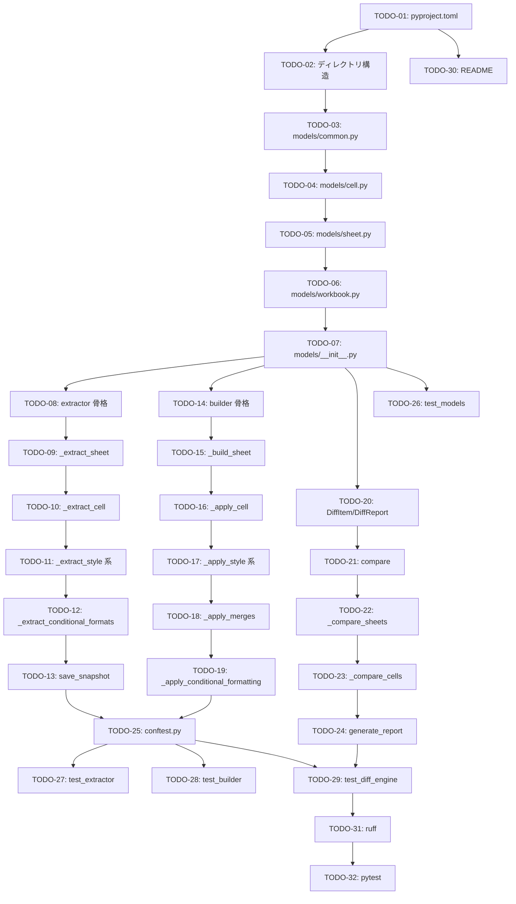

# Spreadsheet IaC 完全再現基盤 — 実装計画書

作成日: 2026-02-28
参照: `implementation-design.md`

---

## 1. TODOリスト（1クラス/1メソッド単位）

### Group 1: プロジェクト基盤セットアップ（順次）

| ID | 内容 | 使用ツール | 依存 |
|---|---|---|---|
| **TODO-01** | `pyproject.toml` 作成: `spreadsheet-iac` パッケージ定義。依存: `openpyxl>=3.1.0`, `pydantic>=2.0.0`, `deepdiff>=6.0.0`。dev: `pytest>=7.4.0`, `pytest-cov>=4.1.0`, `ruff>=0.1.0`。`hatchling` ビルドバックエンド、`ruff` lint 設定（line-length=100, target=py311）を含む | general-purpose | - |
| **TODO-02** | ディレクトリ構造作成: `src/spreadsheet_iac/{models,snapshot,builder,diff}/`, `tests/`, `specs/`, `snapshots/`, `output/`, `reports/` 各 `__init__.py` 含む | general-purpose | TODO-01 |

---

### Group 2: Pydantic モデル実装（並列可）

| ID | 内容 | 使用ツール | 依存 |
|---|---|---|---|
| **TODO-03** | `models/common.py` 新規作成: `FontSpec(BaseModel)`（name/size/bold/italic/underline/color）、`BorderSide(BaseModel)`（style/color）、`AlignmentSpec(BaseModel)`（horizontal/vertical/wrap）の 3 クラス。全フィールドに `Optional` と適切なデフォルト値を設定 | general-purpose | TODO-02 |
| **TODO-04** | `models/cell.py` 新規作成: `StyleSpec(BaseModel)`（fill: RGB6桁/font: FontSpec/border: dict[str, BorderSide]/alignment: AlignmentSpec）、`CellSpec(BaseModel)`（row/col/value/r1c1/number_format/style）。`from __future__ import annotations` で循環参照を回避 | general-purpose | TODO-03 |
| **TODO-05** | `models/sheet.py` 新規作成: `ConditionalFormatRule(BaseModel)`（range/type/operator/formula/style）、`SheetSpec(BaseModel)`（name/index/visible/freeze_panes/tab_color/column_widths/row_heights/merges/cells/conditional_formatting）。`cells` フィールドは `list[CellSpec]`、JSON シリアライズ可能であること | general-purpose | TODO-04 |
| **TODO-06** | `models/workbook.py` 新規作成: `WorkbookSpec(BaseModel)`（sheets: list[SheetSpec]）。`from_json_file(path: Path)` クラスメソッドと `save_json(path: Path)` インスタンスメソッドを追加（`model_validate_json` / `model_dump_json` を内部利用） | general-purpose | TODO-05 |
| **TODO-07** | `models/__init__.py` 更新: `WorkbookSpec`, `SheetSpec`, `CellSpec`, `StyleSpec`, `ConditionalFormatRule`, `FontSpec`, `BorderSide`, `AlignmentSpec` を公開エクスポート | general-purpose | TODO-06 |

---

### Group 3: Snapshot Engine 実装（順次）

| ID | 内容 | 使用ツール | 依存 |
|---|---|---|---|
| **TODO-08** | `snapshot/extractor.py` — `SpreadsheetExtractor` クラス骨格作成: `extract(xlsx_path: Path) -> WorkbookSpec` メインメソッドの骨格。`openpyxl.load_workbook(path, data_only=False)` で XLSX を開き、各 Worksheet を順にイテレートして `_extract_sheet()` を呼ぶ。最後に `WorkbookSpec(sheets=sheet_specs)` を返す | general-purpose | TODO-07 |
| **TODO-09** | `snapshot/extractor.py` — `_extract_sheet(ws, index: int) -> SheetSpec` 実装: シート名・可視性・freeze_panes・tab_color を取得。`column_dimensions`, `row_dimensions` から列幅・行高さを辞書形式で取得。`merged_cells` から結合範囲リストを取得。各セルを `_extract_cell()` で処理し、`None` でないもののみ収集 | general-purpose | TODO-08 |
| **TODO-10** | `snapshot/extractor.py` — `_extract_cell(cell) -> Optional[CellSpec]` 実装: `cell.value` が `None` かつスタイルがデフォルトの場合は `None` 返却。`cell.data_type == "f"` の場合は `r1c1` に `cell.value`（A1 形式数式文字列）を設定、それ以外は `value` に設定。`number_format` を取得。`_extract_style()` を呼び出す | general-purpose | TODO-09 |
| **TODO-11** | `snapshot/extractor.py` — `_extract_style(cell) -> StyleSpec` + `_extract_font(cell) -> FontSpec` + `_extract_border(cell) -> dict[str, BorderSide]` + `_extract_alignment(cell) -> AlignmentSpec` 実装: openpyxl の `cell.fill.fgColor.rgb`、`cell.font.*`、`cell.border.*`、`cell.alignment.*` をそれぞれ対応 Pydantic モデルへマッピング。`None` や `"00000000"` 等のデフォルト値は `None` として扱う | general-purpose | TODO-10 |
| **TODO-12** | `snapshot/extractor.py` — `_extract_conditional_formats(ws) -> list[ConditionalFormatRule]` 実装: `ws.conditional_formatting` をイテレートし、各ルール（`CellIsRule`, `FormulaRule` 等）を `ConditionalFormatRule` へ変換。対応できないルールタイプは警告ログを出力してスキップ | general-purpose | TODO-11 |
| **TODO-13** | `snapshot/extractor.py` — `save_snapshot(spec: WorkbookSpec, output_path: Path) -> None` 実装: `output_path` の親ディレクトリを `mkdir(parents=True, exist_ok=True)` で作成。`spec.save_json(output_path)` で JSON 保存。保存先パスをコンソール出力 | general-purpose | TODO-12 |

---

### Group 4: Build Engine 実装（順次）

| ID | 内容 | 使用ツール | 依存 |
|---|---|---|---|
| **TODO-14** | `builder/builder.py` — `SpreadsheetBuilder` クラス骨格作成: `build(spec: WorkbookSpec, output_path: Path) -> None` メインメソッド。`openpyxl.Workbook()` でワークブック生成。デフォルトシートを削除後、`spec.sheets` を `index` 昇順でソートして `_build_sheet()` を呼ぶ。最後に `wb.save(output_path)` | general-purpose | TODO-07 |
| **TODO-15** | `builder/builder.py` — `_build_sheet(wb, sheet_spec: SheetSpec) -> None` 実装: `wb.create_sheet(sheet_spec.name)` でシート作成。`visible` が `False` の場合 `ws.sheet_state = "hidden"` 設定。`tab_color` 設定。列幅（`ws.column_dimensions[col].width`）と行高さ（`ws.row_dimensions[row].height`）を適用 | general-purpose | TODO-14 |
| **TODO-16** | `builder/builder.py` — `_apply_cell(ws, cell_spec: CellSpec) -> None` 実装: `ws.cell(row, col)` でセル取得。`r1c1` が `None` でない場合は `cell.value = r1c1`（数式文字列をそのまま設定）、`r1c1` が `None` の場合は `value` を設定。`cell.number_format = cell_spec.number_format` 設定。`_apply_style()` を呼ぶ | general-purpose | TODO-15 |
| **TODO-17** | `builder/builder.py` — `_apply_style(ws_cell, style: StyleSpec) -> None` + `_apply_font()` + `_apply_border()` + `_apply_alignment()` 実装: `openpyxl.styles.PatternFill`（`fgColor` に RGB 6 桁）、`openpyxl.styles.Font`、`openpyxl.styles.Border` + `Side`、`openpyxl.styles.Alignment` を生成して `ws_cell.*` に代入。各メソッドは `None` チェックを行いデフォルト値は設定しない（openpyxl の暗黙デフォルトに任せる） | general-purpose | TODO-16 |
| **TODO-18** | `builder/builder.py` — `_apply_merges(ws, merges: list[str]) -> None` 実装: `ws.merge_cells(merge_range)` を各範囲に適用。ループ内で例外をキャッチし、不正な範囲は警告出力してスキップ | general-purpose | TODO-17 |
| **TODO-19** | `builder/builder.py` — `_apply_conditional_formatting(ws, rules: list[ConditionalFormatRule]) -> None` 実装: `ConditionalFormatRule.type` に応じて `openpyxl.formatting.rule.CellIsRule` または `FormulaRule` を生成。`ws.conditional_formatting.add(range, rule)` で適用。未対応タイプは警告出力してスキップ | general-purpose | TODO-18 |

---

### Group 5: Diff Engine 実装（順次）

| ID | 内容 | 使用ツール | 依存 |
|---|---|---|---|
| **TODO-20** | `diff/engine.py` — `DiffItem(BaseModel)` + `DiffReport(BaseModel)` 定義: `DiffItem`（sheet/location/field/before/after）、`DiffReport`（items: list[DiffItem]、`has_changes` プロパティ） | general-purpose | TODO-07 |
| **TODO-21** | `diff/engine.py` — `DiffEngine.compare(before: WorkbookSpec, after: WorkbookSpec) -> DiffReport` 実装: シート名をキーとした辞書に変換。before/after それぞれのシートセットを比較（追加・削除・変更）。共通シートは `_compare_sheets()` で差分検出 | general-purpose | TODO-20 |
| **TODO-22** | `diff/engine.py` — `_compare_sheets(before: SheetSpec, after: SheetSpec) -> list[DiffItem]` 実装: `column_widths`, `row_heights`, `merges`, `freeze_panes`, `tab_color` の差分を検出。セルは (row, col) をキーとした辞書に変換し `_compare_cells()` を呼ぶ。追加・削除セルも `DiffItem` として記録 | general-purpose | TODO-21 |
| **TODO-23** | `diff/engine.py` — `_compare_cells(before: CellSpec, after: CellSpec) -> list[DiffItem]` 実装: `value`, `r1c1`, `number_format`, `style.fill`, `style.font.*`, `style.border.*`, `style.alignment.*` を field 単位で比較。変更があった field のみ `DiffItem` として収集 | general-purpose | TODO-22 |
| **TODO-24** | `diff/engine.py` — `generate_report(report: DiffReport) -> str` 実装: Markdown 形式レポートを生成。ヘッダー `## Changes`、変更なしの場合は `No changes detected.`、変更ありの場合は sheet 別に箇条書き（例: `- reward!G14 formula changed: "=A1" → "=B1"`） | general-purpose | TODO-23 |

---

### Group 6: テスト実装（並列可）

| ID | 内容 | 使用ツール | 依存 |
|---|---|---|---|
| **TODO-25** | `tests/conftest.py` 作成: pytest フィクスチャ `sample_xlsx(tmp_path)` — openpyxl で最小構成の XLSX を作成（1 シート、ヘッダーセル、数式セル、スタイル付きセル、結合セル、freeze_panes 設定）。`sample_spec(tmp_path)` — 対応する WorkbookSpec を手動で構築して返す | general-purpose | TODO-13, TODO-19 |
| **TODO-26** | `tests/test_models.py` 作成: `WorkbookSpec`, `SheetSpec`, `CellSpec`, `StyleSpec` の Pydantic バリデーションテスト。JSON シリアライズ → デシリアライズのラウンドトリップテスト。必須フィールド欠損時の `ValidationError` テスト | general-purpose | TODO-07 |
| **TODO-27** | `tests/test_extractor.py` 作成: `SpreadsheetExtractor.extract()` のユニットテスト。`sample_xlsx` フィクスチャを使用。シート名・freeze_panes・列幅・結合セルが正しく抽出されること。スタイル付きセルの fill/font/border が正しく抽出されること | general-purpose | TODO-25 |
| **TODO-28** | `tests/test_builder.py` 作成: `SpreadsheetBuilder.build()` のラウンドトリップテスト。`sample_spec` から XLSX を生成し、再度 `extract()` して元の spec と比較。セル値・数式・列幅・freeze_panes・結合が一致すること | general-purpose | TODO-25 |
| **TODO-29** | `tests/test_diff_engine.py` 作成: `DiffEngine.compare()` のユニットテスト。変更なし → `report.has_changes == False`。数式変更 → 対応 `DiffItem` が生成されること。シート追加・削除 → 対応 `DiffItem` が生成されること。`generate_report()` が Markdown 文字列を返すこと | general-purpose | TODO-24 |

---

### Group 7: 品質チェック（順次）

| ID | 内容 | 使用ツール | 依存 |
|---|---|---|---|
| **TODO-30** | `README.md` 作成: インストール手順（`uv sync`）、使用方法（snapshot/build/diff の各コマンド例）、ディレクトリ構造説明 | general-purpose | TODO-01 |
| **TODO-31** | `ruff check src/ tests/` でコードスタイル検査・修正。`ruff format src/ tests/` でフォーマット適用 | general-purpose | TODO-29 |
| **TODO-32** | `pytest tests/ -v --cov=spreadsheet_iac` でテスト全件実行。カバレッジレポート確認 | general-purpose | TODO-31 |

---

## 2. 実行グループ（並列最適化）

```
Group 1（順次）: プロジェクト基盤セットアップ
  → TODO-01: pyproject.toml
  → TODO-02: ディレクトリ構造作成

Group 2（並列可）: Pydantic モデル実装
  TODO-03 → TODO-04 → TODO-05 → TODO-06 → TODO-07（順次依存のため一連）

Group 3（順次）: Snapshot Engine 実装
  TODO-08 → TODO-09 → TODO-10 → TODO-11 → TODO-12 → TODO-13

Group 4（順次）: Build Engine 実装
  TODO-14 → TODO-15 → TODO-16 → TODO-17 → TODO-18 → TODO-19

Group 5（順次）: Diff Engine 実装
  TODO-20 → TODO-21 → TODO-22 → TODO-23 → TODO-24

（Group 3, 4, 5 は Group 2 完了後、並列実行可能）

Group 6（並列可）: テスト実装
  TODO-25（conftest, Group 3+4 完了後）
  TODO-26（models テスト, Group 2 完了後）
  TODO-27（extractor テスト, TODO-25 完了後）
  TODO-28（builder テスト, TODO-25 完了後）
  TODO-29（diff テスト, TODO-24 + TODO-25 完了後）

Group 7（順次）: 品質チェック
  → TODO-30: README
  → TODO-31: ruff lint/format
  → TODO-32: pytest 全件実行
```

---

## 3. 依存関係グラフ（Mermaid）



---

## 4. 完了条件

- [ ] TODO-01〜TODO-32 が全て完了
- [ ] `ruff check` エラーなし
- [ ] `pytest tests/ -v` 全件パス
- [ ] `extract → build → extract` のラウンドトリップテストが成功
- [ ] `specs/`, `snapshots/`, `output/`, `reports/` ディレクトリが存在
- [ ] `README.md` にインストール・使用方法が記載されている
