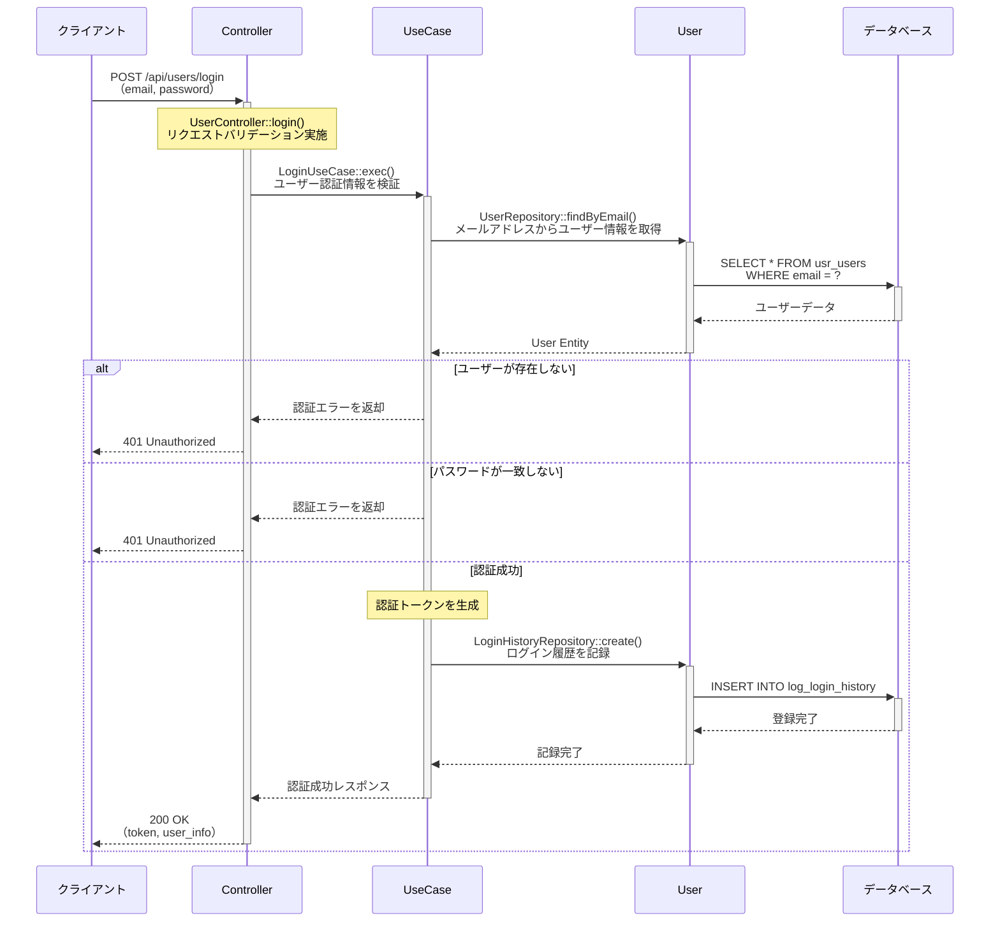

# generate-sequence-diagram

指定されたAPIエンドポイントのコードを解析し、詳細なシーケンス図（Mermaid形式）を自動生成して`docs/api-sequence-diagrams/`ディレクトリに保存するコマンドです。

## 使用方法

```
/generate-sequence-diagram [エンドポイントURL] [オプション：ファイル名サフィックス]
```

## 使用例

### 基本的な使用方法
```
/generate-sequence-diagram /api/users/login
```
→ `docs/api-sequence-diagrams/api_users_login.md` が生成されます

### 条件分岐や特定機能の詳細を記述する場合
```
/generate-sequence-diagram /api/stage/start event_quest
```
→ `docs/api-sequence-diagrams/api_stage_start_event_quest.md` が生成されます

```
/generate-sequence-diagram /api/gacha/draw normal_gacha
```
→ `docs/api-sequence-diagrams/api_gacha_draw_normal_gacha.md` が生成されます

```
/generate-sequence-diagram /api/gacha/draw special_bonus_flow
```
→ `docs/api-sequence-diagrams/api_gacha_draw_special_bonus_flow.md` が生成されます

## 実行内容

引数: $ARGUMENTS

### 1. エンドポイント解析

#### ルーティング情報の取得
- `api/routes/api.php` からエンドポイントに対応するControllerとメソッドを特定
- HTTPメソッド（GET/POST/PUT/DELETE）の確認
- ミドルウェア構成の確認（認証、バリデーション等）

#### Controller解析
- Controller内の対象メソッドのコードを読み取り
- UseCase呼び出しを特定
- レスポンス生成ロジックの確認

### 2. 処理フローの詳細解析

#### UseCase層の解析
- UseCaseクラスの`execute()`メソッドを解析
- 処理の流れを順次追跡（トランザクション境界、条件分岐、ループ処理）
- Repository、Service、その他依存コンポーネントの呼び出しを特定

#### Repository/Service層の解析
- データベース操作（SELECT/INSERT/UPDATE/DELETE）の詳細
- 取得データの内容と用途
- 複数テーブルへのアクセスパターン

#### Model/Entity層の解析
- Eloquentリレーション（hasMany、belongsTo等）の使用状況
- アクセサ/ミューテータの適用
- スコープやクエリビルダーの利用状況

### 3. シーケンス図の生成

#### 詳細度の方針
以下の観点で詳細なシーケンス図を作成します：

**メソッド呼び出しレベル**
- 各クラス間のメソッド呼び出しを詳細に記載
- メソッド名ではなく、**日本語で「何をしているか」を明確に記述**
  - 例: `execute()` → 「ユーザー認証情報を検証」
  - 例: `findById()` → 「IDからユーザー情報を取得」

**DB操作の詳細**
- テーブル名と操作内容を明示
  - 例: `usr_users テーブルから user_id={id} のユーザー情報を取得`
  - 例: `log_login_history テーブルにログイン履歴を記録`
- 取得データの用途を記載
  - 例: `取得したユーザー情報から認証トークンを生成`
- **マスタデータ（mst_*）の単純な取得処理は記載しない**
  - マスターデータのSELECT処理はシーケンス図から省略
  - ただし、マスターデータを使った計算やビジネスロジックはNote等で補足

**トランザクション境界**
- トランザクション開始・コミット・ロールバックを明示
- デッドロック防止のためのロック取得順序を記載（必要に応じて）

**条件分岐とエラーハンドリング**
- 主要な条件分岐（if/switch）をalt/opt記法で表現
- 異常系フロー（例外処理、エラーレスポンス）を明示
- バリデーションエラー、ビジネスロジックエラーの処理

**複雑な処理の分解**
- ループ処理はloop記法で明示（処理対象と繰り返し条件）
- 並列処理や非同期処理がある場合はpar記法で表現

#### Mermaid形式の構造

**Participantの設計方針**
- **ドメイン間の連携に焦点**: Client、Controller、UseCase、各ドメイン、DBでparticipantを構成し、ドメイン間の連携を明確に表現
- **Service/Repositoryは含めない**: Service、Repository、Factoryなどの内部実装は各ドメインに含め、ドメイン間の連携を中心に表現
- **具体的なクラス名はメッセージやNoteで記載**: 処理の詳細度は維持し、どのクラスのどのメソッドが呼ばれているかをメッセージテキストやNote内に記載
- **可読性を重視**: participantの数を最小限に抑え、ドメイン間の連携フローが一目でわかるシーケンス図を作成

**標準的なParticipant構成**
- `Client`: クライアント
- `Controller`: Controller
- `UseCase`: UseCase
- `[Domain]`: 各ドメイン（例: Stage, Reward, User, Shop, InGame等）
  - Stageドメイン: StageService、StageRepository、StageDelegator等を含む
  - Rewardドメイン: RewardService、RewardRepository、RewardDelegator等を含む
  - Userドメイン: UserService、UserRepository、UserDelegator等を含む
  - Shopドメイン: ShopService、ShopRepository、ShopDelegator等を含む
  - InGameドメイン: InGameService、InGameRepository、InGameDelegator等を含む
- `DB`: データベース（mst/usr/log等のDBを含む）

**APIバージョンの扱い**
- エンドポイントURLからバージョン番号（v1, v2等）は省略
- 例: `/api/v1/users/login` → `/api/users/login`



### 4. ファイル保存

#### ファイル名生成ルール
1. **エンドポイントベース命名**（デフォルト）
   - エンドポイントURLから自動生成（バージョン番号は省略）
   - `/api/users/login` → `api_users_login.md`
   - スラッシュは`_`に、ハイフンもそのまま使用

2. **サフィックス付き命名**（オプション指定時）
   - 第2引数でサフィックスを指定可能
   - `/api/stage/start event_quest` → `api_stage_start_event_quest.md`
   - 条件分岐や特定機能のフローを分けて記述する際に使用

#### ファイル内容
以下の構成でMarkdownファイルを作成：

```markdown
# [エンドポイント名] シーケンス図

## 概要
- **エンドポイント**: [URL]
- **HTTPメソッド**: [GET/POST/PUT/DELETE]
- **機能概要**: [このエンドポイントが提供する機能の説明]
- **認証**: [必要/不要]
- **主要な処理**: [処理内容の概要]

## リクエストパラメータ
| パラメータ名 | 型 | 必須 | 説明 |
|-------------|-----|------|------|
| ... | ... | ... | ... |

## レスポンス
### 成功時（200 OK）
```json
{
  ...
}
```

### エラー時
- 401 Unauthorized: 認証エラー
- 404 Not Found: リソースが見つからない
- 500 Internal Server Error: サーバーエラー

## シーケンス図

```mermaid
sequenceDiagram
    [Mermaid形式のシーケンス図]
```

## 処理詳細説明

### 1. [処理ステップ名]
[詳細な説明]

### 2. [処理ステップ名]
[詳細な説明]

## データベース操作

### 参照テーブル
- `テーブル名`: 用途
- `テーブル名`: 用途

### トランザクション
- 開始ポイント: [場所]
- コミット条件: [条件]
- ロールバック条件: [条件]

## エラーハンドリング

### バリデーションエラー
[説明]

### ビジネスロジックエラー
[説明]

### システムエラー
[説明]

## 備考
[その他注意事項や補足情報]
```

### 5. 出力とユーザー確認

生成後、以下の情報を表示：
- 生成されたファイルパス
- ファイルサイズ
- シーケンス図のparticipant数（複雑度の目安）
- エンドポイントの主要処理ステップ数

## 技術仕様

### 対応するファイル構造
```
api/
├── routes/
│   └── api.php                 # ルーティング定義
├── app/
│   ├── Http/
│   │   └── Controllers/
│   │       └── Api/            # Controller層
│   ├── UseCases/               # UseCase層
│   ├── Repositories/           # Repository層
│   ├── Services/               # Service層
│   └── Models/                 # Model/Entity層
```

### 解析対象
- Controller（`app/Http/Controllers/Api/`）
- UseCase（`app/UseCases/`）
- Repository（`app/Repositories/`）
- Service（`app/Services/`）
- Model/Entity（`app/Models/`, `app/Entities/`）

### 使用ツール
- **Read**: ファイル内容読み取り
- **Glob**: ファイル検索
- **Grep**: コード内パターン検索
- **Write**: シーケンス図ファイル保存
- **glow-server-local-db MCP**: データベーステーブル構造確認（推奨）
  - テーブル一覧取得: `list_tables`
  - テーブル構造確認: `describe_table`
  - データ確認: `query_database`
  - 実際に存在するテーブル名を確認してから記載すること

## 注意事項

### 実行前の確認
- 対象エンドポイントが`api/routes/api.php`に定義されていること
- 関連するController、UseCase、Repositoryが実装されていること

### 複雑なエンドポイントの場合
- 条件分岐が多い場合は、サフィックスを使って複数のシーケンス図に分割することを推奨
- 例: 通常フロー、エラーフロー、特別条件時のフローをそれぞれ別ファイルで作成

### 生成されるファイルの更新
- 既存のシーケンス図ファイルが存在する場合は上書きされます
- 手動で編集した内容は失われるため、必要に応じてバックアップを取ってください

### コードが複雑な場合の対応
- 非常に複雑な処理の場合、シーケンス図が読みにくくなる可能性があります
- その場合は処理を論理的なまとまりで分割し、複数のシーケンス図を作成することを検討してください

## トラブルシューティング

### エンドポイントが見つからない
- `api/routes/api.php`を確認し、正しいURLパスを指定しているか確認
- URLのバージョン番号（v1, v2等）やプレフィックスを含めて指定

### Controllerが見つからない
- ルーティング定義からControllerクラス名とメソッド名を確認
- `app/Http/Controllers/Api/`配下に該当ファイルが存在するか確認

### UseCaseやRepositoryの呼び出しが追跡できない
- Controller内のコードを確認し、依存注入されているクラスを特定
- コンストラクタや`__construct()`を確認

### シーケンス図が複雑すぎる
- 処理を段階的に分割し、複数のシーケンス図に分けることを検討
- サフィックスを使って機能別・条件別にファイルを作成

## 生成例

### シンプルな例（ユーザー詳細取得API）
```
/generate-sequence-diagram /api/users/show
```

生成されるファイル: `docs/api-sequence-diagrams/api_users_show.md`

### 複雑な例（ガチャ実行API - 通常フロー）
```
/generate-sequence-diagram /api/gacha/draw normal_flow
```

生成されるファイル: `docs/api-sequence-diagrams/api_gacha_draw_normal_flow.md`

### 複雑な例（ガチャ実行API - 天井到達時）
```
/generate-sequence-diagram /api/gacha/draw ceiling_reached
```

生成されるファイル: `docs/api-sequence-diagrams/api_gacha_draw_ceiling_reached.md`

このコマンドにより、APIエンドポイントの実装内容を正確に把握でき、ドキュメント整備と設計レビューの効率化が実現されます。
