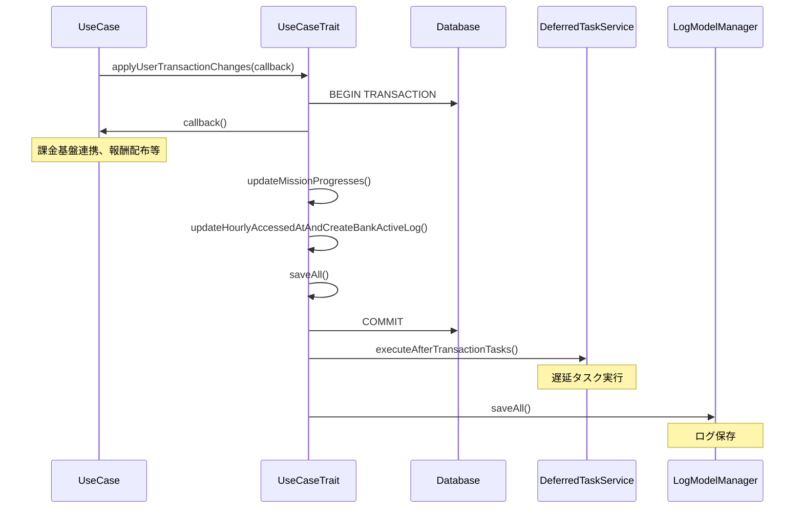

# applyUserTransactionChanges アーキテクチャ

## 概要

`applyUserTransactionChanges` は、APIリクエスト処理内で行われたユーザーデータの変更を確定させるメソッドです。
トランザクションで囲みつつ、指定されたコールバック処理を実行した後に、ミッション進捗更新や、ユーザデータ・ログデータの一括保存などの処理をまとめて実行します。

## 処理フロー

```
applyUserTransactionChanges(callback)
    │
    ├─ [トランザクション開始]
    │
    ├─ 1. callback() 実行
    │     - 課金基盤連携
    │     - 報酬配布
    │     - 即時保存が必要な処理
    │
    ├─ 2. updateMissionProgresses()
    │     - ミッション進捗判定と更新
    │
    ├─ 3. updateHourlyAccessedAtAndCreateBankActiveLog()
    │     - 1時間ごとのアクセス日時更新
    │     - BankF001用アクティブログ作成
    │
    ├─ 4. saveAll()
    │     - UsrModelManager の一括保存
    │     - usr_* テーブルへの書き込み
    │
    ├─ [トランザクションコミット]
    │
    ├─ 5. executeAfterTransactionTasks()
    │     - 遅延タスク実行（トランザクション外）
    │
    └─ 6. saveAllLog()
        - LogModelManager の一括保存
        - log_* テーブルへの書き込み
```

## 重要なポイント

### 1. callback に渡すべき処理

```php
$this->applyUserTransactionChanges(function () use (...) {
    // ✅ callback に含めるべき処理
    $this->gachaService->execConsumeResource($logGachaAction);  // 課金基盤連携
    $this->rewardDelegator->sendRewards(...);                   // 報酬配布
    $this->gachaService->addGachaHistory(...);                  // キャッシュ保存
});
```

**callback に含めるべき処理:**
- 課金基盤（Billing/Currency）との連携
- 報酬配布処理（`rewardDelegator->sendRewards()`）
- 即時保存が必要なキャッシュ操作
- 遅延実行対象外の Repository 操作

**callback に含めなくてよい処理:**
- `UsrModelManager` を使用する Repository の操作（`saveAll()` で自動保存）
- `LogModelManager` を使用する Repository の操作（`saveAllLog()` で自動保存）

### 2. 戻り値の扱い

callback から戻り値を返すことができます:

```php
list($resultA, $resultB) = $this->applyUserTransactionChanges(function () use (...) {
    // 処理
    return [$resultA, $resultB];
});
```

### 3. エラーハンドリング

- callback 内で例外が発生した場合、トランザクションは自動的にロールバック
- `executeAfterTransactionTasks()` や `saveAllLog()` の例外はエラーログのみ（ロールバックしない）

## processWithoutUserTransactionChanges との違い

| 処理 | applyUserTransactionChanges | processWithoutUserTransactionChanges |
|-----|---------------------------|-------------------------------------|
| トランザクション | あり | なし |
| callback | あり | なし |
| ミッション進捗更新 | あり | なし |
| saveAll() | あり | なし |
| アクセス日時更新 | あり | あり（即時保存） |
| ログ保存 | あり | あり |

## シーケンス図


