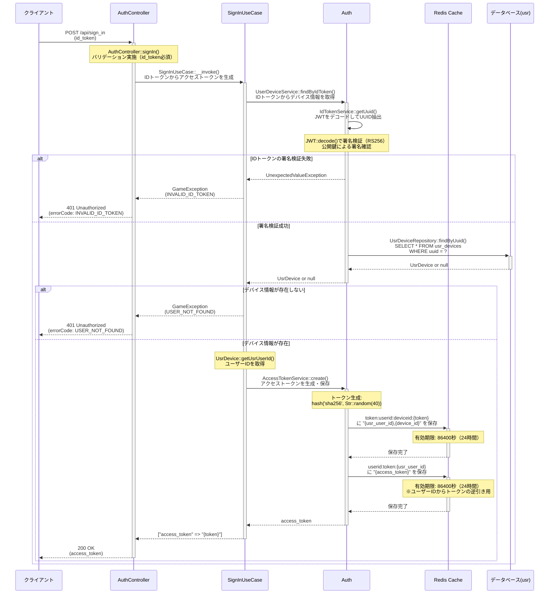

# /sign_in シーケンス図

## 概要
- **エンドポイント**: POST /api/sign_in
- **HTTPメソッド**: POST
- **機能概要**: IDトークンを検証し、有効なアクセストークンを発行してユーザー認証を行う
- **認証**: 不要（このエンドポイント自体が認証のためのもの）
- **主要な処理**:
  1. IDトークンからUUIDを抽出・検証
  2. UUIDに紐づくデバイス情報とユーザーIDを取得
  3. アクセストークンを生成してRedisキャッシュに保存
  4. アクセストークンをレスポンスとして返却

## リクエストパラメータ
| パラメータ名 | 型 | 必須 | 説明 |
|-------------|-----|------|------|
| id_token | string | ○ | sign_up時に発行されたJWT形式のIDトークン（RS256署名） |

## レスポンス
### 成功時（200 OK）
```json
{
  "access_token": "ハッシュ化されたアクセストークン文字列（SHA256）"
}
```

### エラー時
- **400 Bad Request**: バリデーションエラー（id_tokenが未指定）
  - errorCode: `VALIDATION_ERROR`
- **401 Unauthorized**: IDトークンが不正、またはユーザーが見つからない
  - errorCode: `INVALID_ID_TOKEN` - IDトークンの署名検証に失敗、またはペイロードが不正
  - errorCode: `USER_NOT_FOUND` - IDトークンは有効だが、対応するデバイス情報が存在しない

## シーケンス図



## 処理詳細説明

### 1. リクエストバリデーション
- `AuthController::signIn()`で`id_token`パラメータの必須チェックを実施
- バリデーション失敗時は`VALIDATION_ERROR`を返却

### 2. IDトークンの検証とUUID抽出
- `IdTokenService::getUuid()`でJWT形式のIDトークンをデコード
- RS256アルゴリズムによる署名検証を実施（公開鍵使用）
- 署名が不正な場合は`UnexpectedValueException`がスローされ、`INVALID_ID_TOKEN`エラーとなる
- 検証成功時はペイロードから`uuid`を抽出

### 3. デバイス情報の取得
- `UsrDeviceRepository::findByUuid()`で`usr_devices`テーブルからデバイス情報を検索
- デバイス情報が存在しない場合は`USER_NOT_FOUND`エラーを返却
- デバイス情報からユーザーID（`usr_user_id`）とデバイスID（`id`）を取得

### 4. アクセストークンの生成と保存
- `AccessTokenService::create()`でアクセストークンを生成
  - トークン文字列: `hash('sha256', Str::random(40))`
  - ランダム文字列（40文字）をSHA256でハッシュ化
- Redisキャッシュに2つのキーでトークン情報を保存:
  1. **トークン→ユーザー情報の紐付け**
     - キー: `token:userid:deviceid:{access_token}`
     - 値: `{usr_user_id},{device_id}`
     - 用途: アクセストークンからユーザーIDとデバイスIDを取得
  2. **ユーザーID→トークンの紐付け**
     - キー: `userid:token:{usr_user_id}`
     - 値: `{access_token}`
     - 用途: 複数端末ログイン検出（同一ユーザーの最新トークンを管理）
- 有効期限: 86400秒（24時間）

### 5. レスポンス返却
- 生成したアクセストークンをJSON形式で返却
- クライアントは以降のAPI呼び出しでこのトークンを使用

## データベース操作

### 参照テーブル
- **usr_devices**: デバイス情報テーブル
  - 用途: UUIDからデバイス情報とユーザーIDを取得
  - 検索条件: `uuid`（UNIQUE制約あり）
  - 取得カラム: `id`, `usr_user_id`, `uuid`, `bnid_linked_at`, `os_platform`

### キャッシュ操作
- **Redis Cache**: アクセストークン情報の保存
  - `token:userid:deviceid:{token}`: トークンからユーザー情報への参照
  - `userid:token:{usr_user_id}`: ユーザーIDからトークンへの逆引き
  - 有効期限: 24時間

### トランザクション
- このエンドポイントではトランザクションは使用されない
- データベースは参照のみ（SELECT）
- キャッシュへの書き込みは個別に実行

## エラーハンドリング

### バリデーションエラー
- **発生条件**: `id_token`パラメータが未指定
- **エラーコード**: `VALIDATION_ERROR`
- **HTTPステータス**: 400 Bad Request
- **処理**: Laravel標準のバリデーション機能により自動的にエラーレスポンスを返却

### 認証エラー（IDトークン不正）
- **発生条件**:
  - JWTの署名検証に失敗（公開鍵で検証できない）
  - JWTのペイロードが不正（uuidフィールドが存在しない等）
- **エラーコード**: `INVALID_ID_TOKEN`
- **HTTPステータス**: 401 Unauthorized
- **処理**: `IdTokenService::getUuid()`で`UnexpectedValueException`がスローされ、`SignInUseCase`でキャッチして`GameException`に変換

### ユーザー未登録エラー
- **発生条件**: IDトークンは有効だが、該当するデバイス情報が`usr_devices`テーブルに存在しない
- **エラーコード**: `USER_NOT_FOUND`
- **HTTPステータス**: 401 Unauthorized
- **処理**: `UsrDeviceRepository::findByUuid()`が`null`を返した場合に`GameException`をスロー

### システムエラー
- **発生条件**:
  - Redisキャッシュへの接続エラー
  - データベース接続エラー
- **処理**: 例外が上位にスローされ、グローバル例外ハンドラで処理

## 備考

### セキュリティ考慮事項
- IDトークンはRS256署名（非対称鍵）により検証されるため、サーバー側の秘密鍵なしには偽造不可能
- アクセストークンは24時間で自動的に失効
- 同一ユーザーが複数端末でログインした場合、最後にログインした端末のトークンのみが有効となる
  - `userid:token:{usr_user_id}`キーが上書きされるため
  - 古いトークンでのアクセスは`MULTIPLE_DEVICE_LOGIN_DETECTED`エラーとなる

### sign_upとの連携
- 新規ユーザー登録時に`sign_up`エンドポイントでIDトークンが発行される
- `sign_up`では`UsrDeviceRepository::create()`でデバイス情報が作成される
- その後、`sign_in`でIDトークンを使ってアクセストークンを取得する流れ

### TODO
- アクセストークンをハッシュ化した状態で保存する（現在は平文保存）
- アクセストークンの重複チェック機能の実装

### ミドルウェア
このエンドポイントには以下のミドルウェアが適用されています:
- `encrypt`: リクエスト/レスポンスの暗号化
- ※認証系ミドルウェア（`auth:api`等）は適用されない
