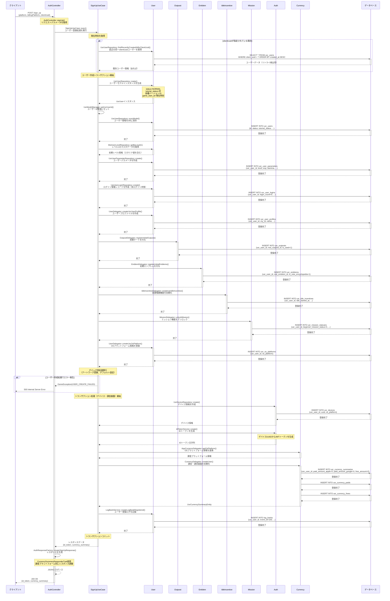

# /sign_up シーケンス図

## 概要
- **エンドポイント**: POST /sign_up
- **HTTPメソッド**: POST
- **機能概要**: 新規ユーザー登録を行い、初期データの作成とIDトークンの発行を実行
- **認証**: 不要（新規登録のため）
- **主要な処理**:
  - ユーザーアカウントの新規作成
  - ユーザーパラメータ（レベル、スタミナ等）の初期化
  - 初期ゲーム要素の付与（ゲート、エンブレム、ミッション機能）
  - デバイス情報の登録
  - 課金・通貨基盤の初期化
  - IDトークンの発行

## リクエストパラメータ
| パラメータ名 | 型 | 必須 | 説明 |
|-------------|-----|------|------|
| platform | string | ○ | プラットフォーム情報（iOS/Android等） |
| billingPlatform | string | ○ | 課金プラットフォーム（Apple/Google等） |
| clientUuid | string | △ | クライアントUUID（任意、リトライ検出用） |

## レスポンス
### 成功時（200 OK）
```json
{
  "id_token": "eyJhbGciOiJIUzI1NiIsInR...",
  "currency_summary": {
    "paid_amount_apple": 0,
    "paid_amount_google": 0,
    "free_amount": 0
  }
}
```

### エラー時
- 500 Internal Server Error: ユーザー作成失敗（USER_CREATE_FAILED）
- 500 Internal Server Error: トランザクション処理失敗

## シーケンス図



## 処理詳細説明

### 1. リクエスト受信とパラメータ取得
- AuthControllerがリクエストを受信
- platform、billingPlatform、clientUuidを取得
- clientUuidはリトライ時の重複登録検出に使用

### 2. リトライ検出処理
- clientUuidが指定されている場合、同一UUIDで最近作成されたユーザーを検索
- リトライ検出用の情報として保持（ログ記録時に使用）

### 3. ユーザー基本情報の作成
- UsrUserRepository::make()でユーザーモデルインスタンスを生成
- status=NORMAL、tutorial_status=空、各種規約バージョン=0で初期化
- game_start_atに現在時刻を設定
- UsrModelManagerにユーザーIDをセット（ユーザーキャッシュ管理用）
- syncModel()でDBに保存（usr_usersテーブルにINSERT）

### 4. ユーザーパラメータの初期化
- MstUserLevelRepositoryからレベル1のマスタ情報を取得
- UsrUserParameterRepositoryでユーザーパラメータを作成
- level=1、exp=0、初期スタミナ値を設定してINSERT

### 5. ログイン情報の初期化
- UsrUserLoginRepositoryでログイン情報レコードを作成
- 未ログイン状態（login_count=0）で初期化

### 6. ユーザープロファイルの作成
- UserDelegatorを通じてユーザープロファイルを作成
- my_id、name、デフォルトユニット、デフォルトエンブレムを設定

### 7. 初期ゲーム要素の付与
**OutpostDelegator（ゲート機能）**
- 初期ゲートを登録（is_used=1で使用中状態）

**EmblemDelegator（エンブレム機能）**
- 初期エンブレムを付与
- is_new_encyclopedia=1で新規取得フラグをON

**IdleIncentiveDelegator（放置報酬機能）**
- 放置報酬機能を初期化
- idle_started_atに現在時刻を設定

**MissionDelegator（ミッション機能）**
- ミッション機能をアンロック
- beginner_mission_status=0で初期化

### 8. OSプラットフォーム情報の登録
- UserDelegatorを通じてOSプラットフォーム情報を登録
- usr_os_platformsテーブルに保存

### 9. デバッグ用処理
- DebugForDevelopServiceを使用してデバッグ用データを登録
- アートワークの登録やデフォルト設定を実施
- TODO: リリース前に削除予定

### 10. トランザクション処理（デバイス・課金基盤）
**デバイス情報の作成**
- UsrDeviceRepositoryでデバイス情報を作成
- uuid、os_platformを保存

**IDトークン生成**
- IdTokenServiceでデバイスUUIDからJWTトークンを生成
- 認証に使用するIDトークンを発行

**課金・通貨基盤の初期化**
- AppCurrencyDelegatorでプラットフォーム情報を変換
- CurrencyDelegatorでユーザーの課金・通貨基盤を初期化
- usr_currency_summaries、usr_currency_paids、usr_currency_freesに初期レコードを作成
- paid_amount_apple=0、paid_amount_google=0、free_amount=0で初期化

**ユーザー登録ログの記録**
- LogBankServiceでユーザー登録ログを記録
- log_banksテーブルにevent_id=100（ユーザー登録イベント）で保存
- リトライ検出用の情報も含めて記録

### 11. レスポンス生成
- AuthResponseFactoryでレスポンスを生成
- CurrencySummaryResponderTraitを使用して課金プラットフォーム別にレスポンスを調整
- id_tokenとcurrency_summaryを含むJSONを返却

## データベース操作

### 参照テーブル
- `mst_user_levels`: レベル1のマスタデータ取得（初期スタミナ値）

### 作成テーブル（ユーザー基本情報）
- `usr_users`: ユーザー基本情報
- `usr_user_parameters`: ユーザーパラメータ（レベル、経験値、スタミナ等）
- `usr_user_logins`: ログイン情報
- `usr_user_profiles`: ユーザープロファイル
- `usr_os_platforms`: OSプラットフォーム情報

### 作成テーブル（ゲーム要素）
- `usr_outposts`: ゲート情報
- `usr_emblems`: エンブレム情報
- `usr_idle_incentives`: 放置報酬情報
- `usr_mission_statuses`: ミッション状態

### 作成テーブル（認証・課金）
- `usr_devices`: デバイス情報
- `usr_currency_summaries`: 通貨サマリ
- `usr_currency_paids`: 有償通貨
- `usr_currency_frees`: 無償通貨

### 作成テーブル（ログ）
- `log_banks`: ユーザー登録ログ（event_id=100）

### トランザクション
- **第1トランザクション**: ユーザー基本情報とゲーム要素の作成
  - 開始ポイント: UsrUserRepository::make()の後
  - コミット条件: すべての初期データ作成が成功
  - ロールバック条件: いずれかのINSERT処理が失敗した場合、USER_CREATE_FAILED例外をスロー

- **第2トランザクション**: デバイス・課金基盤の初期化
  - 開始ポイント: applyUserTransactionChanges()内
  - コミット条件: デバイス作成、IDトークン生成、課金基盤初期化、ログ記録がすべて成功
  - ロールバック条件: トランザクション内の処理が失敗した場合

## エラーハンドリング

### ユーザー作成エラー
- ユーザー基本情報の作成中に例外が発生した場合、GameException(USER_CREATE_FAILED)をスロー
- 第1トランザクションがロールバックされ、すべての作成データが破棄される
- 500 Internal Server Errorをクライアントに返却

### トランザクション処理エラー
- デバイス情報作成、IDトークン生成、課金基盤初期化のいずれかが失敗した場合
- 第2トランザクションがロールバックされる
- エラーレスポンスをクライアントに返却

### システムエラー
- データベース接続エラー、予期しない例外が発生した場合
- 適切なエラーメッセージと500 Internal Server Errorを返却

## 備考

### UsrModelManagerの役割
- ユーザーキャッシュ管理のためにユーザーIDをセット
- syncModel()実行時に、セットされたユーザーIDと一致するか検証
- ユーザーIDのミスマッチを防ぐための安全機構

### デバッグ用処理
- DebugForDevelopServiceによるアートワーク登録とデフォルト設定
- リリース前に削除予定の処理
- 開発・テスト環境でのみ実行される想定

### リトライ検出
- clientUuidを使用して、同一クライアントからの重複登録を検出
- リトライ時の情報をログに記録することで、ユーザー登録の分析が可能

### 課金プラットフォーム対応
- Apple StoreとGoogle Playの両方に対応
- usr_currency_summariesでpaid_amount_appleとpaid_amount_googleを分けて管理
- レスポンス生成時にbillingPlatformに応じて適切な形式で返却

### 初期ゲーム要素の意図
- **ゲート（Outpost）**: プレイヤーの拠点機能の初期設定
- **エンブレム**: プレイヤーのアイコンやバッジ機能の初期付与
- **放置報酬（IdleIncentive）**: オフライン中も報酬が得られる機能の初期化
- **ミッション**: 達成報酬を得られるミッション機能のアンロック
