# ステージ開始API（イベントクエスト） シーケンス図

## 概要
- **エンドポイント**: POST /api/stage/start
- **HTTPメソッド**: POST
- **機能概要**: イベントクエストのステージ開始処理を実行し、スタミナ消費・セッション開始・ユニット出撃回数の更新を行う
- **認証**: 必要
- **主要な処理**: イベントクエスト特有のリセット処理と挑戦回数制限チェック

## リクエストパラメータ
| パラメータ名 | 型 | 必須 | 説明 |
|-------------|-----|------|------|
| mstStageId | string | ○ | ステージID |
| partyNo | int | ○ | パーティ番号 |
| isChallengeAd | boolean | ○ | 広告視聴での挑戦かどうか |

## レスポンス
### 成功時（200 OK）
```json
{
  "usrParameter": {
    "stamina": 100,
    "maxStamina": 120,
    // ... その他ユーザーパラメータ
  },
  "usrStageStatus": {
    "mstStageId": "event_stage_001",
    "resetClearCount": 2,
    "resetAdChallengeCount": 0,
    // ... その他ステージステータス
  }
}
```

### エラー時
- 400 Bad Request: バリデーションエラー
- 401 Unauthorized: 認証エラー
- 403 Forbidden: ステージに挑戦できない（スタミナ不足、回数制限超過等）
- 404 Not Found: ステージが見つからない
- 500 Internal Server Error: サーバーエラー

## シーケンス図

```mermaid
sequenceDiagram
    participant Client as クライアント
    participant Controller as StageController
    participant UseCase as StageStartUseCase
    participant Stage as Stage
    participant InGame as InGame
    participant User as User
    participant Unit as Unit
    participant DB as データベース

    Client->>+Controller: POST /api/stage/start<br/>(mstStageId, partyNo, isChallengeAd)
    Note over Controller: リクエストバリデーション実施

    Controller->>+UseCase: StageStartUseCase::exec()

    %% マスターデータ取得
    UseCase->>+Stage: MstStageRepository::getStagePeriod()<br/>ステージマスター情報を期間付きで取得
    Stage->>DB: SELECT FROM mst_stages<br/>WHERE id = mstStageId AND 開催期間チェック
    DB-->>Stage: ステージマスター情報
    Stage-->>UseCase: MstStageEntity

    UseCase->>+Stage: MstQuestRepository::getQuestPeriod()<br/>クエストマスター情報を期間付きで取得
    Stage->>DB: SELECT FROM mst_quests<br/>WHERE id = mstQuestId AND 開催期間チェック
    DB-->>Stage: クエストマスター情報
    Stage-->>UseCase: MstQuestEntity

    %% クエストタイプに応じたServiceを取得
    UseCase->>+Stage: QuestServiceFactory::getStageStartQuestService()<br/>questType='event'に対応するServiceを取得
    Stage-->>UseCase: StageStartEventQuestService

    %% イベントクエスト開始処理
    UseCase->>+Stage: StageStartEventQuestService::start()

    %% パーティルールチェック
    Stage->>+InGame: InGameDelegator::checkAndGetParty()<br/>パーティ編成とルール適合性を検証
    InGame->>DB: SELECT FROM usr_parties<br/>WHERE usr_user_id = ? AND party_no = ?
    DB-->>InGame: パーティ情報
    InGame->>DB: SELECT FROM usr_units<br/>WHERE usr_unit_id IN (パーティユニットID)
    DB-->>InGame: ユニット情報
    Note over InGame: ステージルールに適合するか検証<br/>（属性制限、レベル制限等）
    InGame-->>Stage: Party Entity

    %% 有効なキャンペーン取得
    Stage->>DB: SELECT FROM opr_campaigns<br/>WHERE 開催期間内 AND クエスト対象
    DB-->>Stage: キャンペーン情報

    %% イベント設定取得
    Stage->>DB: SELECT FROM mst_stage_event_settings<br/>WHERE mst_stage_id = ? AND 開催期間内
    DB-->>Stage: イベント設定情報

    %% スタミナ消費処理
    Stage->>+User: UserDelegator::validateStamina()<br/>スタミナが足りるか検証
    User->>DB: SELECT stamina FROM usr_user_parameters<br/>WHERE usr_user_id = ?
    DB-->>User: スタミナ情報
    alt スタミナ不足
        User-->>Stage: GameException: STAMINA_NOT_ENOUGH
        Stage-->>UseCase: エラー
        UseCase-->>Controller: エラー
        Controller-->>Client: 403 Forbidden
    end
    User-->>-Stage: 検証OK

    Stage->>+User: UserDelegator::consumeStamina()<br/>スタミナを消費（キャンペーン割引適用）
    Note over User: キャンペーン効果適用<br/>消費量 = floor(基本消費量 * 割引率)
    User->>DB: UPDATE usr_user_parameters<br/>SET stamina = stamina - ?<br/>WHERE usr_user_id = ?
    DB-->>User: 更新完了
    User->>DB: INSERT INTO log_resource_consume<br/>スタミナ消費ログを記録
    DB-->>User: 記録完了
    User-->>-Stage: 消費完了

    %% ステージ開放処理
    Stage->>DB: SELECT FROM usr_stage_events<br/>WHERE usr_user_id = ? AND mst_stage_id IN (対象, 前ステージ)
    DB-->>Stage: ユーザーステージ情報
    alt ステージ未開放 AND 開放条件を満たす
        Note over Stage: 前ステージクリア済み or 初期ステージ
        Stage->>DB: INSERT INTO usr_stage_events<br/>ステージを新規開放
        DB-->>Stage: 開放完了
    end

    %% セッション開始
    Stage->>DB: SELECT FROM usr_stage_sessions<br/>WHERE usr_user_id = ?
    DB-->>Stage: セッション情報
    Stage->>DB: UPDATE usr_stage_sessions<br/>SET mst_stage_id = ?, party_no = ?, <br/>opr_campaign_ids = ?, is_challenge_ad = ?
    DB-->>Stage: セッション開始

    %% ユニット出撃回数更新
    Stage->>+Unit: UnitDelegator::incrementBattleCount()<br/>パーティユニットの出撃回数を増加
    Unit->>DB: UPDATE usr_units<br/>SET battle_count = battle_count + 1<br/>WHERE usr_unit_id IN (パーティユニットID)
    DB-->>Unit: 更新完了
    Unit-->>-Stage: 更新完了

    %% ミッショントリガー送信
    Stage->>Stage: StageMissionTriggerService::sendStageStartTriggers()<br/>ミッション進捗更新用トリガーを送信
    Note over Stage: Redis等のメッセージキューに送信<br/>（非同期でミッション進捗を更新）

    %% イベントクエスト特有処理
    Note over Stage: === イベントクエスト特有処理 ===

    Stage->>Stage: UsrStageEvent::setLastChallengedAt()<br/>最終挑戦日時を更新

    alt クリア可能回数が無制限
        Stage->>DB: UPDATE usr_stage_events<br/>SET last_challenged_at = ?
        DB-->>Stage: 更新完了
        Note over Stage: 以降のリセット・回数制限処理はスキップ
    else クリア可能回数が制限あり
        %% リセット判定
        alt デイリーリセット対象 AND 日付が変わっている
            Stage->>Stage: UsrStageEvent::reset()<br/>リセットカウントとリセット日時を更新
            Note over Stage: reset_clear_count = 0<br/>reset_ad_challenge_count = 0<br/>latest_reset_at = now
        end

        %% 回数制限チェック
        Note over Stage: 回数制限を検証（リセット後の値で判定）
        alt 広告視聴での挑戦
            alt 広告挑戦回数が上限に達している
                Stage-->>UseCase: GameException: STAGE_CANNOT_START
                UseCase-->>Controller: エラー
                Controller-->>Client: 403 Forbidden<br/>（ad challenge count is over）
            end
            Stage->>Stage: UsrStageEvent::incrementResetAdChallengeCount()<br/>広告挑戦回数をインクリメント
        else 通常挑戦
            alt クリア回数が上限に達している
                Stage-->>UseCase: GameException: STAGE_CANNOT_START
                UseCase-->>Controller: エラー
                Controller-->>Client: 403 Forbidden<br/>（clearable count is over）
            end
        end

        %% ステージステータス更新
        Stage->>DB: UPDATE usr_stage_events<br/>SET last_challenged_at = ?,<br/>reset_clear_count = ?,<br/>reset_ad_challenge_count = ?,<br/>latest_reset_at = ?
        DB-->>Stage: 更新完了
    end

    Stage-->>-UseCase: 処理完了

    %% ステージ開始ログ送信
    UseCase->>UseCase: StageLogService::sendStartLog()<br/>ステージ開始ログをログサーバーに送信
    Note over UseCase: ログサーバーへの非同期送信

    %% 最新ユーザー情報取得
    UseCase->>+User: UserDelegator::getUsrUserParameterByUsrUserId()<br/>最新のユーザーパラメータを取得
    User->>DB: SELECT FROM usr_user_parameters<br/>WHERE usr_user_id = ?
    DB-->>User: ユーザーパラメータ
    User-->>-UseCase: UsrUserParameter Entity

    UseCase->>UseCase: StageSessionService::getUsrStageSessionWithResetDaily()<br/>デイリーリセット適用済みセッション情報を取得

    %% トランザクション確定
    UseCase->>UseCase: applyUserTransactionChanges()<br/>トランザクションをコミット
    Note over UseCase: 全ての変更をDBに確定

    UseCase-->>-Controller: StageStartResultData

    Controller->>Controller: StageResponseFactory::createStartResponse()<br/>レスポンスデータを生成
    Controller-->>-Client: 200 OK<br/>(usrParameter, usrStageStatus)
```



## 処理詳細説明

### 1. リクエスト受付とバリデーション
- StageControllerでリクエストパラメータを検証
- 必須項目: `mstStageId`, `partyNo`, `isChallengeAd`

### 2. マスターデータ取得
- ステージマスター情報を期間チェック付きで取得（開催期間外ならエラー）
- クエストマスター情報を取得し、クエストタイプを特定（今回は`event`）

### 3. クエストタイプ別Serviceの取得
- `QuestServiceFactory`を使用してクエストタイプに応じたServiceを取得
- イベントクエストの場合は`StageStartEventQuestService`が返される

### 4. パーティルールチェック
- `InGameDelegator`を通じてパーティ情報を取得
- ステージルールに適合するか検証（属性制限、レベル制限等）
- 不適合の場合はエラー

### 5. 有効なキャンペーン取得
- 現在開催中のキャンペーン情報を取得
- スタミナ消費割引キャンペーンや挑戦回数追加キャンペーン等

### 6. イベント設定取得
- `mst_stage_event_settings`からイベント固有の設定を取得
- クリア可能回数、広告挑戦回数、リセットタイプ等の情報

### 7. スタミナ消費処理
- スタミナの残量を検証
- キャンペーン効果を適用した消費量を計算（`floor(基本消費量 * 割引率)`）
- スタミナを消費し、ログに記録

### 8. ステージ開放処理
- ユーザーのステージ開放状態を確認
- 未開放の場合、開放条件（前ステージクリア or 初期ステージ）を満たしていれば開放
- `usr_stage_events`テーブルに新規レコードを作成

### 9. セッション開始
- `usr_stage_sessions`テーブルを更新
- 現在挑戦中のステージ情報を記録（ステージID、パーティ番号、キャンペーンID等）

### 10. ユニット出撃回数更新
- パーティに編成されているユニットの出撃回数をインクリメント
- `usr_units`テーブルの`battle_count`を更新

### 11. ミッショントリガー送信
- ステージ開始イベントをミッションシステムに通知
- 非同期でミッション進捗が更新される

### 12. イベントクエスト特有処理

#### 12-1. 最終挑戦日時の更新
- `usr_stage_events`テーブルの`last_challenged_at`を現在日時に更新

#### 12-2. クリア可能回数が無制限の場合
- リセット処理と回数制限チェックをスキップ
- 最終挑戦日時のみ更新して処理終了

#### 12-3. クリア可能回数が制限ありの場合

##### リセット判定
- イベント設定の`reset_type`が`DAILY`の場合、日付変更をチェック
- 日付が変わっていれば、リセットカウントとリセット日時を更新
  - `reset_clear_count = 0`
  - `reset_ad_challenge_count = 0`
  - `latest_reset_at = 現在日時`

##### 回数制限チェック
- 広告視聴での挑戦（`isChallengeAd = true`）の場合:
  - `reset_ad_challenge_count`が上限（`ad_challenge_count`）に達していないか確認
  - 上限に達していればエラー
  - 問題なければ`reset_ad_challenge_count`をインクリメント
- 通常挑戦（`isChallengeAd = false`）の場合:
  - `reset_clear_count`が上限（`clearable_count` + キャンペーン追加回数）に達していないか確認
  - 上限に達していればエラー

##### ステージステータスの更新
- `usr_stage_events`テーブルに全ての変更を反映

### 13. ログ送信とユーザー情報取得
- ステージ開始ログをログサーバーに非同期送信
- 最新のユーザーパラメータを取得（スタミナ消費後の値）
- セッション情報をデイリーリセット適用済みで取得

### 14. トランザクション確定
- `applyUserTransactionChanges()`で全ての変更をコミット

### 15. レスポンス生成
- `StageResponseFactory`を使用してレスポンスを生成
- ユーザーパラメータとステージステータスを含む

## データベース操作

### 参照テーブル（SELECT）
- `mst_stages`: ステージマスター情報
- `mst_quests`: クエストマスター情報
- `mst_stage_event_settings`: イベントステージ設定
- `opr_campaigns`: キャンペーン情報
- `usr_user_parameters`: ユーザーパラメータ（スタミナ等）
- `usr_parties`: パーティ編成情報
- `usr_units`: ユニット情報
- `usr_stage_events`: ユーザーのステージ進捗状態
- `usr_stage_sessions`: ステージセッション情報

### 更新テーブル（INSERT/UPDATE）
- `usr_user_parameters`: スタミナ消費
- `log_resource_consume`: スタミナ消費ログ記録
- `usr_stage_events`: ステージ開放、挑戦回数更新、最終挑戦日時更新
- `usr_stage_sessions`: セッション開始情報の記録
- `usr_units`: 出撃回数のインクリメント

### トランザクション
- **開始ポイント**: UseCaseの処理開始時（暗黙的）
- **コミット条件**: 全ての処理が正常に完了した場合
- **ロールバック条件**:
  - スタミナ不足エラー
  - ステージ開放条件未達
  - 回数制限超過エラー
  - パーティルール違反
  - その他のGameException発生時

## エラーハンドリング

### バリデーションエラー
- リクエストパラメータが不正な場合（必須項目不足、型不一致等）
- HTTPステータス: 400 Bad Request

### ビジネスロジックエラー
1. **スタミナ不足** (`ErrorCode::STAMINA_NOT_ENOUGH`)
   - HTTPステータス: 403 Forbidden
   - メッセージ: スタミナが不足しています

2. **ステージ開始不可** (`ErrorCode::STAGE_CANNOT_START`)
   - HTTPステータス: 403 Forbidden
   - 原因:
     - 挑戦回数制限超過（`clearable count is over`）
     - 広告挑戦回数制限超過（`ad challenge count is over`）
     - ステージ未開放（`not found in usr_stages`）
     - パーティルール違反

3. **クエストタイプ不明** (`ErrorCode::QUEST_TYPE_NOT_FOUND`)
   - HTTPステータス: 500 Internal Server Error
   - メッセージ: 不明なクエストタイプです

4. **期間外アクセス**
   - HTTPステータス: 404 Not Found
   - メッセージ: ステージまたはクエストが開催期間外です

### システムエラー
- データベース接続エラー
- トランザクションエラー
- HTTPステータス: 500 Internal Server Error

## 備考

### イベントクエストの特徴
1. **リセット機能**: デイリーリセットにより挑戦回数が毎日復活
2. **複数の挑戦方法**: 通常挑戦と広告視聴挑戦の2種類
3. **回数制限**: イベント設定により柔軟に回数制限を設定可能
4. **キャンペーン対応**: スタミナ消費割引や挑戦回数追加キャンペーンに対応

### 通常クエストとの違い
- 通常クエストには回数制限やリセット処理がない
- イベントクエストのみ`usr_stage_events`テーブルで回数管理
- 通常クエストは`usr_stage_normals`テーブルでクリア状態のみ管理

### パフォーマンス考慮事項
- マスターデータはキャッシュされることが望ましい
- ミッショントリガーは非同期処理のため、レスポンスタイムに影響しない
- ログ送信も非同期処理

### セキュリティ考慮事項
- 認証ミドルウェアで事前にユーザー認証を実施
- リクエストは暗号化ミドルウェアで保護
- 多重アクセス防止ミドルウェアで二重実行を防止
- クライアント・アセット・マスターバージョンチェックで不正クライアント対策
