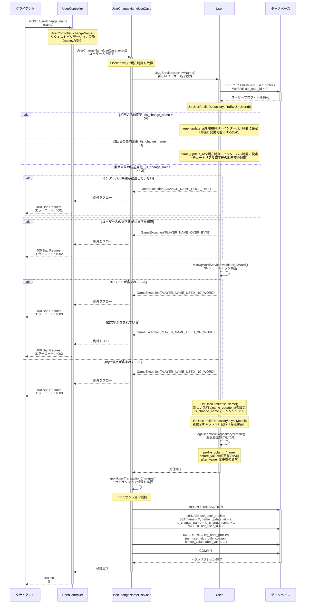

# /user/change_name シーケンス図

## 概要
- **エンドポイント**: POST /user/change_name
- **HTTPメソッド**: POST
- **機能概要**: ユーザー名を変更するAPI。初回・2回目は即座に変更可能だが、3回目以降はインターバル時間（設定値）の経過が必要。NGワード・絵文字・文字数チェックを実施し、変更履歴をログに記録する。
- **認証**: 必要（auth:api ミドルウェア）
- **主要な処理**:
  - ユーザー名のバリデーション（NGワード、絵文字、4byte漢字、文字数）
  - 名前変更インターバルのチェック（3回目以降）
  - ユーザープロフィール情報の更新
  - 変更履歴のログ保存
  - トランザクション処理による一括保存

## リクエストパラメータ
| パラメータ名 | 型 | 必須 | 説明 |
|-------------|-----|------|------|
| name | string | ○ | 新しいユーザー名（最大32文字） |

## レスポンス
### 成功時（200 OK）
```json
{}
```

### エラー時
- **400 Bad Request**: バリデーションエラー（nameパラメータが不正）
- **401 Unauthorized**: 認証エラー
- **4001 (CHANGE_NAME_COOL_TIME)**: 名前変更のクールタイム中
- **4002 (PLAYER_NAME_OVER_BYTE)**: ユーザー名が32文字を超過
- **4003 (PLAYER_NAME_USED_NG_WORD)**: NGワードが含まれている、または絵文字・4byte漢字が含まれている
- **500 Internal Server Error**: サーバーエラー

## シーケンス図



## 処理詳細説明

### 1. リクエスト受信とバリデーション
- `UserController::changeName()` でリクエストを受信
- Laravelの `validate()` メソッドで `name` パラメータの必須チェックを実施
- 認証済みユーザー情報を取得（`$request->user()`）

### 2. 現在時刻の取得
- `Clock::now()` でサーバーの現在時刻を取得
- この時刻を基準に名前変更インターバルの判定や、更新日時の設定を行う

### 3. ユーザープロフィール情報の取得
- `UsrUserProfileRepository::findByUsrUserId()` でユーザープロフィール情報を取得
- `usr_user_profiles` テーブルから該当ユーザーのレコードを取得

### 4. 名前変更インターバルのチェック
**初回・2回目の特別処理:**
- 初回（`is_change_name = 0`）: チュートリアル開始時に即座に名前変更できるよう、`name_update_at` を `現在時刻 - インターバル時間` に設定
- 2回目（`is_change_name = 1`）: チュートリアル完了後に即座に名前変更できるよう、同様に過去の時刻を設定

**3回目以降の処理:**
- `name_update_at + インターバル時間` が現在時刻を過ぎているかチェック
- 過ぎていない場合は `GameException(CHANGE_NAME_COOL_TIME)` をスロー
- インターバル時間は `MstConfigService::getUserNameChangeIntervalHours()` から取得

### 5. ユーザー名のバリデーション

**文字数チェック:**
- `mb_strlen($newName) > 32` の場合、`GameException(PLAYER_NAME_OVER_BYTE)` をスロー

**NGワードチェック（`MstNgWordService::validateNGWord()`）:**
- 絵文字チェック: 4byte UTF-8文字（絵文字）が含まれているか正規表現で判定
- 4byte漢字チェック: 常用ではない4byte漢字が含まれているか判定
- NGワードチェック: データベースに登録されたNGワードリストと照合
- いずれかに該当する場合、`GameException(PLAYER_NAME_USED_NG_WORD)` をスロー

### 6. ユーザープロフィール情報の更新
- `UsrUserProfile::setName()` で新しい名前と `name_update_at` を設定
- `is_change_name` フラグをインクリメント（内部で自動的に実施）
- `UsrUserProfileRepository::syncModel()` で変更をキャッシュに記録（実際のDB更新は遅延実行）

### 7. 変更履歴のログ保存
- `LogUserProfileRepository::create()` で変更履歴ログを作成
- 以下の情報を記録:
  - `profile_column`: 'name'（変更したカラム名）
  - `before_value`: 変更前のユーザー名
  - `after_value`: 変更後のユーザー名
  - `usr_user_id`: ユーザーID
  - その他のメタデータ（リクエストID、ロギング番号など）

### 8. トランザクション処理
- `applyUserTransactionChanges()` でトランザクション処理を実行
- 以下の処理を一括で実行:
  1. トランザクション開始（`BEGIN TRANSACTION`）
  2. `usr_user_profiles` テーブルの更新
  3. `log_user_profiles` テーブルへの挿入
  4. トランザクションコミット（`COMMIT`）
- エラーが発生した場合は自動的にロールバック

### 9. レスポンス返却
- 空のJSONオブジェクト `{}` を返却（200 OK）

## データベース操作

### 参照テーブル
- **usr_user_profiles**: ユーザープロフィール情報（名前、名前変更日時、変更回数などを管理）
- **log_user_profiles**: ユーザープロフィール変更履歴ログ（変更前後の値を記録）

### トランザクション
- **開始ポイント**: `UseCaseTrait::applyUserTransactionChanges()` 内でトランザクション開始
- **コミット条件**: すべてのDB更新処理が正常に完了した場合
- **ロールバック条件**:
  - DB更新処理中に例外が発生した場合
  - バリデーションエラーが発生した場合（トランザクション開始前のため、ロールバック不要）

### キャッシュ管理
- `UsrUserProfileRepository` は `UsrModelSingleCacheRepository` を継承
- `syncModel()` メソッドで変更をキャッシュに記録し、トランザクション内で一括保存
- これにより、N+1問題を回避し、パフォーマンスを最適化

## エラーハンドリング

### バリデーションエラー
- **リクエストパラメータ不正**: Laravelのバリデーション機能により、`name` パラメータが未指定の場合は 400 Bad Request を返却
- **文字数超過**: 32文字を超える名前は `PLAYER_NAME_OVER_BYTE` エラー
- **NGワード**: 絵文字、4byte漢字、登録済みNGワードが含まれている場合は `PLAYER_NAME_USED_NG_WORD` エラー

### ビジネスロジックエラー
- **クールタイム中**: 3回目以降の名前変更で、インターバル時間が経過していない場合は `CHANGE_NAME_COOL_TIME` エラー
- **ユーザー未登録**: ユーザープロフィール情報が存在しない場合は `USER_NOT_FOUND` エラー（通常は発生しない）

### システムエラー
- **DB接続エラー**: データベース接続に失敗した場合は 500 Internal Server Error
- **トランザクションエラー**: トランザクション処理中にエラーが発生した場合は自動的にロールバックし、500 Internal Server Error を返却

## 備考

### 名前変更インターバルの仕様
- **1回目**: インターバル時間を無視して即座に変更可能（チュートリアル開始時の名前設定）
- **2回目**: インターバル時間を無視して即座に変更可能（チュートリアル完了後の名前変更）
- **3回目以降**: `name_update_at` から指定されたインターバル時間が経過している必要がある

この仕様により、チュートリアル中のユーザー体験を損なわずに、スパムや不正行為を防止しています。

### NGワードチェックの詳細
`MstNgWordService::validateNGWord()` では以下のチェックを実施:
1. **絵文字チェック**: 4byte UTF-8文字（`\xF0-\xF7`で始まる文字）を検出
2. **4byte漢字チェック**: 常用外の4byte漢字を検出
3. **NGワードリストチェック**: データベースに登録されたNGワードと照合

いずれかに該当する場合、同じエラーコード（`PLAYER_NAME_USED_NG_WORD`）を返却します。

### 遅延保存の仕組み
- `UsrModelSingleCacheRepository` を使用することで、複数のDB操作を一括で実行
- `syncModel()` で変更をキャッシュに記録し、`applyUserTransactionChanges()` 内で一括保存
- これにより、トランザクション内のDB接続回数を削減し、パフォーマンスを向上

### セキュリティ考慮事項
- 認証必須（`auth:api` ミドルウェア）により、未認証ユーザーはアクセス不可
- `block_multiple_access` ミドルウェアにより、同時アクセスを制御
- `user_status_check` ミドルウェアにより、BANされたユーザーはアクセス不可
