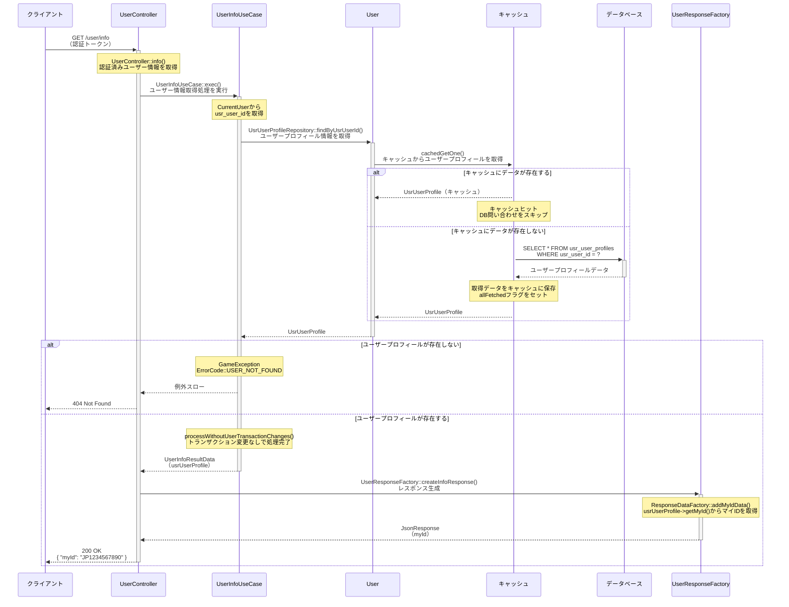

# /user/info シーケンス図

## 概要
- **エンドポイント**: GET /user/info
- **HTTPメソッド**: GET
- **機能概要**: ログイン中のユーザーのマイID情報を取得する
- **認証**: 必要
- **主要な処理**: ユーザープロフィール情報からマイIDを取得してレスポンスとして返却

## リクエストパラメータ
| パラメータ名 | 型 | 必須 | 説明 |
|-------------|-----|------|------|
| なし | - | - | 認証トークンからユーザー情報を取得 |

## レスポンス
### 成功時（200 OK）
```json
{
  "myId": "JP1234567890"
}
```

### エラー時
- 401 Unauthorized: 認証エラー
- 404 Not Found: ユーザー情報が見つからない（USER_NOT_FOUND）
- 500 Internal Server Error: サーバーエラー

## シーケンス図



## 処理詳細説明

### 1. 認証とユーザー情報取得
- エンドポイントは認証ミドルウェア（`user_status_check`、`client_version_check`、`asset_version_check`、`master_version_check`、`cross_day_check`）を通過後に実行される
- `$request->user()`で認証済みユーザー（`CurrentUser`）を取得

### 2. ユーザープロフィール取得処理
- `UsrUserProfileRepository::findByUsrUserId()`を呼び出し、ユーザープロフィール情報を取得
- 内部で`UsrModelSingleCacheRepository::cachedGetOne()`を使用し、キャッシュ機構を活用
  - 1ユーザーあたり最大1レコードのテーブルであるため、`UsrModelSingleCacheRepository`を継承
  - 自分のデータの場合、キャッシュから取得（キャッシュヒット時はDB問い合わせなし）
  - 他人のデータの場合は毎回DBから取得
  - キャッシュにデータがない場合は`dbSelectOne()`でDBから取得し、キャッシュに保存

### 3. データベース取得
- テーブル: `usr_user_profiles`
- クエリ: `SELECT * FROM usr_user_profiles WHERE usr_user_id = ?`
- プライマリーキー: `usr_user_id`
- ユニークキー: `my_id`

### 4. エラーハンドリング
- ユーザープロフィールが見つからない場合、`GameException`（`ErrorCode::USER_NOT_FOUND`）をスロー
- 認証エラーの場合は、ミドルウェアで401 Unauthorizedを返却

### 5. レスポンス生成
- `UserResponseFactory::createInfoResponse()`でレスポンスを生成
- `ResponseDataFactory::addMyIdData()`を使用し、`UsrUserProfile::getMyId()`からマイIDを取得
- レスポンスには`myId`のみを含む

## データベース操作

### 参照テーブル
- `usr_user_profiles`: ユーザープロフィール情報（マイID、名前、アバター、エンブレム等）

### トランザクション
- このエンドポイントではトランザクションは使用されない（読み取り専用）
- `processWithoutUserTransactionChanges()`により、トランザクション変更なしで処理が完了

### キャッシュ機構
- `UsrModelSingleCacheRepository`を使用したキャッシュ機構
- 初回DB取得後、キャッシュに保存し、2回目以降はキャッシュから取得
- `allFetched`フラグにより、1度取得済みであればDBアクセスをスキップ
- 1ユーザーあたり最大1レコードのテーブルであるため、効率的にキャッシュ管理

## エラーハンドリング

### バリデーションエラー
- リクエストパラメータがないため、バリデーションエラーは発生しない

### ビジネスロジックエラー
- **USER_NOT_FOUND**: ユーザープロフィールが存在しない場合（通常発生しない想定）

### システムエラー
- データベース接続エラー等の場合は500 Internal Server Errorを返却

## 備考
- このエンドポイントは非常にシンプルで、マイIDのみを返却する
- キャッシュ機構により、2回目以降のアクセスはDB問い合わせが不要
- `my_id`はユーザープロフィール作成時に自動生成される（例: `JP1234567890`）
- マイIDの形式: リージョンプレフィックス（JP）+ 10桁のランダム数字
