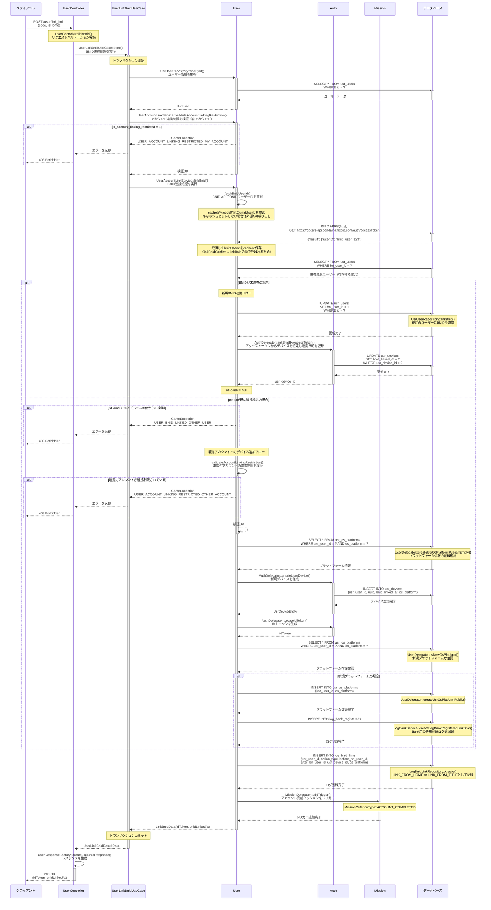

# /user/link_bnid シーケンス図

## 概要
- **エンドポイント**: `/user/link_bnid`
- **HTTPメソッド**: POST
- **機能概要**: ユーザーアカウントにBandai Namco ID（BNID）を連携する。未連携の場合は新規連携、既に連携済みのBNIDの場合は既存アカウントへのデバイス追加を行う。
- **認証**: 必要
- **主要な処理**:
  - BNID APIを使用してBNIDユーザーIDを取得
  - 未連携の場合: BNID連携情報を登録し、現在のデバイスに連携日時を記録
  - 既に連携済みの場合: 既存アカウントに新規デバイスを追加し、IDトークンを発行
  - アカウント連携制限の検証
  - BNID連携ログの記録
  - アカウント完成ミッションのトリガー

## リクエストパラメータ
| パラメータ名 | 型 | 必須 | 説明 |
|-------------|-----|------|------|
| code | string | Yes | BNID認証コード |
| isHome | boolean | Yes | ホーム画面からの呼び出しか（true: ホーム画面、false: タイトル画面） |

### ヘッダー
| ヘッダー名 | 型 | 必須 | 説明 |
|------------|-----|------|------|
| X-Access-Token | string | Yes | アクセストークン |
| X-Platform | string | Yes | プラットフォーム情報（iOS/Android等） |

## レスポンス
### 成功時（200 OK）
```json
{
  "idToken": "eyJhbGciOiJIUzI1NiIsInR5cCI6IkpXVCJ9...",
  "bnidLinkedAt": "2025-01-15T12:34:56.000000Z"
}
```

**フィールド説明**:
- `idToken`: 既存アカウントへの連携時に発行されるIDトークン（未連携の新規連携時はnull）
- `bnidLinkedAt`: BNID連携日時（ISO8601形式）

### エラー時
- **400 Bad Request**: バリデーションエラー
- **401 Unauthorized**: 認証エラー
- **403 Forbidden**: アカウント連携制限エラー
  - `USER_ACCOUNT_LINKING_RESTRICTED_MY_ACCOUNT`: 自アカウントが連携制限されている
  - `USER_ACCOUNT_LINKING_RESTRICTED_OTHER_ACCOUNT`: 連携先アカウントが連携制限されている
  - `USER_BNID_LINKED_OTHER_USER`: 既に他のユーザーに連携されているBNID（ホーム画面からの操作時のみ）
- **500 Internal Server Error**: BNID APIエラーやシステムエラー

## シーケンス図



## 処理詳細説明

### 1. リクエスト受信とバリデーション
- `UserController::linkBnid()`でリクエストパラメータを検証
- 必須パラメータ: `code`（BNID認証コード）、`isHome`（呼び出し元画面の判定）
- ヘッダーから`X-Access-Token`、`X-Platform`、クライアントIPアドレスを取得

### 2. UseCaseでのトランザクション管理
- `UseCaseTrait::applyUserTransactionChanges()`により、usrデータベースのトランザクション境界を設定
- 処理中にエラーが発生した場合は自動的にロールバック

### 3. アカウント連携制限の検証（自アカウント）
- `UsrUserRepository::findById()`で現在のユーザー情報を取得
- `UserAccountLinkService::validateAccountLinkingRestriction()`で`is_account_linking_restricted`フラグを確認
- 制限されている場合は`USER_ACCOUNT_LINKING_RESTRICTED_MY_ACCOUNT`エラーを返却

### 4. BNID APIを使用したBNIDユーザーID取得
- `UserAccountLinkService::fetchBnidUserId()`が実行される
- まず、Redisキャッシュから`code`に対応する`bnidUserId`を検索（`linkBnidConfirm`で事前キャッシュされている想定）
- キャッシュヒットしない場合は、BNID API（`https://cp-sys-api.bandainamcoid.com/auth/accessToken`）を呼び出し
- 取得した`bnidUserId`をキャッシュに保存（次回のリクエストで再利用）
- API呼び出し失敗時は`USER_BNID_ACCESS_TOKEN_API_ERROR`エラーを返却

### 5. BNID連携状態の判定

#### 5-1. 未連携の場合（新規連携フロー）
- `UsrUserRepository::linkBnid()`で`usr_users.bn_user_id`を更新
- `AuthDelegator::linkBnidByAccessToken()`でアクセストークンから現在のデバイスを特定し、`usr_devices.bnid_linked_at`に現在日時を記録
- `idToken`はnull（新規デバイス追加ではないため）

#### 5-2. 既に連携済みの場合（既存アカウントへのデバイス追加フロー）
- `isHome = true`（ホーム画面からの操作）の場合は`USER_BNID_LINKED_OTHER_USER`エラーを返却
  - ホーム画面からは他のアカウントへの連携はできない仕様
- タイトル画面からの操作（`isHome = false`）の場合は、既存アカウントへのデバイス追加を実行

##### 連携先アカウントの検証
- `validateAccountLinkingRestriction()`で連携先アカウントの`is_account_linking_restricted`を確認
- 制限されている場合は`USER_ACCOUNT_LINKING_RESTRICTED_OTHER_ACCOUNT`エラーを返却

##### デバイス追加処理
- `UserDelegator::createUsrOsPlatformPublicIfEmpty()`で`usr_os_platforms`にプラットフォーム情報が未登録の場合は登録
- `AuthDelegator::createUserDevice()`で新規デバイスを`usr_devices`に登録
  - `usr_user_id`: 連携先ユーザーID
  - `uuid`: 新規生成
  - `bnid_linked_at`: 現在日時
  - `os_platform`: リクエストヘッダーから取得
- `AuthDelegator::createIdToken()`でIDトークンを生成（クライアント側で認証トークンとして使用）

##### 新規プラットフォームの場合の追加処理
- `UserDelegator::isNewOsPlatform()`で、連携先ユーザーにとって新規プラットフォームか確認
- 新規プラットフォームの場合:
  - `UserDelegator::createUsrOsPlatformPublic()`で`usr_os_platforms`に登録
  - `LogBankService::createLogBankRegisteredLinkBnid()`で`log_bank_registereds`にBank用の新規登録ログを記録

### 6. BNID連携ログの記録
- `LogBnidLinkRepository::create()`で`log_bnid_links`テーブルに連携ログを記録
- `action_type`:
  - `LINK_FROM_HOME`: ホーム画面からの連携
  - `LINK_FROM_TITLE`: タイトル画面からの連携
- `before_bn_user_id`: 連携前のBNIDユーザーID（既存アカウント連携時のみ）
- `after_bn_user_id`: 連携後のBNIDユーザーID
- `usr_device_id`: 連携したデバイスID
- `os_platform`: プラットフォーム情報

### 7. ミッショントリガーの追加
- `MissionDelegator::addTrigger()`でアカウント完成ミッション（`ACCOUNT_COMPLETED`）をトリガー
- BNID連携完了により、アカウント完成扱いとなる

### 8. レスポンス生成
- `LinkBnidData`を生成し、`UserLinkBnidResultData`にラップ
- `UserResponseFactory::createLinkBnidResponse()`でJSON形式のレスポンスを生成
  - `idToken`: 既存アカウント連携時のみ設定（新規連携時はnull）
  - `bnidLinkedAt`: BNID連携日時（ISO8601形式）

## データベース操作

### 参照テーブル
- **usr_users**: ユーザー情報（BNID連携情報を含む）
  - `id`: ユーザーID
  - `bn_user_id`: BNIDユーザーID
  - `is_account_linking_restricted`: アカウント連携制限フラグ
- **usr_devices**: デバイス情報
  - `usr_user_id`: ユーザーID
  - `uuid`: デバイスUUID
  - `bnid_linked_at`: BNID連携日時
  - `os_platform`: プラットフォーム情報
- **usr_os_platforms**: ユーザーのプラットフォーム情報
  - `usr_user_id`: ユーザーID
  - `os_platform`: プラットフォーム情報
- **log_bnid_links**: BNID連携ログ
  - `usr_user_id`: ユーザーID
  - `action_type`: 連携アクション種別
  - `before_bn_user_id`: 連携前BNIDユーザーID
  - `after_bn_user_id`: 連携後BNIDユーザーID
  - `usr_device_id`: デバイスID
  - `os_platform`: プラットフォーム情報
- **log_bank_registereds**: Bank用新規登録ログ（新規プラットフォーム追加時のみ）

### トランザクション
- **開始ポイント**: `UserLinkBnidUseCase::exec()`の`applyUserTransactionChanges()`内
- **コミット条件**: BNID連携処理が正常に完了した場合
- **ロールバック条件**:
  - アカウント連携制限エラー
  - BNID API呼び出し失敗
  - データベース操作エラー
  - その他の例外発生時

## エラーハンドリング

### バリデーションエラー
- `code`、`isHome`パラメータが不正な場合
- リクエストヘッダー（`X-Access-Token`、`X-Platform`）が不足している場合

### ビジネスロジックエラー
- **USER_ACCOUNT_LINKING_RESTRICTED_MY_ACCOUNT**: 自アカウントが連携制限されている
  - `usr_users.is_account_linking_restricted = 1`の場合
- **USER_ACCOUNT_LINKING_RESTRICTED_OTHER_ACCOUNT**: 連携先アカウントが連携制限されている
  - 既存アカウント連携時に、連携先の`usr_users.is_account_linking_restricted = 1`の場合
- **USER_BNID_LINKED_OTHER_USER**: 既に他のユーザーに連携されているBNID
  - `isHome = true`かつ既に連携済みのBNIDの場合
- **USER_BNID_ACCESS_TOKEN_API_ERROR**: BNID API呼び出し失敗
  - 外部APIへのリクエストが失敗した場合（ステータスコード4xx/5xx）

### システムエラー
- データベース接続エラー
- トランザクションエラー
- 予期しない例外

## 備考

### BNID連携の2つのフロー
1. **新規連携フロー**: BNIDが未連携の場合、現在のユーザーにBNIDを紐づける
2. **既存アカウント連携フロー**: BNIDが既に連携済みの場合、既存アカウントに新規デバイスを追加し、IDトークンを発行してクライアント側で既存アカウントにログインする

### isHomeパラメータの役割
- `isHome = true`（ホーム画面）: 新規連携のみ許可。既存アカウント連携はエラー
- `isHome = false`（タイトル画面）: 新規連携と既存アカウント連携の両方を許可

### BNID APIキャッシュの役割
- `linkBnidConfirm`→`linkBnid`の順で呼ばれる想定のため、BNID API呼び出し結果をRedisキャッシュに保存
- 同一の`code`で複数回API呼び出しを行わないように効率化

### アカウント連携制限
- `usr_users.is_account_linking_restricted`フラグにより、特定ユーザーのアカウント連携を制限可能
- 自アカウント・連携先アカウントの両方で制限チェックを実施

### ミッションシステムとの連携
- BNID連携完了により、`ACCOUNT_COMPLETED`ミッションをトリガー
- ミッション達成による報酬付与は、ミッションシステム側で処理される
