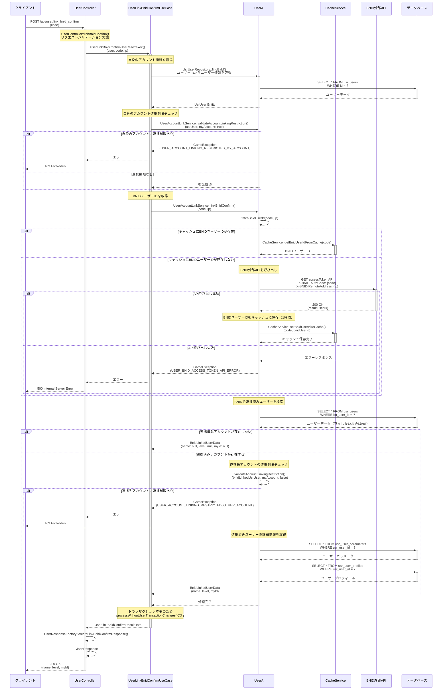

# BNID連携確認API シーケンス図

## 概要
- **エンドポイント**: POST /api/user/link_bnid_confirm
- **HTTPメソッド**: POST
- **機能概要**: BNID（バンダイナムコID）と連携可能なアカウントを確認するAPI。認証コードからBNIDユーザーIDを取得し、既に連携済みのユーザー情報を返却する。連携済みアカウントが存在しない場合はnullを返す。
- **認証**: 必要（ユーザー認証トークン）
- **主要な処理**:
  1. 認証コードからBNIDユーザーIDを取得（外部API呼び出し or キャッシュ）
  2. BNIDユーザーIDで既存ユーザーを検索
  3. 連携済みアカウントが存在する場合、そのユーザー情報を返却

## リクエストパラメータ
| パラメータ名 | 型 | 必須 | 説明 |
|-------------|-----|------|------|
| code | string | ○ | BNID認証コード |

## レスポンス
### 成功時（200 OK）

#### パターン1: 連携済みアカウントが存在しない場合
```json
{
  "name": null,
  "level": null,
  "myId": null
}
```

#### パターン2: 連携済みアカウントが存在する場合
```json
{
  "name": "プレイヤー名",
  "level": 50,
  "myId": "ABC123XYZ"
}
```

### エラー時
- 400 Bad Request: バリデーションエラー（codeが未指定）
- 401 Unauthorized: 認証エラー
- 403 Forbidden:
  - `USER_ACCOUNT_LINKING_RESTRICTED_MY_ACCOUNT`: 自身のアカウントに連携制限がかかっている
  - `USER_ACCOUNT_LINKING_RESTRICTED_OTHER_ACCOUNT`: 連携先アカウントに連携制限がかかっている
- 500 Internal Server Error:
  - `USER_BNID_ACCESS_TOKEN_API_ERROR`: BNID外部API呼び出しエラー
  - その他システムエラー

## シーケンス図



## 処理詳細説明

### 1. リクエスト受信とバリデーション
- `UserController::linkBnidConfirm()` がリクエストを受け取る
- `code` パラメータの必須チェック
- 現在ログイン中のユーザー情報（`$request->user()`）とクライアントIPアドレスを取得

### 2. 自身のアカウント連携制限チェック
- `UsrUserRepository::findById()` で自身のユーザー情報を取得
- `usr_users` テーブルの `is_account_linking_restricted` フラグをチェック
- 連携制限がある場合は `USER_ACCOUNT_LINKING_RESTRICTED_MY_ACCOUNT` エラー

### 3. BNIDユーザーIDの取得
- まず `CacheService::getBnidUserIdFromCache()` でキャッシュを確認
- キャッシュにない場合、BNID外部API（`https://cp-sys-api.bandainamcoid.com/auth/accessToken`）を呼び出し
- APIリクエストには以下のヘッダーを付与:
  - `X-BNID-RemoteAddress`: クライアントIPアドレス
  - `X-BNID-ClientID`: 環境変数から取得
  - `X-BNID-ClientSecret`: 環境変数から取得
  - `X-BNID-AuthCode`: リクエストパラメータの `code`
- 取得したBNIDユーザーIDは1時間キャッシュに保存（`linkBnidConfirm` → `linkBnid` の順で呼ばれるため）

### 4. 連携済みユーザーの検索
- `UsrUserPublicRepository::getByBnUserId()` でBNIDユーザーIDに紐づくユーザーを検索
- `usr_users` テーブルの `bn_user_id` カラムで検索

### 5. 連携済みユーザー情報の取得（存在する場合）
- 連携先アカウントの連携制限チェック（`is_account_linking_restricted` フラグ）
- 連携制限がある場合は `USER_ACCOUNT_LINKING_RESTRICTED_OTHER_ACCOUNT` エラー
- `usr_user_parameters` テーブルから `level` を取得
- `usr_user_profiles` テーブルから `name` と `my_id` を取得

### 6. レスポンス生成
- `BnidLinkedUserData` を生成
  - 連携済みアカウントがない場合: すべて `null`
  - 連携済みアカウントがある場合: `name`, `level`, `myId` を設定
- `UserResponseFactory::createLinkBnidConfirmResponse()` でJSONレスポンスを生成

## データベース操作

### 参照テーブル
- `usr_users`: ユーザー基本情報の取得、BNIDユーザーIDによる検索
  - 自身のユーザー情報取得（`id` で検索）
  - 連携済みユーザー検索（`bn_user_id` で検索）
  - 連携制限フラグ確認（`is_account_linking_restricted`）
- `usr_user_parameters`: 連携済みユーザーのレベル情報取得
- `usr_user_profiles`: 連携済みユーザーの名前とマイID情報取得

### トランザクション
- このAPIはデータ参照のみのため、トランザクション不要
- `processWithoutUserTransactionChanges()` を実行してトランザクション処理をスキップ

### インデックス
- `usr_users.id`: PRIMARY KEY
- `usr_users.bn_user_id`: INDEX（MUL）- 連携済みユーザー検索で使用

## エラーハンドリング

### バリデーションエラー
- `code` パラメータが未指定の場合、400 Bad Requestを返却
- Laravel標準のバリデーション機能を使用

### ビジネスロジックエラー

#### 自身のアカウントに連携制限がある
- エラーコード: `USER_ACCOUNT_LINKING_RESTRICTED_MY_ACCOUNT`
- HTTPステータス: 403 Forbidden
- 発生条件: `usr_users.is_account_linking_restricted = 1`（自身のアカウント）

#### 連携先アカウントに連携制限がある
- エラーコード: `USER_ACCOUNT_LINKING_RESTRICTED_OTHER_ACCOUNT`
- HTTPステータス: 403 Forbidden
- 発生条件: `usr_users.is_account_linking_restricted = 1`（連携先アカウント）

### システムエラー

#### BNID外部API呼び出しエラー
- エラーコード: `USER_BNID_ACCESS_TOKEN_API_ERROR`
- HTTPステータス: 500 Internal Server Error
- 発生条件:
  - BNID外部APIがエラーレスポンスを返却
  - ネットワークエラー
  - 認証情報（ClientID/ClientSecret）が不正

## 備考

### キャッシュ戦略
- BNIDユーザーIDは1時間キャッシュされる
- 通常のフロー: `linkBnidConfirm` → `linkBnid` の順で呼ばれるため、2回目のAPI呼び出しを省略できる
- キャッシュキー: `CacheKeyUtil::getBnidUserIdKey(code)` で生成

### テスト環境での動作
- 環境変数 `APP_ENV=local_test` の場合、BNID外部APIを呼び出さず `dummy_user_id` を返却
- テスト実行時のAPI依存を排除

### 連携制限機能
- `is_account_linking_restricted` フラグは不正行為防止やサポート対応のために使用
- 自身のアカウントと連携先アカウントの両方をチェック
- 制限されている場合、連携確認も連携処理もできない

### 外部API依存
- このAPIはBNID外部API（`https://cp-sys-api.bandainamcoid.com/auth/accessToken`）に依存
- 外部APIの可用性がこのエンドポイントの成否に影響
- キャッシュにより、同一コードの連続呼び出しでは外部API呼び出しを削減

### セキュリティ考慮事項
- クライアントIPアドレスをBNID外部APIに送信（不正アクセス防止）
- 認証コード（`code`）は使い捨てを想定
- 認証済みユーザーのみがアクセス可能（ミドルウェアで制御）
