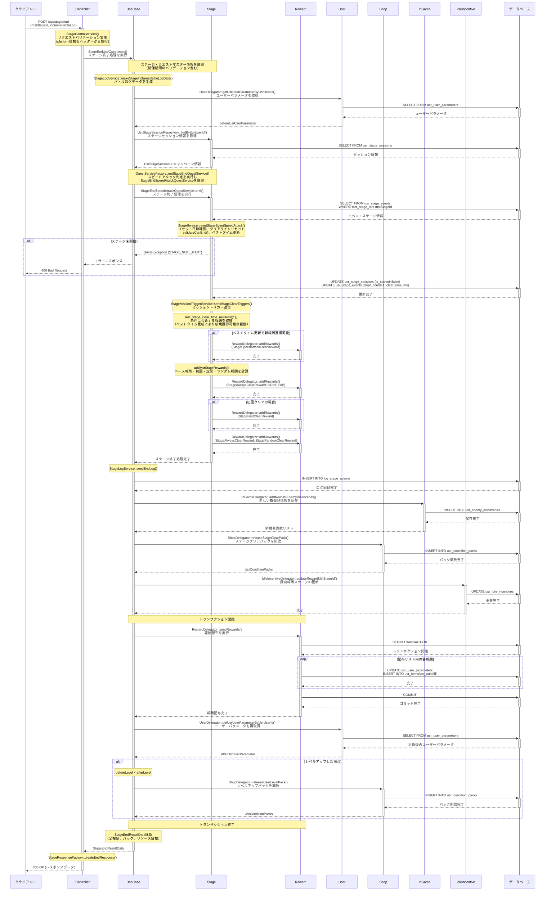

# ステージ終了 (スピードアタッククエスト) シーケンス図

## 概要
- **エンドポイント**: `POST /api/stage/end`
- **HTTPメソッド**: POST
- **機能概要**: スピードアタッククエストのステージ終了処理を行い、クリアタイム報酬を含む各種報酬を配布する
- **認証**: 必要
- **主要な処理**:
  - ステージクリア処理
  - スピードアタック専用のクリアタイム報酬配布
  - 通常報酬（経験値、コイン、アイテム等）の配布
  - ユーザーレベルアップ処理
  - 原画・原画のかけら獲得

## リクエストパラメータ
| パラメータ名 | 型 | 必須 | 説明 |
|-------------|-----|------|------|
| mstStageId | string | ○ | ステージマスターID |
| inGameBattleLog | array | ○ | ゲーム内バトルログ（クリアタイム、発見した敵情報等を含む） |

## レスポンス
### 成功時（200 OK）
```json
{
  "userLevelUp": {
    "beforeExp": 1000,
    "afterExp": 1500,
    "rewards": []
  },
  "stageAlwaysClearRewards": [],
  "stageRandomClearRewards": [],
  "stageFirstClearRewards": [],
  "stageSpeedAttackClearRewards": [
    {
      "resourceType": "diamond",
      "resourceId": null,
      "resourceAmount": 50,
      "mstStageId": "stage_001",
      "mstStageClearTimeRewardId": "clear_time_reward_001"
    }
  ],
  "usrConditionPacks": [],
  "usrArtworks": [],
  "usrArtworkFragments": [],
  "usrItems": [],
  "usrUnits": [],
  "usrEnemyDiscoveries": [],
  "oprCampaignIds": []
}
```

### エラー時
- 401 Unauthorized: 認証エラー
- 400 Bad Request: バリデーションエラー
- 500 Internal Server Error: サーバーエラー

## シーケンス図



## 処理詳細説明

### 1. リクエストバリデーションと初期処理
- **Controller**: `StageController::end()`
  - リクエストパラメータ（mstStageId、inGameBattleLog）をバリデーション
  - platformヘッダー情報を取得
- **UseCase**: マスターデータ取得とバトルログ生成
  - ステージマスター情報とクエストマスター情報を取得（開催期間のバリデーション含む）
  - クエストタイプ（NORMAL/EVENT/ENHANCE）を判定
  - バトルログデータを生成（クリアタイム、発見した敵情報等を構造化）

### 2. ユーザー情報とセッション情報の取得
- **User**: `UserDelegator::getUsrUserParameterByUsrUserId()`
  - ユーザーパラメータ（経験値、レベル）を取得してレベルアップ判定用に保存
- **Stage**: `UsrStageSessionRepository::findByUsrUserId()`
  - ステージセッション情報を取得（パーティNo、開始状態、キャンペーンID等）

### 3. スピードアタッククエスト判定と専用サービス取得
- **Stage**: `QuestServiceFactory::getStageEndQuestService()`、`StageService::isSpeedAttack()`
  - 特殊ルール（mst_in_game_special_rules）からスピードアタック判定を実行
  - スピードアタックの場合は`StageEndSpeedAttackQuestService`を返却

### 4. スピードアタック専用処理
#### 4.1 ベストタイムリセット処理
- **Stage**: `UsrStageEventRepository::findByMstStageIds()`、`StageService::resetStageEventSpeedAttack()`
  - イベントステージ情報（`usr_stage_events`）を取得
  - リセット日時を確認し、リセットが必要な場合はクリアタイムをリセット

#### 4.2 クリアタイム更新
- ベストタイム更新前のクリアタイム（`beforeClearTimeMs`）を保存
- 新しいクリアタイムを`clear_time_ms`と`reset_clear_time_ms`に設定

### 5. ステージクリア処理
- **Stage**: `UsrStageSessionRepository::syncModel()`、`UsrStageEventRepository::syncModel()`
  - ステージセッションをクローズ（`is_started = false`）
  - クリア回数をインクリメント（`clear_count + 1`）、クリアタイムを更新
- **Stage**: `StageMissionTriggerService::sendStageClearTriggers()`
  - ミッショントリガーを送信（デイリーミッション、イベントミッション等）

### 6. スピードアタッククリアタイム報酬配布
- **Stage**: クリアタイム報酬判定
  - マスターデータ（mst_stage_clear_time_rewards）から該当する報酬を判定
  - 条件: `clearTimeMs <= upper_clear_time_ms AND beforeClearTimeMs > upper_clear_time_ms`
- **Reward**: `RewardDelegator::addRewards()`
  - ベストタイム更新により新しく獲得可能になった報酬のみを配布リストに追加
  - 報酬タイプ: `StageSpeedAttackClearReward`

### 7. 通常ステージ報酬配布
- **Stage**: `StageEndSpeedAttackQuestService::addMstStageRewards()`
  - **ベース報酬**: 経験値、コイン（キャンペーン倍率を適用）
  - **初回クリア報酬**: ステージ初クリア時のみ（`StageFirstClearReward`）
  - **定常クリア報酬**: 毎回配布（`StageAlwaysClearReward`）
  - **ランダムクリア報酬**: 確率抽選（`StageRandomClearReward`）

### 8. 関連機能の更新
- **UseCase**: `StageLogService::sendEndLog()`
  - ステージアクションログを`log_stage_actions`テーブルに記録
- **InGame**: `InGameDelegator::addNewUsrEnemyDiscoveries()`
  - 新しく発見した敵を`usr_enemy_discoveries`に保存
- **Shop**: `ShopDelegator::releaseStageClearPack()`
  - 条件達成パックを開放
- **IdleIncentive**: `IdleIncentiveDelegator::updateRewardMstStageId()`
  - 探索報酬のステージIDを更新

### 9. トランザクション処理（報酬配布とレベルアップ）
- **Reward**: `RewardDelegator::sendRewards()`
  - トランザクション開始
  - 配布リスト内の全報酬を順次配布
    - 経験値、コイン、ダイヤ等のパラメータ加算
    - アイテム、ユニット等の付与
  - トランザクションコミット
- **User**: `UserDelegator::getUsrUserParameterByUsrUserId()`
  - ユーザーパラメータを再取得してレベルアップを確認
- **Shop**: `ShopDelegator::releaseUserLevelPack()`
  - レベルアップした場合はレベルアップパックを開放

### 10. レスポンスデータ構築
- **UseCase**: `StageEndResultData`構築
  - ユーザーレベルアップ情報（レベルアップ前後の経験値、レベルアップ報酬）
  - 各種報酬情報（定常、ランダム、初回、スピードアタッククリアタイム報酬）
  - 開放されたパック情報
  - 更新されたリソース情報（原画、原画のかけら、アイテム、ユニット）
  - 新規発見敵情報
  - 適用されたキャンペーンID
- **Controller**: `StageResponseFactory::createEndResponse()`
  - JSONレスポンスを生成

## データベース操作

### 参照テーブル
- `mst_stages`: ステージマスター情報（経験値、コイン、報酬設定等）
- `mst_quests`: クエストマスター情報（クエストタイプ、開催期間等）
- `mst_in_game_special_rules`: ゲーム内特殊ルール（スピードアタック判定用）
- `mst_stage_clear_time_rewards`: スピードアタッククリアタイム報酬マスター
- `mst_stage_rewards`: ステージ報酬マスター（初回・定常・ランダム報酬）
- `mst_stage_event_rewards`: イベントステージ報酬マスター
- `usr_user_parameters`: ユーザーパラメータ（経験値、レベル、コイン、ダイヤ等）
- `usr_stage_sessions`: ステージセッション情報
- `usr_stage_events`: イベントステージ情報（クリア回数、クリアタイム、リセットクリアタイム）
- `usr_enemy_discoveries`: 敵発見情報
- `usr_condition_packs`: 条件達成パック情報
- `usr_idle_incentives`: 探索報酬情報
- `log_stage_actions`: ステージアクションログ

### トランザクション
- **開始ポイント**: 報酬配布処理開始時（`RewardDelegator::sendRewards`）
- **コミット条件**: 全報酬配布とレベルアップパック開放が正常完了
- **ロールバック条件**: 報酬配布やレベルアップパック開放で例外発生時

### スピードアタック特有の処理
- `usr_stage_events`テーブルの`clear_time_ms`と`reset_clear_time_ms`を更新
- `mst_stage_clear_time_rewards`から条件に合致する報酬を取得
- ベストタイム更新時のみ新しい報酬を配布

## エラーハンドリング

### バリデーションエラー
- **STAGE_NOT_START**: ステージが開始されていない、またはステージ情報が取得できない
- リクエストパラメータの型・必須チェックエラー

### ビジネスロジックエラー
- **QUEST_TYPE_NOT_FOUND**: クエストタイプが不正（NORMAL/EVENT/ENHANCE以外）
- ステージ開催期間外のアクセス
- クエスト開催期間外のアクセス

### システムエラー
- データベース接続エラー
- トランザクション処理中の例外
- 外部サービス（ログ送信等）のエラー

## 備考

### スピードアタッククエストの特徴
1. **クリアタイムのリセット機構**
   - 特定の周期（日次、週次等）でベストタイムがリセットされる
   - リセット後は再度報酬獲得のチャンスがある

2. **クリアタイム報酬の配布条件**
   - ベストタイム更新時のみ報酬を獲得
   - `beforeClearTimeMs > upper_clear_time_ms >= clearTimeMs`の条件を満たす報酬のみ配布
   - 同一周期内に同じ報酬を複数回獲得することはできない

3. **通常のイベントクエストとの違い**
   - 親クラス`StageEndEventQuestService`を継承
   - スピードアタック専用のクリアタイム報酬配布処理を追加
   - その他の報酬配布ロジックは通常イベントクエストと同じ

### ドメイン間の連携
- **Stage**: ステージ関連の全処理（Service、Repository含む）を担当
- **Reward**: 報酬配布処理を担当
- **User**: ユーザー情報管理を担当
- **Shop**: パック開放処理を担当
- **InGame**: ゲーム内コンテンツ（敵発見等）を担当
- **IdleIncentive**: 探索報酬管理を担当

### キャンペーン機能
- 経験値、コイン、アイテムドロップ量、原画のかけらドロップ率に倍率を適用
- キャンペーン情報はステージセッション開始時に保存され、終了時に適用
- 複数キャンペーンの同時適用が可能

### レベルアップ処理
- 報酬配布後に経験値が加算され、レベルアップする可能性がある
- レベルアップ時は追加でレベルアップパックを開放
- レベルアップ報酬も別途配布される

### 原画・原画のかけら
- ステージに原画のかけらドロップ設定がある場合のみ処理
- ドロップ抽選により原画のかけらを獲得
- 一定数の原画のかけらが集まると原画が解放される
