# ダイヤモンドでスタミナ購入 シーケンス図

## 概要
- **エンドポイント**: `/user/buy_stamina_diamond`
- **HTTPメソッド**: POST
- **機能概要**: ダイヤモンドを消費してスタミナを購入する機能
- **認証**: 必要
- **主要な処理**:
  - ダイヤモンド消費処理（無償→有償の順）
  - スタミナの回復と加算
  - ユーザーパラメータの更新

## リクエストパラメータ
| パラメータ名 | 型 | 必須 | 説明 |
|-------------|-----|------|------|
| なし | - | - | リクエストボディは不要 |

### リクエストヘッダー
| ヘッダー名 | 型 | 必須 | 説明 |
|-------------|-----|------|------|
| Platform | int | ○ | プラットフォーム識別子（iOS/Android等） |
| Billing-Platform | string | ○ | 課金プラットフォーム識別子 |
| Authorization | string | ○ | 認証トークン |

## レスポンス
### 成功時（200 OK）
```json
{
  "stamina": 150,
  "staminaUpdatedAt": "2025-11-20T12:34:56+00:00",
  "level": 25,
  "exp": 12345,
  "coin": 10000,
  "dailyBuyStaminaAdCount": 0,
  "dailyBuyStaminaAdAt": null
}
```

### エラー時
- **400 Bad Request**: バリデーションエラー
- **401 Unauthorized**: 認証エラー
- **422 Unprocessable Entity**: ビジネスロジックエラー
  - `USER_STAMINA_FULL`: スタミナが既に最大値に達している
  - `USER_STAMINA_EXCEEDS_LIMIT`: 購入によってシステム上限を超える
  - `LACK_OF_RESOURCES`: ダイヤモンドが不足している
- **500 Internal Server Error**: サーバーエラー

## シーケンス図

```mermaid
sequenceDiagram
    participant Client as クライアント
    participant Controller as UserController
    participant UseCase as UserBuyStaminaDiamondUseCase
    participant User as User
    participant Currency as Currency
    participant DB as データベース

    Client->>+Controller: POST /user/buy_stamina_diamond<br/>Header: Platform, Billing-Platform
    Note over Controller: UserController::buyStaminaDiamond()<br/>リクエストヘッダーからプラットフォーム情報を取得

    Controller->>+UseCase: UserBuyStaminaDiamondUseCase::exec()<br/>ダイヤモンドでスタミナ購入処理を実行
    Note over UseCase: 現在時刻を取得

    Note over UseCase: トランザクション開始

    UseCase->>+User: UserBuyStaminaService::buyStaminaDiamond()<br/>スタミナ購入処理

    Note over User: MstConfigから最大スタミナ比率を取得<br/>（例: 50%回復）

    User->>+User: UserBuyStaminaService::calcAddStamina()<br/>追加スタミナ量を計算

    User->>User: UserService::recoveryStamina()<br/>自然回復分を適用してスタミナを更新
    User->>+DB: SELECT * FROM usr_user_parameters<br/>WHERE usr_user_id = ?
    DB-->>-User: スタミナ情報

    Note over User: 現在スタミナを取得

    Note over User: レベル別最大スタミナを取得<br/>（MstUserLevelから）

    Note over User: ショップパス効果による追加上限を取得<br/>（ShopPassEffectDelegator）

    Note over User: 合計最大スタミナ = レベル別 + パス効果

    alt スタミナが既に最大値以上
        User-->>UseCase: エラー: USER_STAMINA_FULL
        UseCase-->>Controller: GameException
        Note over UseCase: トランザクションロールバック
        Controller-->>Client: 422 Unprocessable Entity<br/>スタミナが満タンです
    else スタミナに余裕あり
        Note over User: 追加スタミナ = 最大スタミナ × 回復率<br/>（例: 200 × 50% = 100）

        alt 購入後にシステム上限超過
            User-->>UseCase: エラー: USER_STAMINA_EXCEEDS_LIMIT
            UseCase-->>Controller: GameException
            Note over UseCase: トランザクションロールバック
            Controller-->>Client: 422 Unprocessable Entity<br/>システム上限を超えます
        else システム上限内
            User-->>-User: 追加スタミナ量（例: 100）

            Note over User: MstConfigから消費ダイヤモンド数を取得<br/>（例: 50ダイヤ）

            User->>+Currency: AppCurrencyDelegator::consumeDiamond()<br/>ダイヤモンドを消費

            Currency->>Currency: CurrencyUserService::consumeDiamond()<br/>プラットフォーム情報を変換

            Note over Currency: Platform → OsPlatform変換<br/>（例: 1 → "ios"）

            Currency->>Currency: CurrencyDelegator::useCurrency()<br/>通貨消費処理を実行

            Note over Currency: BuyStaminaTriggerをトリガーとして記録

            Currency->>+DB: SELECT * FROM usr_currency_summaries<br/>WHERE usr_user_id = ?
            DB-->>-Currency: ダイヤモンド保有情報

            alt ダイヤモンド不足
                Currency-->>User: エラー: LACK_OF_RESOURCES
                User-->>UseCase: GameException
                UseCase-->>Controller: GameException
                Note over UseCase: トランザクションロールバック
                Controller-->>Client: 422 Unprocessable Entity<br/>ダイヤモンドが不足しています
            else ダイヤモンド十分
                Note over Currency: 無償ダイヤから優先的に消費

                Currency->>+DB: UPDATE usr_currency_frees<br/>SET amount = amount - ?<br/>WHERE usr_user_id = ?
                DB-->>-Currency: 無償ダイヤ消費完了

                alt 無償だけで足りない場合
                    Currency->>+DB: UPDATE usr_currency_paids<br/>SET amount = amount - ?<br/>WHERE usr_user_id = ?
                    DB-->>-Currency: 有償ダイヤ消費完了
                end

                Currency->>+DB: INSERT INTO log_currency_frees<br/>（消費ログ記録）
                DB-->>-Currency: ログ記録完了

                Currency->>+DB: INSERT INTO log_currency_paids<br/>（消費ログ記録）
                DB-->>-Currency: ログ記録完了

                Currency->>+DB: UPDATE usr_currency_summaries<br/>SET total_free = ?, total_paid = ?
                DB-->>-Currency: サマリ更新完了

                Currency-->>-User: 通貨消費完了

                User->>+User: UserService::addStamina()<br/>スタミナを加算

                User->>+DB: UPDATE usr_user_parameters<br/>SET stamina = stamina + ?,<br/>stamina_updated_at = ?<br/>WHERE usr_user_id = ?
                DB-->>-User: スタミナ更新完了

                User->>+DB: INSERT INTO log_staminas<br/>（スタミナ変動ログ記録）
                DB-->>-User: ログ記録完了

                User-->>-User: スタミナ加算完了

                User-->>-UseCase: スタミナ購入処理完了

                UseCase->>+User: UsrUserParameterRepository::findByUsrUserId()<br/>更新後のユーザーパラメータを取得
                User->>+DB: SELECT * FROM usr_user_parameters<br/>WHERE usr_user_id = ?
                DB-->>-User: 更新後のパラメータ
                User-->>-UseCase: UsrUserParameterEntity

                Note over UseCase: トランザクションコミット

                UseCase->>+User: UsrUserBuyCountRepository::findByUsrUserId()<br/>購入回数情報を取得
                User->>+DB: SELECT * FROM usr_user_buy_counts<br/>WHERE usr_user_id = ?
                DB-->>-User: 購入回数データ
                User-->>-UseCase: UsrUserBuyCountEntity

                Note over UseCase: レスポンスデータを作成

                UseCase-->>-Controller: UserBuyStaminaDiamondResultData<br/>（usrUserParameter, usrUserBuyCount）

                Controller->>Controller: UserResponseFactory::createBuyStaminaDiamondResponse()<br/>JSON レスポンスを生成

                Note over Controller: ResponseDataFactory経由で<br/>usrParameterData と usrBuyCountData を追加

                Controller-->>-Client: 200 OK<br/>（stamina, level, exp, coin, buyCount等）
            end
        end
    end
```



## 処理詳細説明

### 1. リクエスト受信と認証
- クライアントからPOSTリクエストを受信
- ミドルウェアで認証トークンを検証
- リクエストヘッダーからプラットフォーム情報（Platform, Billing-Platform）を取得

### 2. スタミナ購入可否の検証
- **自然回復の適用**: まず自然回復分のスタミナを計算・適用
- **現在スタミナの確認**: usr_user_parametersテーブルから取得
- **最大スタミナの計算**:
  - レベル別最大スタミナ（mst_user_levelsから取得）
  - ショップパス効果による追加上限（usr_shop_passesから計算）
  - 合計 = レベル別 + パス効果
- **満タンチェック**: 現在スタミナ >= 最大スタミナの場合はエラー
- **追加スタミナ計算**: 最大スタミナ × 回復率（mst_configsから取得、通常50%）
- **システム上限チェック**: 購入後スタミナがシステム上限を超えないか検証

### 3. ダイヤモンド消費処理
- **消費量の取得**: mst_configsから購入に必要なダイヤモンド数を取得
- **プラットフォーム変換**: 整数型のPlatformを文字列型のOsPlatform（"ios", "android"等）に変換
- **保有ダイヤモンドの確認**: usr_currency_summariesから取得
- **不足チェック**: 保有ダイヤ < 必要ダイヤの場合はエラー（LACK_OF_RESOURCES）
- **消費順序**: 無償ダイヤモンド → 有償ダイヤモンドの順で消費
- **データベース更新**:
  - usr_currency_frees: 無償ダイヤを減算
  - usr_currency_paids: 有償ダイヤを減算（無償だけで足りない場合）
  - usr_currency_summaries: 合計値を更新
- **ログ記録**: log_currency_frees, log_currency_paidsに消費履歴を記録
- **トリガー記録**: BuyStaminaTriggerとして消費理由を記録

### 4. スタミナ加算処理
- **スタミナ更新**: usr_user_parametersのstaminaカラムに追加スタミナを加算
- **更新時刻記録**: stamina_updated_atを現在時刻で更新
- **ログ記録**: log_staminasテーブルにスタミナ変動履歴を記録

### 5. レスポンス生成
- **更新後データの取得**: usr_user_parametersから最新のユーザーパラメータを取得
- **購入回数情報の取得**: usr_user_buy_countsから購入回数データを取得（広告視聴用）
- **JSON整形**: ResponseDataFactory経由でレスポンス形式を整形
- **返却データ**:
  - stamina: 更新後のスタミナ値
  - staminaUpdatedAt: スタミナ更新時刻（ISO8601形式）
  - level: ユーザーレベル
  - exp: 経験値
  - coin: 所持コイン
  - dailyBuyStaminaAdCount: 広告視聴によるスタミナ購入回数（本日）
  - dailyBuyStaminaAdAt: 最終広告視聴時刻

## データベース操作

### 参照テーブル
- **usr_user_parameters**: ユーザーの基本パラメータ（スタミナ、レベル、経験値、コイン）
- **usr_currency_summaries**: ダイヤモンド保有情報（無償・有償の合計）
- **usr_currency_frees**: 無償ダイヤモンド詳細
- **usr_currency_paids**: 有償ダイヤモンド詳細
- **usr_user_buy_counts**: 購入回数情報（広告視聴によるスタミナ購入）
- **usr_shop_passes**: ショップパス情報（スタミナ上限追加効果）
- **log_currency_frees**: 無償ダイヤモンド消費ログ
- **log_currency_paids**: 有償ダイヤモンド消費ログ
- **log_staminas**: スタミナ変動ログ

### マスターデータ参照（シーケンス図には記載なし）
- **mst_configs**: システム設定値（回復率、消費ダイヤ数、システム上限等）
- **mst_user_levels**: レベル別パラメータ（最大スタミナ等）

### トランザクション
- **開始ポイント**: UserBuyStaminaDiamondUseCase::exec()内のapplyUserTransactionChanges()呼び出し時
- **コミット条件**:
  - ダイヤモンド消費が成功
  - スタミナ加算が成功
  - 全てのDB更新が正常完了
- **ロールバック条件**:
  - スタミナが既に最大値（USER_STAMINA_FULL）
  - システム上限超過（USER_STAMINA_EXCEEDS_LIMIT）
  - ダイヤモンド不足（LACK_OF_RESOURCES）
  - その他のDB更新エラー

## エラーハンドリング

### バリデーションエラー
- **認証エラー**: 認証トークンが無効または期限切れ
- **ヘッダー不足**: Platform, Billing-Platformヘッダーが不足

### ビジネスロジックエラー
- **USER_STAMINA_FULL**: スタミナが既に最大値に達している
  - 自然回復を含めた現在スタミナが最大スタミナ以上の場合
  - メッセージ: "stamina is full. (stamina: {current})"
- **USER_STAMINA_EXCEEDS_LIMIT**: 購入によってシステム上限を超える
  - 現在スタミナ + 追加スタミナ > システム上限の場合
  - メッセージ: "exceeding the limit by making a buy. (stamina: {current} addStamina: {add})"
- **LACK_OF_RESOURCES**: ダイヤモンドが不足している
  - 保有ダイヤモンド < 必要ダイヤモンドの場合

### システムエラー
- **データベース接続エラー**: DB接続が確立できない
- **トランザクションエラー**: コミット・ロールバックに失敗
- **予期しない例外**: その他の実行時エラー

## 備考

### スタミナ回復の仕組み
- スタミナ購入前に必ず自然回復分を適用
- 自然回復は時間経過に応じて自動的に計算（usr_user_parameters.stamina_updated_atを基準）
- 回復後のスタミナが既に最大値の場合は購入不可

### ダイヤモンド消費の優先順位
- 無償ダイヤモンド → 有償ダイヤモンドの順で消費
- 無償だけで足りる場合は有償には手をつけない
- CurrencyライブラリのuseCurrency()メソッドが自動的に優先順位を制御

### ショップパス効果
- アクティブなショップパスがある場合、スタミナ上限が追加される
- ShopPassEffectDelegator経由で現在時刻時点の有効な効果を取得
- 効果がない場合は追加上限は0

### 購入回数情報について
- usr_user_buy_countsは主に広告視聴によるスタミナ購入の回数管理に使用
- ダイヤモンド購入では購入回数のカウントは行わない（回数制限なし）
- レスポンスには含まれるが、本APIでは更新されない

### トリガー情報
- BuyStaminaTriggerとしてダイヤモンド消費理由を記録
- ログテーブルに保存され、後の分析やサポート対応に使用
- トリガーには消費ダイヤ数も含まれる

### 関連API
- `/user/buy_stamina_ad`: 広告視聴でスタミナを購入（ダイヤ不要、回数制限あり）
- `/user/info`: ユーザー情報取得（スタミナ情報を含む）
- `/game/update_and_fetch`: ゲームデータ同期（自然回復処理を含む）
