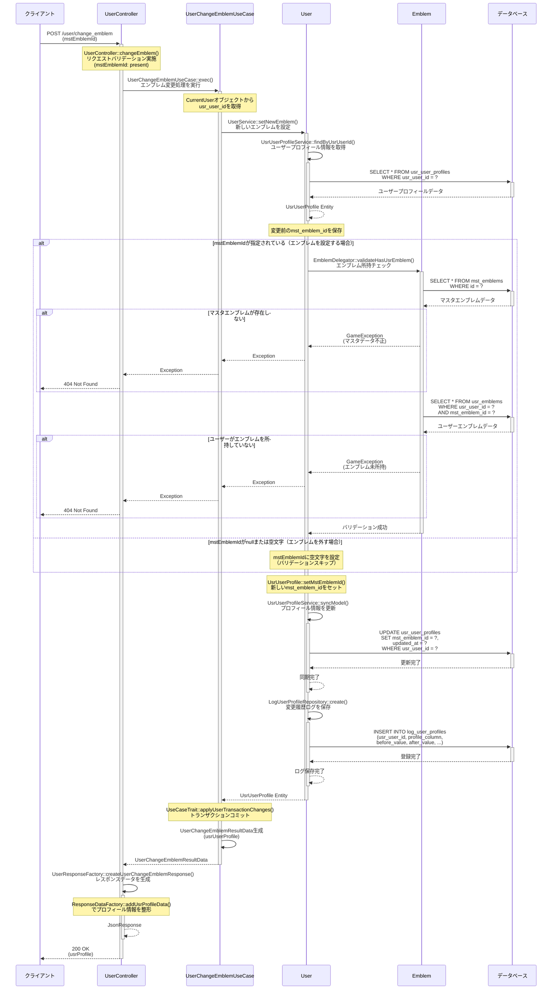

# /user/change_emblem シーケンス図

## 概要
- **エンドポイント**: `/user/change_emblem`
- **HTTPメソッド**: POST
- **機能概要**: ユーザーが装備するエンブレムを変更する機能。所持しているエンブレムであることを検証し、プロフィールに設定する。空文字を指定することでエンブレムを外すことも可能。
- **認証**: 必要
- **主要な処理**: エンブレム所持チェック、プロフィール更新、変更履歴ログ保存

## リクエストパラメータ
| パラメータ名 | 型 | 必須 | 説明 |
|-------------|-----|------|------|
| mstEmblemId | string\|null | Yes (present) | 設定したいエンブレムのマスタID。nullまたは空文字の場合はエンブレムを外す |

## レスポンス
### 成功時（200 OK）
```json
{
  "usrProfile": {
    "name": "プレイヤー名",
    "myId": "ABCD1234",
    "isChangeName": 1,
    "birthDate": "2024-01-01",
    "mstUnitId": "unit_001",
    "mstEmblemId": "emblem_001"
  }
}
```

### エラー時
- 400 Bad Request: バリデーションエラー（リクエストパラメータ不正）
- 404 Not Found: 指定されたエンブレムが存在しない、またはユーザーが所持していない
- 500 Internal Server Error: サーバーエラー

## シーケンス図



## 処理詳細説明

### 1. リクエスト受付とバリデーション
- `UserController::changeEmblem()`でリクエストを受け付け
- Laravelのバリデーション機能で`mstEmblemId`が`present`（存在する）ことを確認
- 認証済みユーザー情報（CurrentUser）を取得

### 2. エンブレム設定処理
- `UserService::setNewEmblem()`でエンブレム変更のメインロジックを実行
- `UsrUserProfileService`を通じて現在のユーザープロフィール情報を取得
- 変更前の`mst_emblem_id`を保存（ログ記録用）

### 3. エンブレム所持チェック
- `mstEmblemId`が指定されている場合のみバリデーション実施
- `EmblemDelegator::validateHasUsrEmblem()`で以下をチェック：
  - マスタデータ（`mst_emblems`）に該当エンブレムが存在するか
  - ユーザーが該当エンブレムを所持しているか（`usr_emblems`テーブル）
- `mstEmblemId`がnullまたは空文字の場合、バリデーションをスキップし空文字を設定（エンブレムを外す）

### 4. プロフィール更新
- `UsrUserProfile`エンティティの`mst_emblem_id`を新しい値に更新
- `UsrUserProfileService::syncModel()`でデータベースに反映
- `usr_user_profiles`テーブルの該当レコードを更新

### 5. 変更履歴ログ保存
- `LogUserProfileRepository::create()`で変更履歴を記録
- 保存内容：
  - `usr_user_id`: ユーザーID
  - `profile_column`: 'mst_emblem_id'（変更したカラム名）
  - `before_value`: 変更前の値
  - `after_value`: 変更後の値
  - その他メタデータ（request_id等）

### 6. トランザクション処理
- `UseCaseTrait::applyUserTransactionChanges()`でトランザクションをコミット
- ユーザーデータの整合性を保証

### 7. レスポンス生成
- `UserChangeEmblemResultData`に更新後のプロフィール情報を格納
- `UserResponseFactory::createUserChangeEmblemResponse()`でJSON形式に整形
- `ResponseDataFactory::addUsrProfileData()`でプロフィール情報をレスポンス形式に変換

## データベース操作

### 参照テーブル
- `usr_user_profiles`: ユーザープロフィール情報（読み取り・更新）
- `mst_emblems`: エンブレムマスタデータ（バリデーション用読み取り）
- `usr_emblems`: ユーザー所持エンブレム情報（バリデーション用読み取り）
- `log_user_profiles`: プロフィール変更履歴ログ（書き込み）

### トランザクション
- **開始ポイント**: UseCaseレイヤーでの暗黙的トランザクション開始
- **コミット条件**: 全ての処理が正常に完了した場合（`applyUserTransactionChanges()`実行時）
- **ロールバック条件**:
  - バリデーションエラー発生時
  - エンブレム未所持エラー発生時
  - データベースエラー発生時

## エラーハンドリング

### バリデーションエラー
- **発生条件**: `mstEmblemId`パラメータが存在しない場合
- **レスポンス**: 400 Bad Request
- **内容**: Laravelのバリデーションエラーメッセージ

### ビジネスロジックエラー
1. **マスタエンブレム不正エラー**
   - 発生条件: 指定された`mstEmblemId`がマスタデータに存在しない
   - レスポンス: 404 Not Found (GameException)
   - 処理: `MstEmblemRepository::getByIdWithError()`でエラー送出

2. **エンブレム未所持エラー**
   - 発生条件: ユーザーが指定されたエンブレムを所持していない
   - レスポンス: 404 Not Found (GameException)
   - 処理: `UsrEmblemRepository::findByMstEmblemId($usrUserId, $mstEmblemId, true)`の第3引数trueでエラー送出

### システムエラー
- **発生条件**: データベース接続エラー、予期しない例外等
- **レスポンス**: 500 Internal Server Error
- **処理**: トランザクション自動ロールバック

## 備考

### エンブレムを外す機能
- `mstEmblemId`にnullまたは空文字を指定することで、装備中のエンブレムを外すことができる
- この場合、バリデーションはスキップされ、`mst_emblem_id`が空文字に更新される

### ログ記録
- プロフィールの変更履歴は全て`log_user_profiles`テーブルに記録される
- 変更前後の値を保持することで、データの追跡が可能

### トランザクション管理
- `UseCaseTrait`を使用してトランザクションを管理
- ユーザーデータの更新とログ保存が同一トランザクション内で実行され、整合性が保証される
