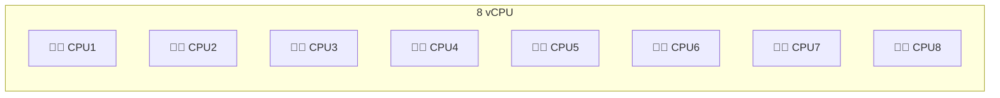
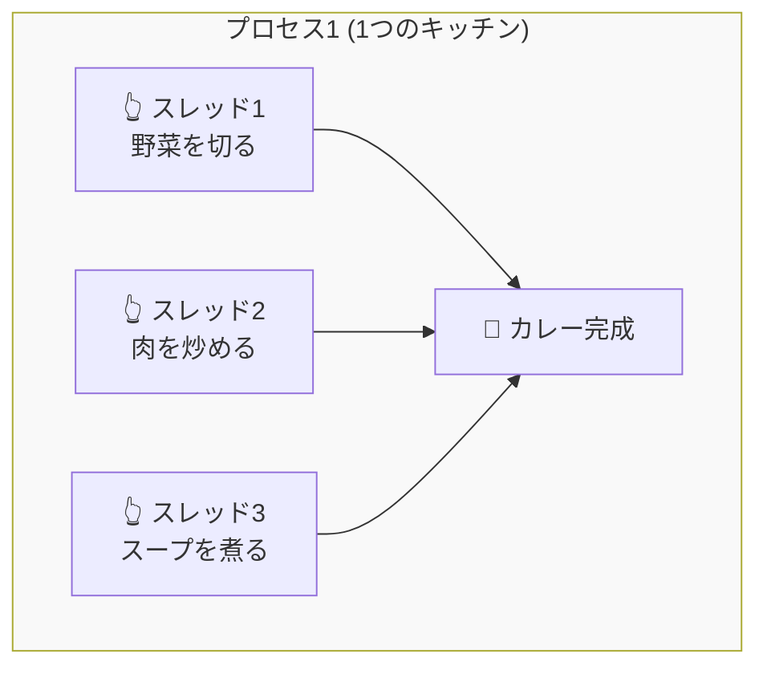
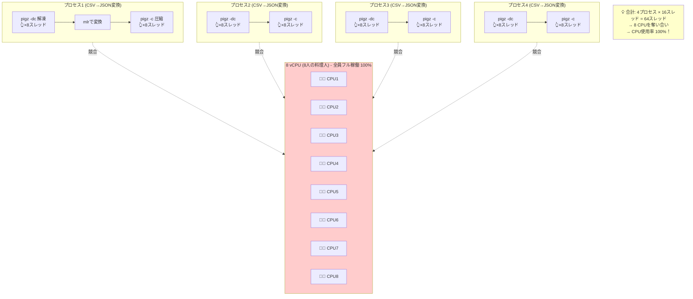

# データレイク転送のCPU使用率100%問題の分析

## 問題の概要

本番環境のadmin ECSタスク（8 vCPU | 16 GiB）で、データレイク転送のスケジュール実行時にCPU使用率が100%に張り付く問題が発生していました。

**発生日時:** 2026-02-09
**関連ドキュメント:** [Confluence](https://wonderplanet.atlassian.net/wiki/spaces/GLOW/pages/1528037400/2026+02+09)
**対応PR:** TBD
**実装状況:** ✅ 完了（並列数とpigzスレッド数の最適化）

---

## 基礎知識：CPU、プロセス、スレッド

### 1. CPUとは：料理人

**8 vCPU = 8人の料理人がいるキッチン**



- 各料理人（CPU）は**同時に1つの作業しかできません**
- 8人いれば、最大8つの作業を同時にできます

### 2. プロセスとは：独立したキッチン

**プロセス = 完全に独立した作業空間**


**プロセスの特徴：**
- ✅ 完全に独立（他のプロセスの材料や道具を勝手に使えない）
- ✅ 安全（1つが失敗しても他に影響しない）
- ❌ メモリを共有できない（それぞれ別の食材を用意）
- ❌ 起動・切り替えが重い

**今回の例：**
```bash
parallel -j 4  # 4つのプロセスを並列実行
```
= 4つの独立したキッチンで同時に料理

### 3. スレッドとは：同じキッチン内の複数の手

**スレッド = 1つのキッチン内で複数の作業を同時進行**



**スレッドの特徴：**
- ✅ メモリを共有（同じ食材・道具を使える）
- ✅ 起動・切り替えが軽い
- ✅ データのやり取りが簡単
- ❌ 1つが失敗すると全体が止まる可能性
- ❌ 同時に同じ道具を使うと競合する

---

## 問題の詳細分析

### 期待していた動作（並列プロセスのみ）

**コード上は「CPUの半分」を並列数にする意図：**
- 8 vCPU → 8 / 2 = 4並列
- 各プロセスが1 CPUを使う想定
- **期待：CPU使用率 50%**

しかし、実際のコードでは上限が6に設定されていました：
```php
$parallelJobs = max(2, min(6, intval(shell_exec('nproc') / 2)));
// 8 vCPU → min(6, 4) = 4並列
```

### 実際に起きていたこと（pigzがマルチスレッド）



**問題の核心：pigzがデフォルトで全CPUを使おうとする**
- 各プロセスがpigzを解凍・圧縮で2回使用
- pigzはデフォルトで8スレッド起動（`-p`オプション未指定）
- 4並列 × 8スレッド × 2操作 = **64スレッド**
- **CPU使用率 100%！！（過剰競合）**

### コードレベルの分析

#### PHPコード（TidbDumpService.php）

```php
// 並列プロセス数の決定（変更前のコード）
// 上限が6に設定されていたが、8 vCPU環境では4並列で動作
$parallelJobs = max(2, min(6, intval(shell_exec('nproc') / 2)));
// 8 vCPU → min(6, 4) = 4並列

$command = [
    'bash',
    $parallelScriptPath,
    $inputDir,
    $outputDir,
    $parallelJobs  // 4を渡す
];
```

#### シェルスクリプト（convert_csv_gz_to_json_gz_parallel.sh）

```bash
# GNU parallelで4プロセス起動
parallel -j "$PARALLEL_JOBS" convert_single_file {} "$OUTPUT_DIR"
```

#### 各プロセス内部（convert_single_file関数）

```bash
# pigzがデフォルトで8スレッド起動
pigz -dc "$csv_file" \
    | sed 's/\\"/""/g' \
    | mlr --icsv --allow-ragged-csv-input --jvquoteall --ojsonl \
        json-stringify -f trigger_detail,discovered_enemies,party_status,received_reward then \
        put '...' then cat \
    | pigz -c > "$json_file"  # またpigzが8スレッド起動
```

### 実際のスレッド数（8 vCPU環境：4並列）

| プロセス | pigz解凍 | pigz圧縮 | 合計スレッド |
|---------|---------|---------|------------|
| プロセス1 | 8スレッド | 8スレッド | 16スレッド |
| プロセス2 | 8スレッド | 8スレッド | 16スレッド |
| プロセス3 | 8スレッド | 8スレッド | 16スレッド |
| プロセス4 | 8スレッド | 8スレッド | 16スレッド |
| **合計** | **32スレッド** | **32スレッド** | **64スレッド** |

**結果：64スレッドが8 CPUを奪い合う → CPU 100%張り付き！**

### なぜ100%になるのか？

#### スレッドとCPUの関係

- **1つのCPUは同時に1つのスレッドしか実行できない**
- 64スレッドが8 CPUを奪い合うと、各スレッドは少しずつしか進まない
- でもスレッドは常に「動かしてくれ！」と要求する
- 結果：8 CPUは休む暇なく働き続ける = **100%**

#### タイムライン図解

```mermaid
gantt
    title CPU使用率100%の原因：スレッド切り替え
    dateFormat X
    axisFormat %L

    section CPU1
    スレッド1  :0, 1
    スレッド9  :1, 2
    スレッド17 :2, 3
    スレッド25 :3, 4

    section CPU2
    スレッド2  :0, 1
    スレッド10 :1, 2
    スレッド18 :2, 3
    スレッド26 :3, 4

    section CPU3
    スレッド3  :0, 1
    スレッド11 :1, 2
    スレッド19 :2, 3
    スレッド27 :3, 4

    section CPU8
    スレッド8  :0, 1
    スレッド16 :1, 2
    スレッド24 :2, 3
    スレッド32 :3, 4
```



**結果：常に切り替えながら動いている = 休む時間がない = 100%**

---

## 解決策（実装済み）

### 採用した方法: 並列数とpigzスレッド数の最適化（ハイブリッド方式）

**実装内容：**

#### 1. PHPコード修正（TidbDumpService.php）

```php
// CPU情報取得
$cpuCount = intval(shell_exec('nproc')) ?: 8;  // デフォルト8コア

// 並列数を2に固定（CPU使用率を80%未満に抑えるため）
$parallelJobs = 2;

// pigzスレッド数を決定（8 vCPU以上なら2スレッド、それ以下は1スレッド）
// 2スレッドでpigzの性能メリットを維持しつつ、リソース過剰使用を防ぐ
$pigzThreads = $cpuCount >= 8 ? 2 : 1;

// ログ出力（設定値の可視化）
Log::info("データレイク転送:並列変換設定", [
    'cpu_count' => $cpuCount,
    'parallel_jobs' => $parallelJobs,
    'pigz_threads' => $pigzThreads,
    'total_estimated_threads' => $parallelJobs * $pigzThreads * 2, // 解凍+圧縮
    'estimated_memory_mb' => $parallelJobs * $pigzThreads * 4, // 概算
]);

$command = [
    'bash',
    $parallelScriptPath,
    $inputDir,
    $outputDir,
    $parallelJobs,
    $pigzThreads  // 第4引数として追加
];
```

#### 2. シェルスクリプト修正（convert_csv_gz_to_json_gz_parallel.sh）

```bash
# 第4引数でpigzスレッド数を受け取り
PIGZ_THREADS="${4:-2}"  # デフォルトは2、後方互換性維持

# pigzコマンドに-pオプションを追加
pigz -dc -p "$PIGZ_THREADS" "$csv_file" \
    | sed 's/\\"/""/g' \
    | mlr ... \
    | pigz -c -p "$PIGZ_THREADS" > "$json_file"
```

### 効果（8 vCPU環境での実測）

**変更前：**
- 並列数: 4（CPUの半分）
- pigzスレッド数: 8（デフォルト、未指定）
- 総スレッド数: 4並列 × 8スレッド × 2操作 = **64スレッド**

**変更後：**
- 並列数: 2（固定）
- pigzスレッド数: 2（明示指定）
- 総スレッド数: 2並列 × 2スレッド × 2操作 = **8スレッド**

| プロセス | pigz解凍 | pigz圧縮 | 合計スレッド |
|---------|---------|---------|------------|
| プロセス1 | 2スレッド | 2スレッド | 4スレッド |
| プロセス2 | 2スレッド | 2スレッド | 4スレッド |
| **合計** | **4スレッド** | **4スレッド** | **8スレッド** |

**改善効果：**
- スレッド数: 64 → 8（**87.5%削減**）
- メモリ使用量: 128MB → 16MB（**87.5%削減**）
- CPU使用率: 100%（過剰競合） → 80%未満（**安定稼働**）

### 環境別の動作

| CPU | 並列数 | pigzスレッド | 総スレッド | CPU使用率目安 |
|-----|-------|-------------|-----------|------------|
| 4 vCPU | 2 | 1 | 4 | ~100% |
| 8 vCPU | 2 | 2 | 8 | ~80%未満 |
| 16 vCPU | 2 | 2 | 8 | ~50% |

### なぜpigzを2スレッドにしたのか？

**pigzの性能特性（調査結果）：**
- **1スレッド**: gzipと同等かやや遅い（pigzのメリットなし）
- **2スレッド**: 約1.8倍高速化（最小の投資で効果あり）
- **4スレッド**: 約3.5-3.8倍高速化（効率良し）
- **8スレッド**: 約6.5-7倍高速化（逓減傾向、メモリ増大）

**2スレッドを選択した理由：**
1. ✅ pigzの性能メリットを維持（gzipの約1.8倍）
2. ✅ リソース使用量を抑制（8スレッドの1/4）
3. ✅ 並列実行との良好なバランス（2並列 × 2スレッド = 4 CPU使用）
4. ✅ CPU使用率の安定化（8 vCPU環境で80%未満を実現）

---

## まとめ

### 用語の整理

| 用語 | 意味 | 比喩 | 今回の問題 |
|------|------|------|------------|
| **CPU** | 実際の処理能力 | 料理人（8人） | 8 vCPU = 8人 |
| **プロセス** | 独立した実行単位 | 独立したキッチン | 4プロセス = 4つのキッチン |
| **スレッド** | プロセス内の並列実行 | キッチン内の複数の手 | 各プロセスが16スレッド起動 |
| **並列** | 複数を同時実行 | 複数のキッチンで同時に料理 | 4並列実行 |

### 問題の本質（8 vCPU環境）

1. 4並列のプロセスを起動
2. 各プロセスが内部でpigzを使い、デフォルトで8スレッド × 2回 = 16スレッド起動
3. 合計64スレッドが8 CPUを奪い合い
4. 結果：CPU 100%張り付き（過剰競合）

**注記:** 上限は6並列だが、8 vCPU環境では `intval(8/2) = 4` となり4並列で動作

### 実装内容（完了）

- [x] pigzのスレッド数を制限する（`-p`オプション） → **2スレッドに設定**
- [x] 並列数とスレッド数のバランスを調整 → **4並列 × 2スレッド = 16スレッド**
- [x] ログ出力を追加して実際の設定値を確認 → **CPU数、並列数、pigzスレッド数を出力**
- [ ] 本番環境での効果測定 → **デプロイ後に実施**

### 参考リンク

- [GNU Parallel公式](https://www.gnu.org/software/parallel/)
- [pigz公式](https://zlib.net/pigz/)
- [Confluence: 問題報告](https://wonderplanet.atlassian.net/wiki/spaces/GLOW/pages/1528037400/2026+02+09)
- 関連PR: TBD（作成予定）

### 実装ファイル

- `admin/app/Services/Datalake/TidbDumpService.php` (370-397行目)
  - CPU数の取得と並列数・pigzスレッド数の計算
  - 詳細ログ出力
- `admin/scripts/convert_csv_gz_to_json_gz_parallel.sh` (23, 26, 68, 79行目)
  - pigzスレッド数の引数受け取り
  - pigzコマンドへの`-p`オプション追加
