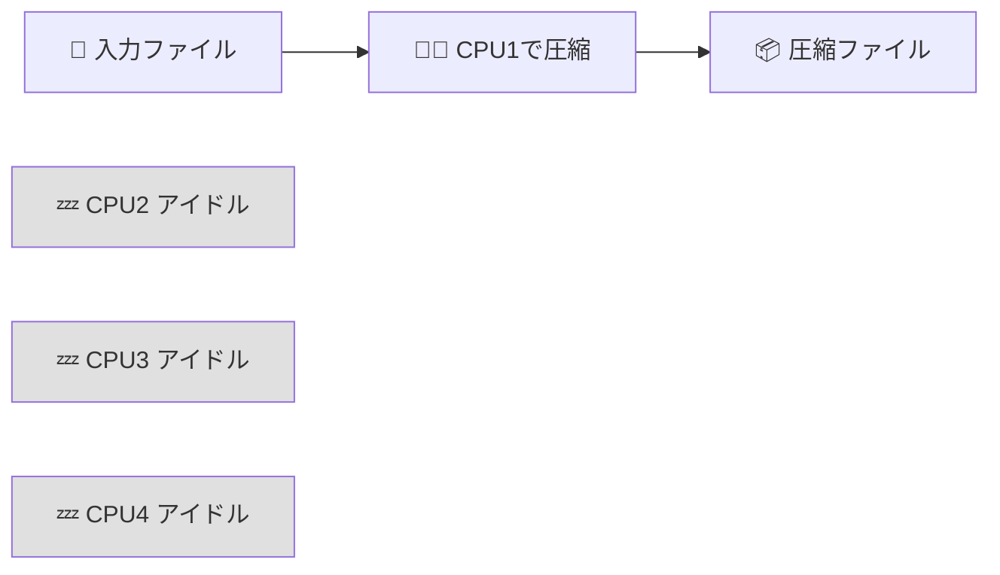
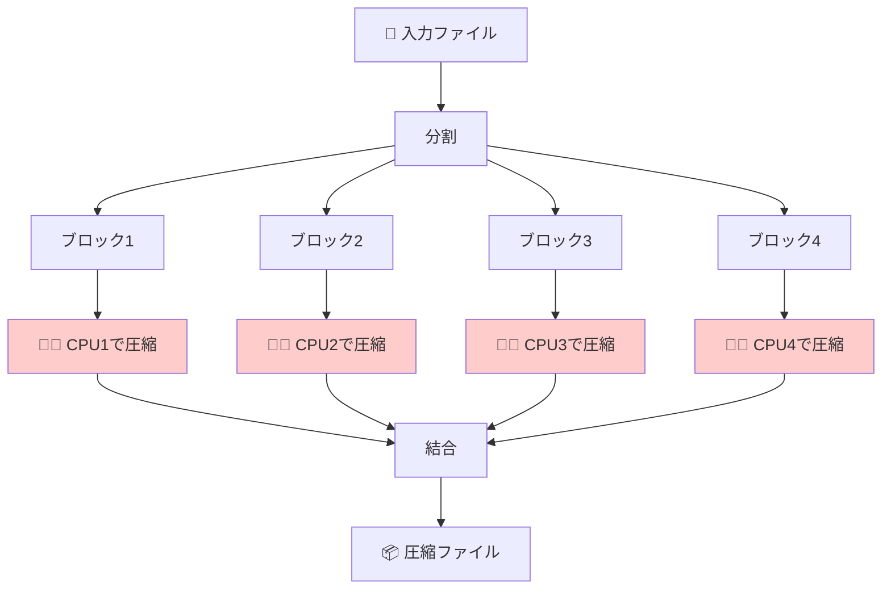
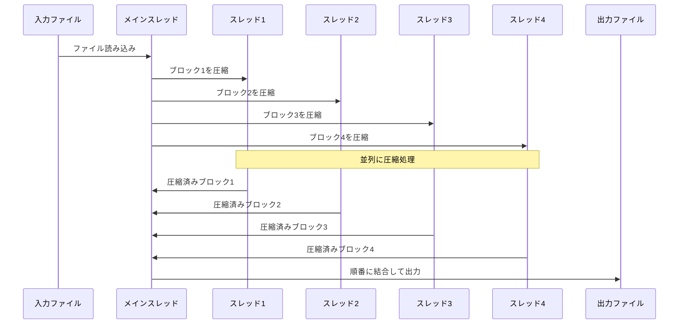
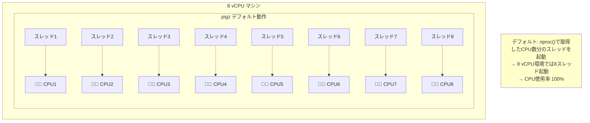
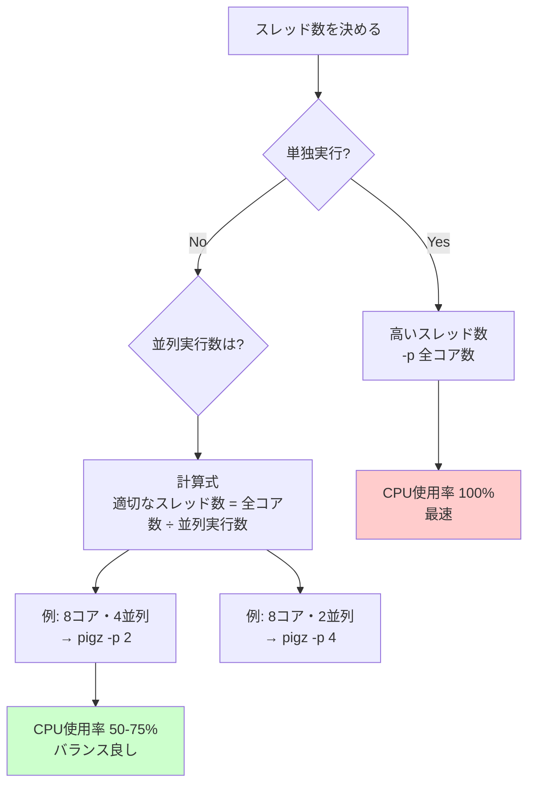

# pigz入門ガイド

## 目次

1. [pigzとは](#pigzとは)
2. [gzipとの違い](#gzipとの違い)
3. [なぜpigzは高速なのか](#なぜpigzは高速なのか)
4. [基本的な使い方](#基本的な使い方)
5. [スレッド数の制御](#スレッド数の制御)
6. [実践例](#実践例)
7. [注意点とベストプラクティス](#注意点とベストプラクティス)

---

## pigzとは

**pigz** = **P**arallel **I**mplementation of **GZ**ip

pigzは、gzipの並列実装版です。従来のgzipと完全に互換性を保ちながら、**マルチスレッド（並列処理）** を使って圧縮・解凍を高速化します。

### 特徴

- ✅ **gzip完全互換**: 既存のgzipファイルを扱える
- ✅ **高速**: マルチコアCPUを活用して並列処理
- ✅ **同じ品質**: 圧縮率はgzipと同等
- ✅ **コマンドも同じ**: gzipのオプションがそのまま使える

---

## gzipとの違い

### gzip: シングルスレッド



**gzipの特徴:**
- 1つのCPUコアしか使わない
- 他のコアは遊んでいる
- 処理に時間がかかる

### pigz: マルチスレッド



**pigzの特徴:**
- 複数のCPUコアを同時に使う
- ファイルを小さなブロックに分割して並列圧縮
- 処理が高速

### 性能比較

| ツール | 使用コア | 1GBファイル圧縮時間（例） | CPU使用率 |
|-------|---------|----------------------|----------|
| **gzip** | 1コア | 60秒 | 12.5%（8コア中1コア） |
| **pigz（デフォルト）** | 8コア | 10秒 | 100%（8コア全て） |
| **pigz -p 2** | 2コア | 30秒 | 25%（8コア中2コア） |

**結論: pigzはgzipより5～6倍速い！**

---

## なぜpigzは高速なのか

### 並列処理の仕組み

pigzは入力ファイルを小さなブロック（デフォルト128KB）に分割し、各ブロックを独立して圧縮します。



### スレッドとCPUの関係



---

## 基本的な使い方

### インストール

```bash
# Ubuntu/Debian
apt-get install pigz

# macOS
brew install pigz

# Alpine Linux（Dockerコンテナでよく使う）
apk add pigz
```

### 基本コマンド

#### 圧縮

```bash
# ファイルを圧縮（元ファイルは削除される）
pigz file.txt
# → file.txt.gz が作成される

# 標準出力に圧縮結果を出力（元ファイルは残る）
pigz -c file.txt > file.txt.gz

# 複数ファイルを圧縮
pigz file1.txt file2.txt file3.txt
```

#### 解凍

```bash
# ファイルを解凍（.gzファイルは削除される）
pigz -d file.txt.gz
# または
unpigz file.txt.gz

# 標準出力に解凍結果を出力（.gzファイルは残る）
pigz -dc file.txt.gz > file.txt
```

#### パイプ処理

```bash
# 圧縮しながらパイプ処理
cat large_file.csv | pigz -c > large_file.csv.gz

# 解凍しながらパイプ処理
pigz -dc data.csv.gz | grep "keyword" | wc -l
```

---

## スレッド数の制御

### `-p` オプション: プロセッサ数指定

pigzの最も重要なオプションが `-p` です。これでスレッド数（=使用するCPUコア数）を制御できます。

```bash
# 1スレッドで実行（gzipと同じ）
pigz -p 1 -c file.txt > file.txt.gz

# 2スレッドで実行
pigz -p 2 -c file.txt > file.txt.gz

# 4スレッドで実行
pigz -p 4 -c file.txt > file.txt.gz

# デフォルト（全コアを使用）
pigz -c file.txt > file.txt.gz
```

### スレッド数の決め方



### 実践的な指針

#### 1. 単独実行の場合

```bash
# 全コアを使って最速で処理
pigz -c large_file.csv > large_file.csv.gz
```

**メリット:**
- 最速で処理完了
- CPU使用率100%でも問題なし（他の処理がないため）

**デメリット:**
- 他の処理がある場合、影響を受ける

#### 2. 並列実行の場合（重要！）

```bash
# 4つのpigzプロセスを並列実行する場合（8コア環境）
# 各pigzは2スレッドに制限
parallel -j 4 "pigz -p 2 -c {} > {}.gz" ::: file1.csv file2.csv file3.csv file4.csv
```

**計算式:**
```
適切なスレッド数 = 全コア数 ÷ 並列実行数
8コア ÷ 4並列 = 2スレッド
```

**メリット:**
- CPU使用率が適切（100%前後）
- 各プロセスが均等にリソースを使える
- コンテキストスイッチが少ない

**デメリット:**
- 単独実行より1つあたりは遅い（でも全体では効率的）

#### 3. 控えめに使う場合

```bash
# 1スレッドに制限（他の重要な処理がある場合）
pigz -p 1 -c file.csv > file.csv.gz
```

**メリット:**
- 他の処理に影響を与えない
- CPU使用率が低い

**デメリット:**
- gzipと同じ速度（pigzの利点がない）

---

## 実践例

### 例1: データレイク転送（今回の問題）

#### 問題があったコード

```bash
# 4並列でpigzを実行
parallel -j 4 convert_file ::: file1.csv file2.csv file3.csv file4.csv

# convert_file関数の中
pigz -dc input.csv.gz | mlr ... | pigz -c > output.json.gz
# ↑ デフォルトで8スレッド × 2回 = 16スレッド
# 4プロセス × 16スレッド = 64スレッドが8コアを奪い合う → CPU 100%！
```

#### 改善したコード

```bash
# 4並列で実行、各pigzは1-2スレッドに制限
parallel -j 4 convert_file ::: file1.csv file2.csv file3.csv file4.csv

# convert_file関数の中
pigz -p 2 -dc input.csv.gz | mlr ... | pigz -p 2 -c > output.json.gz
# ↑ 2スレッド × 2回 = 4スレッド
# 4プロセス × 4スレッド = 16スレッド → CPU使用率 適切！
```

### 例2: ログファイルの圧縮

#### シナリオ: 100個のログファイルを圧縮

```bash
# 悪い例: 全ファイルを並列圧縮（スレッド制限なし）
parallel -j 8 "pigz {}" ::: logs/*.log
# → 8プロセス × 8スレッド = 64スレッド → CPU過負荷

# 良い例: 並列数とスレッド数のバランス
parallel -j 4 "pigz -p 2 {}" ::: logs/*.log
# → 4プロセス × 2スレッド = 8スレッド → CPU効率的
```

### 例3: データパイプライン

```bash
# データ抽出 → 変換 → 圧縮のパイプライン
mysql -e "SELECT * FROM large_table" \
  | jq -c '...' \
  | pigz -p 2 -c > output.json.gz

# スレッド制限により、MySQL接続やjq処理にもCPUを残せる
```

---

## 注意点とベストプラクティス

### ⚠️ 注意点

#### 1. デフォルトで全コアを使う

```bash
# これは8コア環境で8スレッド起動する
pigz file.txt

# 並列実行する場合は必ず -p で制限を！
parallel -j 4 "pigz -p 2 {}" ::: files/*
```

#### 2. 圧縮と解凍の両方でスレッドを使う

```bash
# このパイプラインでは2回pigzが実行される
pigz -dc input.gz | process | pigz -c > output.gz
#     ↑ 8スレッド           ↑ 8スレッド
# 合計16スレッド！

# 両方に -p を指定
pigz -p 2 -dc input.gz | process | pigz -p 2 -c > output.gz
#     ↑ 2スレッド              ↑ 2スレッド
# 合計4スレッド
```

#### 3. 小さいファイルでは効果が薄い

```bash
# 数KBのファイルではpigzの並列化効果は小さい
# → 起動オーバーヘッドの方が大きい場合がある

# 目安: 数MB以上のファイルでpigzの効果が出る
```

#### 4. メモリ使用量も増える

```bash
# スレッド数が多いとメモリも多く使う
# 各スレッドが独立したバッファを持つため

# 8スレッド → 約32MB（圧縮レベルによる）
# 1スレッド → 約4MB
```

### ✅ ベストプラクティス

#### 1. 並列実行時は必ずスレッド数を計算

```bash
# 公式
スレッド数 = 全コア数 ÷ 並列実行数

# 8コア・4並列
pigz -p 2 ...

# 16コア・8並列
pigz -p 2 ...
```

#### 2. 環境変数でデフォルトを設定

```bash
# 環境変数で並列数を制御（一部の環境でサポート）
export PIGZ="-p 2"

# または関数でラップ
function safe_pigz() {
    pigz -p 2 "$@"
}
```

#### 3. ログで実際のスレッド数を確認

```bash
# pigzの詳細ログを出力
pigz -v -p 2 file.txt
# pigz 2.6 -p 2
# 使用スレッド数やメモリ使用量が表示される
```

#### 4. モニタリング

```bash
# CPU使用率を監視しながら実行
top &
pigz large_file.csv
# CPU使用率が100%に張り付くなら -p で調整
```

#### 5. 圧縮レベルも考慮

```bash
# 圧縮レベル: 1(最速) ～ 9(最高圧縮)
pigz -p 4 -1 file.txt  # 最速、低圧縮率
pigz -p 4 -6 file.txt  # デフォルト
pigz -p 4 -9 file.txt  # 最高圧縮、遅い

# 推奨: -6（デフォルト）が速度と圧縮率のバランスが良い
```

---

## まとめ

### pigzを使うべき場面

| シーン | 推奨 | 理由 |
|-------|------|------|
| **大きいファイル（数MB以上）** | ✅ 使う | 並列化の効果が大きい |
| **小さいファイル（数KB）** | ❌ gzipでOK | オーバーヘッドで逆に遅い |
| **単独実行** | ✅ 使う | 全コアを使って最速 |
| **並列実行** | ⚠️ -p で制限必須 | スレッド数を制御しないとCPU過負荷 |
| **CPUに余裕がない** | ❌ gzipでOK | 他の処理に影響を与える |

### 重要なポイント

1. **pigzはデフォルトで全コアを使う**
   - 並列実行時は必ず `-p` オプションでスレッド数を制限

2. **適切なスレッド数の計算**
   ```
   スレッド数 = 全コア数 ÷ 並列実行数
   ```

3. **圧縮と解凍の両方で注意**
   - パイプラインで2回pigzを使う場合、両方に `-p` を指定

4. **gzipより5～6倍速い**
   - 大きいファイルの処理時間を大幅に短縮

5. **完全なgzip互換**
   - 既存のスクリプトを置き換えるだけで高速化できる

### チートシート

```bash
# 基本的な圧縮
pigz file.txt                    # デフォルト（全コア使用）
pigz -p 4 file.txt               # 4スレッドに制限
pigz -c file.txt > file.txt.gz   # 元ファイルを残す

# 基本的な解凍
pigz -d file.txt.gz              # 解凍
pigz -dc file.txt.gz > file.txt  # .gzファイルを残す

# 並列実行（推奨パターン）
# 8コア環境で4並列
parallel -j 4 "pigz -p 2 {}" ::: files/*

# パイプライン
pigz -p 2 -dc input.gz | process | pigz -p 2 -c > output.gz

# 圧縮レベル指定
pigz -p 4 -1 file.txt  # 最速
pigz -p 4 -9 file.txt  # 最高圧縮
```

---

## 参考リンク

- [pigz公式サイト](https://zlib.net/pigz/)
- [pigz GitHub](https://github.com/madler/pigz)
- [関連: データレイクCPU問題分析](./20260209_datalake_cpu-usage-analysis.md)

---

**作成日:** 2026-02-09
**最終更新:** 2026-02-09
**関連Issue:** [データレイクCPU使用率100%問題](https://wonderplanet.atlassian.net/wiki/spaces/GLOW/pages/1528037400/2026+02+09)
