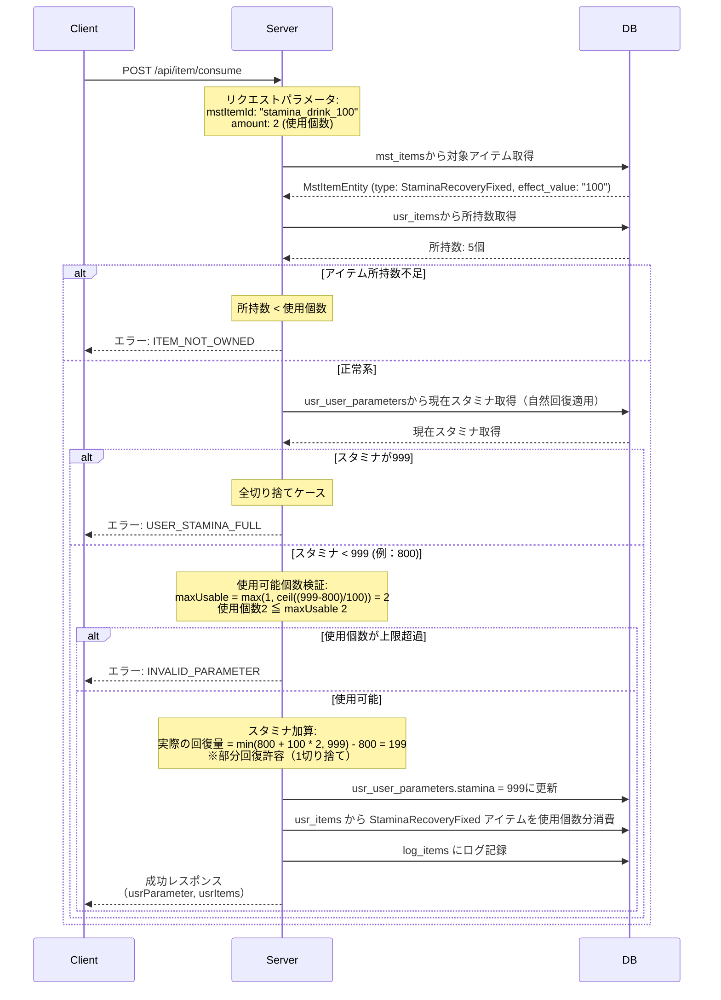
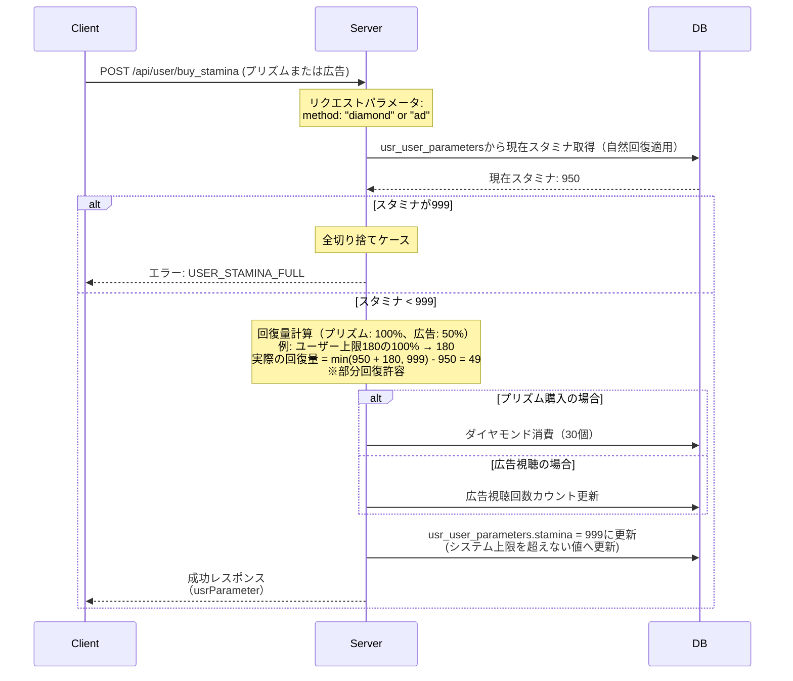

# スタミナ回復アイテムv2 API設計書

## 目次

- [仕様書](#仕様書)
  - [要点まとめ](#要点まとめ)
  - [仕様確認](#仕様確認)
- [シーケンス図](#シーケンス図)
- [エラー設計](#エラー設計)
- [API仕様](#api仕様)
- [DB設計](#db設計)
  - [マスター/オペレーション](#マスターオペレーション)
  - [ユーザー](#ユーザー)
  - [ログ](#ログ)
- [テーブル一覧](#テーブル一覧)
- [実装上の注意点](#実装上の注意点)
- [テスト観点](#テスト観点)

---

## 仕様書

### 要点まとめ

#### 概要
- スタミナ回復アイテムv2は、既存の割合回復アイテム（スタミナボトル: 50%回復）に加えて、固定値回復アイテム（スタミナドリンク10、50、100など）を追加する機能です。
- すべてのスタミナ回復方法（固定値回復、割合回復、プリズム購入、広告視聴）でシステム上限999まで回復可能になり、ユーザーのスタミナ上限値（レベル依存）を超えてもオーバーフローが許可されます。
- 部分回復を許容し、回復後に999を超える場合でも一部でも回復できる場合は回復を実行します（例: スタミナ950でドリンク100使用 → 999まで回復、51は切り捨て）。
- ARPU向上とプレイ時間の自由化（溜めて使える）を実現し、イベント時のブースト効果が期待できます。

#### DB変更点
- **新規追加:**
  - なし

- **既存テーブルへの変更:**
  - `mst_items`: ItemType enum に `StaminaRecoveryFixed` を追加（固定値回復アイテム用）

#### API
- **新規追加:**
  - なし（既存のアイテム使用APIで固定値回復アイテムを処理）

- **既存APIへの変更:**
  - アイテム使用API（ItemStaminaRecoveryService）: 固定値回復アイテムの処理を追加
  - プリズム・広告回復API（UserBuyStaminaService）: システム上限999へのチェック変更、部分回復の許容

### 仕様確認

#### 参照ドキュメント
- 既存実装コード: `api/app/Domain/Item/Services/ItemStaminaRecoveryService.php`
- 既存実装コード: `api/app/Domain/User/Services/UserBuyStaminaService.php`
- 既存実装コード: `api/app/Domain/Item/Enums/ItemType.php`
- 要件調査: `docs/sdd-v2/features/スタミナ回復アイテムv2/01_要件調査.md`
- 仕様確認: `docs/sdd-v2/features/スタミナ回復アイテムv2/02_仕様確認.md`
- プランナー確認結果: `docs/sdd-v2/features/スタミナ回復アイテムv2/02_2_プランナー確認結果.md`

#### 仕様ポイント

| 項目 | 内容 |
|------|------|
| システム上限値 | スタミナの絶対上限は999（mst_configsから取得、UserConstant::MAX_STAMINA）。すべてのスタミナ回復方法でこの上限を超えることはできない |
| 固定値回復の計算式 | 回復量 = アイテムのeffect_value（文字列を整数に変換してそのまま加算） |
| 割合回復の計算式 | 回復量 = ユーザーのスタミナ上限値 × effect_value / 100 |
| オーバーフロー許可 | ユーザーのスタミナ上限値（レベル依存）を超えてもシステム上限999までスタミナを保持可能 |
| 部分回復の許容 | 回復後に999を超える場合でも、一部でも回復できる場合は回復を許可（超過分は切り捨て） |
| 全切り捨て時のエラー | スタミナが999の状態で回復しようとした場合はUSER_STAMINA_FULLエラー |
| 複数個使用 | 固定値回復アイテムは1回のAPI呼び出しで複数個同時使用可能 |
| 使用可能個数の計算 | `max(1, ceil((999 - currentStamina) / recoveryAmount))` ただしスタミナが999の場合は0個 |
| アイテム所持数0のエラー | アイテム所持数が0個の場合は使用不可（ITEM_NOT_OWNEDエラー） |
| 自然回復の事前適用 | アイテム使用前、プリズム・広告購入前に自然回復を適用 |
| 統一仕様の適用範囲 | プリズム購入、広告視聴、既存割合回復アイテムもシステム上限999・部分回復許容を適用 |

---

## シーケンス図

### 固定値回復アイテム使用



### プリズム購入・広告視聴（既存機能の変更）



---

## エラー設計

> クラサバで必ず認識共有する。
> クライアント側で、実際にどんな挙動にすべきか、不明瞭な状態をなくして、
> 本番リリース後に、CS対応も含めハンドリングしやすい状態にしておきたいです。

### スタミナ回復アイテムv2関連エラー

| エラーコード | 新規 | エラー内容 | 発生条件 | クライアント挙動 |
|------------|------|----------|---------|---------------|
| `ErrorCode::USER_STAMINA_FULL` | - | スタミナが上限に達している | 現在スタミナが999の状態で回復アイテムを使用、またはプリズム・広告でスタミナ購入しようとした場合 | エラーダイアログ表示「スタミナの所持上限は999となっているため、これ以上回復できません。」→アイテム使用ダイアログに戻る |
| `ErrorCode::ITEM_NOT_OWNED` | - | アイテム未所持 | 所持数が0個のアイテムを使用しようとした場合 | エラーダイアログ表示「アイテムを所持していません。」→アイテム一覧画面に戻る |
| `ErrorCode::INVALID_PARAMETER` | - | パラメータ不正 | 使用個数が使用可能個数を超えている場合（例: スタミナ950でドリンク100を2個使用しようとした場合、使用可能個数は1個のため） | エラーダイアログ表示「使用可能な個数を超えています。」→アイテム使用ダイアログに戻る |
| `ErrorCode::MST_NOT_FOUND` | - | マスタ未存在 | 指定されたmstItemIdがマスタデータに存在しない場合 | エラーダイアログ表示「アイテムが見つかりません。」→アイテム一覧画面に戻る |
| `ErrorCode::USER_BUY_STAMINA_COUNT_LIMIT` | - | 広告視聴回数上限 | 広告視聴によるスタミナ購入が1日の上限（3回）に達している場合 | エラーダイアログ表示「本日の広告視聴によるスタミナ回復は上限に達しました。」→スタミナ回復ダイアログに戻る |
| `ErrorCode::USER_BUY_STAMINA_AD_DURING_INTERVAL` | - | 広告視聴インターバル中 | 広告視聴によるスタミナ購入のインターバル（60分）経過前に再度購入しようとした場合 | エラーダイアログ表示「広告視聴によるスタミナ回復は60分間隔で利用できます。」→スタミナ回復ダイアログに戻る |
| `ErrorCode::LACK_OF_RESOURCES` | - | ダイヤモンド不足 | プリズム購入に必要なダイヤモンド（30個）が不足している場合 | エラーダイアログ表示「ダイヤモンドが不足しています。」→ショップへの導線を表示 |

**エラーハンドリング方針:**
- クライアント側で事前にアイテム所持数、スタミナ値、使用可能個数のバリデーションを実施
- サーバー側でも全てのバリデーションを必ず実施（クライアント改ざん対策）
- エラー発生時はトランザクションロールバックにより、アイテム消費とスタミナ加算の不整合を防止
- 部分回復が発生する場合（切り捨てあり）はクライアント側で事前に確認ダイアログを表示（サーバー側では特別な処理なし）

---

## API仕様

### 既存API: POST /api/item/consume（固定値回復アイテム対応を追加）

スタミナ回復アイテム（固定値回復・割合回復）を使用してスタミナを回復する。

#### request

```json
{
  "mstItemId": "stamina_drink_100",
  "amount": 2
}
```

**パラメータ説明:**
- `mstItemId` (string, required): mst_items.id（使用するアイテムのマスタID）
- `amount` (int, required): 使用個数（1以上）

**バリデーション:**
- `mstItemId`: mst_itemsに存在するIDであること
- `mstItemId`: type が `StaminaRecoveryFixed` または `StaminaRecoveryPercent` であること
- `amount`: 1以上の整数であること
- `amount`: 所持数以下であること
- `amount`: 使用可能個数以下であること
- 現在スタミナ: 999未満であること（999の場合はUSER_STAMINA_FULLエラー）

#### response

```json
{
  "usrParameter": {
    "level": 50,
    "exp": 12345,
    "coin": 15000,
    "stamina": 999,
    "staminaUpdatedAt": "2025-12-17T15:30:00+09:00",
    "freeDiamond": 500,
    "paidDiamondIos": 100,
    "paidDiamondAndroid": 0
  },
  "usrItems": [
    {
      "mstItemId": "stamina_drink_100",
      "amount": 3
    }
  ]
}
```

**レスポンス説明:**
- `usrParameter`: ユーザーパラメータ（usr_user_parametersから取得、スタミナとstaminaUpdatedAtが更新される）
  - `level`: プレイヤーレベル（usr_user_parameters）
  - `exp`: 経験値（usr_user_parameters）
  - `coin`: コイン（usr_user_parameters）
  - `stamina`: スタミナ（回復後の値、usr_user_parameters）
  - `staminaUpdatedAt`: スタミナ最終更新日時（ISO8601形式、usr_user_parameters）
  - `freeDiamond`: 無償ダイヤ（usr_user_parameters）
  - `paidDiamondIos`: iOS有償ダイヤ（usr_user_parameters）
  - `paidDiamondAndroid`: Android有償ダイヤ（usr_user_parameters）
- `usrItems`: アイテム変更差分（usr_itemsから取得、使用したアイテムの残り所持数）
  - `mstItemId`: アイテムマスタID（mst_items.id）
  - `amount`: 変更後の所持数（usr_items.amount）

**既存との互換性:**
- 既存の割合回復アイテム（StaminaRecoveryPercent）も引き続き使用可能

---

### 既存API: POST /api/user/buy_stamina_diamond（プリズム購入、システム上限999対応）

**変更内容:**
- 上限チェックをユーザー上限からシステム上限999に変更
- 部分回復を許容（回復後にシステム上限999を超える場合、999まで回復して、超過分は切り捨て）
- スタミナが999の場合はUSER_STAMINA_FULLエラーを返す
- リクエスト・レスポンスに変更なし

---

### 既存API: POST /api/user/buy_stamina_ad（広告視聴、システム上限999対応）

**変更内容:**
- /api/user/buy_stamina_diamond と同じ対応

---

## DB設計

### マスター/オペレーション

#### mst_items（既存改修）

アイテムマスタ情報を管理するテーブル。

**変更内容:**
- `type` enum に `StaminaRecoveryFixed` を追加
- `effect_value` の使用方法を拡張（固定値回復アイテム用）

| 列名 | データ型/制約 | 説明 |
|------|---------------|------|
| type | enum(..., 'StaminaRecoveryFixed', ...) NOT NULL | アイテム種別<br/>'StaminaRecoveryFixed': 固定値回復アイテム<br/>'StaminaRecoveryPercent': 割合回復アイテム |
| effect_value | varchar(255) NULL | 効果値<br/>StaminaRecoveryFixed: 固定回復量（例: "10", "100"）<br/>StaminaRecoveryPercent: 回復割合（例: "50"） |

**追加enum値の説明:**
- `StaminaRecoveryFixed`: 固定値回復アイテム（スタミナドリンク10、50、100など）
  - effect_valueには固定回復量を文字列として格納（例: "10", "100"）
  - サーバー側で整数に変換してスタミナに加算

---

## テーブル一覧

| テーブル名 | 新規/既存 | 概要 |
|-----------|----------|------|
| mst_items | 既存改修 | アイテムマスタ情報（type enum に StaminaRecoveryFixed を追加） |
