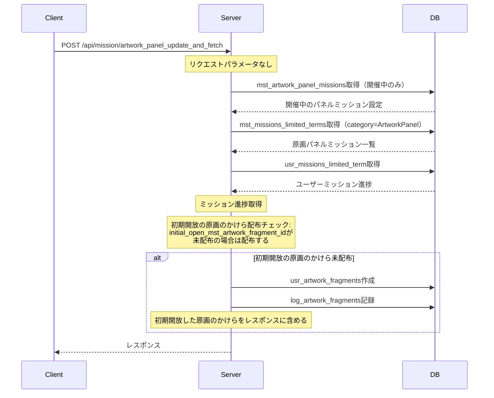
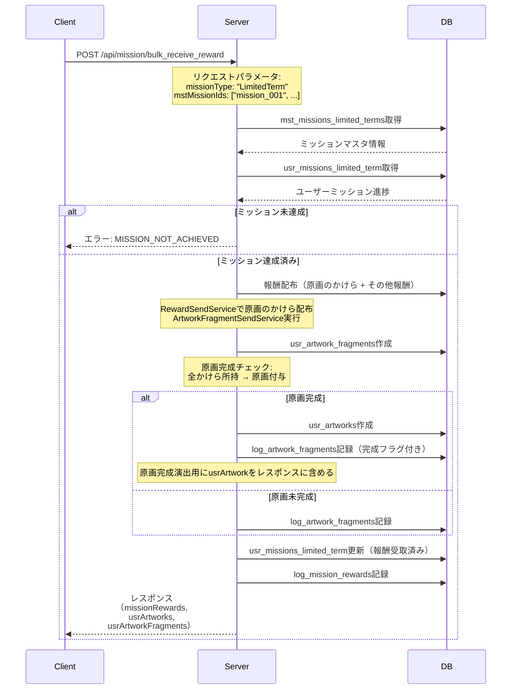

# 原画パネルミッション API設計書

## 目次

- [仕様書](#仕様書)
  - [要点まとめ](#要点まとめ)
  - [仕様確認](#仕様確認)
- [シーケンス図](#シーケンス図)
- [エラー設計](#エラー設計)
- [API仕様](#api仕様)
- [DB設計](#db設計)
  - [マスター/オペレーション](#マスターオペレーション)
  - [ユーザー](#ユーザー)
  - [ログ](#ログ)
- [テーブル一覧](#テーブル一覧)
- [実装上の注意点](#実装上の注意点)
- [テスト観点](#テスト観点)

---

## 仕様書

https://docs.google.com/presentation/d/1Srk7PgEe2jbgsxQV43H-RF8L8Q5NofI4HYekx5NwZag/edit?slide=id.g3b34c20de89_0_124#slide=id.g3b34c20de89_0_124

### 要点まとめ

#### 概要
- 原画パネルミッションは、設定されたミッションを達成することで、分割されたパネルをめくり、隠された「原画（イラスト）」を完成させるイベント機能です。
- パネルが1枚めくられるごとに個別の報酬（原画のかけら1枚 + 設定された報酬）が付与され、すべてのパネルを開放（コンプリート）すると、一枚絵としての「原画」そのものを報酬として獲得できます。
- パネル構成は縦×横のグリッド表示（3x3、4x4、5x5など）で可変可能とし、原画パネルの開放順序はミッションを達成して報酬を受け取った順（一括受け取りの場合は番号順）に開放されます。
- イベントTOP画面からパネルミッションTOP画面に遷移するアイコンが表示され、ミッション達成時には赤バッジが表示されます。
- 原画パネルミッションは、既存の期間限定ミッションとして設定し、progress_group_keyで、原画パネルミッション設定と紐付けることを想定しています
- 実装は、既存の期間限定ミッション(MstMissionLimitedTerm)を、流用して行います


#### DB変更点
- **新規追加:**
  - `mst_artwork_panel_missions`: 原画パネルミッション基本設定マスタ

- **既存テーブルへの変更:**
  - `mst_missions_limited_terms.mission_category` enum: `ArtworkPanel` を追加

#### API
- **新規追加:**
  - `POST /api/mission/artwork_panel_update_and_fetch`: 原画パネルミッション更新・取得API

- **既存APIへの変更:**
  - `POST /api/mission/bulk_receive_reward`: レスポンスに `usrArtworks`, `usrArtworkFragments` を追加
  - `GET /api/game/badge`: レスポンスに `unreceivedMissionArtworkPanelRewardCounts` を追加（原画パネルミッションID毎の未受取報酬数）

### 仕様確認

#### 仕様確認内容

| 質問 | 回答 | リンク |
|------|------|--------|
| 仕様書p3の「1枚は最初から開放されているようにする。」の仕様について、設定はどのようなイメージか教えていただきたいです<br/>・一番左上の1番目の原画のかけらを、最初から開放済みにする？<br/>・最初から開放しておく原画の位置は、毎回変えられるようにする？<br/>・最初から開放しておく原画の数は、イベントごとに変わる可能性がある？ | 最初から開放しておく原画の位置は毎回変更することが可能で、1枚のみ固定で設定できる、でOKです | [Slackスレッド](https://wonderplanet-glow.slack.com/archives/C069N3UL80H/p1769428199745089?thread_ts=1769427903.526159&cid=C069N3UL80H) |
| 1枚目を空いていない設定にする（最初から開放するパネルを0個に設定する）、で認識あってますでしょうか | 最初から開放されているパネルを0枚の設定もできる、でお願いできますと。1枚だけ最初から開放されている設定も可能 | [Slackスレッド](https://wonderplanet-glow.slack.com/archives/C069N3UL80H/p1769571620982489?thread_ts=1769427903.526159&cid=C069N3UL80H) |

#### 参照ドキュメント
- 既存実装コード: `api/app/Domain/Mission/`
- 既存実装コード: `api/app/Domain/Encyclopedia/Services/EncyclopediaService.php`
- 既存実装コード: `api/app/Domain/Reward/Services/ArtworkSendService.php`
- 仕様書: `docs/sdd-v2/features/原画パネルミッション/ゲーム体験仕様書.pdf`

#### 仕様ポイント

| 項目 | 内容 |
|------|------|
| パネル構成 | 縦×横のグリッド表示（3x3、4x4、5x5などマスタで可変可能 = 実質、原画1枚のかけら構成と同じ）<br/>各パネルに1つのミッション条件と1つの個別報酬が紐づく |
| パネル報酬 | ミッション達成毎に原画のかけら1枚 + 設定された報酬（強化素材、ガチャチケット等） |
| コンプリート報酬 | 全パネル開放時に原画を自動獲得<br/>各ミッション報酬の原画のかけら配布後、原画完成判定と原画データ登録を自動実行<br/>ミッション報酬として原画そのものの設定はしない |
| 演出 | 原画のかけら開放時の演出を実施<br/>ミッション報酬獲得APIレスポンスにUsrArtworkがあるかどうかで完成判定を実施し演出してもらう想定 |
| UI/バッジ | ホーム画面とイベントTOP画面にパネルミッションアイコンが表示<br/>原画パネルミッション用のバッジレスポンスを追加する |
| まとめて受け取り | 既存のミッションと同様に一括受け取りボタンを実装<br/>既存のmission/bulk_receive_rewardAPIをそのまま使う |
| イベント紐付け | パネルミッション設定はイベントIDに紐づく<br/>1パネルミッション = 1原画（不変） |
| 期間設定 | パネルミッション期間=UI表示期間、期間限定ミッション期間=達成判定と受取可期間 として考える<br/>パネルミッション期間 ≦ 期間限定ミッション期間 で設定してもらう |
| progress_group_key | 期間限定ミッションの `progress_group_key` には原画パネルミッションIDを設定<br/>期間限定ミッションと原画パネルミッション設定との紐付けとなる。 |
| 復刻時対応 | 復刻時は配置した原画を交換所で獲得できるようにする想定とのこと。 |

---

## シーケンス図

### 原画パネルミッション取得



### 原画パネルミッション報酬受け取り（一括受け取り含む）



---

## エラー設計

新規エラーコードはなし。既存ミッションのエラーコードを使用する。

---

## API仕様

### POST /api/mission/artwork_panel_update_and_fetch

原画パネルミッションの進捗情報を取得する。開催中の全原画パネルミッションのミッション進捗を返却。

updateの命名意図
- 初期開放対象の原画のかけら(mst_artwork_panel_missions.initial_open_mst_artwork_fragment_id)が未配布の場合はここで配布する
- 原画が未完成でも、図鑑ページ上で、獲得済みのかけら情報は表示するため、かけらも配布しておく必要があるため

#### request

```json
{}
```

**パラメータ説明:**
- なし

**バリデーション:**
- なし

#### response

```json
{
  "usrMissionLimitedTerms": [
    {
      "mstMissionLimitedTermId": "artwork_panel_mission_001_01",
      "progress": 1,
      "isCleared": true,
      "isReceivedReward": false
    },
    {
      "mstMissionLimitedTermId": "artwork_panel_mission_001_02",
      "progress": 5,
      "isCleared": false,
      "isReceivedReward": false
    }
  ],
  "usrArtworkFragments": [
    {
      "mstArtworkId": "artwork_001",
      "mstArtworkFragmentId": "artwork_fragment_001_01"
    }
  ]
}
```

**レスポンス説明:**
- `usrMissionLimitedTerms`: 期間限定ミッション進捗リスト（原画パネルミッション）
  - `mstMissionLimitedTermId`: ミッションマスタID（mst_missions_limited_terms.id）
  - `progress`: 現在の進捗数
  - `isCleared`: ミッションクリア済みフラグ
  - `isReceivedReward`: 報酬受取済みフラグ
- `usrArtworkFragments`: 初期開放した原画のかけらリスト
  - 初期開放で原画が完成するケースは考えない。よってusrArtworksレスポンスの追加はしない。

---

### POST /api/mission/bulk_receive_reward（既存API変更）

**変更内容:**
- レスポンスに `usrArtworks`, `usrArtworkFragments` を追加

#### response

```json
{
  "missionReceiveRewards": [
    {
      "missionType": "LimitedTerm",
      "mstMissionId": "artwork_panel_mission_001_01",
      "unreceivedRewardReason": "None"
    }
  ],
  "missionRewards": [
    {
      "reward": {
        "unreceivedRewardReasonType": "None",
        "resourceType": "ArtworkFragment",
        "resourceId": "artwork_fragment_001_01",
        "resourceAmount": 1,
        "preConversionResource": null
      }
    },
    {
      "reward": {
        "unreceivedRewardReasonType": "None",
        "resourceType": "Artwork",
        "resourceId": "artwork_01",
        "resourceAmount": 1,
        "preConversionResource": null
      }
    },
    {
      "reward": {
        "unreceivedRewardReasonType": "None",
        "resourceType": "Coin",
        "resourceId": null,
        "resourceAmount": 999,
        "preConversionResource": null
      }
    }
  ],
  ...
  "usrMissionLimitedTerms": [
    {
      "mstMissionLimitedTermId": "artwork_panel_mission_001_01",
      "progress": 1,
      "isCleared": true,
      "isReceivedReward": true
    }
  ],
  ...
  "usrArtworks": [
    {
      "mstArtworkId": "artwork_001",
      "isNewEncyclopedia": true,
    }
  ],
  "usrArtworkFragments": [
    {
      "mstArtworkId": "artwork_001",
      "mstArtworkFragmentId": "artwork_fragment_001_01"
    },
    {
      "mstArtworkId": "artwork_001",
      "mstArtworkFragmentId": "artwork_fragment_001_02"
    }
  ]
}
```

**レスポンス説明（追加項目のみ）:**
- `usrArtworks`: 獲得した原画リスト（原画完成時のみ含まれる）
- `usrArtworkFragments`: 獲得した原画のかけらリスト

---

### GET /api/game/badge（既存API変更）

**変更内容:**
- レスポンスに `unreceivedMissionArtworkPanelRewardCounts` を追加
- 原画パネルミッションID毎の未受取報酬数を返却

#### request（変更なし）

パラメータなし

#### response

```json
{
  "unreceivedMissionRewardCount": 5,
  "unreceivedMissionBeginnerRewardCount": 0,
  "unopenedMessageCount": 3,
  "unreceivedMissionEventRewardCounts": [
    {
      "mstEventId": "event_001",
      "unreceivedMissionRewardCount": 2
    }
  ],
  "unreceivedMissionAdventBattleRewardCount": 1,
  "unreceivedMissionArtworkPanelRewardCounts": [
    {
      "mstArtworkPanelMissionId": "artwork_panel_mission_001",
      "unreceivedMissionRewardCount": 3
    },
    {
      "mstArtworkPanelMissionId": "artwork_panel_mission_002",
      "unreceivedMissionRewardCount": 1
    }
  ],
  "mngContentCloses": []
}
```

**レスポンス説明（追加項目のみ）:**
- `unreceivedMissionArtworkPanelRewardCounts`: 原画パネルミッション未受取報酬数リスト（パネルミッションID毎）
  - `mstArtworkPanelMissionId`: 原画パネルミッションマスタID（mst_artwork_panel_missions.id）
  - `unreceivedMissionRewardCount`: 未受取報酬数

---

## DB設計

### マスター/オペレーション

#### mst_artwork_panel_missions（新規）

原画パネルミッション基本設定マスタ。1パネルミッションの基本情報を管理。

| 列名 | index | データ型/制約 | 説明 |
|------|-------|---------------|------|
| id | PK | varchar(255) NOT NULL | 原画パネルミッションID |
| release_key | | int NOT NULL | リリースキー |
| mst_artwork_id | | varchar(255) NOT NULL | mst_artworks.id（対象原画ID） |
| mst_event_id | | varchar(255) NOT NULL | mst_events.id（紐づくイベントID） |
| initial_open_mst_artwork_fragment_id | | varchar(255) NULL | mst_artwork_fragments.id（初期開放する原画のかけらID）<br/> NULL: 初期開放パネルなし |
| start_at | | timestamp NOT NULL | 開始日時（パネルミッション期間：UI表示期間） |
| end_at | | timestamp NOT NULL | 終了日時（パネルミッション期間：UI表示期間） |

##### initial_open_mst_artwork_fragment_id 列の追加意図

初期開放は1または0個という現要件に基づき、initial_open_mst_artwork_fragment_id列を追加する設計を採用。

**メリット:**
- 初期開放対象がマスタ参照だけで即座に特定可能

**デメリット:**
- 初期開放を2つ以上に拡張する場合は開発が必要
- ミッション報酬設定との二重管理になる可能性

**列追加しない対抗策も検討したが不採用:**
- ミッション報酬設定とmst_artwork_fragmentsの比較により初期開放対象を特定する案
- 不採用理由：判定ロジックの複雑化。パフォーマンス観点:判定に必要なマスタデータが多いため判定結果データをマスタキャッシュしておきたいが、その機構を作らないといけないため。

---

#### mst_missions_limited_terms（既存テーブル、データ追加）

期間限定ミッション設定。原画パネルミッション用のミッションデータを追加。

**追加データ例:**
- `mission_category`: "ArtworkPanel"（新規enum値）
- `progress_group_key`: 原画パネルミッションID（mst_artwork_panel_missions.id）を設定してパネルミッションと紐付ける
- `mst_mission_rewards.resource_type`: 原画のかけら（resource_type=ArtworkFragment, resource_id=mst_artwork_fragments.id） + その他報酬

---

#### MissionLimitedTermCategory enum（既存改修）

期間限定ミッションのカテゴリ定義。

**追加enum値:**
- `ARTWORK_PANEL = 'ArtworkPanel'`

---

#### RewardType enum（既存改修）

報酬タイプ定義。

**追加enum値:**
- `ARTWORK_FRAGMENT = 'ArtworkFragment'`（原画のかけら）

---

### ユーザー

変更なし。既存のまま使用する。

---

### ログ

変更なし。既存のまま使用する。

---

## テーブル一覧

| テーブル名 | 新規/既存 | 概要 |
|-----------|----------|------|
| mst_artwork_panel_missions | 新規 | 原画パネルミッション基本設定マスタ |
| mst_missions_limited_terms | 既存 | 期間限定ミッション設定（mission_category='ArtworkPanel'のデータが増える） |
| usr_missions_limited_term | 既存 | 期間限定ミッション進捗（原画パネルミッション進捗を含む） |
| usr_artwork_fragments | 既存 | 原画のかけら所持情報 |
| usr_artworks | 既存 | 原画所持情報 |
| log_mission_rewards | 既存 | ミッション報酬受取ログ（原画パネルミッション報酬を含む） |
| log_artwork_fragments | 既存 | 原画のかけら獲得ログ（原画完成ログを含む） |

---

## 実装上の注意点

### 原画のかけら配布と原画完成判定

- **実装箇所: ArtworkFragmentSendService（新規作成）**
  - RewardSendServiceInterfaceを実装
  - 原画のかけら配布後、自動的に原画完成判定を実行
  - 全かけら所持チェック: usr_artwork_fragmentsテーブルから該当原画IDのかけら数を取得し、mst_artwork_fragmentsの総数と比較
  - 完成時: usr_artworksにレコード作成、log_artwork_fragmentsに完成ログ記録
  - 完成時の原画報酬は自動的にRewardDelegatorの配布対象に追加

### ミッション進捗取得の最適化

- **MissionFetchService拡張:**
  - `getMissionLimitedTermFetchStatusWhenFetchAll` メソッドに原画パネルミッション取得処理を追加
  - mission_category='ArtworkPanel'のミッションのみを抽出してフィルタリング
  - 既存のAdventBattle同様の実装パターンを踏襲

### バッジ数計算

- **GameService.fetchBadge拡張:**
  - 原画パネルミッション未受取報酬数をパネルミッションID毎に集計
  - `unreceivedMissionArtworkPanelRewardCounts` としてレスポンスに追加
  - 各パネルミッション（mst_artwork_panel_mission_id）ごとに未受取報酬数を集計

### RewardTypeへのArtworkFragment追加

- **実装必要箇所:**
  - `RewardType` enum に `ARTWORK_FRAGMENT` を追加
  - `ArtworkFragmentSendService` の実装（RewardSendServiceInterface準拠）
  - `RewardDelegatorServiceProvider` への `ArtworkFragmentSendService` バインディング追加
  - 原画のかけら報酬配布時の処理フロー実装

### 報酬受取レスポンスへの原画情報追加

- **MissionBulkReceiveRewardResultData拡張:**
  - `usrArtworks` プロパティを追加（Collection<UsrArtworkEntity>）
  - `usrArtworkFragments` プロパティを追加（Collection<UsrArtworkFragmentEntity>）
  - EncyclopediaDelegatorから変更モデルを取得してレスポンスに含める

---

## テスト観点

### 単体テスト
- ArtworkFragmentSendService: 原画のかけら配布ロジック
- ArtworkFragmentSendService: 原画完成判定ロジック（全かけら所持チェック）
- ArtworkFragmentSendService: 原画完成時の原画付与ロジック
- MissionFetchService: 原画パネルミッション取得ロジック（category='ArtworkPanel'フィルタリング）
- GameService.fetchBadge: 原画パネルミッション未受取報酬数集計ロジック

### 機能テスト
- POST /api/mission/artwork_panel_update_and_fetch: 正常系（開催中のパネルミッション更新・取得）
- POST /api/mission/artwork_panel_update_and_fetch: 正常系（開催中のパネルミッションが存在しない場合）
- POST /api/mission/bulk_receive_reward: 正常系（原画のかけら配布、原画未完成）
- POST /api/mission/bulk_receive_reward: 正常系（原画のかけら配布、原画完成）
- POST /api/mission/bulk_receive_reward: 正常系（一括受け取り、複数パネル同時開放）
- POST /api/mission/bulk_receive_reward: 異常系（ミッション未達成）
- POST /api/mission/bulk_receive_reward: 異常系（報酬受取済み）
- POST /api/mission/bulk_receive_reward: 異常系（期間外ミッション）
- GET /api/game/badge: 正常系（原画パネルミッション未受取報酬数が含まれる）

### シナリオテスト
1. 原画パネルミッション開始 → 1つ目のミッション達成 → 報酬受け取り（かけら1枚獲得） → パネル1枚開放
2. 複数ミッション達成 → 一括受け取り → 複数パネル開放（番号順）
3. 全ミッション達成 → 最後のミッション報酬受け取り → 原画完成 → 原画獲得 → 完成演出
4. イベント紐付きパネルミッション → イベント終了後 → パネルミッション画面非表示
5. バッジ表示 → ミッション達成 → 赤バッジ表示 → 報酬受け取り → 赤バッジ消える
6. 複数イベント同時開催 → それぞれのパネルミッションが独立して動作
7. 原画完成後の重複配布 → コイン変換（既存の原画重複配布処理と同様）
