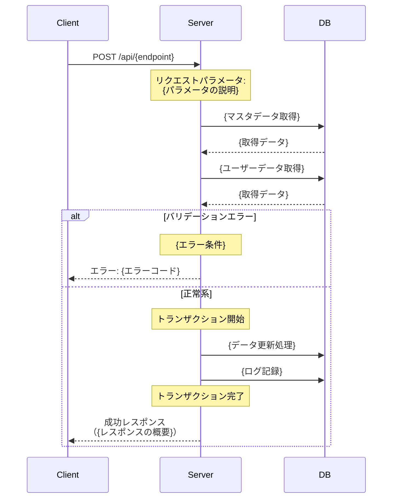

# {機能名} API設計書

## 目次

- [仕様書](#仕様書)
  - [要点まとめ](#要点まとめ)
  - [仕様確認](#仕様確認)
- [シーケンス図](#シーケンス図)
- [エラー設計](#エラー設計)
- [API仕様](#api仕様)
- [DB設計](#db設計)
  - [マスター/オペレーション](#マスターオペレーション)
  - [ユーザー](#ユーザー)
  - [ログ](#ログ)
- [テーブル一覧](#テーブル一覧)
- [実装上の注意点](#実装上の注意点)
- [テスト観点](#テスト観点)

---

## 仕様書

### 要点まとめ

#### 概要
- {機能名}は、{機能の概要説明を3-5文で記述}
- {主要な機能や特徴}
- {ユーザーへの提供価値}

#### DB変更点
- **新規追加:**
  - `mst_{テーブル名}`: {テーブルの説明}
  - `usr_{テーブル名}`: {テーブルの説明}
  - `log_{テーブル名}`: {テーブルの説明}

- **既存テーブルへの変更:**
  - なし

#### API
- **新規追加:**
  - `POST /api/{endpoint}`: {エンドポイントの説明}

- **既存APIへの変更:**
  - なし

### 仕様確認

#### 参照ドキュメント
- 既存実装コード: `api/app/Domain/{ドメイン名}/`
- {関連ドキュメント}: `{パス}`

#### 仕様ポイント

| 項目 | 内容 |
|------|------|
| {仕様項目1} | {内容の説明} |
| {仕様項目2} | {内容の説明} |
| {仕様項目3} | {内容の説明} |

---

## シーケンス図

### {メインフロー名}



---

## エラー設計

> クラサバで必ず認識共有する。
> クライアント側で、実際にどんな挙動にすべきか、不明瞭な状態をなくして、
> 本番リリース後に、CS対応も含めハンドリングしやすい状態にしておきたいです。

### {機能名}関連エラー

| エラーコード | 新規 | エラー内容 | 発生条件 | クライアント挙動 |
|------------|------|----------|---------|---------------|
| `ErrorCode::INVALID_PARAMETER` | - | パラメータ不正 | {発生条件の説明} | エラーダイアログ表示「{メッセージ}」→{画面遷移先} |
| `ErrorCode::MST_NOT_FOUND` | - | マスタ未存在 | {発生条件の説明} | エラーダイアログ表示「{メッセージ}」→{画面遷移先} |
| `ErrorCode::{新規エラーコード}` | 新規 | {エラー内容} | {発生条件の説明} | エラーダイアログ表示「{メッセージ}」→{画面遷移先} |
| `ErrorCode::LACK_OF_RESOURCES` | - | リソース不足 | {発生条件の説明} | エラーダイアログ表示「{メッセージ}」→{獲得導線を表示} |

**エラーハンドリング方針:**
- クライアント側で事前に{チェック内容}のバリデーションを実施
- サーバー側でも全てのバリデーションを必ず実施（クライアント改ざん対策）
- エラー発生時はトランザクションロールバックにより、データ不整合を防止

---

## API仕様

### POST /api/{endpoint}

{エンドポイントの説明文}

#### request

```json
{
  "{パラメータ1}": "{値の例}",
  "{パラメータ2}": {数値の例}
}
```

**パラメータ説明:**
- `{パラメータ1}` (string, required): {マスタテーブル名}.id
- `{パラメータ2}` (int, required): {パラメータの説明}（{範囲や制約}）

**バリデーション:**
- `{パラメータ1}`: {テーブル名}に存在するIDであること
- `{パラメータ2}`: {バリデーション条件}
- {その他のバリデーション条件}

#### response

```json
{
  "usrParameter": {
    "level": 50,
    "exp": 12345,
    "coin": 15000,
    "stamina": 100,
    "staminaUpdatedAt": "2025-12-09T10:00:00+09:00",
    "freeDiamond": 500,
    "paidDiamondIos": 100,
    "paidDiamondAndroid": 0
  },
  "usrItems": [
    {
      "mstItemId": "item_001",
      "amount": 50
    }
  ],
  "{機能固有のレスポンス}": [
    {
      "{フィールド1}": "{値}",
      "{フィールド2}": {数値}
    }
  ],
  "{報酬リスト}": [
    {
      "reward": {
        "unreceivedRewardReasonType": "None",
        "resourceType": "Item",
        "resourceId": "item_001",
        "resourceAmount": 10,
        "preConversionResource": null
      }
    }
  ]
}
```

**レスポンス説明:**
- `usrParameter`: ユーザーパラメータ（{変更されるパラメータの説明}）
  - `level`: プレイヤーレベル
  - `exp`: 経験値
  - `coin`: コイン
  - `stamina`: スタミナ
  - `staminaUpdatedAt`: スタミナ最終更新日時（ISO8601形式）
  - `freeDiamond`: 無償ダイヤ
  - `paidDiamondIos`: iOS有償ダイヤ
  - `paidDiamondAndroid`: Android有償ダイヤ
- `usrItems`: アイテム変更差分（{説明}）
  - `mstItemId`: アイテムマスタID
  - `amount`: 変更後の所持数
- `{機能固有のレスポンス}`: {説明}
  - `{フィールド1}`: {説明}
  - `{フィールド2}`: {説明}
- `{報酬リスト}`: 配布された報酬リスト（演出用）
  - `reward`: 報酬オブジェクト（BaseReward.formatToResponse()の出力形式）

**既存との互換性:**
- {互換性に関する説明、該当しない場合は省略可}

---

## DB設計

### マスター/オペレーション

#### mst_{テーブル名}（{新規/既存改修}）

{テーブルの説明}

| 列名 | index | データ型/制約 | 説明 |
|------|-------|---------------|------|
| id | PK | varchar(255) NOT NULL | {テーブル名}ID |
| release_key | | int NOT NULL | リリースキー |
| {カラム名} | | {データ型} | {説明}<br/>'{値}': {値の説明} |
| start_at | INDEX | datetime NOT NULL | 開始日時 |
| end_at | INDEX | datetime NULL | 終了日時（NULL: 無期限） |
| display_order | | int unsigned NOT NULL | 表示順序 |
| created_at | | datetime(6) NOT NULL DEFAULT CURRENT_TIMESTAMP(6) | 作成日時 |
| updated_at | | datetime(6) NOT NULL DEFAULT CURRENT_TIMESTAMP(6) ON UPDATE CURRENT_TIMESTAMP(6) | 更新日時 |

**追加カラムの説明:**
- `{カラム名}`: {カラムの詳細な説明}
- `end_at`: NULLの場合は無期限として扱う

**制約:**
- start_at < end_at（end_atがNULLでない場合）

---

#### mst_{テーブル名}_i18n（{新規/既存改修}）

{テーブルの説明}多言語テキスト情報を管理するテーブル。

| 列名 | index | データ型/制約 | 説明 |
|------|-------|---------------|------|
| id | PK | varchar(255) NOT NULL | レコードID |
| mst_{テーブル名}_id | INDEX | varchar(255) NOT NULL | mst_{テーブル名}.id |
| language | | enum('ja','en','zh-Hant') NOT NULL DEFAULT 'ja' | 言語コード |
| name | | varchar(255) NOT NULL | 名称 |
| asset_key | | varchar(255) NULL | アセットキー |
| created_at | | datetime(6) NOT NULL DEFAULT CURRENT_TIMESTAMP(6) | 作成日時 |
| updated_at | | datetime(6) NOT NULL DEFAULT CURRENT_TIMESTAMP(6) ON UPDATE CURRENT_TIMESTAMP(6) | 更新日時 |

**制約:**
- UNIQUE(mst_{テーブル名}_id, language)

---

### ユーザー

> ⚠️ PKの貼り方について、TiDB最適化の観点から以下の方針:
>
> **1ユーザーあたり1レコードのみのテーブル**
> - PK：usr_user_id
>
> **1ユーザーあたり複数レコードできるテーブル**
> - 複合PK：usr_user_id, ドメインID or マスタID

#### usr_{テーブル名}（{新規/既存改修}）

{テーブルの説明}を管理するテーブル。

| 列名 | index | データ型/制約 | 説明 |
|------|-------|---------------|------|
| usr_user_id | PK | varchar(255) NOT NULL | usr_users.id |
| mst_{関連テーブル}_id | PK | varchar(255) NOT NULL | mst_{関連テーブル}.id |
| {カラム名} | | int unsigned NOT NULL DEFAULT 0 | {説明} |
| {日時カラム} | | datetime NULL | {説明}（{用途}） |
| created_at | | datetime(6) NOT NULL DEFAULT CURRENT_TIMESTAMP(6) | 作成日時 |
| updated_at | | datetime(6) NOT NULL DEFAULT CURRENT_TIMESTAMP(6) ON UPDATE CURRENT_TIMESTAMP(6) | 更新日時 |

**追加カラムの説明:**
- `{カラム名}`: {カラムの詳細な説明}
- `{日時カラム}`: {用途の詳細説明}

**利用箇所:**
- POST /api/{endpoint}: {利用方法の説明}

**設計上の注意:**
- 複合PK（usr_user_id, mst_{関連テーブル}_id）でTiDB最適化
- {その他の設計上の注意点}

---

### ログ

#### log_{テーブル名}（{新規/既存改修}）

{アクション}のログを記録するテーブル。

| 列名 | index | データ型/制約 | 説明 |
|------|-------|---------------|------|
| id | PK | bigint unsigned AUTO_INCREMENT | ログID |
| usr_user_id | INDEX | varchar(255) NOT NULL | usr_users.id |
| nginx_request_id | | varchar(255) NULL | Nginxリクエストヘッダから取得されるログ追跡用ID |
| request_id | | varchar(255) NULL | アプリケーション内で生成されるログ追跡用ID |
| logging_no | | int NOT NULL DEFAULT 1 | 1回のリクエストでのログ番号 |
| mst_{関連テーブル}_id | | varchar(255) NOT NULL | mst_{関連テーブル}.id |
| {詳細カラム} | | json NOT NULL | {詳細情報}（JSON形式） |
| {カウントカラム} | | int unsigned NOT NULL | {カウント対象の説明} |
| created_at | INDEX | datetime(6) NOT NULL DEFAULT CURRENT_TIMESTAMP(6) | 作成日時 |
| updated_at | | datetime(6) NOT NULL DEFAULT CURRENT_TIMESTAMP(6) ON UPDATE CURRENT_TIMESTAMP(6) | 更新日時 |

**ログ記録タイミング:**
- POST /api/{endpoint}: {処理完了時に1レコード記録など}

**{詳細カラム}例:**
```json
[
  {"{key1}": "{value1}", "{key2}": {value2}}
]
```

---

## テーブル一覧

| テーブル名 | 新規/既存 | 概要 |
|-----------|----------|------|
| mst_{テーブル名} | 既存 | {テーブルの概要} |
| mst_{テーブル名}_i18n | 既存 | {テーブルの概要} |
| usr_{テーブル名} | 既存 | {テーブルの概要} |
| log_{テーブル名} | 既存 | {テーブルの概要} |

---

## 実装上の注意点

### トランザクション制御

- **{処理1}→{処理2}の順序を厳守:**
  - トランザクション内で、必ず「{処理1}」→「{処理2}」の順序で実行
  - {処理2}に失敗した場合、トランザクションロールバックにより{処理1}も取り消される

- **{特殊処理}:**
  - {特殊処理の説明}
  - {判定条件や処理内容}

### {その他の注意点タイトル}

- {注意点の詳細説明}
- {実装時の考慮事項}

---

## テスト観点

### 単体テスト
- {ロジックの検証内容}
- {境界値テスト内容}
- {エラーケーステスト}

### 機能テスト
- POST /api/{endpoint}: 正常系（{テストケースの説明}）
- POST /api/{endpoint}: 異常系（{エラーケースの説明}）
- {その他のテストケース}

### シナリオテスト
1. {シナリオ1の説明}
2. {シナリオ2の説明}
3. {シナリオ3の説明}
