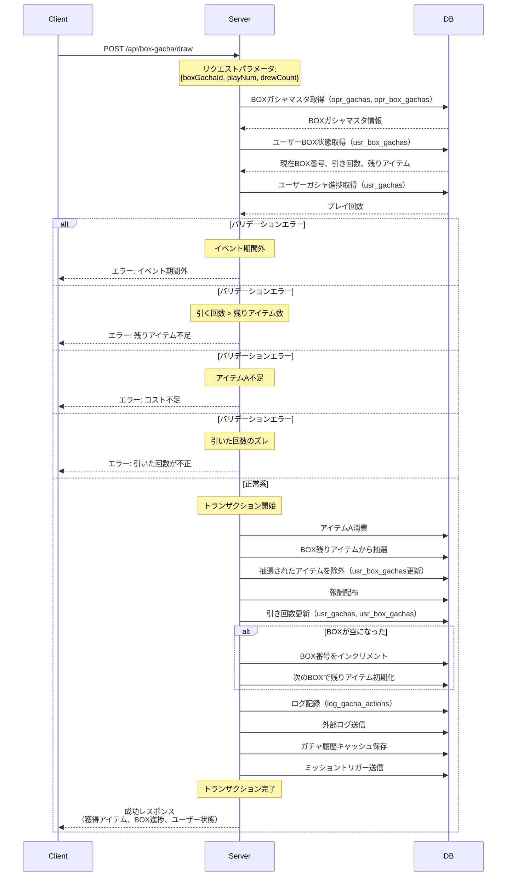
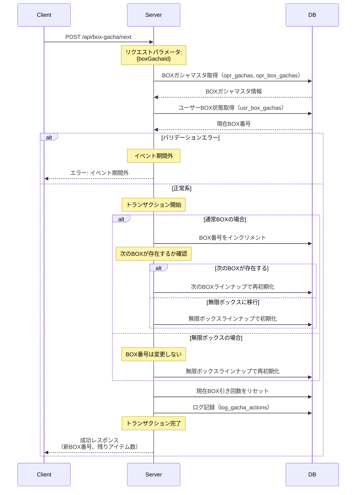
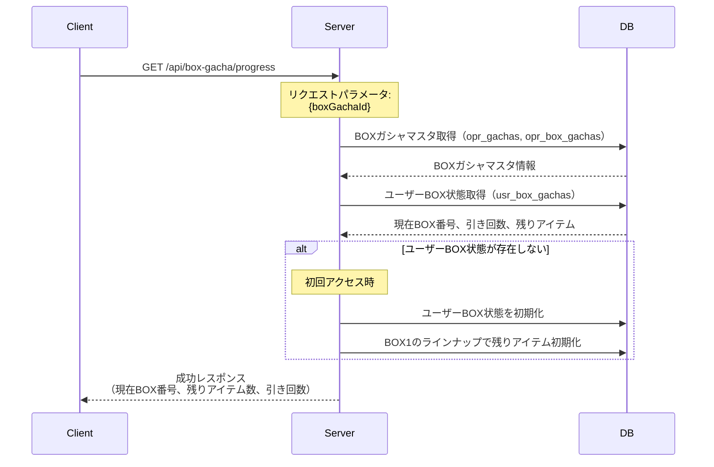

# BOXガシャ API設計書

## 目次

- [仕様書](#仕様書)
  - [要点まとめ](#要点まとめ)
  - [仕様確認](#仕様確認)
- [シーケンス図](#シーケンス図)
- [エラー設計](#エラー設計)
- [API仕様](#api仕様)
- [DB設計](#db設計)
  - [マスター/オペレーション](#マスターオペレーション)
  - [ユーザー](#ユーザー)
  - [ログ](#ログ)

---

## 仕様書

### 要点まとめ

#### 概要
- BOXガシャは、運要素を排除した「確実な報酬」を提供するイベント型ガシャ機能
- BOX内のアイテム総数が決まっており、引き続ければ必ず目玉報酬が手に入る「天井の可視化」を実現
- BOX1個あたり100個のアイテムを管理し、引いたアイテムは除外される
- イベント専用アイテムAを消費してガシャを実行し、BOXが空になったら次のBOXへ移行（手動での移行も可能）
- 通常BOXを全て引き終わったら無限ボックスに移行し、繰り返し利用可能

#### DB変更点
- **新規追加:**
  - `opr_box_gachas`: BOXガシャ固有設定（総BOX数、無限ボックス設定等）
  - `usr_box_gachas`: ユーザーBOX状態（BOX番号、引き回数、残りアイテム）
  - `log_gacha_actions`: 既存テーブルにBOXガシャのログを記録（変更なし）

- **既存テーブルへの変更:**
  - `opr_gachas`: BOXガシャのレコードを追加（gacha_type = 'Box' を追加想定）
  - `opr_gacha_prizes`: BOXラインナップを登録（group_idでBOX番号ごとに管理）
  - `usr_gachas`: BOXガシャのプレイ回数を記録（変更なし、既存の仕組みを利用）

#### API
- **新規追加:**
  - `POST /api/box-gacha/draw`: BOXガシャ実行
  - `POST /api/box-gacha/next`: 次のBOXへ移行（手動リセット含む）
  - `GET /api/box-gacha/progress`: BOX進捗情報取得

- **既存APIへの変更:**
  - なし（マスタデータ配信は既存の仕組みをそのまま利用）

### 仕様確認

#### 参照ドキュメント
- [サーバーAPI要件書](./05_サーバーAPI要件書.md)
- [ゲーム体験仕様書](./ゲーム体験仕様書.pdf)

#### ゲーム体験仕様確認結果

| Q | A |
|---|---|
| Q3: BOX内のアイテム総数 | 100個 |
| Q4: BOXリセット方法 | ユーザー手動 |
| Q5: 途中でのリセット | 可能 |
| Q6: 残りアイテム数を超えて引く場合 | エラーで引けない |
| Q7-9: コスト | アイテムA 150個で1回、1,500個で10回 |
| Q10: 無限ボックスのラインナップ | 通常BOXと同じにも違うものにもできる |
| Q11: 無限ボックスへの移行 | 通常BOXを引き終わった後から |
| Q12: 無限ボックスのリセット | 手動 |
| Q13-14: 重複キャラクター | キャラのかけらアイテムに変換 |
| Q15: 天井カウンター | 不要（BOX自体が天井） |
| Q16: 1日あたりのプレイ回数制限 | なし |
| Q17: コスト効率（割引） | 既存マスタ設定で対応可能 |
| Q18: イベント期間 | 2週間〜1ヶ月程度 |

---

## シーケンス図

### BOXガシャ実行フロー



### 次のBOXへ移行フロー



### BOX進捗情報取得フロー



---

## エラー設計

> ⚠️ クラサバで必ず認識共有する。
> クライアント側で、実際にどんな挙動にすべきか、不明瞭な状態をなくして、
> 本番リリース後に、CS対応も含めハンドリングしやすい状態にしておきたいです。

### BOXガシャ関連エラー

| エラーコード | エラー内容 | 発生条件 | クライアント挙動 |
|------------|----------|---------|---------------|
| `ErrorCode::BOX_GACHA_NOT_FOUND` | BOXガシャが存在しない | 指定されたboxGachaIdのマスタデータが存在しない | エラーダイアログ表示「BOXガシャが見つかりません」→トップ画面に戻る |
| `ErrorCode::BOX_GACHA_EXPIRED` | イベント期間外 | 現在時刻がイベント開始前またはイベント終了後 | エラーダイアログ表示「イベント期間外です」→トップ画面に戻る |
| `ErrorCode::BOX_GACHA_INSUFFICIENT_ITEMS` | 残りアイテム不足 | 引く回数が残りアイテム数を超えている | エラーダイアログ表示「残りアイテムが不足しています」→BOXガシャ画面に戻る（引く回数を変更するよう促す） |
| `ErrorCode::BOX_GACHA_INSUFFICIENT_COST` | コスト不足 | アイテムAの所持数が引く回数に必要なコストより少ない | エラーダイアログ表示「アイテムが不足しています」→イベントクエスト画面に誘導 |
| `ErrorCode::BOX_GACHA_INVALID_PLAY_NUM` | 引く回数が不正 | マスタで定義されていない回数での引きリクエスト | エラーダイアログ表示「不正なリクエストです」→BOXガシャ画面に戻る |
| `ErrorCode::BOX_GACHA_DREW_COUNT_MISMATCH` | 引いた回数のズレ | クライアント側とサーバー側の引いた回数が一致しない | エラーダイアログ表示「データが同期されていません」→画面リロードを促す |

**エラーハンドリング方針:**
- クライアント側で事前にバリデーションを実施し、不正なリクエストを防止する
- サーバー側でも必ず全てのバリデーションを実施する（クライアント改ざん対策）
- エラー発生時はトランザクションロールバックにより、データ不整合を防止する
- 引いた回数のズレが発生した場合は、クライアント側でリロードを促し、最新状態を取得する

---

## API仕様

### POST /api/box-gacha/draw

BOXガシャを実行し、報酬を配布する。

#### request

```json
{
  "boxGachaId": "box_gacha_001",
  "playNum": 1,
  "drewCount": 5
}
```

**パラメータ説明:**
- `boxGachaId` (string, required): BOXガシャID（opr_gachas.id）
- `playNum` (int, required): 引く回数（1, 10など、マスタで定義された回数のみ許可）
- `drewCount` (int, required): クライアント側で記録している累計引き回数（ズレチェック用）

**バリデーション:**
- `boxGachaId`: opr_gachasに存在するIDであること
- `playNum`: マスタで定義された回数であること（opr_gachas.multi_draw_count等）
- `playNum`: 残りアイテム数以下であること
- `drewCount`: サーバー側の記録と一致すること
- イベント期間内であること（opr_gachas.start_at ≤ now ≤ opr_gachas.end_at）
- アイテムAの所持数が引く回数に必要なコスト以上であること

#### response

```json
{
  "gachaRewards": [
    {
      "rewardType": "item",
      "rewardId": "item_001",
      "rewardAmount": 10
    },
    {
      "rewardType": "character",
      "rewardId": "char_001",
      "rewardAmount": 1
    }
  ],
  "boxProgress": {
    "currentBoxNumber": 1,
    "remainingItemsCount": 90,
    "drewCount": 10,
    "totalDrewCount": 10
  },
  "usrUnits": [
    {
      "usrUnitId": "usr_unit_001",
      "unitId": "char_001",
      "level": 1,
      "isNew": true
    }
  ],
  "usrItems": [
    {
      "itemId": "item_001",
      "amount": 100,
      "diff": 10
    }
  ],
  "usrParameter": {
    "usrUserId": "user_001",
    "level": 50,
    "exp": 12345
  }
}
```

**レスポンス説明:**
- `gachaRewards`: 獲得したアイテムリスト
  - `rewardType`: 報酬タイプ（item, character, currency等）
  - `rewardId`: 報酬ID（アイテムID、キャラクターID等）
  - `rewardAmount`: 報酬数量
- `boxProgress`: BOX進捗情報
  - `currentBoxNumber`: 現在のBOX番号（1, 2, 3, ... または無限ボックス番号）
  - `remainingItemsCount`: 残りアイテム数
  - `drewCount`: 現在BOXで引いた回数
  - `totalDrewCount`: 累計引き回数
- `usrUnits`: ユニット変更差分（新規獲得または重複変換後）
- `usrItems`: アイテム変更差分（獲得アイテム、消費したアイテムA含む）
- `usrParameter`: ユーザーパラメータ（レベル、経験値等）

**既存との互換性:**
- 新規APIのため、互換性の考慮は不要

---

### POST /api/box-gacha/next

次のBOXへ移行する。BOXが空になった場合の自動移行、またはユーザーが途中で手動移行する場合の両方に対応。

#### request

```json
{
  "boxGachaId": "box_gacha_001"
}
```

**パラメータ説明:**
- `boxGachaId` (string, required): BOXガシャID（opr_gachas.id）

**バリデーション:**
- `boxGachaId`: opr_gachasに存在するIDであること
- イベント期間内であること

#### response

```json
{
  "boxProgress": {
    "currentBoxNumber": 2,
    "remainingItemsCount": 100,
    "drewCount": 0,
    "totalDrewCount": 100
  }
}
```

**レスポンス説明:**
- `boxProgress`: 移行後のBOX進捗情報
  - `currentBoxNumber`: 移行後のBOX番号
  - `remainingItemsCount`: 移行後の残りアイテム数（通常100個）
  - `drewCount`: 移行後の現在BOX引き回数（0にリセット）
  - `totalDrewCount`: 累計引き回数（リセットしない）

**既存との互換性:**
- 新規APIのため、互換性の考慮は不要

---

### GET /api/box-gacha/progress

ユーザーの現在のBOX進捗情報を取得する。

#### request

```
GET /api/box-gacha/progress?boxGachaId=box_gacha_001
```

**パラメータ説明:**
- `boxGachaId` (string, required): BOXガシャID（opr_gachas.id）

**バリデーション:**
- `boxGachaId`: opr_gachasに存在するIDであること

#### response

```json
{
  "mstBoxGacha": {
    "boxGachaId": "box_gacha_001",
    "name": "〇〇イベントBOXガシャ",
    "startAt": "2025-11-01T00:00:00Z",
    "endAt": "2025-11-30T23:59:59Z",
    "totalBoxCount": 3
  },
  "boxProgress": {
    "currentBoxNumber": 1,
    "remainingItemsCount": 95,
    "drewCount": 5,
    "totalDrewCount": 5
  },
  "costInfo": {
    "costItemId": "item_a",
    "costPerDraw": {
      "1": 150,
      "10": 1500
    },
    "currentAmount": 3000
  }
}
```

**レスポンス説明:**
- `mstBoxGacha`: BOXガシャ基本情報
  - `boxGachaId`: BOXガシャID
  - `name`: BOXガシャ名
  - `startAt`: イベント開始日時（ISO8601形式）
  - `endAt`: イベント終了日時（ISO8601形式）
  - `totalBoxCount`: 通常BOXの総数（無限ボックス除く）
- `boxProgress`: BOX進捗情報
- `costInfo`: コスト情報
  - `costItemId`: コストアイテムID（アイテムA）
  - `costPerDraw`: 引く回数ごとのコスト（{回数: コスト}）
  - `currentAmount`: 現在のアイテムA所持数

**既存との互換性:**
- 新規APIのため、互換性の考慮は不要

---

## DB設計

### マスター/オペレーション

#### opr_gachas（既存テーブル変更）

既存のガシャマスタテーブル。BOXガシャのレコードを追加する。

**追加が必要な変更:**
- `gacha_type`にenumとして'Box'を追加（または既存のtypeを使用）

**BOXガシャ用のレコード例:**
| 列名 | 設定値 | 説明 |
|------|-------|------|
| id | "box_gacha_001" | BOXガシャID |
| gacha_type | 'Box' | ガシャタイプ（新規追加） |
| multi_draw_count | 10 | 複数回引きの回数 |
| daily_play_limit_count | NULL | プレイ回数制限なし |
| prize_group_id | "box_gacha_001_box1" | 景品グループID（BOX1のラインナップ） |
| start_at | '2025-11-01 00:00:00' | イベント開始日時 |
| end_at | '2025-11-30 23:59:59' | イベント終了日時 |

**既存との互換性:**
- 既存のガシャ機能には影響なし（gacha_typeで区別）

---

#### opr_gacha_prizes（既存テーブル）

既存の景品マスタテーブル。BOXのラインナップをgroup_idで管理する。

**BOXガシャ用のレコード例:**
| 列名 | 設定値 | 説明 |
|------|-------|------|
| id | "box_gacha_001_box1_prize_001" | 景品ID |
| group_id | "box_gacha_001_box1" | 景品グループID（BOX1） |
| resource_type | 'Item' | リソースタイプ |
| resource_id | "item_001" | アイテムID |
| resource_amount | 10 | アイテム数量 |
| weight | 1 | 重み（BOXガシャでは使用しない、全て1） |
| pickup | 0 | ピックアップフラグ（BOXガシャでは使用しない） |

**既存との互換性:**
- 既存のガシャ機能には影響なし（group_idで区別）

**BOXガシャでの使い方:**
- group_idを`{box_gacha_id}_box{box_number}`の形式で設定（例: "box_gacha_001_box1", "box_gacha_001_box2"）
- 無限ボックスの場合は`{box_gacha_id}_infinite`（例: "box_gacha_001_infinite"）
- weightは全て1に設定（BOXガシャでは確率抽選ではなく、残りアイテムから等確率で抽選）

---

#### opr_box_gachas（新規テーブル）

BOXガシャ固有の設定を管理するテーブル。

| 列名 | index | データ型/制約 | 説明 |
|------|-------|---------------|------|
| id | PK | varchar(255) | BOXガシャID（opr_gachas.idと一致） |
| total_box_count | | int unsigned NOT NULL DEFAULT 1 | 通常BOXの総数（無限ボックス除く） |
| infinite_box_group_id | | varchar(255) NULL | 無限ボックスの景品グループID（opr_gacha_prizes.group_id）<br/>NULL: 最後の通常BOXと同じラインナップ |
| cost_item_id | | varchar(255) NOT NULL | コストアイテムID（アイテムA） |
| **cost_per_draw** | | **text NOT NULL** | **引く回数ごとのコスト（JSON形式）**<br/>**例: {"1": 150, "10": 1500}** |
| created_at | | datetime(6) NOT NULL DEFAULT CURRENT_TIMESTAMP(6) | 作成日時 |
| updated_at | | datetime(6) NOT NULL DEFAULT CURRENT_TIMESTAMP(6) ON UPDATE CURRENT_TIMESTAMP(6) | 更新日時 |

**追加カラムの説明:**
- `total_box_count`: 通常BOXの総数。無限ボックスに移行するBOX番号は `total_box_count + 1`
- `infinite_box_group_id`: 無限ボックスの景品グループID。NULLの場合、最後の通常BOXと同じラインナップを使用
- `cost_per_draw`: JSON形式で引く回数ごとのコストを定義。例: `{"1": 150, "10": 1500}`

**制約:**
- `total_box_count` >= 1 であること
- idはopr_gachas.idと一致すること（外部キー制約）

---

### ユーザー

> ⚠️ PKの貼り方について、TiDB最適化の観点から以下の方針:
>
> **1ユーザーあたり1レコードのみのテーブル**
> - PK：usr_user_id
>
> **1ユーザーあたり複数レコードできるテーブル**
> - 複合PK：usr_user_id, ドメインID or マスタID

#### usr_gachas（既存テーブル）

既存のガシャ進捗管理テーブル。BOXガシャのプレイ回数もここで管理する。

**BOXガシャでの使い方:**
- BOXガシャのレコードを追加（opr_gacha_id = BOXガシャID）
- `count`: 累計引き回数を記録
- `daily_count`: 日次引き回数（BOXガシャでは制限なしだが記録は行う）
- `played_at`: 最終プレイ日時

**既存との互換性:**
- 既存のガシャ機能には影響なし（opr_gacha_idで区別）

---

#### usr_box_gachas（新規テーブル）

ユーザーBOX状態（BOX番号、引き回数、残りアイテム）を管理するテーブル。

| 列名 | index | データ型/制約 | 説明 |
|------|-------|---------------|------|
| usr_user_id | PK | varchar(255) | usr_users.id |
| opr_gacha_id | PK | varchar(255) | BOXガシャID（opr_gachas.id） |
| current_box_number | | int unsigned NOT NULL DEFAULT 1 | 現在のBOX番号（1, 2, 3, ...） |
| drew_count | | int unsigned NOT NULL DEFAULT 0 | 現在BOXで引いた回数 |
| **remaining_prizes_json** | | **text NOT NULL** | **残りアイテムリスト（JSON形式）**<br/>**例: [{"prizeId": "prize_001", "count": 5}, ...]** |
| created_at | | datetime(6) NOT NULL DEFAULT CURRENT_TIMESTAMP(6) | 作成日時 |
| updated_at | | datetime(6) NOT NULL DEFAULT CURRENT_TIMESTAMP(6) ON UPDATE CURRENT_TIMESTAMP(6) | 更新日時 |

**追加カラムの説明:**
- `current_box_number`: 現在引いているBOX番号。無限ボックスの場合は特定の値（例：999）で表現
- `drew_count`: 現在BOXで引いた回数。次のBOXへ移行時に0にリセット
- `remaining_prizes_json`: 残りアイテムリストをJSON形式で保存。抽選時に更新
  - JSON形式例: `[{"prizeId": "prize_001", "count": 5}, {"prizeId": "prize_002", "count": 3}, ...]`
  - 抽選されたアイテムのcountを減算、0になったら配列から削除

**利用箇所:**
- POST /api/box-gacha/draw: 引き回数の更新、BOX番号のインクリメント、残りアイテム更新
- POST /api/box-gacha/next: BOX番号の更新、drew_countのリセット、残りアイテム再初期化
- GET /api/box-gacha/progress: BOX進捗情報の取得

**設計上の注意:**
- JSON形式で残りアイテムを管理することで、テーブル数を削減
- BOX1個あたり最大100アイテムなので、JSON形式でも問題なし
- 抽選処理はJSON→配列変換→ランダム抽選→JSON更新の流れ

---

### ログ

#### log_gacha_actions（既存テーブル）

既存のガチャアクションログテーブル。BOXガシャのログもここに記録する。

**BOXガシャでの使い方:**
- BOXガシャのログレコードを追加
- log_triggerにBOXガシャ固有の情報をJSON形式で記録

**log_trigger例:**
```json
{
  "trigger": "box_gacha_draw",
  "boxNumber": 1,
  "drewCount": 10,
  "totalDrewCount": 100,
  "remainingItemsCount": 90,
  "rewards": [
    {"rewardType": "item", "rewardId": "item_001", "rewardAmount": 10}
  ]
}
```

**既存との互換性:**
- 既存のガシャ機能には影響なし（log_triggerで区別）

---

## テーブル一覧

| テーブル名 | 新規/既存 | 概要 |
|-----------|----------|------|
| opr_gachas | 既存（変更） | ガシャマスタ（BOXガシャのレコードを追加） |
| opr_gacha_prizes | 既存 | 景品マスタ（BOXラインナップを登録） |
| opr_box_gachas | 新規 | BOXガシャ固有設定（総BOX数、無限ボックス設定等） |
| usr_gachas | 既存 | ガシャ進捗（BOXガシャのプレイ回数を記録） |
| usr_box_gachas | 新規 | ユーザーBOX状態（BOX番号、引き回数、残りアイテム） |
| log_gacha_actions | 既存 | ガチャアクションログ（BOXガシャのログを記録） |

---

## 実装上の注意点

### トランザクション制御

- **コスト消費→報酬配布の順序を厳守:**
  - トランザクション内で、必ず「コスト消費」→「報酬配布」の順序で実行
  - 報酬配布に失敗した場合、トランザクションロールバックによりコスト消費も取り消される

- **残りアイテム更新のタイミング:**
  - 抽選後、即座に残りアイテムを更新（remaining_prizes_jsonを更新）
  - 同一トランザクション内で実行し、整合性を保証

### 不正防止

- **引いた回数のズレチェック（validateDrewCount）:**
  - クライアント側とサーバー側の引いた回数を比較
  - ズレが発生した場合はエラーを返し、クライアント側でリロードを促す

- **残りアイテム数チェック:**
  - 引く回数が残りアイテム数を超える場合はエラー
  - 存在しないアイテムの取得を防止

### 次のBOXへ移行時の残りアイテムの扱い

- **残存する不明点:** BOX途中で次のBOXへ移行する際の残りアイテムは破棄 or 持ち越し？
- **実装上の仮定:** 破棄（再初期化）として実装
- **要確認:** ゲーム企画担当者に確認が必要

---

## パフォーマンス考慮事項

- **JSON形式での残りアイテム管理:**
  - BOX1個あたり最大100アイテムなので、JSON形式でも十分高速
  - 抽選処理はメモリ上で完結（JSON→配列変換→抽選→JSON更新）

- **抽選処理の最適化:**
  - 残りアイテムリストから抽選する際、PHPの配列操作で処理を完結
  - DB I/Oを最小限に抑える（1回の抽選でSELECT 1回、UPDATE 1回）

- **キャッシュ戦略:**
  - BOXガシャマスタデータはキャッシュに保存し、DB負荷を軽減
  - ユーザーBOX状態もキャッシュ可能（ただし、トランザクション内では最新データをDBから取得）

---

## テスト観点

### 単体テスト
- BOX残りアイテムからの抽選ロジックが正しく動作するか
- 抽選されたアイテムが正しく除外されるか（remaining_prizes_jsonの更新）
- BOXが空になったときにBOX番号が正しくインクリメントされるか
- 無限ボックスへの移行判定が正しく動作するか
- 次のBOXへ移行処理が正しく動作するか（BOX番号更新、残りアイテム再初期化）

### 機能テスト
- POST /api/box-gacha/draw: 正常系（1回引き、10回引き）、異常系（残りアイテム不足、コスト不足、期間外、ズレ検出）
- POST /api/box-gacha/next: 正常系（通常BOX移行、無限ボックス移行）、異常系（期間外）
- GET /api/box-gacha/progress: 正常系（初回アクセス時の初期化、進捗情報取得）

### シナリオテスト
1. BOX1を100回引く（BOXが空になる）→ 自動的にBOX2に移行
2. BOX1を50回引く → 手動で次のBOXへ移行 → BOX2に移行
3. 通常BOXを全て引き終わる → 無限ボックスに移行 → 次のBOXへ移行 → 無限ボックスで再初期化
4. 同時リクエスト時のトランザクション整合性テスト（残りアイテムの二重取得防止）
