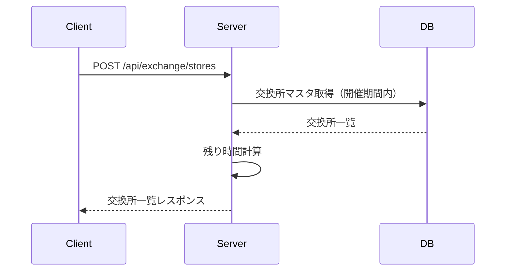
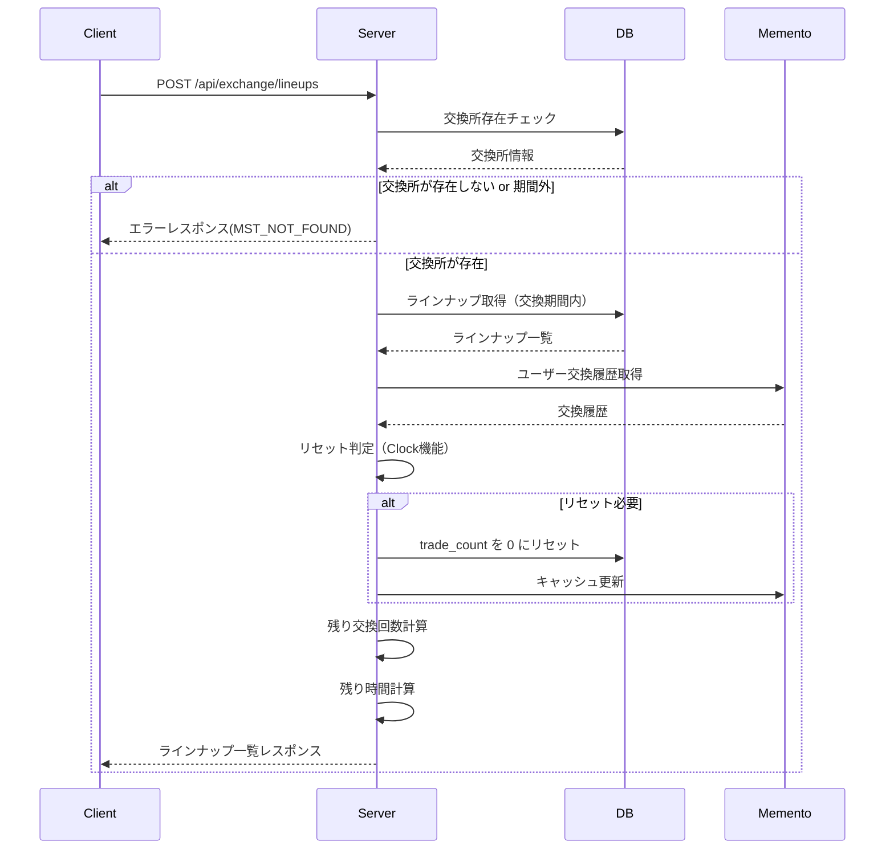
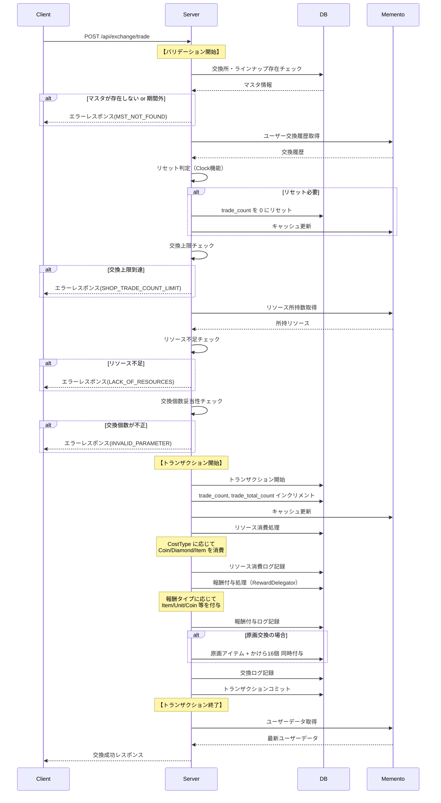
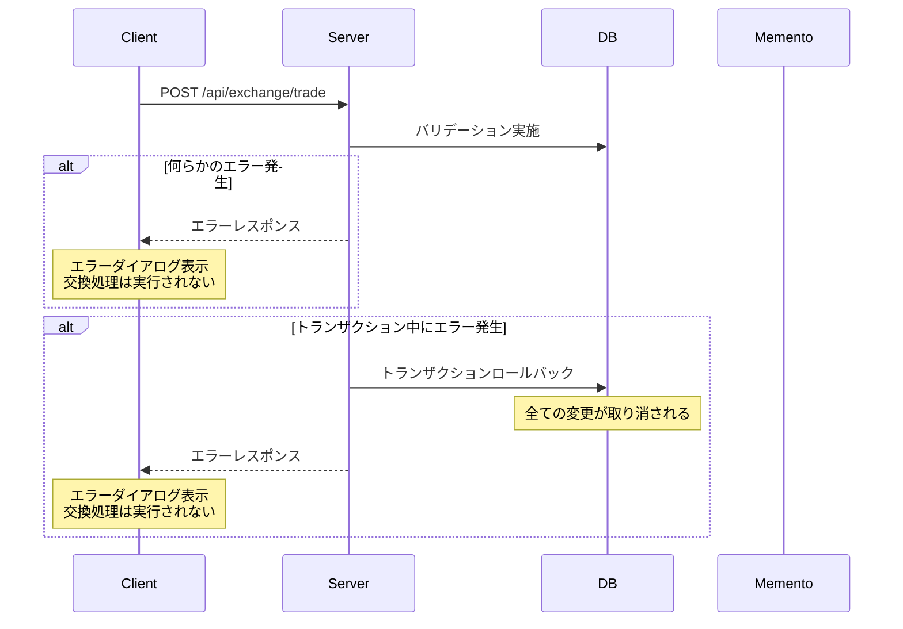

# 交換所 API設計書

## 目次

- [仕様書](#仕様書)
  - [要点まとめ](#要点まとめ)
  - [仕様確認](#仕様確認)
- [シーケンス図](#シーケンス図)
- [エラー設計](#エラー設計)
- [API仕様](#api仕様)
- [DB設計](#db設計)
  - [マスター/オペレーション](#マスターオペレーション)
  - [ユーザー](#ユーザー)
  - [ログ](#ログ)

---

## 仕様書

### 要点まとめ

#### 概要
- 交換所機能は、プレイヤーがゲーム内リソース（アイテム、コイン、ダイヤ等）を使用して、別のアイテムやキャラクター（またはそのピース）と交換できる機能
- 3種類の交換所（通常、イベント、キャラのかけらBOX）を提供し、それぞれ異なる開催期間とリセット方式を持つ
- 既存のShop機能と類似した構造だが、複数リソース消費、原画の特別処理（原画+かけら16個同時付与）、まとめて交換機能などの拡張機能を持つ
- ユーザーごとの交換履歴は`trade_count`（リセット可能）と`trade_total_count`（永続）の二重管理を行い、交換上限制御とゲーム仕様での利用の両方に対応

#### DB変更点
- **新規追加:**
  - `mst_exchange_stores`: 交換所マスタテーブル
  - `mst_exchange_lineups`: 交換ラインナップマスタテーブル
  - `mst_exchange_costs`: 交換コストマスタテーブル（複数リソース消費対応）
  - `usr_exchange_lineups`: ユーザー交換履歴テーブル
  - `log_exchange_lineups`: 交換実行ログテーブル

- **既存テーブルへの変更:**
  - なし（新規機能のため、既存テーブルへの変更は不要）

#### API
- **新規追加:**
  - `POST /api/exchange/stores`: 交換所一覧取得API
  - `POST /api/exchange/lineups`: 交換ラインナップ一覧取得API
  - `POST /api/exchange/trade`: 交換実行API

- **既存APIへの変更:**
  - なし

### 仕様確認

#### 参照ドキュメント
- [サーバーAPI要件書](./05_サーバーAPI要件書.md)
- [サーバー要件_コード調査追記](./サーバー要件_コード調査追記.md)
- [サーバー仕様レビュー](./03_サーバー仕様レビュー.md)

#### ゲーム体験仕様確認結果（主要Q&A）

| Q | A |
|---|---|
| Q1: 複数リソース消費機能は実装するか？ | 実装する。詳細仕様（最大組み合わせ数、バリデーション順序等）は要確認 |
| Q2: `trade_total_count`はゲーム仕様として使用するか？ | 使用する。クライアントへのレスポンスに含める |
| Q3: リセット処理はバッチで実装するか、アクセス時判定で実装するか？ | アクセス時判定で実装する（Clock機能を使用） |
| Q4: 原画交換時の処理方法は？ | 原画アイテムと原画のかけら16個を同時に付与し、完全に完成した状態で記録 |
| Q5: アイテムBOXのタブ分類はサーバー考慮が必要か？ | サーバー考慮不要。クライアント側で実装 |
| Q6: まとめて交換の初期交換個数はサーバー考慮が必要か？ | サーバー考慮不要。クライアント側の画面仕様 |
| Q8: 復刻時のリセット処理は実装必要か？ | 不要。マスタデータ運用で新規交換所IDを発行して対応 |
| Q10: イベント交換所は終了後いつまで表示するか？ | 終了後すぐに非表示（猶予期間なし） |

---

## シーケンス図

### 交換所一覧取得フロー



### 交換ラインナップ取得フロー



### 交換実行フロー（正常系）



### 交換実行フロー（エラー系）



---

## エラー設計

> ⚠️ クラサバで必ず認識共有する。
> クライアント側で、実際にどんな挙動にすべきか、不明瞭な状態をなくして、
> 本番リリース後に、CS対応も含めハンドリングしやすい状態にしておきたいです。

### 交換所関連エラー

| エラーコード | エラー内容 | 発生条件 | クライアント挙動 |
|------------|----------|---------|---------------|
| `ErrorCode::MST_NOT_FOUND` | 交換所・ラインナップが見つからない | ・交換所IDが存在しない<br/>・交換所の開催期間外（start_date未到来 or end_date過去）<br/>・ラインナップIDが存在しない<br/>・ラインナップの交換期間外 | エラーダイアログ表示「この交換所は現在利用できません」<br/>交換所一覧画面に戻る |
| `ErrorCode::SHOP_TRADE_COUNT_LIMIT` | 交換上限到達 | `trade_count >= tradable_count` かつ `tradable_count IS NOT NULL` | エラーダイアログ表示「交換上限に達しました」<br/>交換ボタンを非活性にする（クライアント側で事前チェックも実施） |
| `ErrorCode::LACK_OF_RESOURCES` | リソース不足 | ・所持コイン不足<br/>・所持ダイヤ不足<br/>・所持アイテム不足<br/>・複数リソース消費時、いずれかが不足 | エラーダイアログ表示「リソースが不足しています」<br/>不足リソースの種類と必要数を表示<br/>（クライアント側で事前チェックも実施） |
| `ErrorCode::INVALID_PARAMETER` | 交換個数が不正 | ・交換個数 < 1<br/>・交換個数 > 残り交換可能回数<br/>・交換個数 > 所持リソースから計算可能な個数 | エラーダイアログ表示「交換個数が不正です」<br/>交換個数を適切な範囲に修正するか、交換をキャンセル |

**エラーハンドリング方針:**
- クライアント側で可能な限り事前バリデーションを実施し、不正なリクエストを送信しない
  - 交換上限到達時は交換ボタンを非活性にする
  - リソース不足時は交換ボタンを非活性にする、または不足量を表示
  - 交換個数の入力範囲を制限（1 ≦ 交換個数 ≦ 最大交換可能個数）
- サーバー側でも厳密にバリデーションを実施し、不正なリクエストをエラーで弾く
- エラー発生時は適切なエラーダイアログを表示し、ユーザーに次のアクションを促す
- トランザクション中のエラーは全てロールバックし、データの整合性を保証

---

## API仕様

### POST /api/exchange/stores

開催期間内の交換所一覧を取得する。各交換所の残り時間も計算して返却する。

#### request

```json
{}
```

**パラメータ説明:**
- なし（認証トークンのみ使用）

**バリデーション:**
- なし

#### response

```json
{
  "exchangeStores": [
    {
      "id": "exchange_store_001",
      "categoryType": "Normal",
      "displayName": "通常交換所",
      "assetKey": "exchange_store_normal",
      "startDate": "2025-01-01T00:00:00+09:00",
      "endDate": null,
      "remainingTime": null,
      "displayPriority": 1
    },
    {
      "id": "exchange_store_002",
      "categoryType": "Event",
      "displayName": "イベント交換所",
      "assetKey": "exchange_store_event_001",
      "startDate": "2025-01-10T04:00:00+09:00",
      "endDate": "2025-01-31T03:59:59+09:00",
      "remainingTime": {
        "days": 15,
        "hours": 23
      },
      "displayPriority": 2
    },
    {
      "id": "exchange_store_003",
      "categoryType": "CharacterFragmentBox",
      "displayName": "キャラのかけらBOX交換所",
      "assetKey": "exchange_store_character_fragment",
      "startDate": "2025-01-01T00:00:00+09:00",
      "endDate": null,
      "remainingTime": null,
      "displayPriority": 3
    }
  ]
}
```

**レスポンス説明:**
- `exchangeStores`: 開催期間内の交換所一覧
  - `id` (string): 交換所ID
  - `categoryType` (ExchangeStoreCategoryType): 交換所カテゴリー（Normal, Event, CharacterFragmentBox）
  - `displayName` (string): 交換所の表示名
  - `assetKey` (string): バナー画像等のアセットキー
  - `startDate` (DateTimeOffset): 開催開始日時（ISO 8601形式）
  - `endDate` (DateTimeOffset | null): 開催終了日時（ISO 8601形式）、無期限の場合はnull
  - `remainingTime` (object | null): 残り時間。無期限の場合はnull
    - `days` (int): 残り日数（切り上げ）
    - `hours` (int): 残り時間（切り捨て、0-23）
  - `displayPriority` (int): 表示順序（昇順）

**既存との互換性:**
- 新規APIのため、既存APIへの影響なし

---

### POST /api/exchange/lineups

指定された交換所の交換ラインナップ一覧を取得する。ユーザーの交換履歴も含めて返却する。

#### request

```json
{
  "exchangeStoreId": "exchange_store_001"
}
```

**パラメータ説明:**
- `exchangeStoreId` (string, required): 交換所ID

**バリデーション:**
- `exchangeStoreId`が空文字列でないこと
- `exchangeStoreId`に対応する交換所が存在し、開催期間内であること

#### response

```json
{
  "exchangeStore": {
    "id": "exchange_store_001",
    "categoryType": "Normal",
    "displayName": "通常交換所",
    "assetKey": "exchange_store_normal",
    "resetType": "Monthly",
    "nextResetDate": "2025-02-01T04:00:00+09:00"
  },
  "lineups": [
    {
      "id": "lineup_001",
      "displayName": "スタミナ回復薬×10",
      "assetKey": "item_stamina_potion",
      "reward": {
        "resourceType": "Item",
        "resourceId": "item_stamina_potion",
        "resourceAmount": 10
      },
      "costs": [
        {
          "costType": "Coin",
          "costId": null,
          "costAmount": 1000
        }
      ],
      "tradableCount": 5,
      "usrTradeCount": 2,
      "usrTradeTotalCount": 12,
      "remainingTradeCount": 3,
      "startDate": "2025-01-01T00:00:00+09:00",
      "endDate": null,
      "remainingTime": null,
      "displayPriority": 1,
      "isOriginalArtwork": false
    },
    {
      "id": "lineup_002",
      "displayName": "キャラA ピース×1",
      "assetKey": "unit_a_piece",
      "reward": {
        "resourceType": "Item",
        "resourceId": "unit_a_piece",
        "resourceAmount": 1
      },
      "costs": [
        {
          "costType": "Coin",
          "costId": null,
          "costAmount": 500
        },
        {
          "costType": "Item",
          "costId": "item_event_token",
          "costAmount": 10
        }
      ],
      "tradableCount": null,
      "usrTradeCount": 0,
      "usrTradeTotalCount": 0,
      "remainingTradeCount": null,
      "startDate": "2025-01-01T00:00:00+09:00",
      "endDate": "2025-01-31T03:59:59+09:00",
      "remainingTime": {
        "days": 15,
        "hours": 23
      },
      "displayPriority": 2,
      "isOriginalArtwork": false
    },
    {
      "id": "lineup_003",
      "displayName": "原画: キャラBの笑顔",
      "assetKey": "artwork_b_smile",
      "reward": {
        "resourceType": "Item",
        "resourceId": "artwork_b_smile",
        "resourceAmount": 1
      },
      "costs": [
        {
          "costType": "Item",
          "costId": "artwork_fragment_b",
          "costAmount": 16
        }
      ],
      "tradableCount": 1,
      "usrTradeCount": 0,
      "usrTradeTotalCount": 0,
      "remainingTradeCount": 1,
      "startDate": "2025-01-01T00:00:00+09:00",
      "endDate": null,
      "remainingTime": null,
      "displayPriority": 3,
      "isOriginalArtwork": true
    }
  ]
}
```

**レスポンス説明:**
- `exchangeStore`: 交換所情報
  - `id` (string): 交換所ID
  - `categoryType` (ExchangeStoreCategoryType): 交換所カテゴリー
  - `displayName` (string): 交換所の表示名
  - `assetKey` (string): アセットキー
  - `resetType` (ExchangeResetType): リセット種別（None, Monthly）
  - `nextResetDate` (DateTimeOffset | null): 次回リセット日時。リセットなしの場合はnull

- `lineups`: 交換期間内のラインナップ一覧
  - `id` (string): ラインナップID
  - `displayName` (string): ラインナップの表示名
  - `assetKey` (string): アイテム画像等のアセットキー
  - `reward` (object): 報酬情報
    - `resourceType` (ResourceType): リソースタイプ（Item, Unit, Coin, FreeDiamond等）
    - `resourceId` (string): リソースID（ItemやUnitの場合はマスタID、CoinやDiamondの場合は空文字列）
    - `resourceAmount` (int): 報酬数量
  - `costs` (array): 必要リソース一覧（複数リソース消費対応）
    - `costType` (CostType): コストタイプ（Coin, Diamond, PaidDiamond, Item）
    - `costId` (string | null): コストID（ItemタイプのみマスタID、他はnull）
    - `costAmount` (int): 必要数量
  - `tradableCount` (int | null): 交換上限数。無制限の場合はnull
  - `usrTradeCount` (int): ユーザーの現在期間内交換回数（リセット対象）
  - `usrTradeTotalCount` (int): ユーザーの通算交換回数（永続）
  - `remainingTradeCount` (int | null): 残り交換可能回数。無制限の場合はnull
  - `startDate` (DateTimeOffset): 交換開始日時
  - `endDate` (DateTimeOffset | null): 交換終了日時。無期限の場合はnull
  - `remainingTime` (object | null): 残り時間。無期限の場合はnull
    - `days` (int): 残り日数（切り上げ）
    - `hours` (int): 残り時間（切り捨て、0-23）
  - `displayPriority` (int): 表示順序（昇順）
  - `isOriginalArtwork` (bool): 原画アイテムかどうか（trueの場合、交換時に原画+かけら16個を同時付与）

**既存との互換性:**
- 新規APIのため、既存APIへの影響なし

---

### POST /api/exchange/trade

交換を実行する。リソースを消費し、報酬を付与する。まとめて交換にも対応。

#### request

```json
{
  "lineupId": "lineup_001",
  "tradeCount": 3
}
```

**パラメータ説明:**
- `lineupId` (string, required): ラインナップID
- `tradeCount` (int, optional): 交換個数。省略時は1。1以上の整数を指定

**バリデーション:**
- `lineupId`が空文字列でないこと
- `lineupId`に対応するラインナップが存在し、交換期間内であること
- `tradeCount`が1以上であること
- `tradeCount`が残り交換可能回数以下であること（`tradableCount`がnullでない場合）
- 所持リソースが`必要リソース数 × tradeCount`以上であること（全てのコストについて）

#### response

```json
{
  "exchangeResult": {
    "lineupId": "lineup_001",
    "tradedCount": 3,
    "newTradeCount": 5,
    "newTradeTotalCount": 15,
    "remainingTradeCount": 0,
    "consumedResources": [
      {
        "costType": "Coin",
        "costId": null,
        "costAmount": 3000
      }
    ],
    "receivedRewards": [
      {
        "unreceivedRewardReasonType": "None",
        "resourceType": "Item",
        "resourceId": "item_stamina_potion",
        "resourceAmount": 30,
        "preConversionResource": null
      }
    ]
  },
  "usrParameter": {
    "coin": 47000,
    "freeDiamond": 1000,
    "paidDiamond": 500,
    "stamina": 120,
    "staminaRecoveredAt": "2025-01-15T12:30:00+09:00"
  },
  "usrItems": [
    {
      "id": "item_stamina_potion",
      "amount": 130
    }
  ],
  "usrUnits": []
}
```

**レスポンス説明:**
- `exchangeResult`: 交換結果
  - `lineupId` (string): ラインナップID
  - `tradedCount` (int): 今回交換した個数
  - `newTradeCount` (int): 交換後の現在期間内交換回数
  - `newTradeTotalCount` (int): 交換後の通算交換回数
  - `remainingTradeCount` (int | null): 交換後の残り交換可能回数。無制限の場合はnull
  - `consumedResources` (array): 消費したリソース一覧
    - `costType` (CostType): コストタイプ
    - `costId` (string | null): コストID
    - `costAmount` (int): 消費数量（`単位消費数 × tradeCount`）
  - `receivedRewards` (array): 受け取った報酬一覧（RewardDataと同じ構造）
    - `unreceivedRewardReasonType` (UnreceivedRewardReasonType): 受け取り結果（None, ResourceLimitReached等）
    - `resourceType` (ResourceType): リソースタイプ
    - `resourceId` (string): リソースID
    - `resourceAmount` (int): 受け取った数量（`単位報酬数 × tradeCount`）
    - `preConversionResource` (object | null): 報酬変換前の情報。変換がなければnull

- `usrParameter` (UsrParameterData): 交換後のユーザーパラメータ（コイン、ダイヤ、スタミナ等）
- `usrItems` (UsrItemData[]): 交換後のユーザーアイテム一覧（変動があったアイテムのみ）
- `usrUnits` (UsrUnitData[]): 交換後のユーザーユニット一覧（変動があったユニットのみ、キャラ交換時のみ）

**既存との互換性:**
- 新規APIのため、既存APIへの影響なし

**原画交換時の特別処理:**
- `isOriginalArtwork = true`のラインナップを交換した場合、以下の2つの報酬を付与:
  1. 原画アイテム（完成品）× `tradeCount`
  2. 原画のかけら × `16 × tradeCount`
- `receivedRewards`には両方の報酬が含まれる

---

## DB設計

### マスター/オペレーション

#### mst_exchange_stores（新規）

交換所マスタテーブル。3種類の交換所（通常、イベント、キャラのかけらBOX）を管理する。

| 列名 | index | データ型/制約 | 説明 |
|------|-------|---------------|------|
| id | PK | varchar(255) NOT NULL | 交換所ID |
| category_type | | enum('Normal','Event','CharacterFragmentBox') NOT NULL | 交換所カテゴリー<br/>・Normal: 通常交換所（無期限開催、月次リセット）<br/>・Event: イベント交換所（期間限定、リセットなし）<br/>・CharacterFragmentBox: キャラのかけらBOX交換所（無期限開催、リセットなし） |
| reset_type | | enum('None','Monthly') NOT NULL | リセット種別<br/>・None: リセットなし<br/>・Monthly: 月次リセット（毎月初日04:00） |
| display_name | | varchar(255) NOT NULL | 交換所の表示名 |
| asset_key | | varchar(255) NOT NULL | バナー画像等のアセットキー |
| start_date | | datetime NULL | 開催開始日時。NULLの場合は無期限 |
| end_date | | datetime NULL | 開催終了日時。NULLの場合は無期限 |
| display_priority | | int NOT NULL DEFAULT 0 | 表示順序（昇順） |
| created_at | | timestamp NOT NULL | 作成日時 |
| updated_at | | timestamp NOT NULL | 更新日時 |

**制約:**
- `category_type`と`reset_type`は対応関係がある:
  - Normal: Monthly
  - Event: None
  - CharacterFragmentBox: None
- `start_date`と`end_date`の両方がNULLの場合、無期限開催として扱う
- `start_date`と`end_date`が両方設定されている場合、`start_date < end_date`であること

---

#### mst_exchange_lineups（新規）

交換ラインナップマスタテーブル。各交換所に属するラインナップを管理する。

| 列名 | index | データ型/制約 | 説明 |
|------|-------|---------------|------|
| id | PK | varchar(255) NOT NULL | ラインナップID |
| exchange_store_id | INDEX | varchar(255) NOT NULL | 交換所ID（mst_exchange_stores.id） |
| display_name | | varchar(255) NOT NULL | ラインナップの表示名 |
| asset_key | | varchar(255) NOT NULL | アイテム画像等のアセットキー |
| reward_type | | enum('Item','Unit','Coin','FreeDiamond','PaidDiamond','Stamina','Emblem','Exp') NOT NULL | 報酬リソースタイプ（ResourceTypeのサブセット） |
| reward_id | | varchar(255) NULL | 報酬リソースID。ItemやUnitの場合はマスタID、CoinやDiamond等の場合はNULL |
| reward_amount | | int NOT NULL | 報酬数量（1回の交換で付与される数） |
| tradable_count | | int NULL | 交換上限数。NULLの場合は無制限 |
| start_date | | datetime NULL | 交換開始日時。NULLの場合は無期限 |
| end_date | | datetime NULL | 交換終了日時。NULLの場合は無期限 |
| display_priority | | int NOT NULL DEFAULT 0 | 表示順序（昇順） |
| is_original_artwork | | tinyint(1) NOT NULL DEFAULT 0 | 原画アイテムかどうか（1: 原画、0: 通常）<br/>原画の場合、交換時に原画+かけら16個を同時付与 |
| created_at | | timestamp NOT NULL | 作成日時 |
| updated_at | | timestamp NOT NULL | 更新日時 |

**制約:**
- `exchange_store_id`は`mst_exchange_stores.id`の外部キー
- `reward_amount`は1以上
- `tradable_count`がNULLでない場合、1以上
- `is_original_artwork = 1`の場合、`reward_type = 'Item'`であること

---

#### mst_exchange_costs（新規）

交換コストマスタテーブル。複数リソース消費に対応するため、1ラインナップ:Nコストの1:N構造。

| 列名 | index | データ型/制約 | 説明 |
|------|-------|---------------|------|
| id | PK | varchar(255) NOT NULL | コストID |
| lineup_id | INDEX | varchar(255) NOT NULL | ラインナップID（mst_exchange_lineups.id） |
| cost_type | | enum('Coin','Diamond','PaidDiamond','Item') NOT NULL | コストタイプ |
| cost_id | | varchar(255) NULL | コストID。Itemの場合はマスタID、他はNULL |
| cost_amount | | int NOT NULL | 必要数量（1回の交換に必要な数） |
| display_priority | | int NOT NULL DEFAULT 0 | 表示順序（昇順）<br/>複数コスト表示時の順序 |
| created_at | | timestamp NOT NULL | 作成日時 |
| updated_at | | timestamp NOT NULL | 更新日時 |

**制約:**
- `lineup_id`は`mst_exchange_lineups.id`の外部キー
- `cost_amount`は1以上
- `cost_type = 'Item'`の場合、`cost_id IS NOT NULL`
- `cost_type != 'Item'`の場合、`cost_id IS NULL`
- 同一`lineup_id`内で`cost_type`と`cost_id`の組み合わせは一意

**複数リソース消費の設計方針:**
- 1ラインナップに対して複数のコストレコードを作成
- 交換実行時は全てのコストを順次消費（`display_priority`の昇順）
- いずれかのコストが不足している場合、`LACK_OF_RESOURCES`エラーをスロー
- トランザクション内で全てのコスト消費を実行し、エラー時は全てロールバック

---

### ユーザー

> ⚠️ PKの貼り方について、TiDB最適化の観点から以下の方針:
>
> **1ユーザーあたり1レコードのみのテーブル**
> - PK：usr_user_id
>
> **1ユーザーあたり複数レコードできるテーブル**
> - 複合PK：usr_user_id, ドメインID or マスタID

#### usr_exchange_lineups（新規）

ユーザー交換履歴テーブル。ユーザーごと・ラインナップごとの交換回数を管理する。

| 列名 | index | データ型/制約 | 説明 |
|------|-------|---------------|------|
| usr_user_id | PK | varchar(255) NOT NULL | ユーザーID（usr_users.id） |
| lineup_id | PK | varchar(255) NOT NULL | ラインナップID（mst_exchange_lineups.id） |
| trade_count | | int unsigned NOT NULL DEFAULT 0 | 現在期間内の交換回数（リセット対象）<br/>リセット時に0にリセットされる |
| trade_total_count | | int unsigned NOT NULL DEFAULT 0 | 通算交換回数（永続）<br/>リセット対象外、常に増加し続ける |
| last_reset_at | | datetime NULL | 最終リセット日時<br/>リセット判定に使用（Clock機能のisFirstMonth等） |
| created_at | | timestamp NOT NULL | 作成日時 |
| updated_at | | timestamp NOT NULL | 更新日時 |

**追加カラムの説明:**
- `trade_count`: リセット可能なカウンタ。交換上限チェックに使用。通常交換所の場合、毎月初日04:00にリセット
- `trade_total_count`: 永続カウンタ。ゲーム仕様での利用（例: 通算交換回数に応じた報酬）、統計分析に使用
- `last_reset_at`: リセット判定に使用。`Clock::isFirstMonth(last_reset_at)`で判定し、trueの場合に`trade_count`を0にリセット

**利用箇所:**
- `POST /api/exchange/lineups`: ユーザーの交換履歴を取得し、残り交換可能回数を計算
- `POST /api/exchange/trade`: 交換実行時に`trade_count`と`trade_total_count`をインクリメント、リセット判定を実施

**制約:**
- 複合PK：`(usr_user_id, lineup_id)`
- `trade_count`は`trade_total_count`以下であること（`trade_count <= trade_total_count`）
- `trade_count`と`trade_total_count`は非負整数

**キャッシュ管理:**
- `UsrEloquentModel`を継承し、`UsrModelManager`によるキャッシュ管理を行う
- `makeModelKey()`は`usr_user_id`と`lineup_id`の組み合わせで生成

---

### ログ

#### log_exchange_lineups（新規）

交換実行ログテーブル。ユーザーの交換履歴を記録し、トラブルシューティングや分析に使用する。

| 列名 | index | データ型/制約 | 説明 |
|------|-------|---------------|------|
| id | PK | bigint unsigned NOT NULL AUTO_INCREMENT | ログID |
| usr_user_id | INDEX | varchar(255) NOT NULL | ユーザーID（usr_users.id） |
| lineup_id | INDEX | varchar(255) NOT NULL | ラインナップID（mst_exchange_lineups.id） |
| trade_count | | int unsigned NOT NULL | 交換実行時点の交換回数（何回目の交換か） |
| traded_amount | | int unsigned NOT NULL DEFAULT 1 | 今回交換した個数（まとめて交換対応） |
| consumed_resources | | json NOT NULL | 消費したリソース情報（JSON配列） |
| received_rewards | | json NOT NULL | 実際にユーザーが受け取った報酬情報（JSON配列）<br/>RewardDelegatorから取得した配布済み報酬 |
| created_at | INDEX | timestamp NOT NULL | 交換実行日時 |

**ログ記録タイミング:**
- 交換実行トランザクション内で記録（リソース消費・報酬付与の後、コミット前）

**consumed_resources例:**
```json
[
  {
    "costType": "Coin",
    "costId": null,
    "costAmount": 3000
  },
  {
    "costType": "Item",
    "costId": "item_event_token",
    "costAmount": 30
  }
]
```

**received_rewards例:**
```json
[
  {
    "unreceivedRewardReasonType": "None",
    "resourceType": "Item",
    "resourceId": "item_stamina_potion",
    "resourceAmount": 30,
    "preConversionResource": null
  }
]
```

**制約:**
- `traded_amount`は1以上
- `consumed_resources`と`received_rewards`はJSON形式で保存
- `created_at`にはインデックスを貼り、期間検索を高速化

---

## テーブル一覧

| テーブル名 | 新規/既存 | 概要 |
|-----------|----------|------|
| mst_exchange_stores | 新規 | 交換所マスタテーブル。3種類の交換所を管理 |
| mst_exchange_lineups | 新規 | 交換ラインナップマスタテーブル。各交換所に属するラインナップを管理 |
| mst_exchange_costs | 新規 | 交換コストマスタテーブル。複数リソース消費に対応 |
| usr_exchange_lineups | 新規 | ユーザー交換履歴テーブル。trade_countとtrade_total_countの二重管理 |
| log_exchange_lineups | 新規 | 交換実行ログテーブル。トラブルシューティングと分析用 |

---

## 実装上の注意点

### 既存コードとの整合性

- **Shop機能との類似点:**
  - 交換所機能はShop機能と類似した構造を持つため、既存のShop実装パターンを参考にする
  - `MstShopItem`, `UsrShopItem`, `LogTradeShopItem`と対応する構造
  - `ShopService`, `ShopTradeShopItemUseCase`と類似した処理フロー

- **Reward基盤の活用:**
  - 報酬付与は`RewardDelegator`経由で一元管理
  - `RewardDelegator::addReward()`で報酬をリストに追加
  - `RewardDelegator::sendRewards()`で一括配布を実行
  - 各`SendService`が報酬タイプごとに自動的に呼び出される

- **Clock機能の活用:**
  - リセット判定は`Clock::isFirstMonth(last_reset_at)`を使用
  - リセット基準時刻は04:00（Clock設定に従う）
  - バッチ処理ではなく、ユーザーアクセス時判定で実装

### 複数リソース消費の実装

- **テーブル設計:**
  - `mst_exchange_costs`テーブルを1:N構造で設計
  - 1ラインナップに対して複数のコストレコードを作成可能

- **消費順序:**
  - `display_priority`の昇順で消費処理を実施
  - トランザクション内で全てのコスト消費を実行
  - いずれかのコストが不足している場合、全てロールバック

- **バリデーション:**
  - 全てのコストについて所持数チェックを実施
  - 1つでも不足している場合は`LACK_OF_RESOURCES`エラー

### 原画の特別処理

- **原画交換時の処理:**
  - `is_original_artwork = 1`のラインナップを交換した場合、以下の2つの報酬を付与:
    1. 原画アイテム（完成品）
    2. 原画のかけら × 16
  - `RewardDelegator`に両方の報酬を登録して配布
  - クライアント側で16ピース演出を実行

- **データ記録:**
  - ユーザーデータは「完全に完成した状態」として記録される
  - `received_rewards`には両方の報酬が含まれる

### トランザクション処理

- **トランザクション範囲:**
  - リソース消費と報酬付与は同一トランザクション内で実行
  - トランザクション前に交換回数のインクリメントを実施
  - エラー発生時は全ての変更をロールバック

- **実装方式:**
  - `UseCaseTrait::applyUserTransactionChanges()`メソッドを使用
  - 既存の`ShopTradeShopItemUseCase::execute()`と同様のパターン

### キャッシュ管理

- **UsrModelManagerの活用:**
  - `usr_exchange_lineups`は`UsrEloquentModel`を継承
  - `makeModelKey()`でキャッシュキーを生成（`usr_user_id`と`lineup_id`の組み合わせ）
  - `UsrModelManager`による自動キャッシュ機構を活用
  - リセット判定やインクリメント処理後にキャッシュを更新

---

## パフォーマンス考慮事項

### データベースアクセスの最小化

- **キャッシュの活用:**
  - `UsrModelManager`のキャッシュ機構を活用し、DBアクセスを最小化
  - リセット判定は毎回DBアクセスせず、キャッシュ上で判定
  - 交換履歴の取得はキャッシュから取得可能な場合はキャッシュを使用

- **インデックス設計:**
  - `mst_exchange_lineups.exchange_store_id`にインデックスを貼り、ラインナップ取得を高速化
  - `mst_exchange_costs.lineup_id`にインデックスを貼り、コスト取得を高速化
  - `log_exchange_lineups.created_at`にインデックスを貼り、期間検索を高速化

### 残り時間計算の効率化

- **計算方式:**
  - サーバー側で`end_date - 現在時刻`を計算し、秒数を取得
  - 日数: `秒数 / 86400`（切り上げ）
  - 時間: `(秒数 % 86400) / 3600`（切り捨て）
  - キャッシュは不要（毎回計算してもコストは低い）

### 複数リソース消費のパフォーマンス

- **最大組み合わせ数:**
  - 暫定的には2種類までを想定（コイン + アイテム等）
  - 将来的に3種類以上が必要になった場合も、1:N構造で対応可能
  - 大量のコストレコードがある場合は、バッチ取得とループ処理で最適化

---

## テスト観点

### 単体テスト

#### マスタデータ取得テスト
- 開催期間内の交換所のみを取得できること
- 開催期間外の交換所は取得されないこと
- `start_date`未到来の交換所は取得されないこと
- `end_date`が過去の交換所は取得されないこと
- 残り時間が正しく計算されること（日数切り上げ、時間切り捨て）

#### リセット判定テスト
- `Clock::isFirstMonth()`がtrueの場合、`trade_count`が0にリセットされること
- `Clock::isFirstMonth()`がfalseの場合、`trade_count`が保持されること
- `trade_total_count`は常に保持されること
- `last_reset_at`が正しく更新されること

#### バリデーションテスト
- 交換所・ラインナップが存在しない場合、`MST_NOT_FOUND`エラーがスローされること
- 開催期間外の場合、`MST_NOT_FOUND`エラーがスローされること
- 交換上限到達の場合、`SHOP_TRADE_COUNT_LIMIT`エラーがスローされること
- リソース不足の場合、`LACK_OF_RESOURCES`エラーがスローされること
- 交換個数が不正な場合、`INVALID_PARAMETER`エラーがスローされること

#### トランザクション処理テスト
- リソース消費と報酬付与が同一トランザクション内で実行されること
- エラー発生時に全ての変更がロールバックされること
- `trade_count`と`trade_total_count`が正しくインクリメントされること

#### 複数リソース消費テスト
- 複数のコストが全て消費されること
- いずれかのコストが不足している場合、`LACK_OF_RESOURCES`エラーがスローされること
- トランザクション内で全てのコスト消費が実行されること

#### 原画交換テスト
- 原画アイテムと原画のかけら16個が同時に付与されること
- `received_rewards`に両方の報酬が含まれること

### 機能テスト

#### 交換所一覧取得テスト
- 開催期間内の交換所のみが取得できること
- 残り時間が正しく表示されること
- 表示順序が正しいこと（`display_priority`の昇順）

#### 交換ラインナップ取得テスト
- 指定された交換所のラインナップのみが取得できること
- 交換期間内のラインナップのみが取得できること
- ユーザーの交換履歴が正しく反映されること
- 残り交換可能回数が正しく計算されること
- リセット判定が正しく実施されること

#### 交換実行テスト
- 単一交換が正しく実行されること
- まとめて交換が正しく実行されること
- リソースが正しく消費されること
- 報酬が正しく付与されること
- 交換回数が正しくインクリメントされること
- 交換ログが正しく記録されること

#### エラーハンドリングテスト
- 各種バリデーションエラーが正しくスローされること
- エラー発生時にデータの整合性が保たれること
- エラーレスポンスが正しく返却されること

### シナリオテスト

#### 通常交換所のリセット
1. 通常交換所でラインナップを交換（月末）
2. `trade_count`が増加すること
3. 月初日04:00以降にラインナップ一覧を取得
4. `trade_count`が0にリセットされること
5. `trade_total_count`は保持されること
6. 再度交換が可能になること

#### イベント交換所の開催期間
1. イベント開始前は交換所一覧に表示されないこと
2. イベント開始後は交換所一覧に表示されること
3. イベント終了後は交換所一覧に表示されないこと
4. イベント期間中に交換履歴が蓄積されること

#### 交換上限到達
1. ラインナップを上限まで交換
2. `trade_count`が`tradable_count`に到達すること
3. さらに交換しようとすると`SHOP_TRADE_COUNT_LIMIT`エラーがスローされること
4. リセット後に再度交換が可能になること（通常交換所の場合）

#### 複数リソース消費
1. コイン + アイテムを消費するラインナップを交換
2. 両方のリソースが正しく消費されること
3. いずれかのリソースが不足している場合、交換が失敗すること

#### 原画交換
1. 原画ラインナップを交換
2. 原画アイテムと原画のかけら16個が同時に付与されること
3. ユーザーデータに両方が反映されること

#### まとめて交換
1. 残り交換回数が5回、所持リソースが十分な状態で、5個まとめて交換
2. リソースが`単位消費数 × 5`消費されること
3. 報酬が`単位報酬数 × 5`付与されること
4. `trade_count`が5増加すること
5. 残り交換回数が0になること

---

**作成日:** 2025-11-26
**作成者:** サーバーAPI設計書作成エージェント
**バージョン:** v1.0
**次のステップ:** DB設計の実装、API実装、テスト実装
