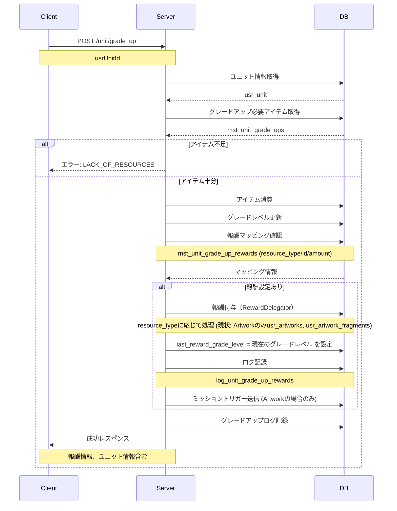
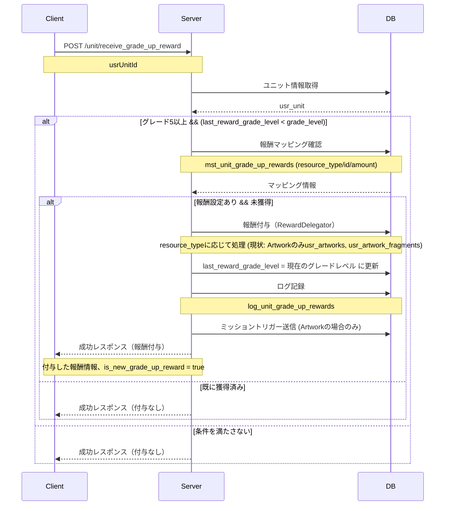

# キャラグレード5到達原画 API設計書

## 目次

- [仕様書](#仕様書)
  - [要点まとめ](#要点まとめ)
  - [仕様確認](#仕様確認)
- [シーケンス図](#シーケンス図)
- [エラー設計](#エラー設計)
- [API仕様](#api仕様)
- [DB設計](#db設計)
  - [マスター/オペレーション](#マスターオペレーション)
  - [ユーザー](#ユーザー)
  - [ログ](#ログ)
- [テーブル一覧](#テーブル一覧)
- [実装上の注意点](#実装上の注意点)
- [パフォーマンス考慮事項](#パフォーマンス考慮事項)
- [テスト観点](#テスト観点)

---

## 仕様書

### 要点まとめ

#### 概要
- キャラをグレード5まで強化した際に、そのキャラに紐づく報酬を自動付与する機能（現状は原画のみ対応）
- 原画獲得時には専用の演出が表示され、ユーザーに達成感を提供
- 機能リリース時に既にグレード5に到達済みのユーザーにも対応

#### DB変更点
- **新規追加:**
  - `mst_unit_grade_up_rewards`: キャラと報酬のマッピング情報を管理（resource_type, resource_id, resource_amountで管理。現状はArtworkのみ）
  - `log_unit_grade_up_rewards`: グレードアップ報酬付与履歴を記録
- **既存テーブルへの変更:**
  - `usr_units`: `last_reward_grade_level` カラムを追加（報酬受け取り状態管理）

#### API
- **既存APIへの変更:**
  - `POST /unit/grade_up`: グレードアップ時に報酬付与処理を追加（現状は原画のみ対応）
  - `GET /game/update_and_fetch`: ユニット情報に`last_reward_grade_level`フラグを含める
- **新規追加:**
  - `POST /unit/receive_grade_up_reward`: 既存ユーザー向けの報酬受け取りAPI

### 仕様確認

#### 参照ドキュメント
- [サーバーAPI要件書](./05_サーバーAPI要件書.md)
- [API実装全体概要設計](./06_API実装全体概要設計.md)

#### ゲーム体験仕様確認結果

| Q | A |
|---|---|
| グレード5以外でも原画獲得を実装する可能性は？ | 将来的にグレード7、10などで原画獲得を実装する可能性がある |
| 重複した原画の扱いは？ | 既存の報酬システムと同様、コインに自動変換される |
| 既存ユーザーへの原画付与タイミングは？ | キャラ詳細画面を開いた時に報酬受け取りAPIを呼び出す |
| 演出表示制御の方針は？ | サーバーは `is_new_grade_up_reward` フラグを返し、クライアント側で演出を制御 |

---

## シーケンス図

### グレードアップ時の原画付与フロー



### 既存ユーザーへの報酬受け取りフロー



---

## エラー設計

> ⚠️ クラサバで必ず認識共有する。
> クライアント側で、実際にどんな挙動にすべきか、不明瞭な状態をなくして、
> 本番リリース後に、CS対応も含めハンドリングしやすい状態にしておきたいです。

### グレードアップ関連エラー

| エラーコード | エラー内容 | 発生条件 | クライアント挙動 |
|------------|----------|---------|---------------|
| `ErrorCode::UNIT_NOT_FOUND` | ユニットが見つからない | 指定されたusrUnitIdが存在しない | エラーダイアログ表示。ホーム画面に戻る |
| `ErrorCode::LACK_OF_RESOURCES` | 消費リソース不足 | グレードアップに必要なかけらが不足している | エラーダイアログ表示。必要アイテムと不足量を表示 |
| `ErrorCode::MST_NOT_FOUND` | マスターデータが見つからない | mst_unit_grade_upsにグレードアップ設定がない | エラーダイアログ表示。サポートに問い合わせを促す |
| `ErrorCode::UNIT_INSUFFICIENT_LEVEL` | ユニットのレベルが十分でない | グレードアップ条件のレベルに到達していない | エラーダイアログ表示。必要レベルを表示 |
| `ErrorCode::INVALID_PARAMETER` | 想定外の値を使用 | グレードが上限に達している、または不正なリクエスト | エラーダイアログ表示。画面を再読み込み |

### 報酬受け取り関連エラー

| エラーコード | エラー内容 | 発生条件 | クライアント挙動 |
|------------|----------|---------|---------------|
| `ErrorCode::UNIT_NOT_FOUND` | ユニットが見つからない | 指定されたusrUnitIdが存在しない | エラーダイアログ表示。画面を再読み込み |
| `ErrorCode::INVALID_PARAMETER` | 想定外の値を使用 | 受け取り条件を満たさないユニットが含まれる | エラーダイアログ表示。画面を再読み込み |
| `ErrorCode::DUPLICATE_ENTRY` | 重複登録 | 既に受け取り済みの報酬を再度受け取ろうとした | 無視（冪等性により成功扱い） |

**エラーハンドリング方針:**
- サーバー側で厳密なバリデーションを実施し、不正なリクエストを検出
- クライアント側では事前に `mst_unit_grade_up_rewards` と `usr_unit.last_reward_grade_level` を確認し、不要なAPIコールを削減
- 報酬受け取りAPIは冪等性を保証し、既に受け取り済みの場合もエラーではなく成功レスポンスを返す

---

## API仕様

### POST /unit/grade_up

キャラのグレードを1つ上げる。到達グレードが原画獲得対象の場合、原画を自動付与する。

#### request

```json
{
  "usrUnitId": "usr_unit_12345"
}
```

**パラメータ説明:**
- `usrUnitId` (string, required): グレードアップ対象のユニットID

**バリデーション:**
- `usrUnitId` は必須
- `usrUnitId` はユーザーが所持しているユニットであること

#### response

```json
{
  "usrUnits": [
    {
      "id": "usr_unit_12345",
      "mstUnitId": "mst_unit_001",
      "level": 80,
      "gradeLevel": 5,
      "rankLevel": 5,
      "lastRewardGradeLevel": 5
    }
  ],
  "usrArtworks": [
    {
      "id": "usr_artwork_67890",
      "usrUserId": "usr_user_001",
      "mstArtworkId": "mst_artwork_001",
      "isNewEncyclopedia": 1
    }
  ],
  "usrArtworkFragments": [
    {
      "id": "usr_artwork_fragment_001",
      "usrUserId": "usr_user_001",
      "mstArtworkFragmentId": "mst_artwork_fragment_001",
      "amount": 1
    }
  ],
  "usrItems": [
    {
      "id": "usr_item_001",
      "usrUserId": "usr_user_001",
      "mstItemId": "mst_item_grade_up_fragment",
      "amount": 45
    }
  ]
}
```

**レスポンス説明:**
- `usrUnits`: 更新されたユニット情報
  - `lastRewardGradeLevel`: 最後に報酬を受け取ったグレードレベル（原画付与後は現在のグレードレベル）
- `usrArtworks`: 付与された原画情報（原画獲得時のみ含まれる）
  - `isNewEncyclopedia`: 図鑑新着フラグ（`1` = 新規獲得）
- `usrArtworkFragments`: 付与された原画フラグメント情報（原画獲得時のみ含まれる）
- `usrItems`: 消費されたアイテム情報（かけらの減少）

**既存との互換性:**
- 既存のグレードアップレスポンスに、原画・原画フラグメント情報が追加される
- 原画設定がないキャラのグレードアップでは、従来通りのレスポンスのみが返される
- `UsrModelDiffGetService` により変更差分が自動収集されるため、レスポンス形式は既存の報酬付与パターンと一貫

---

### GET /game/update_and_fetch

ゲーム全体のデータを取得する。ユニット情報に報酬未受け取りフラグが含まれる。

#### request

```json
{}
```

**パラメータ説明:**
- パラメータなし

#### response

```json
{
  "usrUnits": [
    {
      "id": "usr_unit_12345",
      "mstUnitId": "mst_unit_001",
      "level": 80,
      "gradeLevel": 5,
      "rankLevel": 5,
      "lastRewardGradeLevel": 5
    }
  ],
  "usrArtworks": [...],
  "usrItems": [...],
  "...": "他のゲームデータ"
}
```

**レスポンス説明:**
- `usrUnits`: ユーザーの所持ユニット情報
  - `lastRewardGradeLevel`: 最後に報酬を受け取ったグレードレベル
    - `0`: 未受け取り（クライアントはユニット詳細画面で報酬受け取りAPIを呼び出す）
    - 数値: 受け取り済み（その値が最後に報酬を受け取ったグレードレベル）
- その他のゲームデータは既存と同様

**既存との互換性:**
- `usr_unit`テーブルに新規カラムを追加したため、ユニット情報に`lastRewardGradeLevel`フィールドが追加される
- 既存のクライアントでは未使用のフィールドとして無視される
- 新規クライアントではこの値を確認し、報酬受け取り判定に使用（`0` または `< grade_level` の場合、報酬未受け取りと判定）

---

### POST /unit/receive_grade_up_reward

既にグレード5以上に到達しているユニットの未受け取り報酬（原画）を受け取る。

#### request

```json
{
  "usrUnitId": "usr_unit_12345"
}
```

**パラメータ説明:**
- `usrUnitId` (string, required): 報酬受け取り対象のユニットID

**バリデーション:**
- `usrUnitId` は必須
- ユーザーが所持しているユニットであること
- 以下の条件を満たさない場合は成功レスポンスを返すが原画付与は行わない:
  - グレード5以上
  - `last_reward_grade_level < grade_level`
  - 原画設定が存在する（`mst_unit_grade_up_rewards`）
  - 該当原画が未獲得

#### response

```json
{
  "usrUnits": [
    {
      "id": "usr_unit_12345",
      "mstUnitId": "mst_unit_001",
      "level": 80,
      "gradeLevel": 5,
      "rankLevel": 5,
      "lastRewardGradeLevel": 5
    }
  ],
  "usrArtworks": [
    {
      "id": "usr_artwork_67890",
      "usrUserId": "usr_user_001",
      "mstArtworkId": "mst_artwork_001",
      "isNewEncyclopedia": 1
    }
  ],
  "usrArtworkFragments": [
    {
      "id": "usr_artwork_fragment_001",
      "usrUserId": "usr_user_001",
      "mstArtworkFragmentId": "mst_artwork_fragment_001",
      "amount": 1
    }
  ],
  "isNewGradeUpReward": true
}
```

**レスポンス説明:**
- `usrUnits`: 更新されたユニット情報（原画付与時のみ含まれる）
  - `lastRewardGradeLevel`: 最後に報酬を受け取ったグレードレベル（現在のグレードレベルに更新）
- `usrArtworks`: 付与された原画情報（原画付与時のみ含まれる）
- `usrArtworkFragments`: 付与された原画フラグメント情報（原画付与時のみ含まれる）
- `isNewGradeUpReward`: 演出表示フラグ（`true` = 演出を表示すべき、原画付与時のみ `true`、それ以外は `false` または省略）

**既存との互換性:**
- 新規エンドポイントのため互換性の考慮は不要
- レスポンス形式は既存の報酬付与パターンと一貫
- 条件を満たさない場合も成功レスポンスを返し、クライアント側で `isNewGradeUpReward` の値を確認して演出制御

---

## DB設計

### マスター/オペレーション

#### mst_unit_grade_up_rewards（新規テーブル）

キャラIDとグレードレベルに対して獲得可能な原画のマッピング情報を管理する。

| 列名 | index | データ型/制約 | 説明 |
|------|-------|---------------|------|
| id | PK | varchar(255) | 主キー（UUID） |
| **mst_unit_id** | **UNIQUE (mst_unit_id, grade_level)** | **varchar(255) NOT NULL** | **キャラID（mst_units.id）** |
| **mst_artwork_id** | | **varchar(255) NOT NULL** | **獲得可能な原画ID（mst_artworks.id）** |
| **grade_level** | **UNIQUE (mst_unit_id, grade_level)** | **int unsigned NOT NULL** | **原画獲得可能グレードレベル（リリース時は5）** |
| **release_key** | | **varchar(255) NULL** | **リリース制御用キー** |
| created_at | | timestamp | 作成日時 |
| updated_at | | timestamp | 更新日時 |

**追加カラムの説明:**
- `mst_unit_id`: 対象キャラのID。`mst_units` テーブルとの外部キー関係
- `mst_artwork_id`: 獲得できる原画のID。`mst_artworks` テーブルとの外部キー関係
- `grade_level`: 原画を獲得できるグレードレベル。リリース時は全て5だが、将来的に7、10なども設定可能
- `release_key`: リリース制御用キー。NULL または空文字列の場合は常に有効。特定の値を設定することで、機能フラグによる制御が可能

**制約:**
- UNIQUE KEY `(mst_unit_id, grade_level)`: 同一キャラの同一グレードに複数の原画が設定されることを防止
- `mst_unit_id` は `mst_units.id` が存在すること
- `mst_artwork_id` は `mst_artworks.id` が存在すること
- `grade_level` は対象キャラのunit_labelで到達可能なグレード範囲内であること

**利用箇所:**
- グレードアップ時の原画付与判定（`POST /unit/grade_up`）
- 既存ユーザーへの報酬付与判定（`POST /unit/receive_grade_up_reward`）
- クライアント側のマスタデータとして配信（グレードアップ確認ダイアログ、必殺ワザ詳細画面での表示判定）

---

### ユーザー

> ⚠️ PKの貼り方について、TiDB最適化の観点から以下の方針:
>
> **1ユーザーあたり1レコードのみのテーブル**
> - PK：usr_user_id
>
> **1ユーザーあたり複数レコードできるテーブル**
> - 複合PK：usr_user_id, ドメインID or マスタID

#### usr_units（既存テーブル変更）

ユーザーが所持しているユニット情報。報酬受け取り状態フラグを追加。

| 列名 | index | データ型/制約 | 説明 |
|------|-------|---------------|------|
| id | PK | varchar(255) | usr_units.id |
| usr_user_id | INDEX | varchar(255) | usr_users.id |
| mst_unit_id | | varchar(255) | mst_units.id |
| level | | int unsigned | レベル |
| grade_level | | int unsigned | グレードレベル |
| rank_level | | int unsigned | ランクレベル |
| **last_reward_grade_level** | | **int unsigned NOT NULL DEFAULT 0** | **最後に報酬を受け取ったグレードレベル**<br/>**0: 報酬未受け取り**<br/>**数値: 最後に報酬を受け取ったグレードレベル** |
| created_at | | timestamp | 作成日時 |
| updated_at | | timestamp | 更新日時 |

**追加カラムの説明:**
- `last_reward_grade_level`: 最後にグレードアップ報酬（原画）を受け取ったグレードレベルを記録
  - 原画付与後に現在のグレードレベルを設定
  - デフォルト値 `0`（既存レコードは全て報酬未受け取り扱いとして処理）
  - 判定: `last_reward_grade_level < grade_level` で未受け取りを判定
  - このカラムにより、各グレードごとに個別に演出を表示可能（マルチグレード対応）

**利用箇所:**
- グレードアップAPI（`POST /unit/grade_up`）: 原画付与後にグレードレベルを設定
- 報酬受け取りAPI（`POST /unit/receive_grade_up_reward`）: 判定と更新
- クライアント側: 報酬未受け取りの判定に使用（`< grade_level`）

---

### ログ

#### log_unit_grade_up_rewards（新規テーブル）

グレードアップ報酬（原画）の付与履歴を記録する。

| 列名 | index | データ型/制約 | 説明 |
|------|-------|---------------|------
| id | PK | bigint unsigned AUTO_INCREMENT | ログID |
| usr_user_id | INDEX | varchar(255) NOT NULL | usr_users.id |
| **mst_unit_id** | | **varchar(255) NOT NULL** | **mst_units.id** |
| **mst_unit_grade_up_reward_id** | | **varchar(255) NOT NULL** | **mst_unit_grade_up_reward_id.id** |
| created_at | | timestamp | 作成日時 |

**ログ記録タイミング:**
- グレードアップ時に原画を付与した場合（`POST /unit/grade_up`）
- 報酬受け取りAPIで原画を付与した場合（`POST /unit/receive_grade_up_reward`）

## テーブル一覧

| テーブル名 | 新規/既存 | 概要 |
|-----------|----------|------|
| mst_unit_grade_up_rewards | 新規 | キャラと原画のマッピング情報を管理 |
| usr_units | 既存（変更） | `last_reward_grade_level` カラムを追加 |
| log_unit_grade_up_rewards | 新規 | グレードアップ報酬付与履歴を記録 |

---

## 実装上の注意点

### トランザクション管理

- グレードアップAPIでは、既存のトランザクション内で原画付与処理を実行
- エラー発生時は全体をロールバック（グレードアップ、アイテム消費、原画付与の全て）
- 報酬受け取りAPIでは、1つのユニットの報酬受け取りをトランザクション内で実行
- 条件を満たさない場合もエラーとせず、成功レスポンスを返す（冪等性の保証）

### 既存機能への影響

- グレードアップの基本処理（アイテム消費、グレードレベル更新、ログ記録）は変更しない
- 既存のミッショントリガー（`SPECIFIC_UNIT_GRADE_UP_COUNT`）は継続して送信
- 原画完成ミッショントリガーは追加で送信
- `UsrModelDiffGetService` により、レスポンス形式は既存の報酬付与パターンと一貫

### RewardDelegatorパターンの活用

- 原画付与は `RewardDelegator` を使用し、既存の報酬付与パターンと統一
- `ArtworkSendService` が呼び出され、`EncyclopediaDelegator::grantArtworksWithFragments` により原画とフラグメントを付与
- 重複原画の自動コイン変換も既存の `ArtworkConvertService` を活用

### マイグレーション戦略

- `usr_units.last_reward_grade_level` カラム追加時、デフォルト値 `1` を設定
- これにより、既存レコードは全て「受け取り済み」として扱われる
- 新規グレードアップ時のみ `0` に設定され、原画付与後に `1` に戻る

---

## パフォーマンス考慮事項

- グレードアップAPIに原画付与処理を追加しても、レスポンスタイムの大幅な増加を避ける
  - 目標: 既存処理 + 50ms以内
- 報酬受け取りAPIでは、単一ユニットの報酬受け取り処理
  - 目標: 50ms以内（原画付与処理を含む）
  - ユニット詳細画面表示時に呼び出されるため、快適な体験を提供すること
- マスタデータ `mst_unit_grade_up_rewards` の参照はキャッシュを活用
- ログテーブル `log_unit_grade_up_rewards` は非同期書き込みを検討

---

## テスト観点

### 単体テスト
- `UnitGradeUpService` に原画付与ロジックが正しく追加されていること
- グレード5到達時に原画マッピングが正しく参照されること
- 重複原画の自動コイン変換が正しく動作すること
- `last_reward_grade_level` 値が正しく更新されること
- 報酬受け取りAPIの各種条件判定が正しく動作すること

### 機能テスト
- グレード4→5へのグレードアップで原画が付与されること
- 原画設定がないキャラのグレードアップでは従来通り動作すること
- 既に獲得済みの原画の場合、コインに変換されること
- 既存ユーザーがユニット詳細画面を開いた時、報酬受け取りAPIで原画を獲得できること
- 既に受け取り済みの報酬を再度受け取ろうとしても安全に処理されること（冪等性）
- 条件を満たさないユニットに対する報酬受け取りAPIの呼び出しが安全に処理されること
- ミッショントリガーが正しく送信されること

### シナリオテスト
- グレードアップから原画獲得、演出表示までの一連のフロー
- 機能リリース時、既にグレード5のキャラを所持しているユーザーがユニット詳細画面を開いて報酬を受け取るフロー
- 複数のグレード5キャラを所持している場合、各キャラの詳細画面で個別に演出が表示されること
- 原画獲得によりミッションが達成される場合の動作
