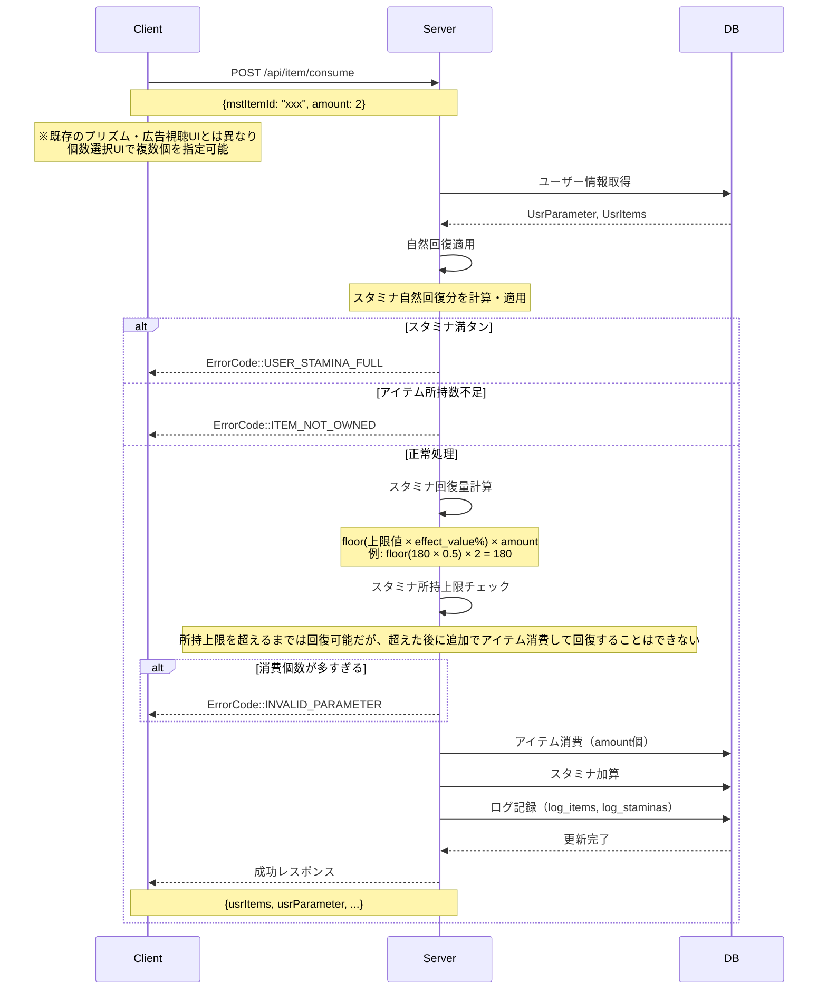

# スタミナ回復アイテム API設計書

## 目次

- [仕様書](#仕様書)
  - [要点まとめ](#要点まとめ)
  - [仕様確認](#仕様確認)
- [シーケンス図](#シーケンス図)
- [エラー設計](#エラー設計)
- [API仕様](#api仕様)
- [DB設計](#db設計)
  - [マスター/オペレーション](#マスターオペレーション)
  - [ユーザー](#ユーザー)
  - [ログ](#ログ)

---

## 仕様書

https://docs.google.com/presentation/d/1UTFvGlKhWw1MIbPCFX-1bjvxOHopNgaVKSeVXh10t5A/edit?slide=id.g3a6b6ec5007_0_571#slide=id.g3a6b6ec5007_0_571

### 要点まとめ

#### 概要
- スタミナ回復アイテムは、ユーザーが任意のタイミングで使用することでスタミナを回復できる消費アイテム
- 回復量は `mst_items.effect_value` で指定されたパーセンテージに基づく（例: "50" = スタミナ上限値の50%回復）
- 既存の `/api/item/consume` API を拡張し、新規ItemType `StaminaRecoveryPercent` を追加することで実現
- ログインボーナス、ミッション、イベント報酬など、既存の報酬配布システムを通じて配布される想定

#### DB変更点
- **新規追加:**
  - なし（既存テーブルで対応）
- **既存テーブルへの変更:**
  - `mst_items`: 新しいアイテム種別 `StaminaRecoveryPercent` のマスタレコード追加（glow-schemaのItemType enum追加）
  - `mst_items.effect_value`: 回復パーセンテージを指定（例: "50" = 50%回復）
  - `usr_items`: スタミナ回復アイテムの所持数管理（既存の仕組みを利用）
  - `log_items`: アイテム使用ログ記録（既存テーブルを利用）
  - `log_staminas`: スタミナ回復ログ記録（既存テーブルを利用）

#### API
- **既存APIへの変更:**
  - `POST /api/item/consume`: ItemType::STAMINA_RECOVERY_PERCENT の処理分岐を追加
- **新規追加:**
  - なし（既存API拡張で対応）

#### 段階的実装の方針
- **Phase 1（今回）:** `StaminaRecoveryPercent`（パーセンテージ回復）のみ実装
- **Phase 2（将来必要時）:** `StaminaRecoveryFixed`（固定量回復）を別のItemTypeとして追加予定

### 仕様確認

#### 参照ドキュメント
- [サーバーAPI要件書](./05_サーバーAPI要件書.md)
- [ゲーム体験仕様確認結果まとめ](./04_ゲーム体験仕様確認結果まとめ.md)
- [サーバー仕様レビュー（プランナー確認結果）](./03_2_サーバー仕様レビュー_プランナー仕様確認結果.md)

#### ゲーム体験仕様確認結果

| Q | A |
|---|---|
| Q5: 回復量の計算式は小数点切り捨てで問題ないか | 切り捨てで問題ない |
| Q6: 1度に複数個（2個以上）使用可能か | **可能**。既存のプリズム・広告視聴UIとは異なり、個数選択UIを実装。**現在スタミナがスタミナ上限未満**であれば複数個同時使用可能。**回復後のスタミナはスタミナ上限を超えてもOK**（システム上限999まで） |

---

## シーケンス図

### アイテム使用フロー（正常系）

**複数個同時使用の例:**
- ユーザーのスタミナ: 50/180
- 1個あたりの回復量: 90（180 × 50%）
- amount: 2を指定した場合 → 2個消費して+180回復 → **スタミナは230になる**（スタミナ上限180を超えてもOK、システム上限999まで許可）
- **使用可否判定**: 現在スタミナ(50) < スタミナ上限(180) なので使用可能
- **回復後**: 50 + 180 = 230（> 180だが、**230まで回復OK**）
- **3個目は使用不可**: 現在スタミナ(230) > スタミナ上限(180) なので追加使用不可



---

## エラー設計

> ⚠️ クラサバで必ず認識共有する。
> クライアント側で、実際にどんな挙動にすべきか、不明瞭な状態をなくして、
> 本番リリース後に、CS対応も含めハンドリングしやすい状態にしておきたいです。

### スタミナ回復アイテム使用関連エラー

| エラーコード | エラー内容 | 発生条件 |
|------------|----------|---------|
| `ErrorCode::USER_STAMINA_FULL` (4003) | スタミナが満タンで使用不可 | 自然回復適用後のスタミナ値 ≥ スタミナ上限値 |
| `ErrorCode::ITEM_NOT_OWNED` (2001) | アイテム未所持 | 指定されたアイテムを所持していない<br/>または所持数が使用個数より少ない |
| `ErrorCode::USER_STAMINA_EXCEEDS_LIMIT` (4004) | システム上限超過（理論上発生しない） | 回復後のスタミナ値が999を超える<br/>（UI側制御により通常は発生しない） |
| `ErrorCode::MST_NOT_FOUND` (10) | マスタデータ未存在 | 指定されたmstItemIdが存在しない |
| `ErrorCode::INVALID_PARAMETER` (13) | リクエストパラメータ不正 | mstItemIdが空、またはamountが0以下または多すぎる |

---

## API仕様

### POST /api/item/consume

アイテムを使用するAPIエンドポイント。ItemType::STAMINA_RECOVERY_PERCENT の場合、スタミナ回復処理を実行する。

**既存のプリズム・広告視聴UIとは異なり、個数選択UIから複数個を同時に使用可能。**

#### request

```json
{
  "mstItemId": "item_stamina_recovery_001",
  "amount": 2
}
```

**パラメータ説明:**
- `mstItemId` (string, required): 使用するアイテムのマスタID。スタミナ回復アイテムの場合は `mst_items` テーブルの `id` で、`type` が `StaminaRecoveryPercent` であること
- `amount` (int, required): 使用個数。1以上の整数を指定。**現在スタミナがスタミナ上限未満であれば複数個を同時指定可能**（回復後のスタミナはスタミナ上限を超えてもOK）

#### response

```json
{
  "usrParameter": {
    "level": 15,
    "exp": 1200,
    "coin": 50000,
    "stamina": 150,
    "staminaUpdatedAt": "2025-11-27T10:30:00+09:00",
    "freeDiamond": 100,
    "paidDiamondIos": 0,
    "paidDiamondAndroid": 0
  },
  "usrItems": [
    {
      "mstItemId": "item_stamina_recovery_001",
      "amount": 9
    }
  ],
  "itemRewards": [],
  "usrItemTrade": null
}
```

**レスポンス説明:**
- `usrParameter`: 使用後のユーザーパラメータ（スタミナ値含む）
  - `stamina`: **更新後のスタミナ値**（スタミナ回復アイテムの場合、自然回復 + アイテム回復後の値。回復量は `floor(スタミナ上限値 × effect_value / 100) × amount`。システム上限999まで許可、スタミナ上限での打ち切りはしない）
  - `staminaUpdatedAt`: **スタミナ更新日時**（アイテム使用時刻）
  - その他のフィールドは既存仕様通り
- `usrItems`: 使用後のアイテム一覧（使用したアイテムの最新所持数を含む）
  - `mstItemId`: マスタアイテムID
  - `amount`: 使用後の所持数
- `itemRewards`: 獲得報酬（スタミナ回復アイテムの場合は空配列）
- `usrItemTrade`: アイテム交換情報（スタミナ回復アイテムの場合はnull）

**既存との互換性:**
- 既存の `/api/item/consume` のレスポンス構造を維持
- スタミナ回復アイテムはアイテム交換ではなく「スタミナ回復効果」を提供するため:
  - `itemRewards`: 空配列（交換報酬がないため）
  - `usrItemTrade`: null（交換履歴がないため）
  - 回復結果は `usrParameter.stamina` と `usrParameter.staminaUpdatedAt` で確認
- 他のItemTypeの挙動には影響しない

---

## DB設計

### マスター/オペレーション

#### mst_items（既存テーブル）

スタミナ回復アイテムのマスタデータを格納する。今回の機能で使用する主要カラム:

| 列名 | 説明 |
|------|------|
| **type** | アイテム種別。スタミナ回復アイテムは `StaminaRecoveryPercent` を指定 |
| **effect_value** | 回復パーセンテージを指定（例: `"50"` = 50%回復） |

※その他のカラム（id, group_type, rarity等）は既存の仕組みをそのまま利用

**glow-schema変更点:**
- `Schema/Item.yml` の `ItemType` enum に `StaminaRecoveryPercent` を追加

```yaml
enum:
  - name: ItemType
    params:
      - name: CharacterFragment
      # ... 既存のItemType ...
      - name: StaminaRecoveryPercent  # 新規追加（パーセンテージ回復）
      - name: Etc
```

**段階的実装の方針:**
※ゲーム体験仕様書には記載のない内容だが、サーバーチームでの将来的な拡張実装を見据えた想定として以下の方針を採用
- **Phase 1（今回）:** `StaminaRecoveryPercent` のみ追加
- **Phase 2（将来必要時）:** `StaminaRecoveryFixed` を追加（固定量回復用）

---

### ユーザー・ログ

以下の既存テーブルをそのまま利用する（テーブル構造・利用方法に変更なし）:

| テーブル名 | 概要 |
|-----------|------|
| mst_items_i18n | スタミナ回復アイテムの多言語対応名称・説明を格納（既存の仕組みでレコード追加） |
| usr_items | アイテム所持数管理。アイテム使用時に `amount` を減算 |
| usr_user_parameters | スタミナ値管理。アイテム使用時に `stamina` と `stamina_updated_at` を更新 |
| log_items | アイテム使用ログ。`trigger_source: 'ItemConsume'` で記録 |
| log_staminas | スタミナ回復ログ。`trigger_source: 'UserStaminaRecoveryCost'` で記録 |

---

## テーブル一覧

| テーブル名 | 新規/既存 | 概要 |
|-----------|----------|------|
| mst_items | 既存（変更） | ItemType enum に `StaminaRecoveryPercent` を追加、`effect_value` で回復パーセンテージを指定 |
| mst_items_i18n | 既存 | スタミナ回復アイテムの多言語名称・説明を追加 |
| usr_items | 既存 | スタミナ回復アイテムの所持数管理 |
| usr_user_parameters | 既存 | スタミナ値とスタミナ更新日時の管理 |
| log_items | 既存 | スタミナ回復アイテム使用ログの記録 |
| log_staminas | 既存 | スタミナ回復ログの記録 |

---

## 実装上の注意点

### スタミナ回復処理の実装順序

スタミナ回復アイテム使用時の処理は以下の順序で実行する必要がある:

1. **自然回復適用** (`UserService::recoveryStamina()`)
   - 最新のスタミナ値を取得するため、まず自然回復を適用する
   - `stamina_updated_at` からの経過時間に基づき回復量を計算

2. **スタミナ満タンチェック**
   - 自然回復後のスタミナ値が上限値以上の場合、`ErrorCode::USER_STAMINA_FULL` をthrow
   - 判定条件: `スタミナ上限値 <= 現在スタミナ`

3. **アイテム所持数チェック**
   - `UsrItemService::consumeItems()` 内で実施
   - 所持数が使用個数より少ない場合、`ErrorCode::ITEM_NOT_OWNED` をthrow

4. **スタミナ回復量計算**
   - マスタデータの `effect_value` から回復パーセンテージを取得
   - ユーザーレベルに応じたスタミナ上限値を取得 (`MstUserLevelRepository::getByLevel()`)
   - ショップパス効果を加算 (`ShopPassEffectDelegator::getShopPassActiveEffectDataByUsrUserId()`)
   - 回復量 = `floor((レベル上限 + パス効果) × effect_value / 100) × amount`

5. **システム上限チェック**
   - 回復後のスタミナ値が999を超える場合、`min(回復後スタミナ, 999)` で打ち切る
   - **注意: スタミナ上限（例: 180）での打ち切りはしない**（回復後スタミナがスタミナ上限を超えることは正常動作）
   - サーバー側でシステム上限999のチェックを実施

### 既存コードとの整合性

- **スタミナ回復計算ロジック**: `UserBuyStaminaService::calcAddStamina()` の実装を参考にする
  - 広告視聴スタミナ購入と同じ計算方法（50%回復）
  - ショップパス効果の加算処理も同様

- **アイテム使用**: `ItemService::apply()` に ItemType::STAMINA_RECOVERY_PERCENT の case 分岐を追加
  - 他のItemType（RandomFragmentBox等）と同様のパターンで実装
  - `mst_items.effect_value` から回復パーセンテージを取得して計算に使用

---

## テスト観点

### 単体テスト

- **スタミナ回復量計算**:
  - レベルごとのスタミナ上限値に対する effect_value% 計算が正しいか
  - effect_value が "50" の場合、50%回復されるか
  - effect_value が "30" の場合、30%回復されるか（effect_valueの値を使えていることの確認）
  - ショップパス効果が正しく加算されるか
  - floor関数による小数点以下切り捨てが正しいか

- **スタミナ満タンチェック**:
  - スタミナ上限値と現在スタミナが同値の場合、エラーが発生するか
  - 自然回復後にスタミナが上限を超えている場合、エラーが発生するか

- **システム上限チェック**:
  - 回復後のスタミナが999を超える場合、999で打ち切られるか
  - ちょうど999になる場合、正常に処理されるか

- **アイテム消費**:
  - 所持数が指定個数以上の場合、正常に消費されるか
  - 所持数が0の場合、エラーが発生するか
  - 消費後の所持数が正しく計算されるか

### 機能テスト

- **正常系フロー**:
  - スタミナ回復アイテムを1個使用し、スタミナがeffect_value%回復するか
  - 自然回復と合わせてスタミナ値が正しく更新されるか

- **異常系フロー**:
  - スタミナ満タン時にアイテム使用APIを呼び、エラーが返るか
  - アイテム未所持時にアイテム使用APIを呼び、エラーが返るか
  - 不正なmstItemIdでAPIを呼び、エラーが返るか
  - スタミナ回復アイテムを複数個消費するケースで、一部消費した際にユーザーのスタミナ所持上限を超えてから、さらに消費して回復しようとした場合にエラーが返るか

- **ログ記録**:
  - アイテム使用時に `log_items` にログが記録されるか
  - アイテム使用時に `log_staminas` にログが記録されるか
  - trigger情報が正しく設定されるか

### シナリオテスト

- **エッジケーステスト**:
  - スタミナが999の状態でアイテム使用を試みる（エラー確認）
  - スタミナが0の状態からアイテムを使用する
  - ショップパス有効時とショップパス無効時でスタミナ回復量が異なるか確認
