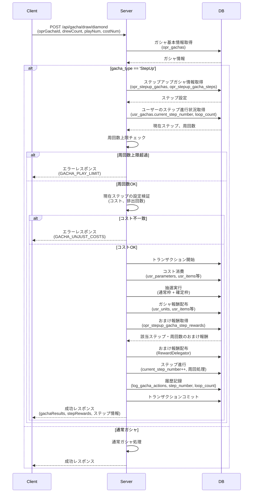
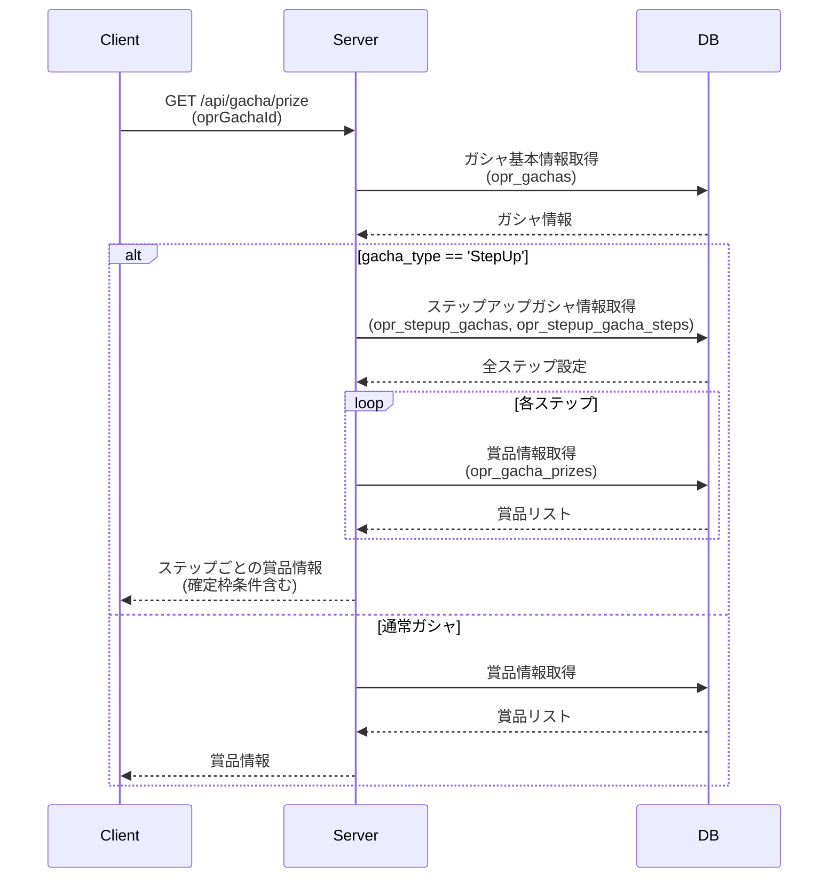
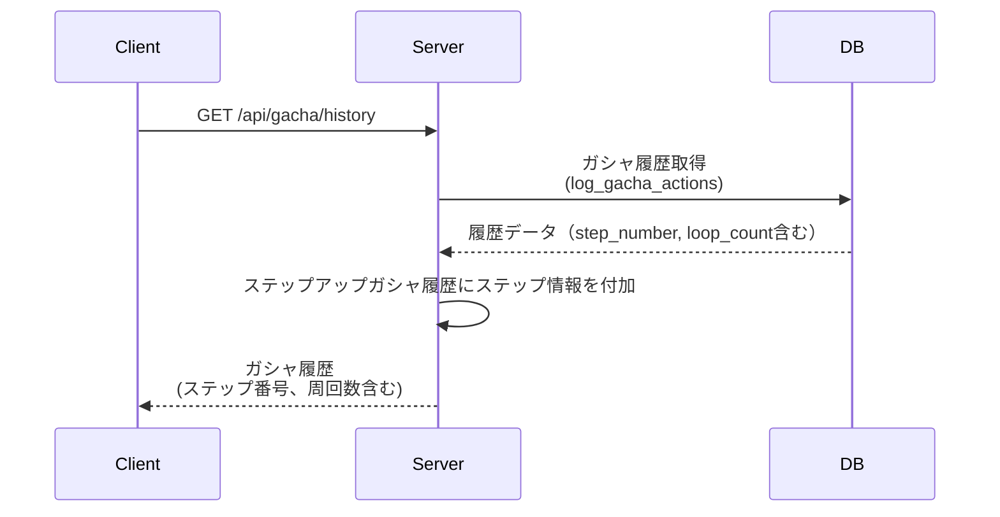

# ステップアップガシャ API設計書

**作成日:** 2025-01-07  
**最終更新日:** 2026-01-07  
**更新履歴:**
- 2026-01-07: おまけ報酬機能追加（opr_stepup_gacha_step_rewardsテーブル、REQ-GE-5対応）
- 2025-01-07: 初版作成

## 目次

- [仕様書](#仕様書)
  - [要点まとめ](#要点まとめ)
  - [仕様確認](#仕様確認)
- [シーケンス図](#シーケンス図)
- [エラー設計](#エラー設計)
- [API仕様](#api仕様)
- [DB設計](#db設計)
  - [マスター/オペレーション](#マスターオペレーション)
  - [ユーザー](#ユーザー)
  - [ログ](#ログ)

---

## 仕様書

### 要点まとめ

#### 概要
- ステップアップガシャは、段階的に特典が向上していく仕組みのガシャ機能
- 最大10ステップまで設定でき、各ステップで異なるコスト・排出回数・確定枠条件を設定可能
- 全ステップ完了後は自動的にステップ1に戻り、周回数の上限設定も可能
- 既存の `/api/gacha/draw/*` APIを拡張し、新規APIエンドポイントは追加しない方針
- レスポンスの `usrGacha` にステップアップガシャ用のパラメータを追加

#### DB変更点
- **新規追加:**
  - `opr_stepup_gachas`: ステップアップガシャの基本情報
  - `opr_stepup_gacha_steps`: 各ステップの詳細設定
  - `opr_stepup_gacha_step_rewards`: 各ステップのおまけ報酬設定（REQ-GE-5）
- **既存テーブルへの変更:**
  - `opr_gachas`: `gacha_type` に 'StepUp' を追加（ENUM拡張）
  - `usr_gachas`: `current_step_number`, `loop_count` カラムを追加（NULL可）
  - `log_gacha_actions`: `step_number`, `loop_count` カラムを追加（NULL可）

#### API
- **既存APIへの変更:**
  - `POST /api/gacha/draw/diamond`: ステップアップガシャ対応
  - `POST /api/gacha/draw/paid_diamond`: ステップアップガシャ対応
  - `POST /api/gacha/draw/item`: ステップアップガシャ対応
  - `POST /api/gacha/draw/free`: ステップアップガシャ対応
  - `GET /api/gacha/prize`: ステップごとの賞品情報返却
  - `GET /api/gacha/history`: ステップ情報を含む履歴返却
  - `POST /api/game/update_and_fetch`: ステップアップガシャ情報追加
- **新規追加:**
  - なし

### 仕様確認

#### 参照ドキュメント
- [サーバーAPI要件書](./05_サーバーAPI要件書.md)
- [ゲーム体験仕様確認結果まとめ](./04_ゲーム体験仕様確認結果まとめ.md)
- [実装方針補足.txt](./実装方針補足.txt)

#### 実装方針
- 既存の `/api/gacha/draw/*` APIを使用し、新規にAPIを増やさない
- 既存のレスポンスの `usrGacha` にステップアップガシャ用のパラメータを追加
- `opr_gachas.gacha_type` に 'StepUp' を追加
- リクエスト時のステップ数の整合性チェックをしない（サーバー側の状態を信頼）
- 新しいDomainを追加しない（既存のGachaドメインを拡張）

---

## シーケンス図

### ステップアップガシャ実行フロー



### ステップアップガシャ賞品情報取得フロー



### ステップアップガシャ履歴取得フロー



---

## エラー設計

> ⚠️ クラサバで必ず認識共有する。
> クライアント側で、実際にどんな挙動にすべきか、不明瞭な状態をなくして、
> 本番リリース後に、CS対応も含めハンドリングしやすい状態にしておきたいです。

### ステップアップガシャ関連エラー

| エラーコード | エラー内容 | 発生条件 | クライアント挙動 |
|------------|----------|---------|---------------|
| `ErrorCode::GACHA_PLAY_LIMIT` | ガシャ実行回数上限 | 周回数が `max_loop_count` に達している | 「このガシャはこれ以上実行できません」ダイアログ表示。ガシャ画面に戻る |
| `ErrorCode::GACHA_UNJUST_COSTS` | コスト不正 | リクエストのコスト情報とマスタデータが不一致 | 「エラーが発生しました」ダイアログ表示。ガシャ画面をリロード |
| `ErrorCode::GACHA_EXPIRED` | ガシャ期限切れ | ガシャの開催期間外 | 「このガシャは終了しました」ダイアログ表示。ホーム画面に戻る |
| `ErrorCode::GACHA_NOT_EXPECTED_PLAY_NUM` | 実行回数不正 | `playNum` が不正な値 | 「エラーが発生しました」ダイアログ表示。ガシャ画面をリロード |
| `ErrorCode::RESOURCE_NOT_ENOUGH` | リソース不足 | プリズムまたはアイテムが不足 | 「プリズムが不足しています」ダイアログ表示。ショップへの導線を提示 |

**エラーハンドリング方針:**
- サーバー側でステップ進行状況を厳密に管理し、クライアントのリクエストパラメータは参考程度に扱う
- コスト不正エラーはチート対策として重要。発生した場合はログに記録し監視
- 周回数上限到達は正常なケースとして扱い、ユーザーに分かりやすいメッセージを表示
- ガシャ期限切れは、クライアント側でも事前にチェックして表示制御することを推奨

---

## API仕様

### POST /api/gacha/draw/diamond

ダイヤモンドを消費してガシャを実行する。ステップアップガシャの場合、現在のステップに応じた処理を実行。

#### request

```json
{
  "oprGachaId": "stepup_gacha_001",
  "drewCount": 0,
  "playNum": 10,
  "costNum": 3000
}
```

**パラメータ説明:**
- `oprGachaId` (string, required): ガシャID（`opr_gachas.id`）
- `drewCount` (int, required): これまでに引いた累計回数（天井カウント用）
- `playNum` (int, required): 今回引く回数（1連、10連等）
- `costNum` (int, required): 消費ダイヤモンド数

**バリデーション:**
- `oprGachaId`: 存在するガシャIDであること
- `playNum`: 1以上、`multi_draw_count` 以下であること
- `costNum`: 正の整数であること
- ステップアップガシャの場合:
  - `playNum`: 現在ステップの `draw_count` と一致すること
  - `costNum`: 現在ステップの `cost_num` と一致すること

#### response

```json
{
  "gachaResults": [
    {
      "reward": {
        "resourceType": "Unit",
        "resourceId": "unit_ssr_001",
        "resourceAmount": 1
      }
    }
  ],
  "stepRewards": [
    {
      "reward": {
        "resourceType": "Item",
        "resourceId": "item_gacha_ticket_001",
        "resourceAmount": 5
      }
    }
  ],
  "usrUnits": [
    {
      "id": "usr_unit_12345",
      "mstUnitId": "unit_ssr_001",
      "level": 1,
      "rarity": "SSR"
    }
  ],
  "usrItems": [
    {
      "id": "usr_item_67890",
      "mstItemId": "item_gacha_ticket_001",
      "amount": 5
    }
  ],
  "usrParameter": {
    "diamond": 7000
  },
  "usrGachaUppers": [
    {
      "upperGroup": "stepup_gacha_001",
      "upperType": "MaxRarity",
      "count": 5
    }
  ],
  "usrGacha": {
    "oprGachaId": "stepup_gacha_001",
    "count": 1,
    "playedAt": "2025-12-16T12:00:00+09:00",
    "currentStepNumber": 2,
    "loopCount": 0
  }
}
```

**レスポンス説明:**
- `gachaResults`: 抽選結果の配列。各要素は排出されたアイテム/ユニットの情報
- `stepRewards`: **おまけ報酬の配列（ステップアップガシャのみ、該当なしまたは非対応の場合は空配列）**
  - ガシャ抽選結果とは別に、ステップ実行時に自動的に付与される報酬
  - 周回数に応じて内容が変化する場合あり（`loop_count_target` による制御）
  - クライアント側で別途演出可能
- `usrUnits`: 獲得したユニット情報の配列（ユニットを獲得した場合のみ）
- `usrItems`: 獲得したアイテム情報の配列（アイテムを獲得した場合のみ、**おまけ報酬を含む**）
- `usrParameter`: 更新後のユーザーパラメータ（ダイヤモンド残高等）
- `usrGachaUppers`: 天井カウント情報の配列
- `usrGacha`: ガシャ実行情報
  - `oprGachaId`: ガシャID
  - `count`: 累計実行回数
  - `playedAt`: 最終実行日時
  - `currentStepNumber`: **実行後の現在ステップ番号（1〜10、ステップアップガシャの場合のみNULL以外）**
  - `loopCount`: **実行後の周回数（1以上、1=1週目、ステップアップガシャの場合のみNULL以外）**

**既存との互換性:**
- `usrGacha` に `currentStepNumber`, `loopCount` フィールドを追加
- `stepRewards` フィールドを追加（ステップアップガシャ以外は空配列）
- ステップアップガシャ以外の場合、`currentStepNumber`, `loopCount` は `null`
- 既存のフィールドに変更なし

### POST /api/gacha/draw/paid_diamond

有償ダイヤモンドを消費してガシャを実行する。リクエスト/レスポンス構造は `POST /api/gacha/draw/diamond` と同じ。

### POST /api/gacha/draw/item

アイテムを消費してガシャを実行する。

#### request

```json
{
  "oprGachaId": "stepup_gacha_002",
  "drewCount": 0,
  "playNum": 10,
  "costId": "item_ticket_001",
  "costNum": 1
}
```

**パラメータ説明:**
- `oprGachaId` (string, required): ガシャID（`opr_gachas.id`）
- `drewCount` (int, required): これまでに引いた累計回数
- `playNum` (int, required): 今回引く回数
- `costId` (string, required): 消費するアイテムID
- `costNum` (int, required): 消費するアイテム数

**バリデーション:**
- `POST /api/gacha/draw/diamond` と同様
- `costId`: 現在ステップの `cost_id` と一致すること

#### response

`POST /api/gacha/draw/diamond` と同じ構造。

### POST /api/gacha/draw/free

無料でガシャを実行する。

#### request

```json
{
  "oprGachaId": "stepup_gacha_003",
  "drewCount": 0
}
```

**パラメータ説明:**
- `oprGachaId` (string, required): ガシャID（`opr_gachas.id`）
- `drewCount` (int, required): これまでに引いた累計回数

**バリデーション:**
- `POST /api/gacha/draw/diamond` と同様
- ステップアップガシャの場合:
  - 現在ステップの `cost_type` が 'Free' であること、または `cost_type` が有料で `is_first_free = 1` かつ `loop_count = 0` であること

#### response

`POST /api/gacha/draw/diamond` と同じ構造。

### GET /api/gacha/prize

ガシャの賞品情報（排出確率等）を取得する。ステップアップガシャの場合、ステップごとの賞品情報を返却。

#### request

```
GET /api/gacha/prize?oprGachaId=stepup_gacha_001
```

**パラメータ説明:**
- `oprGachaId` (string, required): ガシャID（`opr_gachas.id`）

#### response（ステップアップガシャの場合）

```json
{
  "rarityProbabilities": [
    {
      "rarity": "SSR",
      "probability": 0.03
    },
    {
      "rarity": "SR",
      "probability": 0.12
    },
    {
      "rarity": "R",
      "probability": 0.85
    }
  ],
  "probabilityGroups": [
    {
      "rarity": "SSR",
      "prizes": [
        {
          "resourceType": "Unit",
          "resourceId": "unit_ssr_001",
          "resourceAmount": 1,
          "probability": 0.01,
          "isPickup": true
        }
      ]
    }
  ],
  "fixedProbabilities": {
    "fixedCount": 0,
    "rarityProbabilities": [],
    "probabilityGroups": []
  },
  "upperProbabilities": [],
  "stepUpGachaPrizes": [
    {
      "stepNumber": 1,
      "drawCount": 1,
      "fixedPrizeCount": 0,
      "fixedPrizeRarityThresholdType": null,
      "rarityProbabilities": [],
      "probabilityGroups": [],
      "stepRewards": []
    },
    {
      "stepNumber": 2,
      "drawCount": 10,
      "fixedPrizeCount": 1,
      "fixedPrizeRarityThresholdType": "SR",
      "rarityProbabilities": [
        {
          "rarity": "SSR",
          "probability": 0.15
        },
        {
          "rarity": "SR",
          "probability": 0.85
        }
      ],
      "probabilityGroups": [
        {
          "rarity": "SSR",
          "prizes": []
        }
      ],
      "stepRewards": [
        {
          "loopCountTarget": 0,
          "reward": {
            "resourceType": "Item",
            "resourceId": "item_gacha_ticket_001",
            "resourceAmount": 5
          }
        },
        {
          "loopCountTarget": 1,
          "reward": {
            "resourceType": "Item",
            "resourceId": "item_special_bonus_001",
            "resourceAmount": 1
          }
        }
      ]
    }
  ]
}
```

**レスポンス説明:**
- `rarityProbabilities`: 通常枠のレアリティ別確率
- `probabilityGroups`: 通常枠のレアリティ別賞品リスト
- `fixedProbabilities`: 通常の確定枠情報（ステップアップガシャでは使用しない）
- `upperProbabilities`: 天井情報
- `stepUpGachaPrizes`: **ステップアップガシャの各ステップ情報（ステップアップガシャの場合のみ）**
  - `stepNumber`: **ステップ番号**
  - `drawCount`: **排出回数（何連ガシャか）**
  - `fixedPrizeCount`: **確定枠数（0〜10）**
  - `fixedPrizeRarityThresholdType`: **確定枠レアリティ条件（'SR', 'SSR'等、NULLの場合は条件なし）**
  - `rarityProbabilities`: **確定枠のレアリティ別確率**
  - `probabilityGroups`: **確定枠のレアリティ別賞品リスト**
  - `stepRewards`: **おまけ報酬リスト（該当ステップで付与される報酬の配列）**
    - `loopCountTarget`: **対象周回数（null=全周回、1=1週目のみ、2=2週目のみ、0は無視）**
    - `reward`: **報酬情報（resourceType, resourceId, resourceAmount）**

**既存との互換性:**
- `stepUpGachaPrizes` フィールドを追加
- ステップアップガシャ以外の場合、`stepUpGachaPrizes` は空配列または存在しない

### GET /api/gacha/history

ガシャの実行履歴を取得する。ステップアップガシャの場合、ステップ情報を含める。

#### request

```
GET /api/gacha/history
```

#### response

```json
{
  "gachaHistories": [
    {
      "oprGachaId": "stepup_gacha_001",
      "costType": "Diamond",
      "costId": "",
      "costNum": 3000,
      "drawCount": 10,
      "playedAt": "2025-12-16T12:00:00+09:00",
      "results": [
        {
          "sortOrder": 1,
          "reward": {
            "resourceType": "Unit",
            "resourceId": "unit_ssr_001",
            "resourceAmount": 1
          }
        }
      ],
      "stepRewards": [
        {
          "reward": {
            "resourceType": "Item",
            "resourceId": "item_gacha_ticket_001",
            "resourceAmount": 5
          }
        }
      ],
      "stepupInfo": {
        "stepNumber": 1,
        "loopCount": 0
      }
    }
  ]
}
```

**レスポンス説明:**
- `gachaHistories`: ガシャ履歴の配列
  - `oprGachaId`: ガシャID
  - `costType`: コストタイプ
  - `costId`: コストID（アイテムの場合）
  - `costNum`: コスト数
  - `drawCount`: 実行回数
  - `playedAt`: 実行日時
  - `results`: 排出結果の配列
  - `stepRewards`: **おまけ報酬の配列（該当がない場合は空配列）**
  - `stepupInfo`: **ステップアップガシャ情報（ステップアップガシャの場合のみ）**
    - `stepNumber`: **実行したステップ番号**
    - `loopCount`: **実行時の周回数**

**既存との互換性:**
- `stepRewards` フィールドを追加（該当がない場合は空配列）
- `stepupInfo` フィールドを追加
- ステップアップガシャ以外の場合、`stepupInfo` は `null` または存在しない

### POST /api/game/update_and_fetch

ゲームデータを同期し、最新状態を返却する。ステップアップガシャ情報も含める。

#### response（usrGacha部分のみ抜粋）

```json
{
  "usrGachas": [
    {
      "oprGachaId": "stepup_gacha_001",
      "count": 1,
      "playedAt": "2025-12-16T12:00:00+09:00",
      "currentStepNumber": 2,
      "loopCount": 0
    },
    {
      "oprGachaId": "normal_gacha_001",
      "count": 5,
      "playedAt": "2025-12-15T18:00:00+09:00",
      "currentStepNumber": null,
      "loopCount": null
    }
  ]
}
```

**レスポンス説明:**
- `usrGachas`: ユーザーのガシャ情報配列
  - `currentStepNumber`: **現在ステップ番号（ステップアップガシャの場合のみ、それ以外はnull）**
  - `loopCount`: **周回数（ステップアップガシャの場合のみ、それ以外はnull）**

**既存との互換性:**
- `usrGacha` 各要素に `currentStepNumber`, `loopCount` フィールドを追加
- ステップアップガシャ以外の場合、`currentStepNumber`, `loopCount` は `null`

---

## DB設計

### マスター/オペレーション

#### opr_gachas（既存テーブル変更）

ガシャ基本情報を管理するテーブル。ステップアップガシャ用の `gacha_type` を追加。

| 列名 | index | データ型/制約 | 説明 |
|------|-------|---------------|------|
| **gacha_type** | | **enum(..., 'StepUp')** | **ガシャタイプ**<br/>**既存の値に 'StepUp' を追加** |

**追加カラムの説明:**
- `gacha_type`: ENUM型に 'StepUp' を追加。ステップアップガシャを識別するために使用。

**制約:**
- 既存のENUM値: 'Normal', 'Premium', 'Pickup', 'Free', 'Ticket', 'Festival', 'PaidOnly', 'Medal', 'Tutorial'
- 新規追加: 'StepUp'

#### opr_stepup_gachas（新規テーブル）

ステップアップガシャの基本情報を管理するテーブル。

| 列名 | index | データ型/制約 | 説明 |
|------|-------|---------------|------|
| id | PK | varchar(255) | ステップアップガシャID |
| opr_gacha_id | UNIQUE | varchar(255) NOT NULL | opr_gachas.id（外部キー） |
| max_step_number | | tinyint unsigned NOT NULL | 最大ステップ数（1〜10） |
| max_loop_count | | int unsigned NULL | 最大周回数（NULLの場合は無限周回） |
| created_at | | timestamp | 作成日時 |
| updated_at | | timestamp | 更新日時 |

**テーブル説明:**
- ステップアップガシャ全体の設定を管理
- `opr_gacha_id` で `opr_gachas` と1対1の関係

**制約:**
- `max_step_number`: 1以上10以下
- `max_loop_count`: NULL または1以上

#### opr_stepup_gacha_steps（新規テーブル）

ステップアップガシャの各ステップの詳細設定を管理するテーブル。

| 列名 | index | データ型/制約 | 説明 |
|------|-------|---------------|------|
| id | PK | varchar(255) | ステップ設定ID |
| opr_gacha_id | INDEX | varchar(255) NOT NULL | opr_gachas.id（外部キー） |
| step_number | | tinyint unsigned NOT NULL | ステップ番号（1〜10） |
| cost_type | | enum('Diamond','PaidDiamond','Item','Free') NOT NULL | コストタイプ |
| cost_id | | varchar(255) NULL | コストID（Itemの場合にアイテムID） |
| cost_num | | int unsigned NOT NULL | コスト数 |
| draw_count | | tinyint unsigned NOT NULL | 排出回数（何連ガシャか） |
| fixed_prize_count | | tinyint unsigned NOT NULL DEFAULT 0 | 確定枠数（0〜10） |
| fixed_prize_rarity_threshold_type | | enum('N','R','SR','SSR','UR') NULL | 確定枠レアリティ条件 |
| prize_group_id | | varchar(255) NULL | 賞品グループID（NULLの場合は親のprize_group_idを使用） |
| fixed_prize_group_id | | varchar(255) NULL | 確定枠賞品グループID（NULLの場合は親のfixed_prize_group_idを使用） |
| is_first_free | | tinyint(1) NOT NULL DEFAULT 0 | 初回のみ無料フラグ（0: 周回時も同じコスト、1: 初回のみ無料。cost_type='Free'の場合は常に0） |
| created_at | | timestamp | 作成日時 |
| updated_at | | timestamp | 更新日時 |

**テーブル説明:**
- 各ステップの詳細設定を管理
- `opr_gacha_id` と `step_number` で一意

**制約:**
- `step_number`: 1以上、親テーブルの `max_step_number` 以下
- `draw_count`: 1以上
- `fixed_prize_count`: 0以上10以下、`draw_count` 以下を推奨
- UNIQUE制約: (`opr_gacha_id`, `step_number`)

**賞品グループIDの優先順位:**
- `prize_group_id` が設定されている場合: そのIDを使用
- `prize_group_id` がNULLの場合: 親テーブル（`opr_gachas`）の `prize_group_id` を使用
- `fixed_prize_group_id` も同様

---

#### opr_stepup_gacha_step_rewards

各ステップのおまけ報酬（ガシャ結果とは別に付与される報酬）を管理するテーブル。

| 列名 | index | データ型/制約 | 説明 |
|------|-------|---------------|------|
| id | PK | bigint unsigned | 主キー |
| opr_gacha_id | INDEX | bigint unsigned | ステップアップガシャID（opr_stepup_gachas.id） |
| step_number | | tinyint unsigned | ステップ番号（1〜10） |
| loop_count_target | | int unsigned NULL | 対象周回数（NULL=全周回に適用、1=1週目のみ、2=2週目のみ、0は無視） |
| resource_type | | varchar(255) | リソースタイプ（Item, Card等） |
| resource_id | | bigint unsigned | リソースID（opr_items.id, opr_cards.id等） |
| resource_amount | | bigint unsigned | 報酬数量 |
| created_at | | timestamp | 作成日時 |
| updated_at | | timestamp | 更新日時 |

**テーブル説明:**
- 各ステップのガシャ実行時に、ガシャ結果とは別に付与されるおまけ報酬を管理
- 1つのステップに複数のおまけ報酬を設定可能
- 周回数による制御が可能（初回のみ、特定周回のみ、全周回など）

**制約:**
- `step_number`: 1以上、親テーブルの `max_step_number` 以下
- `loop_count_target`: 0以上またはNULL
- `resource_amount`: 1以上
- INDEX: `opr_gacha_id`

**loop_count_targetの動作:**
- `NULL`: 全周回で付与される（周回数に関係なく毎回付与）
- `1`: 1週目（loop_count=1、初回）のみ付与
- `2`: 2週目（loop_count=2）のみ付与
- `0`: どの周回でも一致しない（無視される、設定非推奨）

**利用箇所:**
- POST /api/gacha/draw/* でステップ実行時、該当するおまけ報酬を `RewardDelegator` で配布
- レスポンスの `stepRewards` フィールドに含めて返却

---

### ユーザー

> ⚠️ PKの貼り方について、TiDB最適化の観点から以下の方針:
>
> **1ユーザーあたり1レコードのみのテーブル**
> - PK：usr_user_id
>
> **1ユーザーあたり複数レコードできるテーブル**
> - 複合PK：usr_user_id, ドメインID or マスタID

#### usr_gachas（既存テーブル変更）

ガシャ実行基本情報を管理するテーブル。ステップアップガシャの進行状況も管理。

**追加カラム:**

| 列名 | index | データ型/制約 | 説明 |
|------|-------|---------------|------|
| current_step_number | | tinyint unsigned NULL | 現在のステップ番号（1〜10、ステップアップガシャのみ） |
| loop_count | | int unsigned NULL | 現在の周回数（1以上、1=初回、ステップアップガシャのみ） |

**テーブル説明:**
- ガシャ実行基本情報に加えて、ステップアップガシャの進行状況を管理
- ステップアップガシャ以外のガシャでは `current_step_number`, `loop_count` は NULL

**データ管理:**
- ステップアップガシャ初回実行時に `current_step_number = 1`, `loop_count = 1` を設定
- ステップ実行ごとに `current_step_number` をインクリメント
- 最終ステップ完了時に `current_step_number = 1`, `loop_count++`
- ガシャ期間終了時にデータ削除またはカラムをNULLにクリア

**利用箇所:**
- POST /api/gacha/draw/* でガシャ実行情報の記録とステップ進行状況の取得・更新
- POST /api/game/update_and_fetch でステップアップガシャ情報の返却

---

### ログ

#### log_gacha_actions（既存テーブル変更）

ガシャ実行アクションの履歴を記録するログテーブル。ステップアップガシャの履歴も記録。

**追加カラム:**

| 列名 | index | データ型/制約 | 説明 |
|------|-------|---------------|------|
| step_number | | tinyint unsigned NULL | 実行したステップ番号（ステップアップガシャのみ） |
| loop_count | | int unsigned NULL | 実行時の周回数（ステップアップガシャのみ） |

**テーブル説明:**
- ガシャ実行アクションの履歴に加えて、ステップアップガシャの実行履歴を記録
- ステップアップガシャ以外のガシャでは `step_number`, `loop_count` は NULL
- 監査、分析、不正検知、履歴表示に使用

**ログ記録タイミング:**
- ガシャ実行時、トランザクション内で記録
- ステップアップガシャの場合、`step_number`, `loop_count` にも値を記録

**利用箇所:**
- POST /api/gacha/draw/* でガシャ実行履歴の記録
- GET /api/gacha/history でステップ情報を含む履歴を返却

---

## テーブル一覧

| テーブル名 | 新規/既存 | 概要 |
|-----------|----------|------|
| opr_gachas | 既存（変更） | `gacha_type` に 'StepUp' を追加 |
| opr_stepup_gachas | 新規 | ステップアップガシャの基本情報 |
| opr_stepup_gacha_steps | 新規 | 各ステップの詳細設定 |
| opr_stepup_gacha_step_rewards | 新規 | 各ステップのおまけ報酬設定 |
| usr_gachas | 既存（変更） | `current_step_number`, `loop_count` カラムを追加 |
| log_gacha_actions | 既存（変更） | `step_number`, `loop_count` カラムを追加 |
| opr_gacha_prizes | 既存（変更なし） | ガシャ賞品情報（ステップアップガシャでも使用） |

---

## 実装上の注意点

### ステップアップガシャ判定

- ガシャ実行時、`opr_gachas.gacha_type` で判定
- `gacha_type = 'StepUp'` の場合のみ、ステップアップガシャ用の処理フローに分岐
- 既存のガシャタイプには影響を与えないこと

### ステップ進行管理

- サーバー側で `usr_gachas.current_step_number` を厳密に管理
- クライアントのリクエストパラメータは参考程度に扱い、サーバー側の状態を信頼
- ステップ番号のインクリメント、周回処理はトランザクション内で実行

### 確定枠抽選ロジック

- 排出回数（`draw_count`）と確定枠数（`fixed_prize_count`）に基づき抽選
- 最後のN回を確定枠抽選、残りを通常抽選
- 確定枠は指定レアリティ条件を満たすアイテムから重み付き抽選
- 同じアイテムの重複排出は許可

### トランザクション管理

- コスト消費、報酬配布、ステップ進行、履歴記録を同一トランザクション内で実行
- いずれかの処理に失敗した場合、全体をロールバック
- 既存の `UseCaseTrait::applyUserTransactionChanges` を活用

### レスポンス構造の拡張

- `usrGacha` に `currentStepNumber`, `loopCount` フィールドを追加
- ステップアップガシャ以外の場合、`currentStepNumber`, `loopCount` は `null`
- 既存のクライアントコードに影響を与えないよう、追加のみ実施

### 賞品グループIDの参照

- ステップ個別の `prize_group_id` が設定されている場合: そのIDを使用
- `prize_group_id` がNULLの場合: 親の `opr_gachas.prize_group_id` を使用
- `fixed_prize_group_id` も同様の優先順位

### 無料ステップの処理

- `cost_type = 'Free'` の場合:
  - 何周でも永久無料（`is_first_free` は常に 0）
- `cost_type` が有料（Diamond, PaidDiamond, Item）で `is_first_free = 1` の場合:
  - 初回（`loop_count = 1`）のみコスト消費なし（無料扱い）
  - 周回時（`loop_count > 1`）は `cost_type` と `cost_num` に従ってコスト消費
- `cost_type` が有料で `is_first_free = 0` の場合:
  - 毎周回コスト消費

### データクリーンアップ

- ガシャ期間終了後、該当ガシャの `usr_gachas` レコードを削除またはステップアップカラム（`current_step_number`, `loop_count`）をNULLにクリア
- アクセス時に期限チェックして遅延削除を推奨
- ログデータ（`log_gacha_actions` の `step_number`, `loop_count`）は削除しない

### おまけ報酬の処理（REQ-GE-5）

- **取得タイミング:**
  - ガシャ実行時、`opr_stepup_gacha_step_rewards` から該当ステップと周回数に一致するおまけ報酬を取得
  - `loop_count_target` が NULL のレコードは全周回で適用
  - `loop_count_target` が現在の `loop_count` と一致するレコードを適用
  - 複数のおまけ報酬が条件に一致する場合、すべて付与

- **配布処理:**
  - ガシャ抽選処理の後、`RewardDelegator` を使用してユーザーに配布
  - トランザクション内で、コスト消費・ガシャ抽選・おまけ報酬配布・ステップ進行を一括実行
  - おまけ報酬配布失敗時は全体をロールバック

- **レスポンス:**
  - ガシャ結果（`gachaResults`）とは別に、おまけ報酬（`stepRewards`）を返却
  - `stepRewards` はガシャ抽選結果とは独立した配列
  - クライアント側で別途演出可能にするため分離

- **ログ記録:**
  - おまけ報酬も `log_gacha_actions` の一部として記録
  - 将来的に別ログテーブルを作成する場合も考慮し、`resource_type`, `resource_id`, `resource_amount` の情報を保持

---

## パフォーマンス考慮事項

### インデックス設計

- `opr_stepup_gacha_steps`: INDEX on `opr_gacha_id`、UNIQUE制約 (`opr_gacha_id`, `step_number`)
- `usr_gachas`: 既存のINDEXを維持（追加カラムへのINDEXは不要）
- `log_gacha_actions`: 既存のINDEXを維持（追加カラムへのINDEXは不要）

### N+1問題の回避

- ステップアップガシャ情報取得時、必要なデータを一括取得
- `opr_stepup_gachas` と `opr_stepup_gacha_steps` を JOIN で取得
- 複数ステップの賞品情報を取得する場合、IN句で一括取得

### キャッシュ活用

- マスタデータ（`opr_stepup_gachas`, `opr_stepup_gacha_steps`）は変更頻度が低いため、キャッシュ推奨
- ユーザーデータ（`usr_gachas`）は更新頻度が高いため、キャッシュ戦略を慎重に検討

---

## テスト観点

### 単体テスト

- ステップ進行ロジックのテスト
  - ステップ1→2→...→最大ステップ→1（周回）の動作
  - 周回数上限チェック
- 確定枠抽選ロジックのテスト
  - レアリティ条件フィルタリング
  - 最後のN回が確定枠になること
  - 重複排出の許可
- コスト検証ロジックのテスト
  - コストタイプ、コストID、コスト数の一致確認
  - 不一致時のエラー
- おまけ報酬取得ロジックのテスト
  - `loop_count_target` が NULL のレコードは全周回で適用されること
  - `loop_count_target` が一致するレコードのみ適用されること
  - 複数のおまけ報酬が一致する場合、すべて付与されること
  - 該当なしの場合、空配列が返却されること

### 機能テスト

- ステップアップガシャの実行
  - 各ステップでのガシャ実行
  - ステップ進行の正常動作
  - レスポンスにステップアップガシャ情報が含まれること
  - レスポンスに `stepRewards` が含まれること（該当なしの場合は空配列）
- 周回機能
  - 最終ステップ完了後、ステップ1に戻ること
  - 周回数が正しくカウントされること
  - 周回数上限到達時のエラー
- 無料ステップ
  - 初回のみ無料の動作
  - 毎周回無料の動作
- おまけ報酬機能
  - おまけ報酬が設定されたステップで報酬が付与されること
  - 周回数条件に応じて正しくフィルタリングされること
  - ガシャ結果とおまけ報酬が分離して返却されること
- 賞品情報取得
  - ステップごとの賞品情報が取得できること
  - ステップごとのおまけ報酬情報が取得できること
- 履歴取得
  - ステップ番号、周回数が含まれること
  - おまけ報酬が含まれること

### シナリオテスト

- **シナリオ1: 通常フロー**
  1. ステップ1を実行
  2. ステップ2を実行
  3. ...
  4. ステップ10を実行
  5. 自動的にステップ1に戻る（周回数1）
  6. ステップ1を再度実行

- **シナリオ2: 周回数上限**
  1. 周回数上限3のガシャで、全10ステップを3周実行
  2. 4周目のステップ1実行時にエラー（GACHA_PLAY_LIMIT）

- **シナリオ3: 初回無料ステップ**
  1. ステップ1が `cost_type='Diamond', is_first_free=1` のガシャを実行（初回は無料）
  2. 全ステップを完了して周回
  3. ステップ1を再度実行（2周目はダイヤモンド消費）

- **シナリオ4: ガシャ期間終了**
  1. ステップ3まで実行
  2. ガシャ期間が終了
  3. ガシャ実行時にエラー（GACHA_EXPIRED）
  4. 次回開催時、ステップ1から開始

- **シナリオ5: 確定枠抽選**
  1. ステップ5（10連、確定枠3体、SR以上）を実行
  2. 最後の3回がSR以上から排出されること
  3. 残りの7回が通常抽選されること

- **シナリオ6: 既存ガシャへの影響**
  1. 通常ガシャ（Normal）を実行
  2. ステップアップガシャと同じAPI（/api/gacha/draw/diamond）で実行
  3. 正常に動作すること
  4. レスポンスのステップアップガシャ用パラメータが `null` であること  5. `stepRewards` が空配列であること

- **シナリオ7: おまけ報酬（初回のみ）**
  1. ステップ2に `loop_count_target=1` のおまけ報酬を設定（1週目のみ）
  2. 初回（loop_count=1）でステップ2を実行
  3. レスポンスの `stepRewards` におまけ報酬が含まれること
  4. 全ステップを完了して周回
  5. 2周目（loop_count=2）でステップ2を実行
  6. レスポンスの `stepRewards` が空配列であること（おまけ報酬なし）

- **シナリオ8: おまけ報酬（特定周回のみ）**
  1. ステップ3に `loop_count_target=2` のおまけ報酬を設定（2週目のみ）
  2. 初回（loop_count=1）でステップ3を実行
  3. おまけ報酬が付与されないこと
  4. 全ステップを完了して周回
  5. 2週目（loop_count=2）でステップ3を実行
  6. おまけ報酬が付与されること
  7. 3週目（loop_count=3）でステップ3を実行
  8. おまけ報酬が付与されないこと

- **シナリオ9: おまけ報酬（全周回）**
  1. ステップ5に `loop_count_target=NULL` のおまけ報酬を設定
  2. 初回（loop_count=1）でステップ5を実行
  3. おまけ報酬が付与されること
  4. 全ステップを完了して周回
  5. 2週目（loop_count=2）でステップ5を実行
  6. おまけ報酬が付与されること
  7. 3週目でも同様におまけ報酬が付与されること

- **シナリオ10: おまけ報酬（複数設定）**
  1. ステップ10に複数のおまけ報酬を設定（例: `loop_count_target=NULL` と `loop_count_target=1`）
  2. 初回（loop_count=1）でステップ10を実行
  3. 条件に一致する複数のおまけ報酬がすべて付与されること
  4. 全ステップを完了して周回
  5. 2週目（loop_count=2）でステップ10を実行
  6. `loop_count_target=NULL` の報酬のみ付与されること