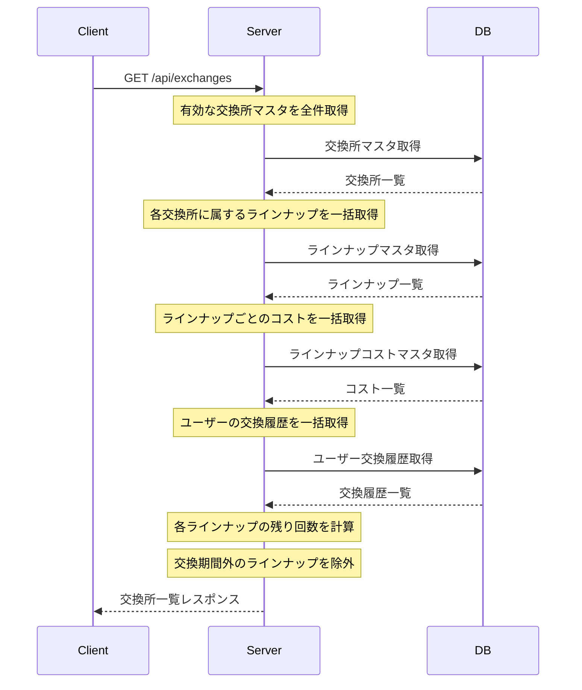
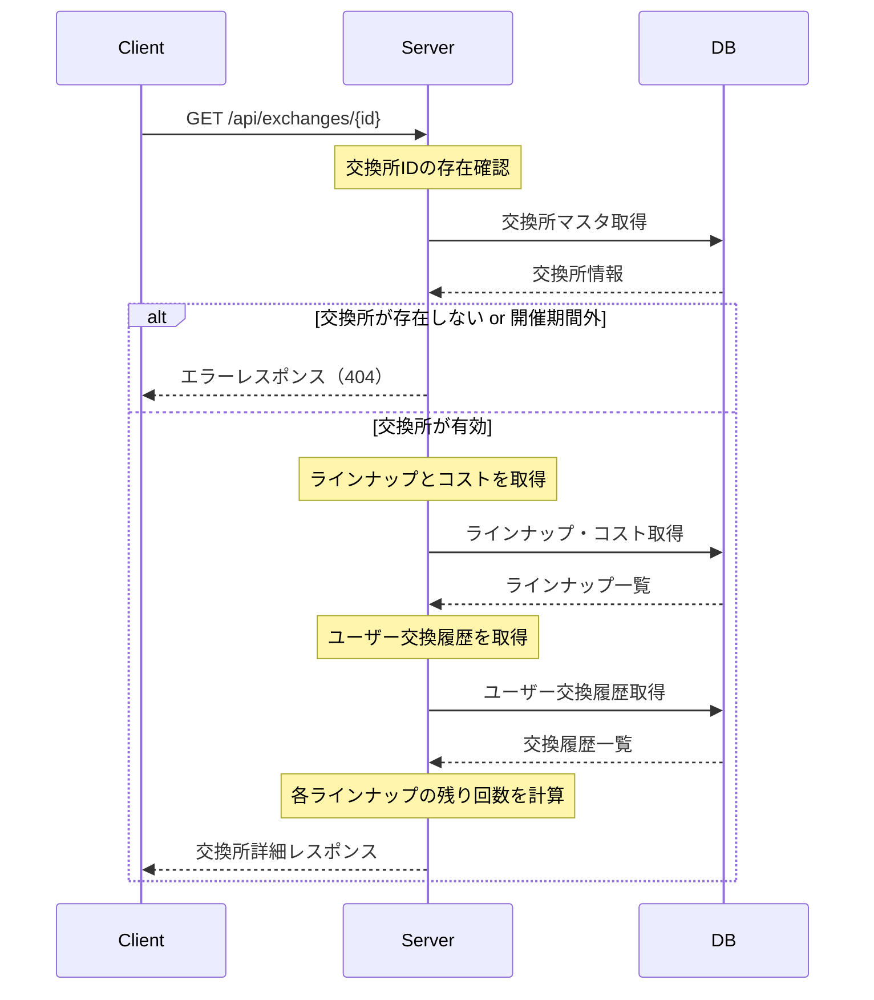
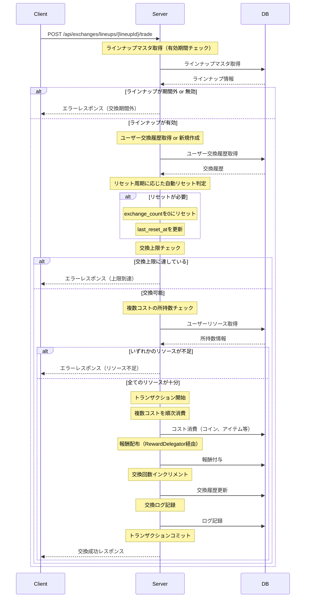

# 交換所 API設計書

## 目次

- [仕様書](#仕様書)
  - [要点まとめ](#要点まとめ)
  - [仕様確認](#仕様確認)
- [シーケンス図](#シーケンス図)
- [エラー設計](#エラー設計)
- [API仕様](#api仕様)
- [DB設計](#db設計)
  - [マスター/オペレーション](#マスターオペレーション)
  - [ユーザー](#ユーザー)
  - [ログ](#ログ)

---

## 仕様書

### 要点まとめ

#### 概要
- ユーザーがゲーム内で獲得したアイテムやコインを使用して、別のアイテムやキャラクターなどと交換できる機能
- 交換所（通常/イベント/キャラのかけらBOX）とラインナップの階層構造を持つ
- ラインナップごとに交換期間、上限数、リセット周期（日次/週次/月次）を設定可能
- 複数種類のリソースを同時に消費する交換に対応
- 交換履歴と残り回数をユーザーごとに管理し、リセット周期に応じて自動リセット

#### DB変更点
- **新規追加:**
  - `mst_exchanges`: 交換所マスタ（交換所の基本情報を管理）
  - `mst_exchange_lineups`: ラインナップマスタ（各ラインナップの詳細を管理）
  - `mst_exchange_lineup_costs`: ラインナップコストマスタ（複数コストを管理）
  - `usr_exchange_lineups`: ユーザー交換履歴（交換回数と最終リセット日時を管理）
  - `log_trade_exchange_lineups`: 交換ログ（監査証跡）
- **既存テーブルへの変更:**
  - なし

#### API
- **新規追加:**
  - `GET /api/exchanges`: 交換所一覧取得（全ラインナップとユーザー交換履歴を含む）
  - `GET /api/exchanges/{id}`: 特定交換所取得（ラインナップとユーザー交換履歴を含む）
  - `POST /api/exchanges/lineups/{lineupId}/trade`: 交換実行（複数リソース消費、報酬付与、履歴更新）
- **既存APIへの変更:**
  - なし

### 仕様確認

#### 参照ドキュメント
- [サーバーAPI要件書](./05_サーバーAPI要件書.md)
- [API実装全体概要設計](./06_API実装全体概要設計.md)
- [ゲーム体験仕様書PDF](./ゲーム体験仕様書.pdf)

#### ゲーム体験仕様確認結果

| Q | A |
|---|---|
| 交換所の階層構造について | 交換所自体をマスタデータとして管理する必要がある |
| 複数リソース消費の実装について | 複数想定で実装する |
| 月次リセットの実行タイミングについて | ユーザーが交換実行時に自動判定してリセットする（既存のショップアイテム実装を参考） |
| 復刻時のID切り直しと交換履歴について | 交換所IDを新規で切り直したら、ユーザーレコードも新規で作成される |
| イベント交換所の交換上限リセット周期 | 日次/週次でリセットされる設定も可能にする |
| 初回無料や広告視聴による交換 | 不要 |
| 交換時のミッション・クエストトリガー | 今はない |

---

## シーケンス図

### 交換所一覧取得フロー



### 特定交換所取得フロー（お知らせ・IGN連携）



### 交換実行フロー



---

## エラー設計

> ⚠️ クラサバで必ず認識共有する。
> クライアント側で、実際にどんな挙動にすべきか、不明瞭な状態をなくして、
> 本番リリース後に、CS対応も含めハンドリングしやすい状態にしておきたいです。

### 交換所関連エラー

| エラーコード | エラー内容 | 発生条件 | クライアント挙動 |
|------------|----------|---------|---------------|
| `ErrorCode::NOT_FOUND` | 交換所が見つからない | 指定された交換所IDが存在しない | エラーダイアログ表示後、交換所一覧画面に戻る |
| `ErrorCode::EXCHANGE_NOT_AVAILABLE` | 交換所が利用できない | 交換所の開催期間外 | エラーダイアログ表示「現在この交換所は開催されていません」 |
| `ErrorCode::EXCHANGE_LINEUP_NOT_AVAILABLE` | ラインナップが利用できない | ラインナップの交換期間外 | エラーダイアログ表示「このアイテムは交換期間外です」 |
| `ErrorCode::EXCHANGE_LIMIT_REACHED` | 交換上限に達した | ユーザーの交換回数が上限に達している | エラーダイアログ表示「交換上限に達しました」、ボタンを「交換済み」に変更 |
| `ErrorCode::INSUFFICIENT_COIN` | コイン不足 | 交換に必要なコインが不足 | エラーダイアログ表示「コインが不足しています」 |
| `ErrorCode::INSUFFICIENT_ITEM` | アイテム不足 | 交換に必要なアイテムが不足 | エラーダイアログ表示「{アイテム名}が不足しています」 |
| `ErrorCode::INVALID_TRADE_AMOUNT` | 交換回数が不正 | 交換回数が0以下、または残り回数を超えている | エラーダイアログ表示「交換回数が不正です」 |

**エラーハンドリング方針:**
- クライアント側で事前に所持数チェックを実施し、不足している場合は赤字で表示
- クライアント側で残り回数をチェックし、上限到達時は「交換済み」ボタンに変更
- サーバー側でも二重チェックを実施し、不正リクエストを防ぐ
- トランザクション内でエラーが発生した場合、全ての変更をロールバック

---

## API仕様

### GET /api/exchanges

交換所一覧を取得する。有効な全ての交換所とラインナップ、ユーザーの交換履歴を含む。

#### request

パラメータなし

#### response

```json
{
  "exchange_shops": [
    {
      "id": "normal_exchange_001",
      "name": "通常交換所",
      "category": "NORMAL",
      "banner_url": "https://example.com/banners/normal_shop.png",
      "start_at": null,
      "end_at": null,
      "lineups": [
        {
          "id": "lineup_001",
          "reward_type": "ITEM",
          "reward_id": "item_gold_coin_1000",
          "reward_amount": 1000,
          "start_at": "2025-11-01T00:00:00Z",
          "end_at": "2025-11-30T23:59:59Z",
          "limit_count": 10,
          "reset_type": "MONTHLY",
          "costs": [
            {
              "cost_type": "ITEM",
              "cost_id": "item_exchange_ticket_a",
              "cost_amount": 1
            }
          ],
          "user_exchange_history": {
            "exchange_count": 3,
            "exchange_total_count": 15,
            "remaining_count": 7,
            "last_reset_at": "2025-11-01T04:00:00Z"
          }
        },
        {
          "id": "lineup_002",
          "reward_type": "UNIT",
          "reward_id": "unit_ssr_character_001",
          "reward_amount": 1,
          "start_at": "2025-11-01T00:00:00Z",
          "end_at": null,
          "limit_count": null,
          "reset_type": "NONE",
          "costs": [
            {
              "cost_type": "COIN",
              "cost_id": "coin",
              "cost_amount": 50000
            },
            {
              "cost_type": "ITEM",
              "cost_id": "item_exchange_stone",
              "cost_amount": 10
            }
          ],
          "user_exchange_history": {
            "exchange_count": 0,
            "exchange_total_count": 0,
            "remaining_count": null,
            "last_reset_at": null
          }
        }
      ]
    },
    {
      "id": "event_exchange_001",
      "name": "ダンダダンいいジャン祭交換所",
      "category": "EVENT",
      "banner_url": "https://example.com/banners/event_shop_dandadan.png",
      "start_at": "2025-11-15T04:00:00Z",
      "end_at": "2025-11-30T03:59:59Z",
      "lineups": [
        {
          "id": "lineup_event_001",
          "reward_type": "ITEM",
          "reward_id": "item_event_exclusive_weapon",
          "reward_amount": 1,
          "start_at": "2025-11-15T04:00:00Z",
          "end_at": "2025-11-30T03:59:59Z",
          "limit_count": 1,
          "reset_type": "NONE",
          "costs": [
            {
              "cost_type": "ITEM",
              "cost_id": "item_event_token",
              "cost_amount": 500
            }
          ],
          "user_exchange_history": {
            "exchange_count": 0,
            "exchange_total_count": 0,
            "remaining_count": 1,
            "last_reset_at": null
          }
        }
      ]
    }
  ]
}
```

**レスポンス説明:**
- `exchange_shops`: 交換所の配列
  - `id`: 交換所ID
  - `name`: 交換所名
  - `category`: 交換所カテゴリー（"NORMAL", "EVENT", "FRAGMENT_BOX"）
  - `banner_url`: バナー画像URL
  - `start_at`: 開催開始日時（ISO 8601形式、nullの場合は無期限）
  - `end_at`: 開催終了日時（ISO 8601形式、nullの場合は無期限）
  - `lineups`: ラインナップの配列
    - `id`: ラインナップID
    - `reward_type`: 報酬種別（"ITEM", "UNIT", "ART", "EMBLEM", "PRISM", "COIN"）
    - `reward_id`: 報酬ID
    - `reward_amount`: 報酬個数
    - `start_at`: 交換期間開始日時
    - `end_at`: 交換期間終了日時（nullの場合は無期限）
    - `limit_count`: 交換上限回数（nullの場合は無制限）
    - `reset_type`: リセット周期（"NONE", "DAILY", "WEEKLY", "MONTHLY"）
    - `costs`: コストの配列（複数コスト対応）
      - `cost_type`: コスト種別（"COIN", "ITEM"）
      - `cost_id`: コストID（コイン の場合は "coin" 固定）
      - `cost_amount`: コスト個数
    - `user_exchange_history`: ユーザー交換履歴
      - `exchange_count`: 現在期間内の交換回数
      - `exchange_total_count`: 累計交換回数
      - `remaining_count`: 残り交換可能回数（nullの場合は無制限）
      - `last_reset_at`: 最終リセット日時（nullの場合は未リセット）

**注意点:**
- 開催期間外の交換所は含まれない
- 交換期間外のラインナップは含まれない
- N+1問題を回避するため、交換所、ラインナップ、コスト、ユーザー交換履歴を一括取得
- `remaining_count`は`limit_count - exchange_count`で計算（limit_countがnullの場合はnull）

---

### GET /api/exchanges/{id}

特定の交換所とラインナップを取得する。お知らせやIGNから直接遷移する際に使用。

#### request

**パスパラメータ:**
- `id` (string, required): 交換所ID

#### response

```json
{
  "exchange_shop": {
    "id": "event_exchange_001",
    "name": "ダンダダンいいジャン祭交換所",
    "category": "EVENT",
    "banner_url": "https://example.com/banners/event_shop_dandadan.png",
    "start_at": "2025-11-15T04:00:00Z",
    "end_at": "2025-11-30T03:59:59Z",
    "lineups": [
      {
        "id": "lineup_event_001",
        "reward_type": "ITEM",
        "reward_id": "item_event_exclusive_weapon",
        "reward_amount": 1,
        "start_at": "2025-11-15T04:00:00Z",
        "end_at": "2025-11-30T03:59:59Z",
        "limit_count": 1,
        "reset_type": "NONE",
        "costs": [
          {
            "cost_type": "ITEM",
            "cost_id": "item_event_token",
            "cost_amount": 500
          }
        ],
        "user_exchange_history": {
          "exchange_count": 0,
          "exchange_total_count": 0,
          "remaining_count": 1,
          "last_reset_at": null
        }
      }
    ]
  }
}
```

**レスポンス説明:**
- `exchange_shop`: 交換所の詳細情報（GET /api/exchanges の各要素と同じ構造）

**エラー:**
- 交換所IDが存在しない場合: `ErrorCode::NOT_FOUND`
- 交換所が開催期間外の場合: `ErrorCode::EXCHANGE_NOT_AVAILABLE`

---

### POST /api/exchanges/lineups/{lineupId}/trade

指定されたラインナップで交換を実行する。複数リソースの消費、報酬付与、交換履歴の更新を行う。

#### request

**パスパラメータ:**
- `lineupId` (string, required): ラインナップID

**ボディパラメータ:**
```json
{
  "amount": 1
}
```

**パラメータ説明:**
- `amount` (int, required): 交換回数（1以上の整数）

**バリデーション:**
- `amount`は1以上の整数であること
- `amount`が残り交換可能回数を超えていないこと

#### response

```json
{
  "result": {
    "exchange_count": 4,
    "exchange_total_count": 16,
    "remaining_count": 6,
    "rewards": [
      {
        "reward_type": "ITEM",
        "reward_id": "item_gold_coin_1000",
        "reward_amount": 1000
      }
    ],
    "consumed_resources": [
      {
        "cost_type": "ITEM",
        "cost_id": "item_exchange_ticket_a",
        "cost_amount": 1,
        "remaining_amount": 9
      }
    ]
  }
}
```

**レスポンス説明:**
- `result`: 交換結果
  - `exchange_count`: 交換後の現在期間内の交換回数
  - `exchange_total_count`: 交換後の累計交換回数
  - `remaining_count`: 交換後の残り交換可能回数（nullの場合は無制限）
  - `rewards`: 付与された報酬の配列
    - `reward_type`: 報酬種別
    - `reward_id`: 報酬ID
    - `reward_amount`: 付与された報酬個数
  - `consumed_resources`: 消費されたリソースの配列
    - `cost_type`: コスト種別
    - `cost_id`: コストID
    - `cost_amount`: 消費した個数
    - `remaining_amount`: 消費後の残り所持数

**エラー:**
- ラインナップが期間外の場合: `ErrorCode::EXCHANGE_LINEUP_NOT_AVAILABLE`
- 交換上限に達している場合: `ErrorCode::EXCHANGE_LIMIT_REACHED`
- コインが不足している場合: `ErrorCode::INSUFFICIENT_COIN`
- アイテムが不足している場合: `ErrorCode::INSUFFICIENT_ITEM`
- 交換回数が不正な場合: `ErrorCode::INVALID_TRADE_AMOUNT`

**処理フロー:**
1. ラインナップマスタ取得（有効期間チェック）
2. ユーザー交換履歴取得 or 新規作成
3. リセット周期に応じた自動リセット判定・実行
4. 交換上限チェック
5. 全コストの所持数チェック
6. トランザクション開始
7. 複数コストを順次消費
8. 報酬配布（RewardDelegator経由）
9. 交換回数インクリメント
10. 交換ログ記録
11. トランザクションコミット

---

## DB設計

### マスター/オペレーション

#### mst_exchanges（新規）

交換所の基本情報を管理するマスタテーブル。交換所一覧画面に表示される交換所を定義。

| 列名 | index | データ型/制約 | 説明 |
|------|-------|---------------|------|
| id | PK | varchar(255) | 交換所ID |
| name | | varchar(255) | 交換所名 |
| category | | enum('NORMAL','EVENT','FRAGMENT_BOX') | 交換所カテゴリー<br/>NORMAL: 通常交換所（恒常）<br/>EVENT: イベント交換所（期間限定）<br/>FRAGMENT_BOX: キャラのかけらBOX交換所 |
| banner_url | | varchar(500) | バナー画像URL |
| start_at | | timestamp NULL | 開催開始日時（NULLの場合は無期限） |
| end_at | | timestamp NULL | 開催終了日時（NULLの場合は無期限） |
| sort_order | | int | 表示順序（小さい順に表示） |
| is_active | | tinyint(1) DEFAULT 1 | 有効フラグ（0: 無効, 1: 有効） |
| created_at | | timestamp | 作成日時 |
| updated_at | | timestamp | 更新日時 |

**制約:**
- `start_at` と `end_at` が両方設定されている場合、`start_at` < `end_at` であること
- `is_active = 0` の交換所は表示しない

---

#### mst_exchange_lineups（新規）

ラインナップの詳細情報を管理するマスタテーブル。各交換所に属するラインナップを定義。

| 列名 | index | データ型/制約 | 説明 |
|------|-------|---------------|------|
| id | PK | varchar(255) | ラインナップID |
| mst_exchange_id | INDEX | varchar(255) | 所属交換所ID（mst_exchanges.id） |
| reward_type | | enum('ITEM','UNIT','ART','EMBLEM','PRISM','COIN') | 報酬種別<br/>ITEM: アイテム<br/>UNIT: キャラクター<br/>ART: 原画<br/>EMBLEM: エンブレム<br/>PRISM: プリズム<br/>COIN: コイン |
| reward_id | | varchar(255) | 報酬ID（対応するマスタテーブルのID） |
| reward_amount | | int unsigned | 報酬個数 |
| start_at | | timestamp NULL | 交換期間開始日時（NULLの場合は無期限） |
| end_at | | timestamp NULL | 交換期間終了日時（NULLの場合は無期限） |
| limit_count | | int unsigned NULL | 交換上限回数（NULLの場合は無制限） |
| reset_type | | enum('NONE','DAILY','WEEKLY','MONTHLY') DEFAULT 'NONE' | リセット周期<br/>NONE: リセットなし<br/>DAILY: 日次リセット<br/>WEEKLY: 週次リセット<br/>MONTHLY: 月次リセット |
| sort_order | | int | 表示順序（小さい順に表示） |
| created_at | | timestamp | 作成日時 |
| updated_at | | timestamp | 更新日時 |

**制約:**
- `start_at` と `end_at` が両方設定されている場合、`start_at` < `end_at` であること
- `mst_exchange_id` は `mst_exchanges.id` に存在すること（外部キー制約）

---

#### mst_exchange_lineup_costs（新規）

ラインナップの必要コスト（消費リソース）を管理するマスタテーブル。複数コスト対応のため、1ラインナップに対してN個のコストレコードを持つ。

| 列名 | index | データ型/制約 | 説明 |
|------|-------|---------------|------|
| id | PK | bigint unsigned AUTO_INCREMENT | コストID |
| mst_exchange_lineup_id | INDEX | varchar(255) | ラインナップID（mst_exchange_lineups.id） |
| cost_type | | enum('COIN','ITEM') | コスト種別<br/>COIN: コイン<br/>ITEM: アイテム |
| cost_id | | varchar(255) | コストID（COIN の場合は "coin" 固定、ITEM の場合はアイテムID） |
| cost_amount | | int unsigned | コスト個数 |
| sort_order | | int | 表示順序（小さい順に表示） |
| created_at | | timestamp | 作成日時 |
| updated_at | | timestamp | 更新日時 |

**制約:**
- `mst_exchange_lineup_id` は `mst_exchange_lineups.id` に存在すること（外部キー制約）
- 同一ラインナップ内で同じコスト（cost_type + cost_id）を重複して設定しないこと

---

### ユーザー

> ⚠️ PKの貼り方について、TiDB最適化の観点から以下の方針:
>
> **1ユーザーあたり1レコードのみのテーブル**
> - PK：usr_user_id
>
> **1ユーザーあたり複数レコードできるテーブル**
> - 複合PK：usr_user_id, ドメインID or マスタID

#### usr_exchange_lineups（新規）

ユーザーごとの交換履歴を管理するテーブル。交換回数と最終リセット日時を記録。

| 列名 | index | データ型/制約 | 説明 |
|------|-------|---------------|------|
| usr_user_id | PK | varchar(255) | usr_users.id |
| mst_exchange_lineup_id | PK | varchar(255) | mst_exchange_lineups.id |
| exchange_count | | int unsigned DEFAULT 0 | 現在期間内の交換回数（リセット周期に応じてリセット） |
| exchange_total_count | | int unsigned DEFAULT 0 | 累計交換回数（リセットされない） |
| last_reset_at | | timestamp NULL | 最終リセット日時（NULLの場合は未リセット） |
| created_at | | timestamp | 作成日時 |
| updated_at | | timestamp | 更新日時 |

**利用箇所:**
- GET /api/exchanges: ユーザー交換履歴を取得し、残り回数を計算
- GET /api/exchanges/{id}: ユーザー交換履歴を取得し、残り回数を計算
- POST /api/exchanges/lineups/{lineupId}/trade: 交換実行時に交換回数をインクリメント、リセット判定を実施

**リセット処理:**
- 交換実行時に`last_reset_at`と現在時刻を比較し、リセット周期に応じて`exchange_count`を0にリセット
- リセット実行時に`last_reset_at`を現在時刻で更新

**UsrModelManagerキャッシュキー:**
- `usr_user_id + mst_exchange_lineup_id` の連結文字列

---

### ログ

#### log_trade_exchange_lineups（新規）

交換実行の詳細ログを記録するテーブル。監査証跡、問い合わせ対応、データ分析に使用。

| 列名 | index | データ型/制約 | 説明 |
|------|-------|---------------|------|
| id | PK | bigint unsigned AUTO_INCREMENT | ログID |
| usr_user_id | INDEX | varchar(255) | usr_users.id |
| mst_exchange_lineup_id | INDEX | varchar(255) | mst_exchange_lineups.id |
| exchange_count_before | | int unsigned | 交換前の現在期間内交換回数 |
| exchange_count_after | | int unsigned | 交換後の現在期間内交換回数 |
| trade_amount | | int unsigned | 交換回数（何回分交換したか） |
| costs | | json | 消費したコスト情報（JSON配列） |
| rewards | | json | 付与された報酬情報（JSON配列） |
| created_at | | timestamp | 作成日時 |

**ログ記録タイミング:**
- POST /api/exchanges/lineups/{lineupId}/trade の交換実行時、トランザクション内で記録

**costs例:**
```json
[
  {
    "cost_type": "ITEM",
    "cost_id": "item_exchange_ticket_a",
    "cost_amount": 1
  },
  {
    "cost_type": "COIN",
    "cost_id": "coin",
    "cost_amount": 1000
  }
]
```

**rewards例:**
```json
[
  {
    "reward_type": "ITEM",
    "reward_id": "item_gold_coin_1000",
    "reward_amount": 1000
  }
]
```

---

## テーブル一覧

| テーブル名 | 新規/既存 | 概要 |
|-----------|----------|------|
| mst_exchanges | 新規 | 交換所マスタ |
| mst_exchange_lineups | 新規 | ラインナップマスタ |
| mst_exchange_lineup_costs | 新規 | ラインナップコストマスタ（複数コスト対応） |
| usr_exchange_lineups | 新規 | ユーザー交換履歴 |
| log_trade_exchange_lineups | 新規 | 交換ログ |

---

## 実装上の注意点

### 既存コードパターンの踏襲

- 既存のショップアイテム機能（`ShopService`、`UsrShopItem`）のコード構造を参考にする
- `applyUserTransactionChanges`によるトランザクション管理
- `UsrModelManager`によるキャッシュ管理（`makeModelKey`メソッドの実装）
- `RewardDelegator`を使用した報酬配布
- `AppCurrencyDelegator`、`UsrItemService`を使用したコスト消費

### リセット処理の実装

- リクエスト時判定方式を採用（バッチ処理ではない）
- `Clock`サービスの`isFirstToday`、`isFirstWeek`を使用
- MONTHLYリセット用に`Clock::isFirstMonth`メソッドを新規実装
- 交換実行前に必ずリセット判定を実施

### 複数リソース消費の実装

- `mst_exchange_lineup_costs`テーブルから全コストを取得
- ループで順次消費処理を実行
- 1つでも所持数が不足している場合、交換全体を拒否
- トランザクション内で全コスト消費を実行し、原子性を保証

### N+1問題の回避

- 交換所、ラインナップ、コスト、ユーザー交換履歴を一括取得
- `keyBy`や`groupBy`でメモリ上で突合
- 既存の`ShopService::fetchResetActiveUsrShopItemsWithoutSyncModels`のパターンを踏襲

### TiDB最適化

- `usr_exchange_lineups`テーブルのPKは`(usr_user_id, mst_exchange_lineup_id)`の複合PK
- 1ユーザーあたり複数レコードのため、複合PKが必須

---

## パフォーマンス考慮事項

- **交換所一覧取得の最適化**: 有効な交換所とラインナップを一括取得し、N+1問題を回避。1リクエストあたりのSQLクエリ実行回数を最小化（目標: 5クエリ以内）
- **UsrModelManagerキャッシュ**: リクエスト処理中、ユーザー交換履歴をメモリ上にキャッシュし、重複クエリを防ぐ
- **複数コスト消費**: ループ処理だが、通常1ラインナップあたり1〜3個程度のコストのため、パフォーマンス影響は限定的
- **インデックス設計**: `mst_exchange_lineups.mst_exchange_shop_id`、`mst_exchange_lineup_costs.mst_exchange_lineup_id`、`log_trade_exchange_lineups.usr_user_id`にインデックスを設定

---

## テスト観点

### 単体テスト

- **リセット処理のテスト**: 各リセット周期（DAILY/WEEKLY/MONTHLY）でリセット判定が正しく動作するかをテスト
- **複数コスト消費のテスト**: 全コストが正しく消費されるか、1つでも不足している場合にエラーになるかをテスト
- **交換上限チェックのテスト**: 上限に達している場合にエラーになるか、リセット後に再度交換可能になるかをテスト
- **報酬配布のテスト**: RewardDelegator経由で報酬が正しく配布されるかをテスト

### 機能テスト

- **交換所一覧取得**: 有効な交換所とラインナップのみが返却されるか、開催期間外のものが除外されるかをテスト
- **特定交換所取得**: 指定された交換所IDが正しく取得できるか、存在しないIDの場合にエラーになるかをテスト
- **交換実行**: コスト消費、報酬付与、交換回数更新が正しく実行されるか、トランザクションが正しく動作するかをテスト
- **エラーハンドリング**: 各エラーケース（期間外、上限到達、リソース不足等）で正しいエラーコードが返却されるかをテスト

### シナリオテスト

- **月次リセットのシナリオ**: 月初日04:00以降の初回アクセスで交換回数がリセットされるか、リセット後に再度交換可能になるかをテスト
- **複数回交換のシナリオ**: まとめて交換（amount > 1）で複数回分のコスト消費と報酬付与が正しく実行されるかをテスト
- **復刻時のシナリオ**: 新しい交換所IDで復刻した場合、ユーザー交換履歴が新規作成され、旧履歴は保持されるかをテスト
- **お知らせ連携のシナリオ**: お知らせから特定交換所に直接遷移できるか、正しいラインナップが表示されるかをテスト
