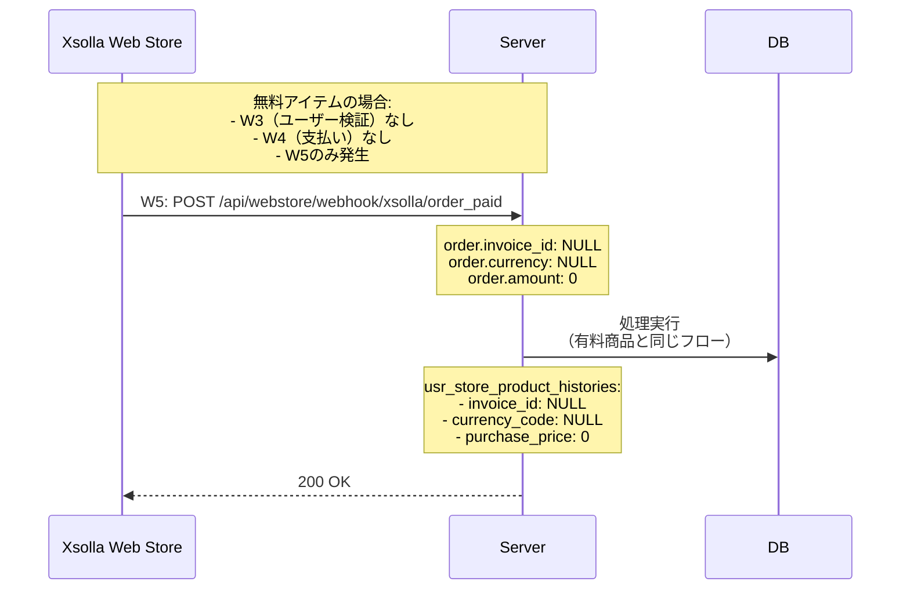

# 外部決済（WEB STORE連携）API設計書

**機能名**: 外部決済（WEB STORE連携）
**作成日**: 2025-12-02
**バージョン**: 1.0
**ステータス**: 設計完了

---

## 目次

- [仕様書](#仕様書)
  - [要点まとめ](#要点まとめ)
  - [仕様確認](#仕様確認)
- [シーケンス図](#シーケンス図)
- [エラー設計](#エラー設計)
- [API仕様](#api仕様)
- [DB設計](#db設計)
  - [マスター/オペレーション](#マスターオペレーション)
  - [ユーザー](#ユーザー)

---

## 仕様書

### 要点まとめ

#### 概要

外部決済機能は、ユーザーがWeb Store（Xsolla基盤）を通じてゲーム内アイテムを購入できる機能です。サーバー側では、Xsollaからの5種類のウェブフックを受信し、以下の処理を行います：

- **ユーザー認証**: バンダイナムコIDとアプリユーザーの紐付け、年齢・国による購入制御
- **購入検証**: 年齢制限、国コード照合、購入回数制限のチェック
- **アイテム付与**: 決済完了後のアイテム付与処理、べき等性の保証
- **外部連携**: Bank/Adjustへの購入データ送信（非同期処理）
- **不正購入防止**: 署名検証、IP制限、重複防止、トランザクション管理

**重要な実装上の注意点:**
1. べき等性の保証が必須（同一order.idでの重複処理防止）
2. アイテム付与失敗時のエラー種別による処理分岐（ステータス記録）
3. 無料アイテム・クーポン交換時の特殊処理（invoice_id, currency_codeがNULL）

#### DB変更点

**新規追加:**
- `usr_webstore_transactions`: WebStoreトランザクションの状態管理（12カラムの軽量テーブル、詳細情報は他テーブル/ログから取得）

**既存テーブルへの変更:**
- `mst_store_products`: `product_id_webstore`カラムを追加、`product_id_ios`と`product_id_android`をNULL許容に変更
- `usr_store_products`: 既存テーブルをWebStoreでも使用（Apple/Google/WebStore全プラットフォーム共通で購入回数を管理）
- `usr_store_product_histories`: `order_id`, `invoice_id`, `transaction_id`カラム追加、`invoice_id`と`currency_code`をNULL許容に変更、`billing_platform`に'webstore'追加
- `usr_currency_paids`: `billing_platform`カラムに'webstore'を追加（既存: 'google', 'apple'）
- `usr_currency_summaries`: `paid_amount_share`カラムを追加（プラットフォーム間で共有可能な有償通貨を管理）

#### API

**新規追加:**
仕様書に下記の記載があるのですべてのウェブフックを以下の1つのAPIで受ける
```
ウェブフックのURLは単一のURLに対してすべて通知を行う。
※ウェブフックごとにURLをわけることはできません。
```
- `POST /api/shop/webstore`
    - W1: ユーザー情報取得（web_store_user_validation）
    - W2: 決済事前確認（web_store_payment_validation）
    - W3: ユーザー検証（user_validation - Xsolla）
    - W4: 支払い（payment - Xsolla）
    - W5: 注文支払い成功（order_paid - Xsolla）

**既存APIへの変更:**
- `POST /game/update_and_fetch`: 国コード登録パラメータ（`country_code`）を追加

---

## シーケンス図

### 購入フロー全体（W1→W2→W3→W4→W5）

```mermaid
sequenceDiagram
    participant User as ユーザー
    participant XsollaWebStore as Xsolla Web Store
    participant Server
    participant DB
    participant Bank as Bank System
    participant Adjust as Adjust API

    Note over User,Server: W1: ユーザー情報取得
    User->>XsollaWebStore: Web Storeにログイン
    XsollaWebStore->>Server: POST /api/shop/webstore<br/>notification_type: "web_store_user_validation"
    Note over Server: バンダイナムコIDで<br/>ユーザー検索

    Server->>DB: usr_users検索<br/>(bn_user_id)
    DB-->>Server: ユーザー情報

    alt エラー（USER_NOT_FOUND/BIRTHDAY_REQUIRED等）
        Server-->>XsollaWebStore: 400エラー
        XsollaWebStore-->>User: ログイン失敗
    else 正常系
        Server->>DB: usr_user_parameters取得<br/>(birth_date)
        DB-->>Server: 誕生日情報
        Server-->>XsollaWebStore: 200 OK<br/>{user情報, 国:"JP"}
        XsollaWebStore-->>User: ログイン成功
    end

    Note over User,Server: W2: 決済事前確認
    User->>XsollaWebStore: 商品選択→決済ボタン
    XsollaWebStore->>Server: POST /api/shop/webstore<br/>notification_type: "web_store_payment_validation"
    Note over Server: 年齢制限・購入回数チェック

    Server->>DB: 年齢・購入回数確認
    DB-->>Server: チェック結果

    alt エラー（PURCHASE_NOT_ALLOWED等）
        Server-->>XsollaWebStore: 400エラー
        XsollaWebStore-->>User: 購入不可
    else 正常系
        Server->>Server: トランザクションID発行
        Server->>DB: usr_webstore_transactions挿入<br/>(status: pending)
        Server-->>XsollaWebStore: 200 OK<br/>{transaction_id}
        XsollaWebStore-->>User: 決済画面表示
    end

    Note over User,Server: W3: ユーザー検証（Xsolla）
    User->>XsollaWebStore: 決済情報入力
    XsollaWebStore->>Server: POST /api/shop/webstore<br/>notification_type: "user_validation"
    Server->>DB: usr_users検索
    DB-->>Server: ユーザー情報

    alt ユーザー存在
        Server-->>XsollaWebStore: 200 OK
    else ユーザー不在
        Server-->>XsollaWebStore: 400 INVALID_USER
        XsollaWebStore-->>User: 決済エラー
    end

    Note over User,Server: W4: 支払い（Xsolla）
    User->>XsollaWebStore: 決済実行
    XsollaWebStore->>Server: POST /api/shop/webstore<br/>notification_type: "payment"<br/>(Xsolla)
    Server-->>XsollaWebStore: 200 OK
    XsollaWebStore->>XsollaWebStore: 決済処理実行

    Note over User,Server: W5: 注文支払い成功
    XsollaWebStore->>Server: POST /api/shop/webstore<br/>notification_type: "order_paid"

    Server->>Server: 署名検証

    Server->>DB: order.idで重複チェック
    DB-->>Server: チェック結果

    alt 既に処理済み（べき等性）
        Server-->>XsollaWebStore: 200 OK（前回結果）
    else 未処理
        Server->>DB: トランザクションID照合・有効期限確認
        DB-->>Server: トランザクション情報

        alt トランザクションエラー
            Server-->>XsollaWebStore: 400エラー
        else 正常系
            Server->>DB: トランザクション開始
            Server->>DB: usr_store_product_histories挿入
            Server->>DB: usr_store_products購入回数更新

            Server->>Server: 商品タイプ判定

            alt 有償通貨（Diamond）
                Server->>DB: BillingDelegator::purchasedForWebStore()<br/>usr_currency_paids挿入<br/>(billing_platform='webstore')
            else その他アイテム
                Server->>DB: RewardDelegator::sendRewards()<br/>アイテム付与
            end

            alt アイテム付与失敗（一時エラー）
                Server->>DB: ロールバック
                Server-->>XsollaWebStore: 500 INTERNAL_ERROR
                Note over XsollaWebStore: Xsollaがリトライ
            else アイテム付与失敗（永続エラー）
                Server->>DB: コミット＋usr_webstore_transactionsステータス更新
                Note over Server: アプリケーションログに詳細記録<br/>アラート送信（手動対応）
                Server-->>XsollaWebStore: 200 OK
            else アイテム付与成功
                Server->>DB: コミット

                par Bank連携（非同期）
                    Server->>Bank: 購入データ送信
                    Bank-->>Server: レスポンス
                and Adjust連携（非同期）
                    Server->>Adjust: クライアントIP送信
                    Adjust-->>Server: レスポンス
                end

                Server->>DB: usr_webstore_transactions<br/>status更新(completed)
                Server-->>XsollaWebStore: 200 OK<br/>{result: "success"}
                XsollaWebStore-->>User: 購入完了通知
            end
        end
    end
```



### 無料アイテムフロー



---

## エラー設計

### 外部決済関連エラー

| エラーコード | エラー内容 | 発生条件 |
|------------|----------|---------|
| `ErrorCode::WEBSTORE_USER_NOT_FOUND` | ユーザーが未登録 | バンダイナムコIDに対応するユーザーがアプリに存在しない |
| `ErrorCode::WEBSTORE_BIRTHDAY_REQUIRED` | 誕生日情報が未登録 | `usr_user_parameters.birth_date`がNULL |
| `ErrorCode::WEBSTORE_COUNTRY_NOT_REGISTERED` | 国コード未登録 | `usr_webstore_infos.country_code`がNULL（`game/update_and_fetch`での国コード登録が必要） |
| `ErrorCode::WEBSTORE_PURCHASE_NOT_ALLOWED_FOR_MINOR` | 未成年で有料商品を購入しようとした | 年齢が購入可能年齢未満かつ`order.amount > 0`（現在の基準: 18歳） |
| `ErrorCode::WEBSTORE_PURCHASE_COUNT_LIMIT` | 購入回数上限 | `usr_store_products`の購入回数が上限超過 |
| `ErrorCode::WEBSTORE_NO_VIRTUAL_GOOD_ITEMS` | items配列にtype=virtual_goodが存在しない | items配列をフィルタした結果、virtual_goodが0件 |
| `ErrorCode::WEBSTORE_TRANSACTION_NOT_FOUND` | トランザクションIDが見つからない | カスタムパラメータの`transaction_id`が`usr_webstore_transactions`に存在しない |
| `ErrorCode::WEBSTORE_DUPLICATE_ORDER` | 同一order.idで重複リクエスト | `usr_store_product_histories`に同一`order_id`が既に存在 |
| `ErrorCode::WEBSTORE_SIGNATURE_INVALID` | 署名検証失敗 | Xsollaからのウェブフックの署名が不正 |
| `ErrorCode::WEBSTORE_INTERNAL_ERROR` | 内部エラー | DB接続エラー、タイムアウトなどの一時エラー |

**注意: メンテナンスエラー（503）について**

メンテナンス中は、ALBリスナールールで503 Service Unavailableを返します。

ALBが返す503レスポンス:
```json
{
  "error": {
    "code": "SERVICE_UNAVAILABLE",
    "message": "Service is under maintenance"
  }
}
```

## API仕様

### POST /api/shop/webstore

**概要:**
Xsollaからの全てのウェブフック（W1-W5）を受信する統合エンドポイント。`notification_type`パラメータで処理を分岐します。

**重要:**
- Xsollaの仕様により、ウェブフックのURLは単一のURLに対してすべて通知を行います
- ウェブフックごとにURLをわけることはできません

**共通仕様:**
- HTTPメソッド: POST
- Content-Type: application/json
- 署名検証: Xsolla署名（X-Signature ヘッダー）を検証

**処理分岐:**
`notification_type`パラメータの値で処理を分岐：
- `"web_store_user_validation"` → W1: ユーザー情報取得
- `"web_store_payment_validation"` → W2: 決済事前確認
- `"user_validation"` → W3: ユーザー検証（Xsolla）
- `"payment"` → W4: 支払い（Xsolla）
- `"order_paid"` → W5: 注文支払い成功

---

#### W1: ユーザー情報取得（web_store_user_validation）

WebStoreログイン時にアプリのユーザー情報を返却する処理。バンダイナムコIDからアプリのユーザーIDを検索し、誕生日情報を取得して返却します。

**リクエスト例:**

```json
{
  "notification_type": "web_store_user_validation",
  "user": {
    "id": "bandai_namco_user_id_12345",
    "name": "PlayerName"
  },
  "custom_parameters": {
    "key1": "value1"
  }
}
```

**パラメータ:**
- `notification_type` (string, required): "web_store_user_validation"固定
- `user.id` (string, required): バンダイナムコID
- `user.name` (string, optional): ユーザー名（参照のみ）
- `custom_parameters` (object, optional): カスタムパラメータ（任意）

**処理フロー:**
1. バンダイナムコIDから`usr_users.bn_user_id`を検索
2. ユーザーが存在しない場合: 400エラー `WEBSTORE_USER_NOT_FOUND`
3. 誕生日情報（`usr_user_parameters.birth_date`）を確認、NULLの場合: 400エラー `WEBSTORE_BIRTHDAY_REQUIRED`
4. 国コード情報（`usr_webstore_infos.country_code`）を確認、NULLの場合: 400エラー `WEBSTORE_COUNTRY_NOT_REGISTERED`
5. レスポンスを返却

**注意:** メンテナンス中は、ALBリスナールールで503を返すため、本処理には到達しません。

**レスポンス例（200 OK）:**

```json
{
  "user": {
    "id": "bandai_namco_user_id_12345",
    "internal_id": "usr_user_12345",
    "name": "PlayerName",
    "level": 1,
    "birthday": "20050408",
    "birthday_month": "202001",
    "country": "JP"
  }
}
```

**レスポンスフィールド:**
- `user.id` (string): バンダイナムコID（リクエストと同じ）
- `user.internal_id` (string): アプリのユーザーID（`usr_user_id`）
- `user.name` (string): ユーザー名
- `user.level` (int): 固定値1（Xsolla仕様で必須だが、実際には使用しない）
- `user.birthday` (string): 誕生日（YYYYMMDD形式）
- `user.birthday_month` (string): 誕生年月（YYYYMM形式）*年月しか保持していない場合にのみ利用
- `user.country` (string): 国コード（ISO 3166-1 alpha-2、例: "JP", "US"）

**エラーレスポンス例:**

```json
{
  "error": {
    "code": "WEBSTORE_USER_NOT_FOUND",
    "message": "User not found. Please login to the app first."
  }
}
```

エラーコードは[エラー設計](#エラー設計)セクションを参照。

---

#### W2: 決済事前確認（web_store_payment_validation）

購入前にユーザーの購入権限を検証し、トランザクションIDを発行する処理。未成年制限（現在: 18歳未満は有料商品購入不可）、購入回数制限をチェックします。

**リクエスト例:**

```json
{
  "notification_type": "web_store_payment_validation",
  "user": {
    "id": "bandai_namco_user_id_12345",
    "birthday": "20050408",
    "country": "JP"
  },
  "custom_parameters": {
    "internal_id": "usr_user_12345",
    "store_code": "JP",
    "country_from_ip": "JP",
    "is_country_mismatch": false
  },
  "purchase": {
    "items": [
      {
        "sku": "item_001",
        "type": "virtual_good",
        "amount": 1000
      }
    ]
  },
  "order": {
    "amount": 1000,
    "currency": "JPY"
  }
}
```

**パラメータ:**
- `notification_type` (string, required): "web_store_payment_validation"固定
- `user.id` (string, required): バンダイナムコID
- `user.birthday` (string, required): 誕生日（YYYYMMDD形式）
- `user.country` (string, required): 国コード
- `custom_parameters.internal_id` (string, required): アプリのユーザーID
- `custom_parameters.store_code` (string, required): ストアコード（国コードと同じ）
- `custom_parameters.country_from_ip` (string, required): クライアントIPから取得した国コード
- `custom_parameters.is_country_mismatch` (boolean, required): アクセス国と居住国が不一致かどうか
- `purchase.items` (array, required): 購入アイテムリスト
  - `sku` (string, required): アイテムSKU（WebStoreのSKU、`mst_store_products.product_id_webstore`に対応）
  - `type` (string, required): アイテムタイプ（"virtual_good"のみ処理対象）
  - `amount` (int, required): アイテムの金額
- `order.amount` (int, required): 注文総額（0の場合は無料アイテム）
- `order.currency` (string, optional): 通貨コード（無料アイテムの場合はNULL）

**処理フロー:**
1. `items`配列から`type=virtual_good`のみをフィルタ
2. フィルタ後のアイテムが0件の場合: 400エラー `WEBSTORE_NO_VIRTUAL_GOOD_ITEMS`
3. ユーザーの年齢をチェック（`usr_user_parameters.birth_date`から算出）:
   - 未成年かつ`order.amount > 0`の場合: 400エラー `WEBSTORE_PURCHASE_NOT_ALLOWED_FOR_MINOR`（現在の基準: 18歳未満）
4. 購入回数制限をチェック（`usr_store_products`テーブル）:
   - 各アイテムの購入回数が上限超過の場合: 400エラー `WEBSTORE_PURCHASE_COUNT_LIMIT`
5. トランザクションIDを発行（UUID v4）
6. トランザクション情報を`usr_webstore_transactions`に挿入（status: "pending"）
7. レスポンスを返却

**注意:** メンテナンス中は、ALBリスナールールで503を返すため、本処理には到達しません。

**レスポンス例（200 OK）:**

```json
{
  "transaction_id": "550e8400-e29b-41d4-a716-446655440000"
}
```

**レスポンスフィールド:**
- `transaction_id` (string): UUID v4形式のトランザクションID

---

#### W3: ユーザー検証（user_validation）

Xsollaが購入直前にユーザーの存在を確認する処理。

**リクエスト例:**

```json
{
  "notification_type": "user_validation",
  "user": {
    "id": "bandai_namco_user_id_12345"
  },
  "custom_parameters": {
    "internal_id": "usr_user_12345"
  }
}
```

**パラメータ:**
- `notification_type` (string, required): "user_validation"固定
- `custom_parameters.internal_id` (string, required): アプリのユーザーID

**処理フロー:**
1. カスタムパラメータから`internal_id`を取得
2. `usr_users`テーブルでユーザー存在確認
3. 存在する場合: 200、存在しない場合: 400

**レスポンス例（200 OK）:**

```json
{}
```

**エラーレスポンス例（400 Bad Request）:**

```json
{
  "error": {
    "code": "INVALID_USER",
    "message": "User not found"
  }
}
```

---

#### W4: 支払い（payment）

決済実行時の支払い通知を受け取る処理。sandboxモードを判定します。

**リクエスト例:**

```json
{
  "notification_type": "payment",
  "transaction": {
    "id": "xsolla_transaction_id",
    "dry_run": 0
  }
}
```

**パラメータ:**
- `notification_type` (string, required): "payment"固定
- `transaction.dry_run` (int, required): 0 or 1（1の場合はテスト決済）

**処理フロー:**
1. `transaction.dry_run`をチェック（1の場合はテスト決済）
2. 200を返却

**レスポンス例（200 OK）:**

```json
{}
```

**エラーレスポンス例（500 Internal Server Error）:**

一時エラー発生時にリトライ可能。

---

#### W5: 注文支払い成功（order_paid）

決済完了後にアイテムを付与し、Bank/Adjustに購入データを送信する処理。べき等性を保証します。

**リクエスト例:**

```json
{
  "notification_type": "order_paid",
  "order": {
    "id": "xsolla_order_id_12345",
    "invoice_id": "xsolla_invoice_id_67890",
    "currency": "JPY",
    "amount": 1000,
    "mode": "live"
  },
  "items": [
    {
      "sku": "item_001",
      "type": "virtual_good",
      "amount": 1000
    }
  ],
  "custom_parameters": {
    "internal_id": "usr_user_12345",
    "transaction_id": "550e8400-e29b-41d4-a716-446655440000",
    "user_ip": "192.168.1.1",
    "store_code": "JP",
    "country_from_ip": "JP",
    "is_country_mismatch": false
  }
}
```

**パラメータ:**
- `notification_type` (string, required): "order_paid"固定
- `order.id` (string, required): Xsollaの注文ID（べき等性キー）
- `order.invoice_id` (string, optional): Xsollaの請求書ID（無料アイテムの場合はNULL）
- `order.currency` (string, optional): 通貨コード（無料アイテムの場合はNULL）
- `order.amount` (int, required): 注文総額（無料アイテムの場合は0）
- `order.mode` (string, required): "live" or "sandbox"（"sandbox"の場合はテスト決済）
- `items` (array, required): 購入アイテムリスト
  - `sku` (string, required): アイテムSKU（WebStoreのSKU、`mst_store_products.product_id_webstore`に対応）
  - `type` (string, required): アイテムタイプ
  - `amount` (int, required): アイテムの金額
- `custom_parameters.internal_id` (string, required): アプリのユーザーID
- `custom_parameters.transaction_id` (string, required): W2で発行したトランザクションID
- `custom_parameters.user_ip` (string, required): クライアントIPアドレス（Adjust連携で使用）
- `custom_parameters.store_code` (string, required): ストアコード
- `custom_parameters.country_from_ip` (string, required): クライアントIPから取得した国コード
- `custom_parameters.is_country_mismatch` (boolean, required): アクセス国と居住国が不一致かどうか

**処理フロー:**
1. `order.id`で重複チェック（`usr_store_product_histories.receipt_unique_id`）
2. 既に処理済みの場合: 1回目の処理結果を返す（べき等性）
3. `order.mode`が"sandbox"の場合、テスト決済フラグを立てる
4. `items`配列から`type=virtual_good`のみをフィルタ
5. トランザクションIDと照合（カスタムパラメータの`transaction_id`）:
   - トランザクションIDが見つからない場合: 400エラー `WEBSTORE_TRANSACTION_NOT_FOUND`
6. **トランザクション開始**
7. `usr_store_product_histories`にレコード挿入
8. 購入回数を更新（`usr_store_products`）
9. **商品タイプ判定とアイテム付与処理**:
   - `items[].sku`から`mst_store_products.product_id_webstore`で検索し、`mst_store_products.id`を取得
   - `mst_store_products.id`から有効な`opr_product`を取得（現在時刻で`start_date <= now < end_date`）
   - `opr_products.product_type`から商品タイプを取得
   - **有償通貨（Diamond）の場合**: `BillingDelegator::purchasedForWebStore()`を呼び出し
   - **その他アイテムの場合**: `RewardDelegator::sendRewards()`を呼び出し
10. **トランザクション終了**
11. Bank/Adjust連携（非同期）
12. `usr_webstore_transactions`のステータスを更新（status: "completed"、item_grant_status/bank_status/adjust_statusを記録）
13. 200を返却

詳細な処理フローは[シーケンス図](#シーケンス図)の「W5: 注文支払い成功フロー」を参照。

**レスポンス例（200 OK）:**

```json
{
  "result": "success",
  "order_id": "xsolla_order_id_12345"
}
```

**レスポンスフィールド:**
- `result` (string): "success"固定
- `order_id` (string): 注文ID（リクエストと同じ）

**エラーレスポンス:**
- **400系**: 永続エラー
- **500系**: 一時エラー

エラーコードは[エラー設計](#エラー設計)セクションを参照。

---

## 既存API変更

### POST /game/update_and_fetch

WebStore利用のため、既存の`game/update_and_fetch` APIに国コード登録機能を追加します。
**クライアント側で対応いただく必要あり**

**重要な仕様:**
- 国コードはApple/Googleのストアフロント情報から取得（デバイス設定ではない）
  - Android: BillingConfig APIから取得
  - iOS: SKPaymentQueue.storefrontから取得
- 一度登録した国コードは更新しない（仕様書要件）
- パラメータはオプショナル（WebStore非利用時は省略可能）

**リクエストパラメータ追加:**
| パラメータ | 型 | 必須 | 説明 |
|-----------|------|------|------|
| country_code | string | - | ISO 3166-1 alpha-2形式の国コード（例: "JP", "US", "GB"）<br>省略可能。WebStore利用時のみ送信 |

**処理フロー（国コード登録部分）:**
1. リクエストに`country_code`パラメータが含まれる場合のみ以下を実行
2. `usr_webstore_infos`に該当ユーザーのレコードが既に存在するか確認
3. 既存レコードがある場合: 何もしない（更新しない）
4. 既存レコードがない場合: `usr_webstore_infos`に新規レコードを作成
   - `usr_user_id`: 認証済みユーザーID
   - `country_code`: リクエストの`country_code`
   - `registered_at`: 現在時刻

**レスポンス:**
従来通りのゲームデータを返却（国コード登録処理はサイレントに実行）

---

## DB設計

### マスター/オペレーション

#### mst_store_products（既存テーブル変更）

3プラットフォーム共通の商品IDマスターとして使用。WebStore商品SKU管理のため、`product_id_webstore`カラムを追加します。

| 列名 | index | データ型/制約 | 説明 |
|------|-------|---------------|------|
| **product_id_webstore** | **INDEX** | **varchar(255) NULL** | **WebStoreのSKU（NULL: モバイルアプリ専用商品）** |

**変更内容:**
- `product_id_webstore`カラムを追加
- WebStore専用商品は`product_id_ios`, `product_id_android`を 空文字 にする
- モバイルアプリ専用商品は`product_id_webstore`を 空文字 にする

**利用箇所:**
- W5（注文支払い成功）: `items[].sku`から`product_id_webstore`で検索し、`mst_store_products.id`を取得
- `usr_store_product_histories`, `log_stores`に保存する`mst_store_product_id`は常に`mst_store_products.id`
- `usr_store_products.product_sub_id`は`opr_products.id`を参照（FK制約設定可能）

---

### ユーザー

#### usr_store_products（既存テーブル・変更なし）

購入回数管理テーブル。**Apple/Google/WebStore全プラットフォームで共通利用**。

**利用箇所:**
- W2（決済事前確認）: 購入回数制限チェック
- W5（注文支払い成功）: 購入回数更新

---

#### usr_webstore_infos（新規テーブル）

WebStore利用に必要な国コード情報を管理するテーブル。

| 列名 | index | データ型/制約 | 説明 |
|------|-------|---------------|------|
| usr_user_id | PK | varchar(255) NOT NULL | usr_users.usr_user_id |
| country_code | | varchar(2) NOT NULL | ISO 3166-1 alpha-2形式の国コード（例: "JP", "US", "GB"） |
| registered_at | | timestamp NOT NULL | 国コード登録日時 |
| created_at | | timestamp NOT NULL | 作成日時 |
| updated_at | | timestamp NOT NULL | 更新日時 |

**重要な仕様:**
- 国コードはApple/Googleのストアフロント情報から取得（デバイス設定ではない）
  - Android: BillingConfig APIから取得
  - iOS: SKPaymentQueue.storefrontから取得
- 一度登録した国コードは更新しない（仕様書P.28要件）
- ユーザーごとに1レコードのみ（usr_user_idがPK）

**利用箇所:**
- `POST /game/update_and_fetch`: 国コード初回登録（country_codeパラメータが送信された場合のみ）
- W1（ユーザー情報取得）: country_code存在チェック、レスポンスで返却
- W5（注文支払い成功）: 不正検出（is_country_mismatch）の判定に使用

---

#### usr_currency_paids（既存テーブル変更）

有償一次通貨（有償通貨）の残高管理テーブル。WebStore購入の有償通貨を管理するため、billing_platformカラムを拡張。

| 列名 | index | データ型/制約 | 説明 |
|------|-------|---------------|------|
| id | PK | varchar(255) | UUID |
| user_id | INDEX | varchar(255) | usr_users.usr_user_id |
| left_amount | | bigint | 同一単価・通貨での残所持数 |
| purchase_price | | decimal(20,6) | 購入時の価格 |
| purchase_amount | | bigint | 購入時に取得した有償一次通貨数 |
| price_per_amount | | decimal(20,8) | 単価 |
| currency_code | | varchar(16) | ISO 4217の通貨コード |
| receipt_unique_id | UNIQUE | varchar(255) | レシートのユニークID |
| is_sandbox | | tinyint | サンドボックス・テスト課金フラグ（0: 本番, 1: テスト） |
| os_platform | | varchar(16) | android / ios |
| **billing_platform** | | **varchar(16)** | **google / apple / webstore** |
| purchased_at | INDEX | timestamp | 購入日時 |
| created_at | | timestamp | 作成日時 |
| updated_at | | timestamp | 更新日時 |

**変更内容:**
- `billing_platform`カラムの値に**'webstore'**を追加（既存: 'google', 'apple'）
- WebStore購入の有償通貨は独立したプラットフォームとして管理
- 単価管理・消費順序は既存のApple/Google購入と同じロジックを踏襲

**クロスプラットフォーム消費:**
- **WebStore購入の有償通貨（billing_platform='webstore'）は、iOS/Androidどちらのプラットフォームからでも消費可能**
- Apple/Google購入の有償通貨は従来通り、購入したプラットフォームでのみ消費可能
- 消費優先順序:
  1. 無償一次通貨（ingame → reward → bonus）
  2. **WebStore購入の有償通貨（billing_platform='webstore'）** ← iOS/Androidどちらからでも消費可能
  3. プラットフォーム固有の有償通貨（Apple/Google購入分）
- この仕様により、ユーザーはWebStore購入した有償通貨をモバイルアプリでも自由に使用可能

**制約:**
- UNIQUE KEY (billing_platform, receipt_unique_id)

**利用箇所:**
- W5（注文支払い成功）: 有償通貨購入時に`billing_platform='webstore'`でレコード挿入

---

#### usr_store_product_histories（既存テーブル変更）

購入履歴テーブル。外部決済固有の情報を追加。

| 列名 | index | データ型/制約 | 説明 |
|------|-------|---------------|------|
| usr_user_id | PK | varchar(255) | usr_users.usr_user_id |
| mst_store_product_id | PK | varchar(255) | mst_store_products.mst_store_product_id |
| receipt_unique_id | UNIQUE | varchar(255) NOT NULL | レシートのユニークID（Apple/Google/Xsolla） |
| **order_id** | **UNIQUE** | **varchar(255) NULL** | **Xsollaの注文ID**<br/>**外部決済の場合のみ設定** |
| **invoice_id** | | **varchar(255) NULL** | **Xsollaの請求書ID**<br/>**無料アイテム・クーポン交換の場合はNULL** |
| **transaction_id** | | **varchar(255) NULL** | **W2で発行したトランザクションID**<br/>**外部決済の場合のみ設定** |
| billing_platform | | enum('apple','google','webstore') | 決済プラットフォーム |
| currency_code | | varchar(16) NULL | 通貨コード（無料アイテムの場合はNULL） |
| purchase_price | | decimal(20,6) NOT NULL | 購入金額（無料アイテムの場合は0） |
| is_sandbox | | tinyint NOT NULL | テスト決済フラグ（0: 本番, 1: テスト） |
| created_at | | timestamp NOT NULL | 作成日時 |
| updated_at | | timestamp NOT NULL | 更新日時 |

**追加カラムの説明:**
- `order_id`: Xsollaの注文ID。外部決済の場合のみ設定。べき等性保証のためユニークインデックスを設定。
- `invoice_id`: Xsollaの請求書ID。無料アイテム・クーポン交換の場合はNULL。
- `transaction_id`: W2（決済事前確認）で発行したトランザクションID。外部決済の場合のみ設定。

**変更内容:**
- `invoice_id`, `currency_code`をNULL許容に変更（無料アイテム・クーポン交換対応）

**利用箇所:**
- W5（注文支払い成功）: レコード挿入、べき等性チェック

---

#### usr_currency_summaries（既存テーブル変更）

有償・無償一次通貨の所持数サマリーテーブル。WebStore購入の有償通貨をクロスプラットフォーム消費可能にするため、新しいカラムを追加。

| 列名 | index | データ型/制約 | 説明 |
|------|-------|---------------|------|
| id | PK | varchar(255) | UUID |
| usr_user_id | UNIQUE | varchar(255) | usr_users.usr_user_id |
| paid_amount_apple | | bigint | AppStore購入の有償通貨残高 |
| paid_amount_google | | bigint | GooglePlay購入の有償通貨残高 |
| **paid_amount_share** | | **bigint DEFAULT 0** | **プラットフォーム間で共有可能な有償通貨残高（iOS/Androidどちらからでも消費可能）** |
| free_amount | | bigint | 無償一次通貨残高 |
| created_at | | timestamp | 作成日時 |
| updated_at | | timestamp | 更新日時 |

**変更内容:**
- `paid_amount_share`カラムを追加（プラットフォーム間で共有可能な有償通貨を管理）

**プラットフォーム間共有消費の実現方法:**
1. **WebStore購入時**: `paid_amount_share`カラムに有償通貨を加算
2. **消費時（iOS/Androidどちらでも）**: `paid_amount_share`から優先的に消費
3. **残高取得時**: ユーザーの現在のプラットフォームに関係なく、`paid_amount_share`を合算して表示

**実装への影響:**
- `CurrencyService::useCurrency()`メソッドの消費ロジック変更が必要
- `UsrCurrencySummaryEntity`に`getPaidAmountShare()`メソッド追加が必要
- `PlatformPaidTrait::getPlatformPaidAmount()`メソッドの変更が必要（全プラットフォームで`paid_amount_share`を加算）

**利用箇所:**
- W5（注文支払い成功）: 有償通貨購入時に`paid_amount_share`を更新
- 通貨消費API: `paid_amount_share`を優先的に消費

---

#### usr_webstore_transactions（新規テーブル）

WebStoreトランザクションの状態、アイテム付与結果、外部連携結果を一元管理する状態管理テーブル。ステータス更新を伴うためユーザーテーブルとして定義。

| 列名 | index | データ型/制約 | 説明 |
|------|-------|---------------|------|
| id | PK | bigint unsigned | レコードID |
| usr_user_id | INDEX | varchar(255) NOT NULL | usr_users.usr_user_id |
| transaction_id | UNIQUE | varchar(255) NOT NULL | トランザクションID（UUID v4） |
| order_id | INDEX | varchar(255) NULL | Xsollaの注文ID（決済完了後に設定） |
| is_sandbox | | tinyint NOT NULL DEFAULT 0 | テスト決済フラグ（0: 本番, 1: テスト） |
| status | INDEX | varchar(50) NOT NULL | ステータス（'pending', 'completed', 'failed'） |
| error_code | | varchar(100) NULL | エラーコード（最小限の情報のみ） |
| item_grant_status | | varchar(50) NULL | アイテム付与ステータス（'success', 'failed_temporary', 'failed_permanent'） |
| bank_status | | varchar(50) NULL | Bank連携ステータス（'pending', 'success', 'failed'） |
| adjust_status | | varchar(50) NULL | Adjust連携ステータス（'pending', 'success', 'failed'） |
| created_at | INDEX | timestamp NOT NULL | 作成日時 |
| updated_at | | timestamp NOT NULL | 更新日時 |

**レコード記録タイミング:**
- **W2（決済事前確認）**: トランザクションID発行時（status: 'pending'）
- **W5（注文支払い成功）**: 処理完了時（status更新、アイテム付与・外部連携結果を記録）

**statusの説明:**
- `pending`: トランザクション発行済み、決済未完了
- `completed`: 決済完了、アイテム付与成功
- `failed`: 決済失敗（一時エラー・永続エラー含む。詳細はerror_codeやitem_grant_statusで判断）

**管理内容:**
1. **トランザクション状態**: `status`, `transaction_id`, `order_id`
2. **アイテム付与状態**: `item_grant_status`
3. **外部連携状態**: `bank_status`, `adjust_status`

**詳細情報の取得方法:**
- **購入詳細（商品ID、金額、通貨等）**: `order_id`から`usr_store_product_histories`を検索
- **エラー詳細**: `error_code`で識別、詳細はアプリケーションログを参照
- **リクエストトレース**: `transaction_id`でアプリケーションログ/Nginxログを検索
- **購入アイテム情報**: `usr_store_product_histories`から取得

**利用箇所:**
- W2（決済事前確認）: レコード挿入（status: 'pending', transaction_idのみ設定）
- W5（注文支払い成功）: order_id設定、ステータス更新（status, item_grant_status, bank_status, adjust_status, error_code）

**運用メリット:**
- 必要最小限の状態管理に特化
- 詳細情報は他テーブル/ログから取得する明確な分離
- データ保持期間管理が1テーブルで完結

---

## テーブル一覧

| テーブル名 | 新規/既存 | 概要 |
|-----------|----------|------|
| mst_store_products | 既存（変更） | `product_id_webstore`カラムを追加、`product_id_ios`と`product_id_android`をNULL許容に変更 |
| usr_store_products | 既存（変更なし） | Apple/Google/WebStore全プラットフォームで購入回数を共通管理 |
| usr_currency_paids | 既存（変更） | `billing_platform`カラムに'webstore'を追加（有償通貨管理） |
| usr_currency_summaries | 既存（変更） | `paid_amount_share`カラムを追加（プラットフォーム間で共有可能な有償通貨を管理） |
| usr_store_product_histories | 既存（変更） | 外部決済固有の情報（`order_id`, `invoice_id`, `transaction_id`）を追加、`billing_platform`に'webstore'追加 |
| usr_webstore_transactions | 新規 | WebStoreトランザクションの状態管理 |

---

## 実装上の注意点

### べき等性の保証

- W5（注文支払い成功）で、同一`order.id`で複数回リクエストが来た場合、1回目の処理結果を返す実装が必須
- `usr_store_product_histories.order_id`にユニークインデックスを設定し、DB制約で重複挿入を防ぐ
- 重複チェック → 挿入のロジックで、ユニーク制約違反の場合は再度重複チェックに戻る

### トランザクション管理

- アイテム付与処理は`usr_store_product_histories`への挿入と同一トランザクション内で実行
- **一時エラー発生時**: トランザクションロールバック + 500エラーを返してXsollaにリトライさせる
- **永続エラー発生時**: トランザクションコミット + `usr_webstore_transactions`のステータス更新（error_code, item_grant_status等を記録） + アプリケーションログに詳細記録 + アラート通知 + 200返却

### デッドロック対策

- アプリ内課金とWeb課金が同時発生した場合、デッドロックが発生しないようにテーブルへのアクセス順序を統一:
  1. `usr_users`
  2. `usr_user_parameters`
  3. `usr_store_products`
  4. `usr_items`
  5. `usr_store_product_histories`（最後に挿入）

### 無料アイテム・クーポン交換の特殊処理

- 無料アイテムやクーポン交換の場合、以下の挙動に対応:
  - `order.invoice_id`がNULL
  - `order.currency`がNULL
  - 「ユーザーの検証（W3）」「支払い（W4）」ウェブフックが発生しない
- `usr_store_product_histories`の`invoice_id`, `currency_code`カラムをNULL許容に変更

### セキュリティ実装

#### 署名検証

- 環境変数`XSOLLA_WEBHOOK_SECRET`を使用した署名検証が必要
- Middlewareで実装（`XsollaSignatureVerificationMiddleware`）

#### IP制限

**実装方式: AWS WAF**

Webフックエンドポイント（`POST /api/shop/webstore`）のみに対してIP制限を実施します。

**WAFルール設定:**
- **対象パス**: `/api/shop/webstore`
- **HTTPメソッド**: POST
- **許可IP**: 以下のIPアドレスリスト
- **アクション**: 許可IP以外からのアクセスは403 Forbiddenで拒否
- **適用先**: ALBに紐付け

**許可IPアドレスリスト:**

Xsolla側の通知元IPアドレス（全ストア・全環境共通）:
```
185.30.20.0/24
185.30.21.0/24
185.30.22.0/24
185.30.23.0/24
34.102.38.178
34.94.43.207
35.236.73.234
34.94.69.44
34.102.22.197
```

WebStore側の通知元IPアドレス（環境別）:
- **アソビストア（開発）**: 35.74.171.211
- **アソビストア（本番）**: 13.112.122.30
- **Bandai Namco Entertainment WebStore 日本（開発）**: 54.65.133.224
- **Bandai Namco Entertainment WebStore 日本（本番）**: 13.113.63.29, 54.238.35.50

**利点:**
- インフラレベルでブロック（アプリケーション層に到達しない）
- 特定エンドポイントのみに制限可能（他のShop APIには影響なし）
- DDoS攻撃への対応が容易
- アプリケーション側でのIPチェック実装が不要

### メンテナンス実装

**実装方式: ALBリスナールール（優先度制御）**

Webフックエンドポイント（`POST /api/shop/webstore`）のメンテナンス時は503を返します。既存の他APIは299を返す仕組みを維持します。
既存のメンテナンス時に実行されるlambdaでwebstore用のリスナールールを追加するようにする

**ALBリスナールール設定:**

**優先度1（高）: Webフックエンドポイント専用メンテナンスルール**
- **条件**:
  - パス = `/api/shop/webstore`
- **アクション**: 固定レスポンス 503 Service Unavailable
- **レスポンスヘッダー**: `Content-Type: application/json`
- **レスポンスボディ**:
```json
{
  "error": {
    "code": "SERVICE_UNAVAILABLE",
    "message": "Service is under maintenance"
  }
}
```

**利点:**
- インフラレベルで完結（アプリケーション実装不要）
- 既存のメンテナンス仕組み（299）に影響なし
- Webフックのみ503を返せる
- W1/W2の処理フローステップ1のメンテナンスチェック要件を満たす

### 有償通貨（Diamond）管理

WebStore購入時に有償通貨を付与する場合の実装方針:

#### BillingDelegatorの拡張

**実装方針:**
- 既存の`BillingDelegator::purchased()`はStoreReceiptを必要とするため、WebStore専用メソッド`purchasedForWebStore()`を追加
- 有償通貨（Diamond）の場合: `BillingDelegator::purchasedForWebStore()`を呼び出し
- その他アイテムの場合: `RewardDelegator::sendRewards()`を呼び出し

**実装時の注意点:**
1. **billing_platform='webstore'固定**: `usr_currency_paids`へのレコード挿入時、billing_platformは'webstore'を設定
2. **消費順序**: 無償 → WebStore購入分（クロスプラットフォーム消費可能） → Apple/Google購入分
3. **receipt_unique_id**: Xsollaの`order.id`を使用（べき等性保証）
4. **デッドロック対策**: 既存のテーブルアクセス順序を遵守
5. **トランザクション管理**: `usr_store_product_histories`挿入と同一トランザクション内で実行

**商品タイプ判定:**
1. SKUから`mst_store_products.product_id_webstore`で検索し、`mst_store_products.id`を取得
2. 現在時刻で有効な`opr_product`を取得（`start_date <= now < end_date`）
3. `opr_products.product_type`から商品タイプを判定し、適切な処理を実行

#### プラットフォーム間共有消費

**目的:**
WebStore購入の有償通貨をiOS/Androidどちらのプラットフォームからでも消費できるようにする。

**実装方針:**
- `usr_currency_summaries`テーブルに`paid_amount_share`カラムを追加
- laravel-wp-currencyパッケージのUsrCurrencySummaryモデル・Repository・Serviceを拡張
- 消費優先順序: 無償 → share → apple/google

**命名の理由:**
- `paid_amount_share`という名称は、簡潔でありながら「プラットフォーム間で共有可能」という意味を表現
- 将来的に他のWeb決済サービス（Steam、Epic Games Store等）が追加されても概念として成立

---

### 外部連携

- Bank/Adjust連携は非同期処理（Laravel Queue）で実装
- 連携失敗は購入成功に影響しない（アプリケーションログに記録 + 非同期再送、最大3回）
- 再送管理:
  - Laravel Queueの`failed_jobs`テーブルで再送状態を管理
  - `usr_webstore_transactions`の`bank_status`/`adjust_status`で最終結果のステータスを記録（詳細な失敗理由はアプリケーションログに記録）
  - 再送が3回失敗した場合: アラート通知（Slack/メール）+ bank_status/adjust_statusを'failed'に更新

---

**最終更新**: 2025-12-09

**バージョン**: v1.4 (2025-12-09)
