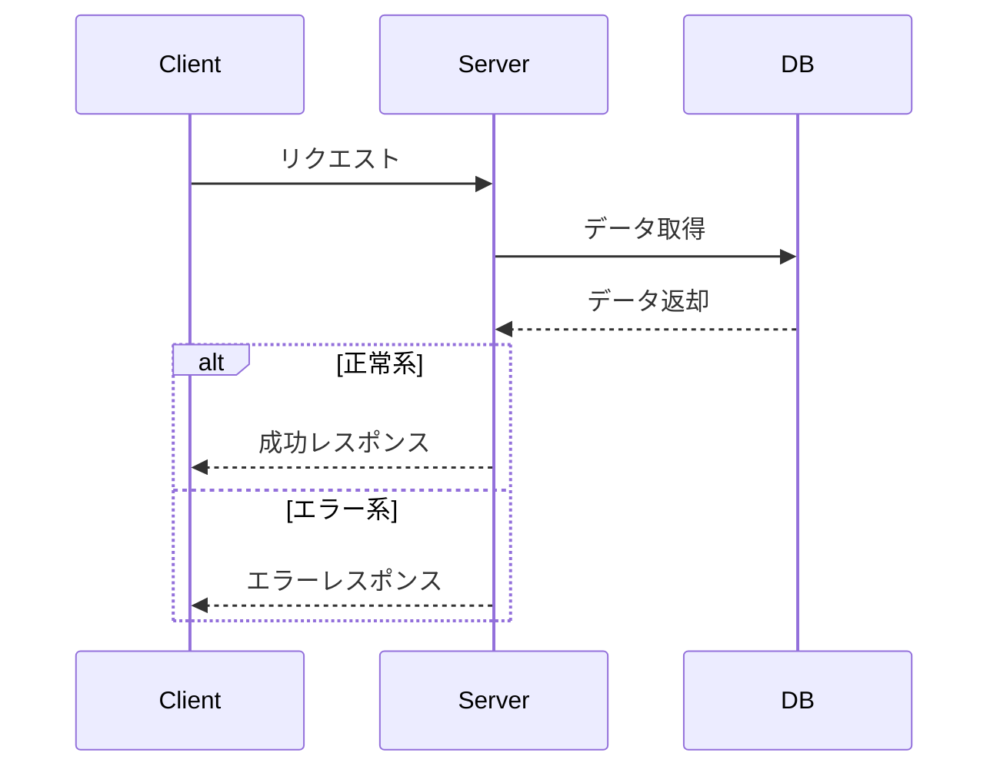

あなたはゲームサーバー/API 開発のスペシャリストです。

サーバーAPI要件書を分析し、実装に必要な具体的なAPI設計を行った
「サーバーAPI設計書」を作成してください。

【入力情報】
以下のドキュメントを参照します:

1. サーバーAPI要件書: @docs/sdd/features/{FEATURE_NAME}/05_サーバーAPI要件書.md
2. API設計書テンプレート: @docs/sdd/templates/API設計書.md

【出力ファイル】
- **以下のパスに Markdown として保存してください:**
  `@docs/sdd/features/{FEATURE_NAME}/07_サーバーAPI設計書.md`

========================
【目的】

- サーバーAPI要件書の内容を、実装可能な具体的なAPI設計に落とし込む
- クライアント・サーバー間のインターフェース（リクエスト/レスポンス）を明確に定義する
- DB設計（マスタ、ユーザー、ログテーブル）を具体的に設計する
- エラーハンドリングの設計を明確にする
- シーケンス図で処理フローを可視化する
- 実装者が迷わず実装できるレベルの具体性を持つ設計書を作成する

※ 重要な注意事項:
1. このドキュメントは「APIの設計」に集中します
2. 要件の説明や背景は最小限にとどめ、設計の具体性を重視します
3. テンプレートの構造に厳密に従い、一貫性のある設計書を作成します
4. 実装時に参照しやすいよう、情報を整理して記述します
5. 出力容量が大量になる場合、エラーを回避する為に適度に小分けしながら対象ファイルに出力してください

========================
【作業手順】

1. **サーバーAPI要件書の読み込み**
   - サーバーAPI要件書を全て読み込む
   - 各要件で実現すべき内容を理解する
   - 要件間の依存関係を把握する

2. **glow-schemaの既存API定義確認**
   - glow-schemaリポジトリで既存のAPI定義（YAMLファイル）を確認
   - 既存のリクエスト/レスポンス構造を理解する
   - 拡張が必要な箇所を特定する

3. **要点まとめの作成**
   - 機能概要を簡潔にまとめる
   - DB変更点（新規/既存変更）を整理する
   - API変更点（新規/既存変更）を整理する

4. **DB設計の詳細化**
   - マスタテーブル: 新規追加カラム、制約、説明
   - ユーザーテーブル: 新規追加カラム、PK設計（TiDB最適化考慮）、説明
   - ログテーブル: 記録すべき情報、構造設計

5. **API仕様の設計**
   - エンドポイントごとにリクエスト/レスポンスの具体的なJSON構造を設計
   - バリデーション要件を明記
   - 既存APIとの互換性を考慮

6. **シーケンス図の作成**
   - 主要な処理フローをMermaid形式で図示
   - participant は大きなシステム単位（Client, Server, DB, Memento等）のみ使用
   - 具体的なサービス名やクラス名は使用しない
   - 正常系・異常系の両方を図示

7. **エラー設計の整理**
   - 発生しうるエラーケースを洗い出す
   - エラーコード、エラー内容、発生条件、クライアント挙動を明記
   - クラサバで認識共有が必要な項目を明示

8. **出力ドキュメントの作成**
   - テンプレートに従って Markdown を生成する

========================
【出力フォーマット】

出力は、**API設計書テンプレート**の構造に厳密に従って Markdown を生成してください。

# {FEATURE_NAME} API設計書

## 目次

- [仕様書](#仕様書)
  - [要点まとめ](#要点まとめ)
  - [仕様確認](#仕様確認)
- [シーケンス図](#シーケンス図)
- [エラー設計](#エラー設計)
- [API仕様](#api仕様)
- [DB設計](#db設計)
  - [マスター/オペレーション](#マスターオペレーション)
  - [ユーザー](#ユーザー)
  - [ログ](#ログ)

---

## 仕様書

### 要点まとめ

#### 概要
- 機能の概要を簡潔に記載（2-3文で要約）
- 機能の目的・価値
- 実装上の重要な注意点

#### DB変更点
- **新規追加:**
  - （新規追加するテーブルがあれば記載、なければ「なし」）
- **既存テーブルへの変更:**
  - `テーブル名`: 変更内容を簡潔に記載
  - （カラム追加、型変更など）

#### API
- **既存APIへの変更:**
  - `エンドポイント`: 変更内容を簡潔に記載
- **新規追加:**
  - （新規追加するエンドポイントがあれば記載、なければ「なし」）

### 仕様確認

#### 参照ドキュメント
- [サーバーAPI要件書](./05_サーバーAPI要件書.md)
- （他の参照ドキュメントがあれば記載）

#### ゲーム体験仕様確認結果
（必要に応じて、主要なQ&Aを表形式で記載）

| Q | A |
|---|---|
| 質問内容 | 回答内容 |

---

## シーケンス図

**重要: participant は大きなシステム単位のみ使用してください**
- 使用可: Client, Server, DB, Memento, ExternalAPI など
- 使用不可: 具体的なサービス名、クラス名、メソッド名

### {処理名}フロー



（主要な処理フローごとにシーケンス図を作成）

---

## エラー設計

> ⚠️ クラサバで必ず認識共有する。
> クライアント側で、実際にどんな挙動にすべきか、不明瞭な状態をなくして、
> 本番リリース後に、CS対応も含めハンドリングしやすい状態にしておきたいです。

### {機能名}関連エラー

| エラーコード | エラー内容 | 発生条件 | クライアント挙動 |
|------------|----------|---------|---------------|
| `ErrorCode::XXX` | エラー説明 | 具体的な発生条件 | クライアント側の挙動 |

**エラーハンドリング方針:**
- （エラーハンドリングの基本方針を記述）
- （クライアント側での事前バリデーション方針など）

---

## API仕様

### POST /api/{endpoint}

{エンドポイントの説明}

#### request

```json
{
  "parameter1": "value",
  "parameter2": 123,
  "newParameter": "追加パラメータの説明"
}
```

**パラメータ説明:**
- `parameter1` (string, required): パラメータの詳細説明
- `parameter2` (int, required): パラメータの詳細説明
- `newParameter` (string, optional): 新規追加パラメータの詳細説明。デフォルト値やバリデーション要件を明記

**バリデーション:**
- （リクエストパラメータのバリデーション要件を箇条書きで記載）

#### response

```json
{
  "field1": "value",
  "field2": 456,
  "newField": {
    "subField1": "value",
    "subField2": []
  }
}
```

**レスポンス説明:**
- `field1`: フィールドの詳細説明
- `field2`: フィールドの詳細説明
- `newField`: 新規追加フィールドの詳細説明
  - `subField1`: サブフィールドの説明
  - `subField2`: サブフィールドの説明（配列の場合は要素の説明も）

**既存との互換性:**
- （既存APIの場合、互換性維持の方針を記載）

（他のエンドポイントも同様に記述）

---

## DB設計

### マスター/オペレーション

#### {テーブル名}（新規/既存テーブル変更）

{テーブルの説明}

| 列名 | index | データ型/制約 | 説明 |
|------|-------|---------------|------|
| id | PK | varchar(255) | 主キー |
| column1 | | int | カラムの説明 |
| **new_column** | | **enum('0','1') NULL** | **新規追加カラムの説明**<br/>**'0': 説明**<br/>**'1': 説明**<br/>**NULL: 説明** |
| created_at | | timestamp | 作成日時 |
| updated_at | | timestamp | 更新日時 |

**追加カラムの説明:**
- `new_column`: 詳細な説明、利用シーン、制約条件など

**制約:**
- （テーブルレベルの制約、ビジネスルール上の制約など）

---

### ユーザー

> ⚠️ PKの貼り方について、TiDB最適化の観点から以下の方針:
>
> **1ユーザーあたり1レコードのみのテーブル**
> - PK：usr_user_id
>
> **1ユーザーあたり複数レコードできるテーブル**
> - 複合PK：usr_user_id, ドメインID or マスタID

#### {テーブル名}（新規/既存テーブル変更）

{テーブルの説明}

| 列名 | index | データ型/制約 | 説明 |
|------|-------|---------------|------|
| usr_user_id | PK | varchar(255) | usr_users.id |
| related_id | PK | varchar(255) | 関連ID（複合PKの場合） |
| column1 | | int | カラムの説明 |
| **new_column** | | **int unsigned** | **新規追加カラムの説明**<br/>**デフォルト: 値** |
| created_at | | timestamp | 作成日時 |
| updated_at | | timestamp | 更新日時 |

**追加カラムの説明:**
- `new_column`: 詳細な説明、利用シーン、デフォルト値、更新タイミングなど

**利用箇所:**
- （どのAPIエンドポイントで参照/更新されるか）

---

### ログ

#### {ログテーブル名}（新規/既存テーブル変更）

{ログの説明}

| 列名 | index | データ型/制約 | 説明 |
|------|-------|---------------|------|
| id | PK | bigint unsigned | ログID |
| usr_user_id | INDEX | varchar(255) | usr_users.id |
| action_type | | enum(...) | アクション種別 |
| amount | | int | 変動量 |
| log_trigger | | text | トリガー情報（JSON） |
| created_at | | timestamp | 作成日時 |

**ログ記録タイミング:**
- （どのタイミングでログが記録されるか）

**log_trigger例:**
```json
{
  "trigger": "trigger_name",
  "related_id": "xxx",
  "additional_info": "yyy"
}
```

---

## テーブル一覧

| テーブル名 | 新規/既存 | 概要 |
|-----------|----------|------|
| テーブル1 | 既存（変更） | 変更内容の概要 |
| テーブル2 | 新規 | テーブルの概要 |

---

## 実装上の注意点

### {注意点カテゴリ1}

- （実装時に注意すべき点を箇条書きで記載）
- （既存コードとの整合性、パフォーマンス考慮事項など）

### {注意点カテゴリ2}

- （その他の注意点）

---

## パフォーマンス考慮事項

- （パフォーマンスに影響する可能性のある項目）
- （最適化が必要な処理）
- （負荷テストで確認すべき項目）

---

## テスト観点

### 単体テスト
- （単体テストで確認すべき項目）

### 機能テスト
- （機能テストで確認すべき項目）

### シナリオテスト
- （シナリオテストで確認すべき項目）

========================
【シーケンス図作成のガイドライン】

**重要: participantは大きなシステム単位のみ使用**

1. **使用可能なparticipant（例）:**
   - `Client`: クライアントアプリケーション
   - `Server`: サーバーアプリケーション全体
   - `DB`: データベース全体（マスタDB、ユーザーDB、ログDBを区別する必要があれば複数使用）
   - `Memento`: キャッシュ層
   - `ExternalAPI`: 外部API（決済、プッシュ通知など）
   - `Queue`: メッセージキュー

2. **使用禁止:**
   - 具体的なサービス名: `StageService`, `UserService`, `RewardService` など
   - 具体的なクラス名: `StageController`, `UsrStageSession` など
   - 具体的なメソッド名: `consumeStamina()`, `addReward()` など

3. **処理の記述方法:**
   - 矢印のラベルには「何をするか」を簡潔に記述
   - 具体的な処理内容はNote（注釈）として記述
   - 条件分岐は `alt` / `else` を使用
   - ループ処理は `loop` を使用

4. **良い例:**
   ```mermaid
   sequenceDiagram
       participant Client
       participant Server
       participant DB

       Client->>Server: ステージ開始リクエスト
       Server->>DB: スタミナ量確認
       DB-->>Server: 現在のスタミナ量

       alt スタミナ不足
           Server-->>Client: エラーレスポンス
       else スタミナ十分
           Server->>DB: スタミナ消費
           Server->>DB: セッション作成
           Server-->>Client: 成功レスポンス
       end
   ```

5. **悪い例（使用禁止）:**
   ```mermaid
   sequenceDiagram
       participant Client
       participant StageController
       participant StageStartService
       participant UserService
       participant StaminaRepository
       participant UsrStageSession
       participant DB

       Client->>StageController: POST /api/stage/start
       StageController->>StageStartService: start()
       StageStartService->>UserService: consumeStamina()
       UserService->>StaminaRepository: save()
       ...
   ```
   ※ 具体的なサービス名、クラス名を使用しているため不可

========================
【DB設計のガイドライン】

1. **TiDB最適化考慮:**
   - ユーザーテーブルのPK設計に注意
   - 1ユーザー1レコード: `usr_user_id` のみをPK
   - 1ユーザー複数レコード: `usr_user_id` と関連IDで複合PK

2. **カラム追加時の注意:**
   - 既存カラムは記載しない（変更がない限り）
   - 新規追加カラムは **太字** で強調
   - NULL許可/NOT NULL、デフォルト値を明記

3. **ENUM型の説明:**
   - 各値の意味を明確に記述
   - 値の選択基準を明示

4. **ログテーブル:**
   - `log_trigger`にはJSON形式で詳細情報を記録
   - サンプルJSONを必ず記載

========================
【エラー設計のガイドライン】

1. **エラーコードの選定:**
   - 既存のErrorCodeを可能な限り使用
   - 新規エラーコードが必要な場合は明記

2. **クライアント挙動の明確化:**
   - ユーザーに表示するダイアログの内容
   - エラー後の画面遷移
   - リトライ可能性

3. **発生条件の具体化:**
   - 「〜の場合」だけでなく、具体的な条件値を記載
   - 複数条件がある場合は全て列挙

========================
【API仕様記述のポリシー】

1. **リクエスト/レスポンスのJSON:**
   - 実際の値の例を記載
   - 型情報をコメントで補足しない（パラメータ説明で明記）
   - ネストが深い場合も完全な構造を記載

2. **新規追加パラメータの明示:**
   - 既存APIへの追加の場合、新規パラメータにコメントを追記
   - 必須/任意、デフォルト値を明記

3. **バリデーション要件:**
   - サーバー側で実施するバリデーションを全て列挙
   - 範囲チェック、フォーマットチェック、ビジネスルールチェック

4. **既存との互換性:**
   - 後方互換性の維持方針を明記
   - 互換性を破壊する変更の場合は、その影響範囲を記載

========================
【記述の優先順位】

1. **具体性を最優先**
   - 抽象的な説明よりも具体的な値、条件、構造を記載
   - 実装者が迷わないレベルの詳細度

2. **実装可能性**
   - 実装可能な形で設計を記述
   - 曖昧な部分は残さない

3. **テンプレート遵守**
   - API設計書テンプレートの構造を厳密に守る
   - セクションの順序、見出しレベルを維持

4. **簡潔さ**
   - 冗長な説明は避ける
   - 要点を簡潔に記述

========================
【禁止事項】

1. **リリース計画の記載禁止**
   - Phase分け、リリーススケジュールは記載しない
   - 実装順序の推奨も記載しない
   - これらは設計書の範囲外

2. **管理ツール(admin)の設計禁止**
   - 管理ツールの画面設計、機能設計は記載しない
   - マスタデータ編集機能には言及しない
   - APIがマスタデータをどう参照するかのみを記述

3. **詳細すぎる実装指示の禁止**
   - 具体的なクラス名、メソッド名は記載しない
   - コードレベルの実装方法は記載しない
   - フレームワーク固有の実装詳細は記載しない

========================
【重要】
生成したサーバーAPI設計書は、Markdown として
**@docs/sdd/features/{FEATURE_NAME}/07_サーバーAPI設計書.md**
に保存してください。

========================

以上を踏まえて、
サーバーAPI要件書を分析し、実装に必要な具体的なAPI設計を行った
サーバーAPI設計書を作成し、md ファイルとして保存してください。
