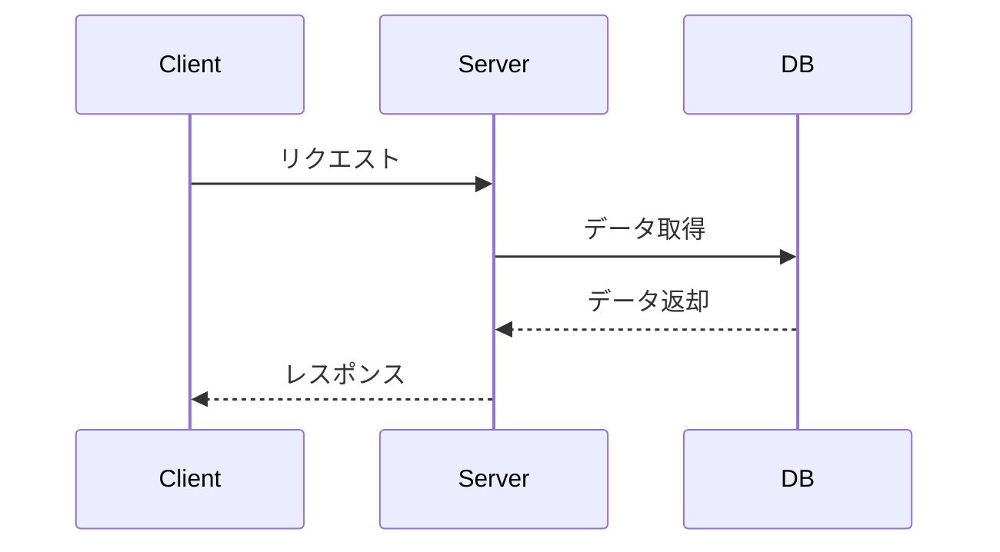

# API設計書テンプレート

## 目次

- [仕様書](#仕様書)
  - [要点まとめ](#要点まとめ)
  - [仕様確認](#仕様確認)
- [シーケンス図](#シーケンス図)
- [エラー設計](#エラー設計)
- [API仕様](#api仕様)
- [DB設計](#db設計)
  - [マスター/オペレーション](#マスターオペレーション)
  - [ユーザー](#ユーザー)
  - [ログ](#ログ)

---

## 仕様書

### 要点まとめ

#### 概要
- 機能の概要を簡潔に記載
- 機能の目的・まとめ
- 注意点

#### DB変更点
- 新規追加するテーブル
- 既存テーブルへの変更内容

#### API
- 新規追加するAPIエンドポイント
- 既存APIへの変更内容

### 仕様確認

- 仕様書URLを貼る
- Slackでのやり取り（必要に応じて）

| Q | A |
|---|---|
| 質問内容 | 回答内容 |

---

## シーケンス図

### サンプルフロー1



---

## エラー設計

> ⚠️ クラサバで必ず認識共有する。
> クライアント側で、実際にどんな挙動にすべきか、不明瞭な状態をなくして、
> 本番リリース後に、CS対応も含めハンドリングしやすい状態にしておきたいです。

[GLOW_エラー設計（クラサバ全体）](エラー設計シートのURL)

---

## API仕様

### POST /api/sample

サンプルの処理
hogeテーブルへのレコードも生成する

#### request

```json
{
  "hoge": "huga"
}
```

#### response

```json
{
  "status": "success"
}
```

---

## DB設計

### マスター/オペレーション

#### 例：mst_items

| 列名 | index | データ型/制約 | 説明 |
|------|-------|---------------|------|
| id | PK | varchar(255) | |
| name | | varchar(255) | アイテム名 |
| description | | text | アイテム説明 |
| created_at | | timestamp | 作成日時 |
| updated_at | | timestamp | 更新日時 |

#### 例：mst_items_i18n

| 列名 | index | データ型/制約 | 説明 |
|------|-------|---------------|------|
| id | PK | varchar(255) | |
| mst_item_id | | varchar(255) | mst_items.id |
| language | | enum('ja','en','zh-Hant') | 言語 |
| name | | varchar(255) | アイテム名 |
| description | | text | アイテム説明 |

### ユーザー

> ⚠️ PKの貼り方について、下記の方針でお願いします。
> TiDBへのクエリパフォーマンス向上の観点で、
> 検索に使わないid列にPKを設定するのは意味がないため。
>
> **1ユーザーあたり1レコードのみのテーブル**
> - PK：usr_user_id
> - テーブル例：usr_user_parameters, usr_mission_statuses
>
> **1ユーザーあたり複数レコードできるテーブル**
> - 複合PK：usr_user_id, ドメインID or マスタID or ユニークになるように
> - テーブル例：
>   - usr_stages：usr_user_id, mst_stage_id
>   - usr_advent_battles：usr_user_id, mst_advent_battle_id
>   - usr_gacha_uppers：usr_user_id, upper_group, upper_type
>
> **レコードのユニーク性を表現するid列をどうするか**
> - 検索で使わないので、基本的に不要になる
> - 例外として、usr_unitsではid列が必要。ユニット強化などをこのid列を使って実行しているため。
> - この場合は、以下の対応が望ましいと考えている
>   - id：index
>   - usr_user_id と mst_unit_id で 複合PK

#### 例：usr_user_parameters

| 列名 | index | データ型/制約 | 説明 |
|------|-------|---------------|------|
| usr_user_id | PK | varchar(255) | usr_users.id |
| level | | int | レベル |
| created_at | | timestamp | 作成日時 |
| updated_at | | timestamp | 更新日時 |

### ログ

#### 例：log_coins

| 列名 | index | データ型/制約 | 説明 |
|------|-------|---------------|------|
| id | PK | bigint unsigned | |
| usr_user_id | INDEX | varchar(255) | usr_users.id |
| amount | | int | コイン増減量 |
| reason | | varchar(255) | 変動理由 |
| created_at | | timestamp | 作成日時 |

---

## テーブル一覧

| テーブル名 | 新規/既存 | 概要 |
|-----------|----------|------|
| mst_items | 新規 | アイテムマスタ |
| mst_items_i18n | 新規 | アイテムマスタ多言語対応 |
| usr_users | 既存 | ユーザー情報 |
| 例：usr_user_parameters | 既存 | ユーザー基本パラメータ管理 |
| log_coins | 新規 | コイン変動ログ |
