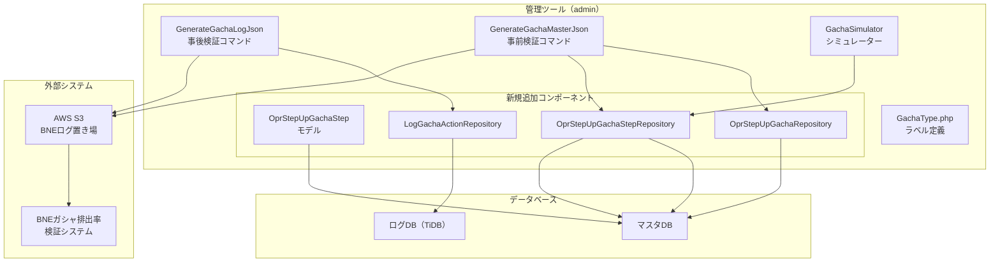
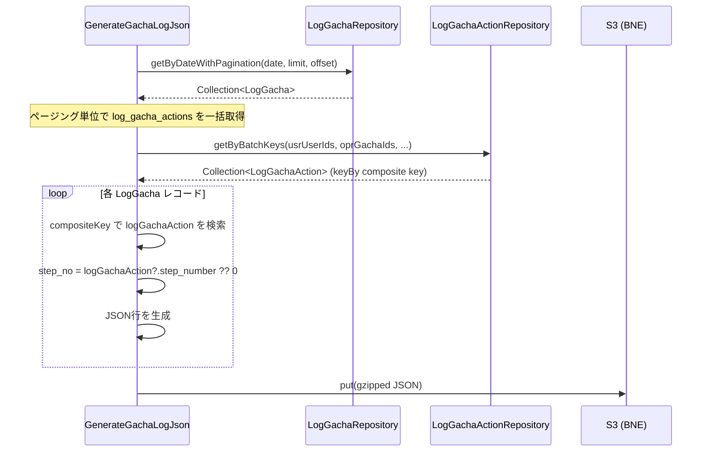
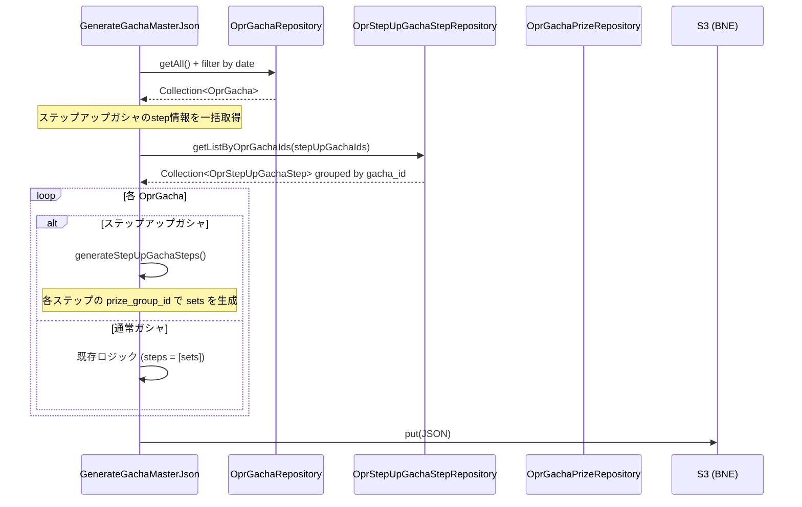
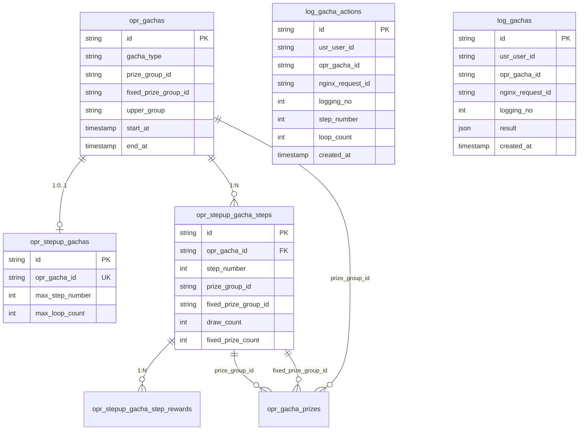

# ステップアップガシャ - ガシャ検証システム改修 実装計画書

## 目次

1. [エグゼクティブサマリー](#1-エグゼクティブサマリー)
2. [現状分析と課題](#2-現状分析と課題)
3. [アーキテクチャ設計](#3-アーキテクチャ設計)
4. [実装フェーズ詳細](#4-実装フェーズ詳細)
5. [データ設計](#5-データ設計)
6. [UI/UX設計](#6-uiux設計)
7. [テスト戦略](#7-テスト戦略)
8. [リスク管理](#8-リスク管理)
9. [デプロイ計画](#9-デプロイ計画)
10. [運用・保守](#10-運用保守)
11. [将来の拡張性](#11-将来の拡張性)
12. [チーム開発における留意点](#12-チーム開発における留意点)

---

## 1. エグゼクティブサマリー

### 1.1 改修の背景と目的

v1.6.0でAPI側にステップアップガシャが実装されたが、管理ツール（admin）のBNEガシャ排出率検証システムへのデータ送信がステップアップガシャに対応していない。BNE（バンダイナムコエンターテインメント）の仕様書「有料ガシャに関する各種対応(国内/海外) Ver.2.1.0」に基づき、ステップアップガシャの事前検証・事後検証に正しいデータを送信することが本改修の目的である。

ステップアップガシャは、ガシャの実行回数（ステップ）に応じて提供割合が変化する仕組みであり、BNE仕様書12ページにて「タブ等で画面を分ける仕様推奨」と記載されている。各ステップごとに異なる抽選テーブル（`prize_group_id`）を使用するため、マスタJSON・ログJSON共にステップ情報を正しく出力する必要がある。

### 1.2 改修の範囲と影響

| 対象 | ファイル | 影響範囲 |
|------|--------|---------|
| GachaType定数 | `admin/app/Constants/GachaType.php` | ガシャ一覧・詳細画面の表示 |
| 事後検証コマンド | `admin/app/Console/Commands/GenerateGachaLogJson.php` | S3へのログJSON出力 |
| 事前検証コマンド | `admin/app/Console/Commands/GenerateGachaMasterJson.php` | S3へのマスタJSON出力 |
| ガシャシミュレーター | `admin/app/Filament/Pages/GachaSimulator.php` | シミュレーション結果 |
| 新規モデル | `admin/app/Models/Mst/OprStepUpGachaStep.php` | データアクセス基盤 |
| 新規リポジトリ(3件) | `admin/app/Repositories/` 配下 | データアクセス基盤 |

### 1.3 全体スケジュール概要

| フェーズ | 内容 | 想定工数 | 依存関係 |
|---------|------|---------|---------|
| Phase 1 | GachaType.phpラベル追加 | 0.5h | なし |
| Phase 2 | モデル・リポジトリ追加 | 2h | なし |
| Phase 3 | 事後検証（ログJSON）対応 | 4h | Phase 2 |
| Phase 4 | 事前検証（マスタJSON）対応 | 5h | Phase 2 |
| Phase 5 | ガシャシミュレーター対応 | 6h | Phase 2 |
| Phase 6 | テスト・デグレ確認 | 4h | Phase 3, 4, 5 |
| Phase 7 | BNEシステム検証・デプロイ | 3h | Phase 6 |
| **合計** | | **約24.5h（約3-4営業日）** | |

### 1.4 主要なリスクと対策

| リスク | 影響度 | 対策 |
|-------|-------|------|
| BNE仕様との不整合 | 高 | Step1のJSONフォーマットチェックツールでの事前検証 |
| 通常ガシャへのデグレッション | 高 | 通常ガシャ用テストケースの先行作成 |
| `log_gacha_actions`結合時のパフォーマンス劣化 | 中 | バッチ単位の一括取得によるN+1回避 |
| `step_no`のインデックス不足 | 低 | BNE側はstep_noで集計するが、出力側のインデックスは不要 |

---

## 2. 現状分析と課題

### 2.1 API側実装状況の詳細

API側（v1.6.0）では、ステップアップガシャの完全な実装が完了している。

#### 実装済みテーブル

```
opr_stepup_gachas          -- ステップアップガシャ設定（1ガシャ:1レコード）
opr_stepup_gacha_steps     -- ステップごとの設定（1ガシャ:Nステップ）
opr_stepup_gacha_step_rewards -- ステップごとのおまけ報酬（検証には不要）
log_gacha_actions          -- step_number, loop_count カラム追加済み
usr_gachas                 -- current_step_number, loop_count カラム追加済み
```

#### 実装済みモデル・リポジトリ

```
api/app/Domain/Resource/Mst/Models/OprStepUpGacha.php
api/app/Domain/Resource/Mst/Models/OprStepUpGachaStep.php
api/app/Domain/Resource/Mst/Models/OprStepUpGachaStepReward.php
api/app/Domain/Resource/Mst/Repositories/OprStepUpGachaRepository.php
api/app/Domain/Resource/Mst/Repositories/OprStepUpGachaStepRepository.php
api/app/Domain/Gacha/Models/LogGachaAction.php  -- setStepNumber(), setLoopCount()
```

#### ガシャタイプ定義

```php
// api/app/Domain/Gacha/Enums/GachaType.php
enum GachaType: string
{
    case STEPUP = 'StepUp';  // 実装済み
    // ... 他のタイプ
}
```

### 2.2 管理ツール側実装状況の詳細

#### 実装済み

| 項目 | ファイル | 状態 |
|-----|--------|------|
| OprStepUpGacha モデル | `admin/app/Models/Mst/OprStepUpGacha.php` | 実装済み（BaseModelを継承、connection設定済み） |
| GachaType::STEPUP 定義 | `admin/app/Constants/GachaType.php` | case定義のみ（label()にケースなし） |
| LogGachaAction モデル | `admin/app/Models/Log/LogGachaAction.php` | 実装済み（log_gachaとのリレーションあり） |

#### 未実装・不足

| 項目 | 必要性 | 優先度 |
|-----|--------|-------|
| `GachaType::STEPUP` の `label()` ケース | **致命的** - 画面表示でエラー発生 | 最高 |
| `OprStepUpGachaStep` モデル（admin側） | **必須** - ステップ情報の取得に必要 | 高 |
| `OprStepUpGachaRepository`（admin側） | **必須** - 事前検証で使用 | 高 |
| `OprStepUpGachaStepRepository`（admin側） | **必須** - 事前検証・シミュレーターで使用 | 高 |
| `LogGachaActionRepository`（admin側） | **必須** - 事後検証で使用 | 高 |
| `GenerateGachaLogJson.php` のステップ対応 | **必須** - BNE事後検証データ不正 | 高 |
| `GenerateGachaMasterJson.php` のステップ対応 | **必須** - BNE事前検証データ不正 | 高 |
| `GachaSimulator.php` のステップ対応 | **推奨** - 事前検証精度に影響 | 中 |

### 2.3 ギャップ分析

#### 致命的な問題

1. **`GachaType.php` の `label()` メソッド**: `STEPUP` ケースが未定義のため、ステップアップガシャを表示しようとすると `UnhandledMatchError` が発生する

```php
// 現状: admin/app/Constants/GachaType.php L23-36
public function label(): string
{
    return match ($this) {
        self::TUTORIAL => 'チュートリアル',
        // ... 他のケース
        self::MEDAL => 'メダル',
        // ★ self::STEPUP が欠落 → UnhandledMatchError
    };
}
```

2. **事後検証ログJSON**: `step_no` が常に `0` 固定

```php
// 現状: admin/app/Console/Commands/GenerateGachaLogJson.php L105
'step_no' => 0,  // ★ 実際のステップ番号が必要
```

3. **事前検証マスタJSON**: `steps` 配列が常に1要素

```php
// 現状: admin/app/Console/Commands/GenerateGachaMasterJson.php L220-222
'steps' => [
    ['sets' => $sets],  // ★ ステップ数分の要素が必要
]
```

### 2.4 技術的負債の洗い出し

| 負債 | 影響 | 対処方針 |
|------|-----|---------|
| `GenerateGachaLogJson.php` でBOXガシャ・選択式ガシャの `is_full_box`、`selected_sp` が固定値 | 現時点では影響なし | 本改修では対象外（コメントは残す） |
| `GenerateGachaMasterJson.php` の `gasha_type` が常に `0` | BOXガシャ未対応（将来課題） | 本改修では対象外 |
| `LogGachaAction` モデルの `log_gacha` リレーションが `nginx_request_id` のみで結合 | 結合精度が不十分 | 事後検証では複合キーによるマッチングを新規実装 |

---

## 3. アーキテクチャ設計

### 3.1 全体アーキテクチャ図



### 3.2 データフロー図

#### 事後検証（ログJSON生成）フロー



#### 事前検証（マスタJSON生成）フロー



### 3.3 コンポーネント間の依存関係

```
Phase 1: GachaType.php ラベル追加（独立、即時対応可能）
    |
Phase 2: モデル・リポジトリ追加（独立、基盤構築）
    |
    ├── Phase 3: GenerateGachaLogJson.php 修正（Phase 2 のリポジトリに依存）
    ├── Phase 4: GenerateGachaMasterJson.php 修正（Phase 2 のリポジトリに依存）
    └── Phase 5: GachaSimulator.php 修正（Phase 2 のリポジトリに依存）
         |
Phase 6: テスト（Phase 3, 4, 5 全て完了後）
    |
Phase 7: BNE検証・デプロイ
```

### 3.4 既存実装との統合方針

1. **最小変更の原則**: 既存の通常ガシャ・BOXガシャの処理ロジックには一切手を加えない。ステップアップガシャ固有の処理は条件分岐で追加する。
2. **フォールバックの原則**: ステップ情報が取得できない場合は、通常ガシャと同じ挙動にフォールバックする（`step_no = 0`、`steps = [sets]`）。
3. **既存パターンの踏襲**: admin側のモデル・リポジトリは、既存の `OprStepUpGacha` モデルや `LogGachaRepository` と同じパターンで実装する。

### 3.5 将来の拡張性の考慮

- ステップアップガシャの判定を `GachaType::STEPUP` のenum比較で行うことで、新しいガシャタイプが追加された際にも同様のパターンで対応可能
- `generateStepUpGachaSteps()` メソッドを独立させることで、ステップアップガシャ固有のロジック変更が局所化される
- リポジトリパターンを採用することで、テスタビリティとモック可能性を確保

---

## 4. 実装フェーズ詳細

### Phase 1: GachaType.php ラベル追加

#### 目的と成果物
ステップアップガシャを管理ツール上で表示した際の `UnhandledMatchError` を解消する。

#### 詳細タスク

**ファイル**: `admin/app/Constants/GachaType.php`

**修正内容**: `label()` メソッドに `STEPUP` ケースを追加

```php
// 修正前（L23-36）
public function label(): string
{
    return match ($this) {
        self::TUTORIAL => 'チュートリアル',
        self::NORMAL => 'ノーマル',
        self::PREMIUM => 'プレミアム',
        self::PICKUP => 'ピックアップ',
        self::FREE => '無料',
        self::TICKET => 'チケット',
        self::FESTIVAL => 'フェス',
        self::PAID_ONLY => '有償限定',
        self::MEDAL => 'メダル',
    };
}

// 修正後
public function label(): string
{
    return match ($this) {
        self::TUTORIAL => 'チュートリアル',
        self::NORMAL => 'ノーマル',
        self::PREMIUM => 'プレミアム',
        self::PICKUP => 'ピックアップ',
        self::FREE => '無料',
        self::TICKET => 'チケット',
        self::FESTIVAL => 'フェス',
        self::PAID_ONLY => '有償限定',
        self::MEDAL => 'メダル',
        self::STEPUP => 'ステップアップ',
    };
}
```

#### 影響範囲
- `admin/app/Models/Mst/OprGacha.php` の `getGachaTypeLabelAttribute()` が `GachaType::from()->label()` を呼び出しているため、ガシャ一覧・詳細・シミュレーター画面全てに影響
- `GachaType::labels()` メソッドも内部で `label()` を呼び出すため、フィルタ等にも影響

#### テスト観点
- ステップアップガシャの一覧表示で「ステップアップ」と表示されること
- 他のガシャタイプのラベルが変更されていないこと（デグレッション）
- `GachaType::labels()` が全ケースを正しく返すこと

#### 工数見積もり: 0.5時間（実装+確認）

#### リスク: なし（単純な文字列追加）

---

### Phase 2: admin側モデル・リポジトリの追加

#### 目的と成果物
Phase 3〜5の基盤となるデータアクセス層を構築する。

#### 詳細タスク

##### 2.1 OprStepUpGachaStep モデル（新規作成）

**ファイル**: `admin/app/Models/Mst/OprStepUpGachaStep.php`

```php
<?php

namespace App\Models\Mst;

use App\Constants\Database;
use App\Domain\Resource\Mst\Models\OprStepUpGachaStep as BaseOprStepUpGachaStep;

class OprStepUpGachaStep extends BaseOprStepUpGachaStep
{
    protected $connection = Database::MASTER_DATA_CONNECTION;

    public function opr_gacha()
    {
        return $this->belongsTo(OprGacha::class, 'opr_gacha_id', 'id');
    }

    public function opr_stepup_gacha()
    {
        return $this->belongsTo(OprStepUpGacha::class, 'opr_gacha_id', 'opr_gacha_id');
    }
}
```

**設計理由**:
- 既存の `OprStepUpGacha` モデルと同じパターンで、API側のBaseModelを継承
- `Database::MASTER_DATA_CONNECTION` を使用してマスタDB接続
- リレーションは `opr_gacha_id` をキーにして `OprGacha` と `OprStepUpGacha` に紐づけ

##### 2.2 OprStepUpGachaRepository（新規作成）

**ファイル**: `admin/app/Repositories/Mst/OprStepUpGachaRepository.php`

```php
<?php

declare(strict_types=1);

namespace App\Repositories\Mst;

use App\Models\Mst\OprStepUpGacha;

class OprStepUpGachaRepository
{
    /**
     * opr_gacha_id でステップアップガシャ設定を取得
     */
    public function findByOprGachaId(string $oprGachaId): ?OprStepUpGacha
    {
        return OprStepUpGacha::query()
            ->where('opr_gacha_id', $oprGachaId)
            ->first();
    }

    /**
     * opr_gacha_id でステップアップガシャ設定を取得（存在しない場合は例外）
     */
    public function getByOprGachaId(string $oprGachaId): OprStepUpGacha
    {
        $entity = $this->findByOprGachaId($oprGachaId);
        if (!$entity) {
            throw new \RuntimeException(
                "OprStepUpGacha not found. opr_gacha_id: {$oprGachaId}"
            );
        }
        return $entity;
    }
}
```

##### 2.3 OprStepUpGachaStepRepository（新規作成）

**ファイル**: `admin/app/Repositories/Mst/OprStepUpGachaStepRepository.php`

```php
<?php

declare(strict_types=1);

namespace App\Repositories\Mst;

use App\Models\Mst\OprStepUpGachaStep;
use Illuminate\Support\Collection;

class OprStepUpGachaStepRepository
{
    /**
     * opr_gacha_id でステップ一覧を取得（ステップ番号順）
     */
    public function getListByOprGachaId(string $oprGachaId): Collection
    {
        return OprStepUpGachaStep::query()
            ->where('opr_gacha_id', $oprGachaId)
            ->orderBy('step_number')
            ->get();
    }

    /**
     * 複数の opr_gacha_id でステップ一覧を一括取得（N+1回避用）
     * @return Collection key: opr_gacha_id, value: Collection<OprStepUpGachaStep>
     */
    public function getListByOprGachaIds(Collection $oprGachaIds): Collection
    {
        if ($oprGachaIds->isEmpty()) {
            return collect();
        }
        return OprStepUpGachaStep::query()
            ->whereIn('opr_gacha_id', $oprGachaIds->toArray())
            ->orderBy('step_number')
            ->get()
            ->groupBy('opr_gacha_id');
    }

    /**
     * opr_gacha_id とステップ番号でステップ情報を取得
     */
    public function findByOprGachaIdAndStepNumber(
        string $oprGachaId,
        int $stepNumber
    ): ?OprStepUpGachaStep {
        return OprStepUpGachaStep::query()
            ->where('opr_gacha_id', $oprGachaId)
            ->where('step_number', $stepNumber)
            ->first();
    }

    /**
     * opr_gacha_id とステップ番号でステップ情報を取得（存在しない場合は例外）
     */
    public function getByOprGachaIdAndStepNumber(
        string $oprGachaId,
        int $stepNumber
    ): OprStepUpGachaStep {
        $entity = $this->findByOprGachaIdAndStepNumber($oprGachaId, $stepNumber);
        if (!$entity) {
            throw new \RuntimeException(
                "OprStepUpGachaStep not found. opr_gacha_id: {$oprGachaId}, step_number: {$stepNumber}"
            );
        }
        return $entity;
    }
}
```

**設計理由**:
- `getListByOprGachaIds()` メソッドを用意し、GenerateGachaMasterJson での N+1問題を回避

##### 2.4 LogGachaActionRepository（新規作成）

**ファイル**: `admin/app/Repositories/Log/LogGachaActionRepository.php`

```php
<?php

declare(strict_types=1);

namespace App\Repositories\Log;

use App\Models\Log\LogGachaAction;
use Carbon\CarbonImmutable;
use Illuminate\Support\Collection;

class LogGachaActionRepository
{
    /**
     * 指定日のlog_gacha_actionsを一括取得しCompositeKeyでインデックス化
     *
     * @param CarbonImmutable $date 対象日
     * @param Collection $usrUserIds ユーザーIDリスト
     * @param Collection $oprGachaIds ガシャIDリスト
     * @param Collection $nginxRequestIds リクエストIDリスト
     * @return Collection key: "{usr_user_id}_{opr_gacha_id}_{nginx_request_id}_{logging_no}"
     */
    public function getByBatchKeysIndexed(
        CarbonImmutable $date,
        Collection $usrUserIds,
        Collection $oprGachaIds,
        Collection $nginxRequestIds
    ): Collection {
        $startOfDay = $date->startOfDay();
        $endOfDay = $date->endOfDay();

        return LogGachaAction::query()
            ->whereIn('usr_user_id', $usrUserIds->unique()->toArray())
            ->whereIn('opr_gacha_id', $oprGachaIds->unique()->toArray())
            ->whereIn('nginx_request_id', $nginxRequestIds->unique()->toArray())
            ->whereBetween('created_at', [$startOfDay, $endOfDay])
            ->get()
            ->keyBy(function (LogGachaAction $logGachaAction) {
                return sprintf(
                    '%s_%s_%s_%d',
                    $logGachaAction->usr_user_id,
                    $logGachaAction->opr_gacha_id,
                    $logGachaAction->nginx_request_id,
                    $logGachaAction->logging_no
                );
            });
    }
}
```

**設計理由**:
- ページング単位で一括取得し、`keyBy` でCompositeKeyによるO(1)検索を実現
- N+1問題を回避しつつ、メモリ消費も抑制（全件取得ではなく、ページング内の条件で絞り込み）

#### 工数見積もり: 2時間

#### テスト観点
- 各リポジトリのメソッドが正しくデータを返すこと
- 該当データが存在しない場合のnull/例外ハンドリング
- `getListByOprGachaIds()` が正しくgroupByされること
- `getByBatchKeysIndexed()` のCompositeKeyが正しく生成されること

#### リスクと対策
- **リスク**: admin側の `Database::MASTER_DATA_CONNECTION` が正しくステップアップガシャテーブルに接続できるか
- **対策**: 既存の `OprStepUpGacha` モデルが同じ接続で動作しているため、問題ない

---

### Phase 3: 事後検証（GenerateGachaLogJson.php）対応

#### 目的と成果物
ステップアップガシャの排出ログで、実際のステップ番号（`step_no`）がBNEログJSONに正しく出力されるようにする。

#### 詳細タスク

**ファイル**: `admin/app/Console/Commands/GenerateGachaLogJson.php`

##### 3.1 use宣言の追加

```php
use App\Repositories\Log\LogGachaActionRepository;
```

##### 3.2 LogGachaActionRepositoryのインスタンス化

`generateGachaLogJson()` メソッドの先頭部分に追加:

```php
/** @var LogGachaActionRepository $logGachaActionRepository */
$logGachaActionRepository = app()->make(LogGachaActionRepository::class);
```

##### 3.3 ページング内でのバッチ取得とステップ番号の設定

whileループ内の変更（`$logGachas` 取得後、`$results` 生成前に追加）:

```php
// ページング内の log_gacha_actions を一括取得（N+1回避）
$logGachaActions = $logGachaActionRepository->getByBatchKeysIndexed(
    $targetDate,
    $logGachas->map(fn($lg) => $lg->getUsrUserId()),
    $logGachas->map(fn($lg) => $lg->getOprGachaId()),
    $logGachas->map(fn($lg) => $lg->getNginxRequestId())
);
```

foreachループ内の `step_no` 設定を変更:

```php
// 変更前:
'step_no' => 0,

// 変更後:
'step_no' => $this->getStepNo($logGacha, $logGachaActions),
```

##### 3.4 getStepNoヘルパーメソッドの追加

```php
/**
 * ステップ番号を取得する
 *
 * ステップアップガシャの場合はlog_gacha_actionsから実際のステップ番号を取得。
 * 通常ガシャの場合は0を返す。
 *
 * BNE仕様: step_no は「単発/BOXでは0固定。ステップアップではステップに応じた
 * 配列番号を指定する（0〜）」
 * ※ステップ番号は1始まりだが、BNE仕様では0始まりの配列番号のため、
 * step_number - 1 を返す。
 *
 * @param LogGacha $logGacha
 * @param Collection $logGachaActions keyByされたコレクション
 * @return int
 */
private function getStepNo($logGacha, Collection $logGachaActions): int
{
    $key = sprintf(
        '%s_%s_%s_%d',
        $logGacha->getUsrUserId(),
        $logGacha->getOprGachaId(),
        $logGacha->getNginxRequestId(),
        $logGacha->getLoggingNo()
    );
    $logGachaAction = $logGachaActions->get($key);

    if ($logGachaAction === null) {
        return 0;
    }

    $stepNumber = $logGachaAction->step_number;
    if ($stepNumber === null) {
        return 0;
    }

    // BNE仕様: step_noは0始まりの配列番号
    // DB上のstep_numberは1始まりのため、-1して返す
    return max(0, $stepNumber - 1);
}
```

**重要な設計判断: `step_no` の0始まり vs 1始まり**

BNEデータ定義仕様書の排出結果ログJSONにおいて、`step_no` は以下のように定義されている:

> step_no: ステップ番号 BIGINT 必須
> 単発/BOXでは0固定。ステップアップではステップに応じた**配列番号**を指定する（0〜）

「配列番号」と記載されているため、0始まりである。一方、`opr_stepup_gacha_steps` テーブルの `step_number` は1始まり（1, 2, 3, 4, 5）。

したがって、**`step_number - 1`** を `step_no` として出力する。

**ただし、この解釈についてはBNE側に確認を推奨する。** マスタJSON側の `steps[]` 配列のインデックスと一致する必要があるため、0始まりが正しいと判断した。

#### 出力JSONフォーマット（修正後）

```json
{"app_id":"600","gasha_id":"stepup_gacha_001","is_full_box":0,"exec_id":"01HQ...","step_no":0,"set_name":"通常","timestamp":1704067200,"user_id":"user001","item_id":"item_001","item_num":1,"promised":0,"selected_sp":[]},
{"app_id":"600","gasha_id":"stepup_gacha_001","is_full_box":0,"exec_id":"01HQ...","step_no":1,"set_name":"通常","timestamp":1704067200,"user_id":"user002","item_id":"item_002","item_num":1,"promised":0,"selected_sp":[]},
```

#### テスト観点
- ステップアップガシャのログで `step_no` が `step_number - 1` の値になっていること
- 通常ガシャのログで `step_no` が `0` になっていること（デグレ防止）
- `log_gacha_actions` レコードが存在しない場合に `step_no` が `0` にフォールバックすること
- `step_number` が `null` の場合に `step_no` が `0` にフォールバックすること
- 1000件ページングで1ページあたりのクエリが2本（log_gacha + log_gacha_actions）であること

#### 工数見積もり: 4時間（実装2h + テスト2h）

#### リスクと対策
- **リスク**: `step_no` の0始まり/1始まりの解釈ミス
  - **対策**: BNEステージング環境のStep1.JSONフォーマットチェックで検証
- **リスク**: `log_gacha_actions` テーブルのデータ量が大きい場合のパフォーマンス
  - **対策**: バッチ単位の `whereIn` 取得で影響を最小化。必要に応じて `created_at` のインデックスを確認

---

### Phase 4: 事前検証（GenerateGachaMasterJson.php）対応

#### 目的と成果物
ステップアップガシャのマスタJSONで、ステップ数分の `steps` 配列が出力されるようにする。

#### 詳細タスク

**ファイル**: `admin/app/Console/Commands/GenerateGachaMasterJson.php`

##### 4.1 use宣言の追加

```php
use App\Domain\Gacha\Enums\GachaType;
use App\Models\Mst\OprStepUpGachaStep;
use App\Repositories\Mst\OprStepUpGachaStepRepository;
```

##### 4.2 ステップアップガシャのstep情報一括取得（prizeGroupIds収集の修正）

`prizeGroupIds` 収集ループ（L112-118付近）の後に追加:

```php
// ステップアップガシャのステップ情報を一括取得（N+1回避）
$stepUpGachaIds = $oprGachas
    ->filter(fn($og) => $og->getGachaType() === GachaType::STEPUP)
    ->map(fn($og) => $og->getId());

/** @var OprStepUpGachaStepRepository $oprStepUpGachaStepRepository */
$oprStepUpGachaStepRepository = app()->make(OprStepUpGachaStepRepository::class);
$allStepUpGachaSteps = $oprStepUpGachaStepRepository->getListByOprGachaIds($stepUpGachaIds);

// ステップアップガシャの各ステップの prize_group_id も収集
foreach ($allStepUpGachaSteps as $oprGachaId => $steps) {
    foreach ($steps as $step) {
        if ($step->prize_group_id) {
            $prizeGroupIds->push($step->prize_group_id);
        }
        if ($step->fixed_prize_group_id) {
            $prizeGroupIds->push($step->fixed_prize_group_id);
        }
    }
}
```

##### 4.3 ガシャマスタ生成ループの修正

各ガシャの `$gachaMaster` 生成部分（L210-223付近）を修正:

```php
// ステップアップガシャ判定と steps 生成
$isStepUpGacha = $oprGacha->getGachaType() === GachaType::STEPUP;

$steps = [];
if ($isStepUpGacha) {
    $stepUpGachaSteps = $allStepUpGachaSteps->get($oprGacha->getId(), collect());
    $steps = $this->generateStepUpGachaSteps(
        $oprGacha,
        $stepUpGachaSteps,
        $groupedOprGachaPrizes,
        $oprGachaUpperGroups,
        $mstUnits,
        $mstItems
    );
} else {
    // 通常ガシャの場合は既存ロジック（1ステップのみ）
    $steps = [['sets' => $sets]];
}

$gachaMaster[$oprGacha->getId()] = [
    'app_id' => $appId,
    'app_name' => $appName,
    'gasha_id' => $oprGacha->getId(),
    'gasha_name' => $oprGachaI18ns->get($oprGacha->getId())?->getName() ?? '',
    'gasha_type' => 0,
    'gasha_group_id' => '',
    'open_time' => $oprGacha->getStartAt()->getTimestamp(),
    'close_time' => $oprGacha->getEndAt()->getTimestamp(),
    'steps' => $steps,
];
```

##### 4.4 generateStepUpGachaSteps メソッドの追加

```php
/**
 * ステップアップガシャの複数ステップを生成
 *
 * @param OprGachaEntity $oprGacha
 * @param Collection $stepUpGachaSteps OprStepUpGachaStep のコレクション（step_number順）
 * @param Collection $groupedOprGachaPrizes key: prize_group_id
 * @param Collection $oprGachaUpperGroups key: upper_group
 * @param Collection $mstUnits key: unit_id
 * @param Collection $mstItems key: item_id
 * @return array
 */
private function generateStepUpGachaSteps(
    OprGachaEntity $oprGacha,
    Collection $stepUpGachaSteps,
    Collection $groupedOprGachaPrizes,
    Collection $oprGachaUpperGroups,
    Collection $mstUnits,
    Collection $mstItems
): array {
    if ($stepUpGachaSteps->isEmpty()) {
        \Log::warning(
            "StepUpGachaSteps not found for stepup gacha. opr_gacha_id: {$oprGacha->getId()}"
        );
        return [['sets' => []]];
    }

    $steps = [];
    foreach ($stepUpGachaSteps as $stepUpGachaStep) {
        /** @var OprStepUpGachaStep $stepUpGachaStep */

        // 通常枠の抽選テーブルを取得
        $prizeGroupId = $stepUpGachaStep->prize_group_id;
        $stepGachaTable = $groupedOprGachaPrizes->get($prizeGroupId, collect());
        $totalWeight = $stepGachaTable->sum(fn($entity) => $entity->getWeight());
        $normalItems = $this->oprGachaPrizesToArray($stepGachaTable, $totalWeight);

        $sets = [
            [
                'set_name' => GachaSetName::REGULAR->value,
                'items' => $normalItems,
            ]
        ];

        // 確定枠がある場合
        $fixedPrizeGroupId = $stepUpGachaStep->fixed_prize_group_id;
        if ($fixedPrizeGroupId) {
            $fixedGachaTable = $groupedOprGachaPrizes->get($fixedPrizeGroupId, collect());
            $fixedTotalWeight = $fixedGachaTable->sum(fn($entity) => $entity->getWeight());
            $fixedItems = $this->oprGachaPrizesToArray($fixedGachaTable, $fixedTotalWeight);
            $sets[] = [
                'set_name' => GachaSetName::FIXED->value,
                'items' => $fixedItems,
            ];
        }

        // 天井がある場合は追加（全ステップ共通で同じ天井設定を使用）
        $oprGachaUppers = $oprGachaUpperGroups->get($oprGacha->getUpperGroup(), collect());
        if ($oprGachaUppers->isNotEmpty()) {
            foreach ($oprGachaUppers as $oprGachaUpper) {
                /** @var OprGachaUpperEntity $oprGachaUpper */
                $upperTable = collect();
                foreach ($stepGachaTable as $gachaTableItem) {
                    /** @var GachaBoxInterface $gachaTableItem */
                    if ($gachaTableItem->isUnit()) {
                        $rarity = $mstUnits->get($gachaTableItem->getResourceId())?->getRarity();
                    } elseif ($gachaTableItem->isItem()) {
                        $rarity = $mstItems->get($gachaTableItem->getResourceId())?->getRarity();
                    } else {
                        continue;
                    }
                    if ($rarity === RarityType::UR->value) {
                        if ($oprGachaUpper->isMaxRarity()
                            || ($oprGachaUpper->isPickup() && $gachaTableItem->getPickup())) {
                            $upperTable->add($gachaTableItem);
                        }
                    }
                }
                $maxRarityTableTotalWeight = $upperTable->sum(fn($entity) => $entity->getWeight());
                $items = $this->oprGachaPrizesToArray($upperTable, $maxRarityTableTotalWeight);
                $setName = $oprGachaUpper->isPickup()
                    ? GachaSetName::PICKUP->value
                    : GachaSetName::MAX_RARITY->value;
                $sets[] = [
                    'set_name' => $setName,
                    'items' => $items,
                ];
            }
        }

        $steps[] = ['sets' => $sets];
    }

    return $steps;
}
```

#### 出力JSONフォーマット（修正後）

```json
{
  "app_id": "600",
  "app_name": "アプリ名",
  "gasha_id": "stepup_gacha_001",
  "gasha_name": "ステップアップガシャ",
  "gasha_type": 0,
  "gasha_group_id": "",
  "open_time": 1704067200,
  "close_time": 1706745599,
  "steps": [
    {
      "sets": [
        {
          "set_name": "通常",
          "items": [
            {"id": "unit_001", "item_num": 1, "weight": 1.0, "weight_sp": 0},
            {"id": "unit_002", "item_num": 1, "weight": 2.5, "weight_sp": 0}
          ]
        }
      ]
    },
    {
      "sets": [
        {
          "set_name": "通常",
          "items": [
            {"id": "unit_001", "item_num": 1, "weight": 1.5, "weight_sp": 0},
            {"id": "unit_002", "item_num": 1, "weight": 3.0, "weight_sp": 0}
          ]
        },
        {
          "set_name": "10連確定",
          "items": [
            {"id": "unit_001", "item_num": 1, "weight": 50.0, "weight_sp": 0},
            {"id": "unit_002", "item_num": 1, "weight": 50.0, "weight_sp": 0}
          ]
        }
      ]
    }
  ]
}
```

#### テスト観点
- ステップアップガシャで `steps` 配列がステップ数分の要素を持つこと
- 各ステップの `sets` が正しい `prize_group_id` のアイテムを含むこと
- 各ステップの確定枠が正しい `fixed_prize_group_id` のアイテムを含むこと
- `prize_group_id` が NULL のステップ（通常あり得ないが）でもエラーにならないこと
- 天井設定が各ステップに正しく反映されること
- 通常ガシャで `steps` 配列が1要素のままであること（デグレ防止）
- BNEのStep1.JSONフォーマットチェックを通過すること

#### 工数見積もり: 5時間（実装3h + テスト2h）

#### リスクと対策
- **リスク**: ステップごとの `prize_group_id` が `opr_gacha_prizes` テーブルに存在しない場合
  - **対策**: `$groupedOprGachaPrizes->get($prizeGroupId, collect())` でフォールバック
- **リスク**: `prizeGroupIds` の収集漏れにより、ステップ固有のアイテムが `oprGachaPrizes` に含まれない
  - **対策**: Phase 4.2で先に一括取得し、`prizeGroupIds` に追加している

---

### Phase 5: ガシャシミュレーター対応

#### 目的と成果物
ステップアップガシャのシミュレーション時に、ステップを選択して各ステップ固有の抽選設定でシミュレーションを実行できるようにする。

#### 詳細タスク

##### 5.1 GachaSimulator.php にステップ選択機能を追加

**ファイル**: `admin/app/Filament/Pages/GachaSimulator.php`

プロパティ追加:

```php
public ?int $selectedStepNumber = null;
public array $stepOptions = [];
public bool $isStepUpGacha = false;
```

`mount()` メソッドに追加:

```php
public function mount()
{
    $this->breadcrumbList();
    $this->minimumPlayNum = $this->getMinimumSimulationNum();
    $this->setupStepOptions();

    if (count($this->simulationResults) === 0) {
        $this->updatedPrizeType();
    }
}

private function setupStepOptions(): void
{
    $oprGacha = OprGacha::query()->where('id', $this->oprGachaId)->first();
    if (!$oprGacha) {
        return;
    }

    $this->isStepUpGacha = $oprGacha->gacha_type->value === GachaType::STEPUP->value;

    if ($this->isStepUpGacha) {
        /** @var OprStepUpGachaStepRepository $repository */
        $repository = app()->make(OprStepUpGachaStepRepository::class);
        $steps = $repository->getListByOprGachaId($this->oprGachaId);

        $this->stepOptions = $steps->mapWithKeys(function ($step) {
            return [$step->step_number => "ステップ {$step->step_number}"];
        })->toArray();

        if ($this->selectedStepNumber === null && !empty($this->stepOptions)) {
            $this->selectedStepNumber = array_key_first($this->stepOptions);
        }
    }
}
```

##### 5.2 シミュレーション実行メソッドの修正

`simulation()` メソッドと `getEmptySimulationResults()` メソッドで、ステップアップガシャの場合はステップ固有の `prize_group_id` を使用する。

```php
// getEmptySimulationResults() の修正
public function getEmptySimulationResults(): Collection
{
    $oprGachaId = $this->oprGachaId;
    $oprGacha = OprGacha::query()->where('id', $oprGachaId)->first()->toEntity();

    // ステップアップガシャの場合はステップ固有の設定を使用
    if ($this->isStepUpGacha && $this->selectedStepNumber !== null) {
        $gachaLotteryBoxData = $this->getStepUpGachaLotteryBox($oprGacha);
    } else {
        $gachaLotteryBoxData = $this->gachaService->getGachaLotteryBox($oprGacha);
    }

    $gachaBoxes = $this->adminGachaService->getGachaBoxesByPrizeType(
        $gachaLotteryBoxData,
        $this->prizeType
    );
    $gachaSimulateResultEntity = new GachaSimulateResultEntity(
        $gachaBoxes, collect(), $this->prizeType, $this->getActualPlayNum()
    );

    return $this->getSimulationResults($gachaSimulateResultEntity);
}
```

##### 5.3 ビューファイルにステップ選択UIを追加

**ファイル**: `admin/resources/views/filament/pages/gacha-simulator.blade.php`

シミュレーション試行回数の入力の前に追加:

```blade
@if ($isStepUpGacha && !empty($stepOptions))
    <div style="display: flex; align-items: center; gap: 10px; margin-bottom: 10px;">
        ステップ選択 :
        <x-filament::input.wrapper style="width: 200px;">
            <x-filament::input.select wire:model.live="selectedStepNumber">
                @foreach ($stepOptions as $stepNumber => $label)
                    <option value="{{ $stepNumber }}">{{ $label }}</option>
                @endforeach
            </x-filament::input.select>
        </x-filament::input.wrapper>
    </div>
@endif
```

##### 5.4 マイグレーション（adm_gacha_simulation_logs に step_number カラム追加）

**ファイル**: `admin/database/migrations/YYYY_MM_DD_HHMMSS_add_step_number_to_adm_gacha_simulation_logs_table.php`

```php
<?php

use Illuminate\Database\Migrations\Migration;
use Illuminate\Database\Schema\Blueprint;
use Illuminate\Support\Facades\Schema;

return new class extends Migration
{
    public function up(): void
    {
        Schema::table('adm_gacha_simulation_logs', function (Blueprint $table) {
            $table->unsignedTinyInteger('step_number')
                ->nullable()
                ->comment('ステップアップガシャのステップ番号')
                ->after('opr_gacha_id');
        });
    }

    public function down(): void
    {
        Schema::table('adm_gacha_simulation_logs', function (Blueprint $table) {
            $table->dropColumn('step_number');
        });
    }
};
```

#### テスト観点
- ステップアップガシャでステップ選択UIが表示されること
- 通常ガシャでステップ選択UIが表示されないこと
- ステップ変更時にシミュレーション結果がリセットされること
- 各ステップで異なる提供割合が表示されること
- シミュレーション結果に step_number が保存されること

#### 工数見積もり: 6時間（実装4h + テスト2h）

#### リスクと対策
- **リスク**: `GachaService::getGachaLotteryBox()` がステップ固有の `prize_group_id` に対応していない可能性
  - **対策**: ステップアップガシャ用の `getStepUpGachaLotteryBox()` メソッドを別途実装し、直接 `OprGachaPrize` を取得する
- **リスク**: シミュレーション結果の保存形式（JSON）にstep_numberを含める必要がある
  - **対策**: `AdmGachaSimulationLog` の `simulation_data` JSONにstep_numberフィールドを追加

---

## 5. データ設計

### 5.1 テーブル構造の確認

#### ER図（ステップアップガシャ関連）



### 5.2 モデル間のリレーション

| モデル | リレーション | 結合キー |
|-------|-----------|---------|
| OprGacha -> OprStepUpGacha | hasOne | opr_gacha_id |
| OprGacha -> OprStepUpGachaStep | hasMany | opr_gacha_id |
| OprStepUpGachaStep -> OprGachaPrize | hasMany (via prize_group_id) | group_id = prize_group_id |
| LogGacha -> LogGachaAction | 複合キー結合 | usr_user_id + opr_gacha_id + nginx_request_id + logging_no + DATE(created_at) |

### 5.3 データ取得の最適化

#### N+1問題回避策

| 対象 | 問題 | 対策 |
|------|-----|------|
| GenerateGachaMasterJson: ステップ情報取得 | ガシャ数 x リポジトリ呼び出し | `getListByOprGachaIds()` で一括取得 → `groupBy('opr_gacha_id')` |
| GenerateGachaMasterJson: prize_group_id 収集 | ステップ数分の追加クエリ | 先に全ステップを取得して収集（追加クエリなし） |
| GenerateGachaLogJson: step_number取得 | ログ数 x リポジトリ呼び出し | `getByBatchKeysIndexed()` でページング単位一括取得 → `keyBy(compositeKey)` |

#### クエリ実行計画

**事後検証（ログJSON生成）**:
- 既存: 1クエリ/ページ（log_gachas）
- 修正後: 2クエリ/ページ（log_gachas + log_gacha_actions）
- 増加量: +1クエリ/ページ（`whereIn` による一括取得）

**事前検証（マスタJSON生成）**:
- 既存: N+2クエリ程度
- 修正後: N+3クエリ程度（+1 = opr_stepup_gacha_steps一括取得）
- 増加量: +1クエリ（`whereIn` による一括取得）

### 5.4 インデックス設計

現状のインデックスで十分対応可能。追加インデックスは不要。

| テーブル | インデックス | 本改修での使用箇所 |
|---------|-----------|-----------------|
| opr_stepup_gacha_steps | idx_opr_gacha_id_step (opr_gacha_id, step_number) | 事前検証: ステップ一覧取得 |
| opr_stepup_gachas | UK (opr_gacha_id) | 事前検証: ステップアップガシャ判定 |
| log_gacha_actions | (opr_gacha_id, created_at) ※要確認 | 事後検証: バッチ取得 |

---

## 6. UI/UX設計

### 6.1 画面フロー

#### ガシャシミュレーター（ステップアップガシャ選択時）

```
ガシャシミュレーター一覧
    |
    v
ガシャシミュレーター詳細
    |
    ├── 基本情報（ガシャタイプ: ステップアップ）
    ├── ピックアップキャラ
    ├── 天井情報
    ├── レアリティ別排出率
    └── シミュレーション
        ├── [ステップ選択] ★新規追加（ステップアップガシャの場合のみ表示）
        │   └── プルダウン: ステップ1 / ステップ2 / ... / ステップN
        ├── シミュレーション試行回数: [input]
        ├── 抽選枠: [select]
        ├── [シミュレーション実行] ボタン
        └── 結果テーブル（選択されたステップの提供割合に基づく）
```

### 6.2 入力項目と検証ルール

| 項目 | 型 | 検証ルール | デフォルト値 |
|-----|---|---------|-----------|
| ステップ選択 | int | ステップアップガシャの場合のみ表示、有効なステップ番号のみ | ステップ1 |
| 試行回数 | int | minimumPlayNum以上、MAX_SIMULATION_COUNT以下 | minimumPlayNum |
| 抽選枠 | enum | 有効なGachaPrizeType | REGULAR |

### 6.3 エラーハンドリング

| エラー条件 | 表示内容 | 処理 |
|----------|---------|------|
| ステップ情報が取得できない | Warning通知 | フォールバック（通常ガシャと同じ動作） |
| ステップアップガシャでstep未選択 | Danger通知「ステップを選択してください」 | シミュレーション中断 |
| prize_group_idに対応するアイテムがない | Warning通知 | 空のitems配列で続行 |

### 6.4 ユーザビリティ向上のための工夫

1. **ステップ選択時の自動リロード**: `wire:model.live` によりステップ変更時に即座に提供割合テーブルが更新される
2. **ステップ情報の視覚的表示**: ステップ番号だけでなく、各ステップの特徴（コスト、抽選回数等）も表示することを将来検討
3. **通常ガシャとの一貫性**: ステップ選択UI以外は通常ガシャと全く同じ操作感を維持

---

## 7. テスト戦略

### 7.1 単体テスト計画

#### テストファイル構成

```
admin/tests/Unit/
├── Constants/
│   └── GachaTypeTest.php           # Phase 1
├── Repositories/
│   ├── Mst/
│   │   ├── OprStepUpGachaRepositoryTest.php      # Phase 2
│   │   └── OprStepUpGachaStepRepositoryTest.php   # Phase 2
│   └── Log/
│       └── LogGachaActionRepositoryTest.php        # Phase 2
├── Console/Commands/
│   ├── GenerateGachaLogJsonStepUpTest.php          # Phase 3
│   └── GenerateGachaMasterJsonStepUpTest.php       # Phase 4
└── Filament/Pages/
    └── GachaSimulatorStepUpTest.php                # Phase 5
```

#### GachaTypeTest

```php
public function test_stepup_label_returns_correct_string(): void
{
    $this->assertEquals('ステップアップ', GachaType::STEPUP->label());
}

public function test_labels_includes_all_cases(): void
{
    $labels = GachaType::labels();
    $this->assertEquals(count(GachaType::cases()), $labels->count());
    $this->assertTrue($labels->has(GachaType::STEPUP->value));
}
```

#### GenerateGachaLogJsonStepUpTest

| No | テストケース | 期待結果 |
|----|-----------|---------|
| 1 | ステップアップガシャのログ（step_number=3） | step_no = 2（0始まり） |
| 2 | 通常ガシャのログ | step_no = 0 |
| 3 | log_gacha_actionsが存在しない | step_no = 0（フォールバック） |
| 4 | step_number が null | step_no = 0（フォールバック） |
| 5 | 大量ログ（1000件超） | 正常完了、パフォーマンス問題なし |
| 6 | 同一日に通常ガシャとステップアップガシャが混在 | 各ガシャで正しいstep_noが設定される |

#### GenerateGachaMasterJsonStepUpTest

| No | テストケース | 期待結果 |
|----|-----------|---------|
| 1 | ステップアップガシャ（5ステップ） | steps配列が5要素 |
| 2 | 各ステップで異なるprize_group_id | 各ステップのitemsが異なる |
| 3 | ステップ3に確定枠あり | ステップ3のsetsにFIXEDセットが含まれる |
| 4 | 天井設定あり | 各ステップにMAX_RARITY/PICKUPセットが含まれる |
| 5 | 通常ガシャ | steps配列が1要素（デグレ防止） |
| 6 | ステップ情報が存在しないステップアップガシャ | フォールバック（空sets） |
| 7 | JSONフォーマット検証 | BNE仕様に準拠した構造 |

### 7.2 結合テスト計画

| No | テストシナリオ | 確認項目 |
|----|-------------|---------|
| 1 | 事後検証フロー | コマンド実行 → S3出力 → JSONフォーマット確認 |
| 2 | 事前検証フロー | コマンド実行 → S3出力 → JSONフォーマット確認 |
| 3 | 混在シナリオ | 通常ガシャ+ステップアップガシャが同時に存在する環境でコマンド実行 |

### 7.3 BNE仕様準拠検証

BNEガシャ排出率検証システムのステージング環境でのチェック:

1. **Step1.JSONフォーマットチェック（ガシャマスタJSONチェック）**: 生成したマスタJSONをアップロードしてフォーマットエラーがないことを確認
2. **Step1.JSONフォーマットチェック（排出結果ログチェック）**: 生成したログJSON(.gz)をアップロードしてフォーマットエラーがないことを確認
3. **Step2.ガシャマスタエラー**: マスタ取り込み後にエラーが発生しないことを確認
4. **Step3.排出結果ログエラー**: ログとマスタの突合エラーが発生しないことを確認

### 7.4 デグレッションテスト計画

| 対象 | テスト内容 | 確認方法 |
|------|---------|---------|
| 通常ガシャのマスタJSON | steps配列が1要素、既存フォーマットと同一 | 差分比較 |
| 通常ガシャのログJSON | step_no=0、既存フォーマットと同一 | 差分比較 |
| プレミアムガシャのシミュレーター | ステップ選択UIが表示されない | 目視確認 |
| ピックアップガシャの確定枠 | 確定枠のsets出力が変更されていない | JSONフォーマット確認 |
| BNEステージングでの既存ガシャ表示 | 既存ガシャの表示が壊れていない | BNE画面確認 |

### 7.5 テストデータ準備方法

#### テスト用ステップアップガシャデータ

```sql
-- opr_gachas
INSERT INTO opr_gachas (id, gacha_type, prize_group_id, ...) VALUES
('test_stepup_001', 'StepUp', 'pg_stepup_default', ...);

-- opr_stepup_gachas
INSERT INTO opr_stepup_gachas (id, opr_gacha_id, max_step_number, max_loop_count) VALUES
('su_001', 'test_stepup_001', 3, NULL);

-- opr_stepup_gacha_steps
INSERT INTO opr_stepup_gacha_steps (id, opr_gacha_id, step_number, prize_group_id, fixed_prize_group_id, ...) VALUES
('sus_001', 'test_stepup_001', 1, 'pg_step1', NULL, ...),
('sus_002', 'test_stepup_001', 2, 'pg_step2', NULL, ...),
('sus_003', 'test_stepup_001', 3, 'pg_step3', 'fpg_step3', ...);

-- opr_gacha_prizes（各ステップ用のアイテム）
INSERT INTO opr_gacha_prizes (id, group_id, resource_type, resource_id, weight, ...) VALUES
('p_s1_1', 'pg_step1', 'Unit', 'unit_001', 100, ...),
('p_s1_2', 'pg_step1', 'Unit', 'unit_002', 900, ...),
('p_s2_1', 'pg_step2', 'Unit', 'unit_001', 200, ...),
('p_s2_2', 'pg_step2', 'Unit', 'unit_002', 800, ...),
-- ... ステップ3も同様
```

---

## 8. リスク管理

### 8.1 技術的リスク

| リスク | 発生確率 | 影響度 | 対策 |
|-------|---------|-------|------|
| `step_no` の0始まり/1始まり解釈ミス | 中 | 高 | BNEステージング環境で事前検証。マスタJSONの`steps[]`配列インデックスとログJSONの`step_no`が一致することを確認 |
| `log_gacha_actions` テーブルのデータ欠損 | 低 | 中 | フォールバック処理（step_no=0）を実装。ログ欠損時は`\Log::warning`で記録 |
| ステップアップガシャのstep情報が未設定 | 低 | 中 | `generateStepUpGachaSteps()`でフォールバック（空setsを1要素返す） |
| パフォーマンス劣化（大量ログ処理） | 低 | 中 | バッチ単位の一括取得で制御。モニタリングでコマンド実行時間を監視 |

### 8.2 スケジュールリスク

| リスク | 発生確率 | 影響度 | 対策 |
|-------|---------|-------|------|
| BNE仕様の追加確認が必要になる | 中 | 中 | step_noの解釈等、不明点をリストアップし事前に確認 |
| テスト環境でのステップアップガシャデータ不足 | 中 | 低 | テストデータのSQLを準備し、テスト環境にインサート |
| コードレビューでの大幅な修正要求 | 低 | 中 | 事前にアーキテクチャレビューを実施 |

### 8.3 品質リスク

| リスク | 発生確率 | 影響度 | 対策 |
|-------|---------|-------|------|
| 通常ガシャへのデグレッション | 低 | 高 | デグレッションテストの先行実施、修正前後のJSON出力差分比較 |
| BNE集計エラーの発生 | 低 | 高 | ステージング環境でのフルフロー検証（マスタ+ログ+集計） |
| ステップ番号のズレ | 中 | 高 | マスタJSONのsteps配列インデックスとログJSONのstep_noの対応テスト |

### 8.4 本番環境への影響

| 影響 | 範囲 | 対策 |
|-----|------|------|
| 事後検証コマンドの実行時間増加 | 微増（+1クエリ/ページ） | バッチ処理のため、影響は軽微 |
| S3出力データ量の増加 | ステップアップガシャ分のみ | 通常ガシャには影響なし |
| admin DBへのマイグレーション | `adm_gacha_simulation_logs` にカラム追加 | nullable カラムのため、既存データに影響なし |

---

## 9. デプロイ計画

### 9.1 デプロイ手順

#### Step 1: ステージング環境

1. ブランチをdevelop/v1.4.0にマージ
2. ステージング環境にデプロイ
3. マイグレーション実行: `./tools/bin/sail-wp admin artisan migrate`
4. 動作確認:
   - ステップアップガシャの一覧表示（Phase 1確認）
   - 事前検証コマンド実行: `./tools/bin/sail-wp admin artisan app:generate-gacha-master-json`
   - 事後検証コマンド実行: `./tools/bin/sail-wp admin artisan app:generate-gacha-log-json`
   - S3出力のJSON確認
   - BNEステージング環境でのフォーマットチェック

#### Step 2: 本番環境

1. リリースノート作成
2. 本番環境にデプロイ
3. マイグレーション実行
4. 動作確認:
   - ステップアップガシャの一覧表示
   - 翌日の日次バッチ（事前検証・事後検証）の正常完了確認
   - BNE本番環境でのデータ表示確認

### 9.2 ロールバック手順

1. デプロイをロールバック（前バージョンのコードに切り替え）
2. マイグレーションロールバック: `./tools/bin/sail-wp admin artisan migrate:rollback --step=1`
   - `adm_gacha_simulation_logs.step_number` カラムを削除
3. 動作確認:
   - 通常ガシャの表示・コマンド実行が正常であること
   - **注意**: ステップアップガシャの検証データは失われるが、既存データには影響なし

### 9.3 本番環境での検証項目

- [ ] ステップアップガシャが管理ツール一覧に正常表示される
- [ ] ステップアップガシャのシミュレーターでステップ選択UIが表示される
- [ ] 事前検証コマンドで生成されたマスタJSONにステップ数分のsteps配列がある
- [ ] 事後検証コマンドで生成されたログJSONにstep_noが正しく設定されている
- [ ] BNE本番環境でStep2.ガシャマスタエラーが発生していない
- [ ] BNE本番環境でStep3.排出結果ログエラーが発生していない
- [ ] 通常ガシャのマスタJSON・ログJSONに影響がない

### 9.4 モニタリング計画

| 対象 | 確認方法 | 確認頻度 |
|------|---------|---------|
| 事後検証コマンド実行時間 | Cloudwatchログ | デプロイ後3日間は毎日 |
| BNEガシャマスタエラー | BNE管理画面 Step2 | デプロイ後1週間は毎日 |
| BNE排出結果ログエラー | BNE管理画面 Step3 | デプロイ後1週間は毎日 |
| ステップアップガシャの排出率表示 | BNE管理画面 ガシャ排出率 | 初回集計後に確認 |

---

## 10. 運用・保守

### 10.1 ログ監視方針

| ログレベル | 条件 | 対応 |
|----------|------|------|
| WARNING | ステップアップガシャのstep情報が存在しない | マスターデータの設定漏れを確認 |
| WARNING | log_gacha_actionsの結合キーが見つからない | ログの記録タイミングのずれを調査 |
| ERROR | リポジトリの get メソッドで例外発生 | マスターデータの不整合を調査 |
| INFO | 事後検証コマンドの処理件数 | 正常系の監視（大幅な件数変動に注意） |

### 10.2 エラー発生時の対応フロー

```
1. BNEからエラー通知を受領
    |
2. エラー内容の確認
    ├── Step2.ガシャマスタエラー → マスタJSONのフォーマット確認
    └── Step3.排出結果ログエラー → ログJSONのstep_no/set_name確認
    |
3. 原因の特定
    ├── マスタデータ不正 → opr_stepup_gacha_stepsのデータ確認
    ├── ログデータ不正 → log_gacha_actionsのstep_number確認
    └── プログラムバグ → コード修正・hotfix
    |
4. 修正・再実行
    ├── マスタJSON再生成: artisan app:generate-gacha-master-json
    ├── ログJSON再生成: artisan app:generate-gacha-log-json --date=YYYY-MM-DD
    └── BNE再集計依頼: gasha_mgmt@rd.bandainamcoent.co.jp
```

### 10.3 ドキュメント整備計画

| ドキュメント | 更新内容 | 担当 |
|------------|---------|------|
| 本実装計画書 | 実装完了後に結果を反映 | 実装者 |
| 実装チェックリスト | 各Phase完了時にチェック | 実装者 |
| 運用手順書 | ステップアップガシャ追加時の手順追記 | 実装者 |

---

## 11. 将来の拡張性

### 11.1 今後追加される可能性のある機能

| 機能 | 可能性 | 本改修での考慮 |
|------|-------|-------------|
| BOXガシャの検証対応 | 高 | `gasha_type` を将来変更可能にしている（現状は `0` 固定） |
| 当選アイテム選択型ガシャ対応 | 中 | `selected_sp` フィールドは空配列で保持（将来実装可能） |
| ステップごとの天井設定 | 低 | 天井処理をステップごとに実行する構造にしている |
| 周回数（loop_count）の検証送信 | 低 | BNE仕様に記載がないため未対応。将来追加時はログJSONにフィールド追加のみ |
| 新しいガシャタイプの追加 | 中 | `GachaType` enumへのケース追加と、コマンド内の分岐追加で対応可能 |

### 11.2 拡張を容易にするための設計方針

1. **Open-Closed Principle**: 既存の通常ガシャ処理には手を加えず、ステップアップガシャ固有の処理を条件分岐で追加。新しいガシャタイプが追加された場合も同じパターンで対応可能。

2. **Strategy Pattern の準備**: 将来ガシャタイプが増えた場合は、`GachaMasterJsonGenerator` インターフェースを定義し、ガシャタイプごとのストラテジークラスに分離することを検討。

3. **リポジトリパターンの一貫性**: 新しいテーブルへのアクセスは必ずリポジトリ経由とし、テスタビリティを確保。

### 11.3 技術的負債を作らないための指針

- コメントで「ステップアップガシャ対応」と明記し、将来の開発者がコンテキストを理解できるようにする
- BNE仕様書のバージョン情報をコメントに記載し、仕様変更時の追跡を容易にする
- テストケースは通常ガシャとステップアップガシャの両方を必ず含め、デグレッション検出の網羅性を確保する

---

## 12. チーム開発における留意点

### 12.1 コードレビューのポイント

| チェック項目 | 確認内容 |
|------------|---------|
| BNE仕様準拠 | step_noの0始まり/1始まり、JSONフィールド名の一致 |
| フォールバック処理 | null/空/異常値の場合に安全にフォールバックするか |
| N+1問題 | ループ内でクエリが発行されていないか |
| デグレッション | 通常ガシャの出力が変更されていないか |
| 型安全性 | nullable カラムの適切な処理 |
| ログ出力 | エラー/警告時に適切なログが出力されているか |

### 12.2 ブランチ戦略

```
develop/v1.4.0（メインブランチ）
    |
    └── v1.6.0/admin_stepup_gacha_pre_post_validationcommand（作業ブランチ）
         |
         ├── コミット1: Phase 1 - GachaType.phpラベル追加
         ├── コミット2: Phase 2 - モデル・リポジトリ追加
         ├── コミット3: Phase 3 - 事後検証コマンド対応
         ├── コミット4: Phase 4 - 事前検証コマンド対応
         ├── コミット5: Phase 5 - シミュレーター対応
         └── コミット6: Phase 6 - テスト追加
```

**注意**: Phase 1は緊急度が高いため、単独でPRを作成して先にマージすることを検討。

### 12.3 コミュニケーション方針

| 事項 | 連絡先 | タイミング |
|------|-------|---------|
| BNE仕様の不明点 | gasha_mgmt@rd.bandainamcoent.co.jp | Phase 3の`step_no`解釈確定前 |
| ステージング検証結果 | BNEプロデューサー + gasha_houkoku@bandainamcoent.co.jp | Phase 6完了後 |
| 本番デプロイ完了 | チーム内Slack | デプロイ後 |
| BNEエラー発生時 | チーム内Slack + BNE担当者 | 発生即時 |

---

## 付録

### A. BNE仕様書の関連ページまとめ

| ページ | 内容 | 本改修との関連 |
|-------|------|-------------|
| P.12 | 提供割合表示例 A)ステップアップ | ステップごとのタブ表示仕様 |
| P.16 | BNE実施方針 | 事前検証の実施条件と実施方法 |
| P.17 | 事前検証 | シミュレーション必要回数、チェック項目 |
| P.18 | 事後検証 | 本番環境でのログ確認方法 |
| P.19 | 事後検証仕様 | システム構成図、S3パスルール |
| P.20-22 | 排出率検証システム | 画面操作方法 |
| P.23-24 | エラーチェックツール | JSONフォーマットチェック手順 |
| P.27 | ガシャ再集計機能 | エラー修正後の再集計手順 |

### B. データ定義仕様書（拡張版）の関連項目

| 項目 | 内容 |
|------|------|
| ガシャマスタJSON `steps[]` | 「シングル/BOXではリスト要素1固定。ステップアップではステップ数に応じたリスト要素を持つ」 |
| 排出結果ログJSON `step_no` | 「単発/BOXでは0固定。ステップアップではステップに応じた配列番号を指定する（0〜）」 |
| S3パス（マスタ） | `s3:/(ログROOT)/APP_ID/GASHA_ID/gasha_YYYYMMDD.json` |
| S3パス（ログ） | `s3:/(ログROOT)/APP_ID/GASHA_ID/logs/YYYYMMDD/(サーバ識別子).json.gz` |

### C. 問い合わせ先

| 用途 | 連絡先 |
|------|-------|
| BNEガシャ検証システム関連 | gasha_mgmt@rd.bandainamcoent.co.jp |
| 事前検証結果報告 | gasha_houkoku@bandainamcoent.co.jp |
| BNEガシャ排出率検証システム（本番） | https://bankadm.channel.or.jp/moderator/ |
| BNEガシャ排出率検証システム（ステージング） | https://bankstg.channel.or.jp/moderator/ |

---

**ドキュメント情報**

| 項目 | 内容 |
|------|------|
| 最終更新 | 2026-02-03 |
| 作成者 | AI Assistant (Claude Opus 4.5) |
| レビュー状態 | 未レビュー |
| 関連ドキュメント | ステップアップガシャ_ガシャ検証改修要件詳細.md |
| 関連ドキュメント | ステップアップガシャ_実装チェックリスト.md |
| 関連ドキュメント | ステップアップガシャ対応まとめ.md |
