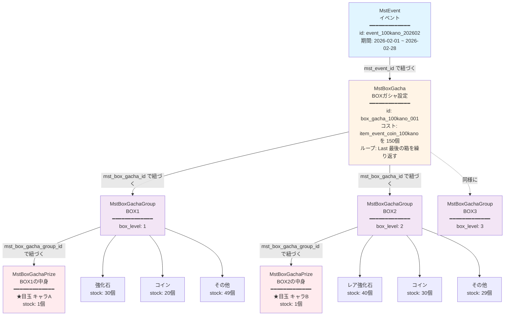
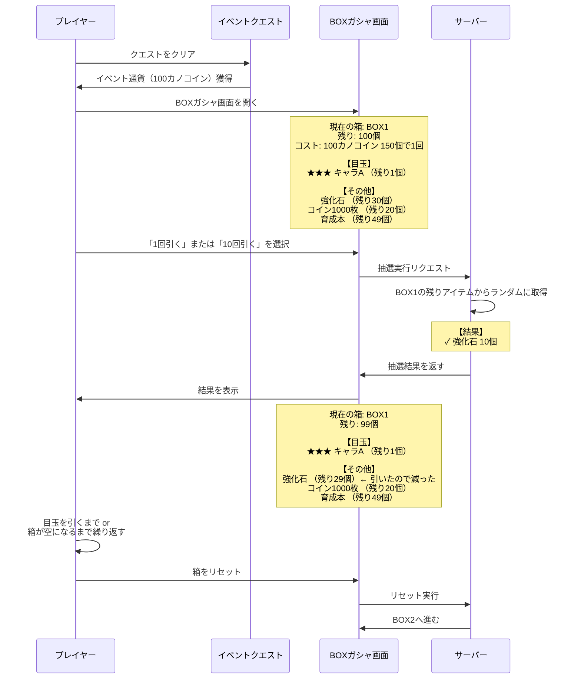
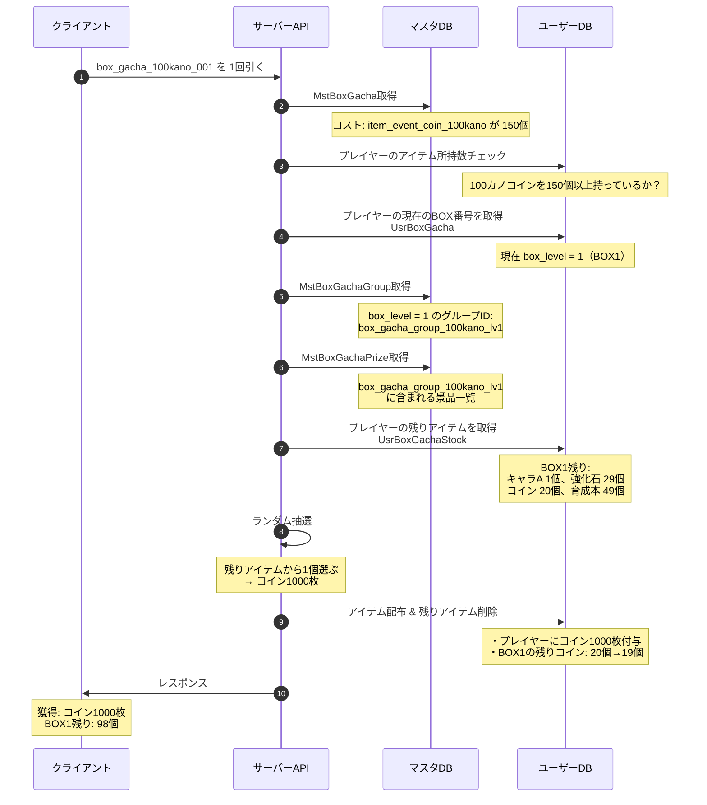
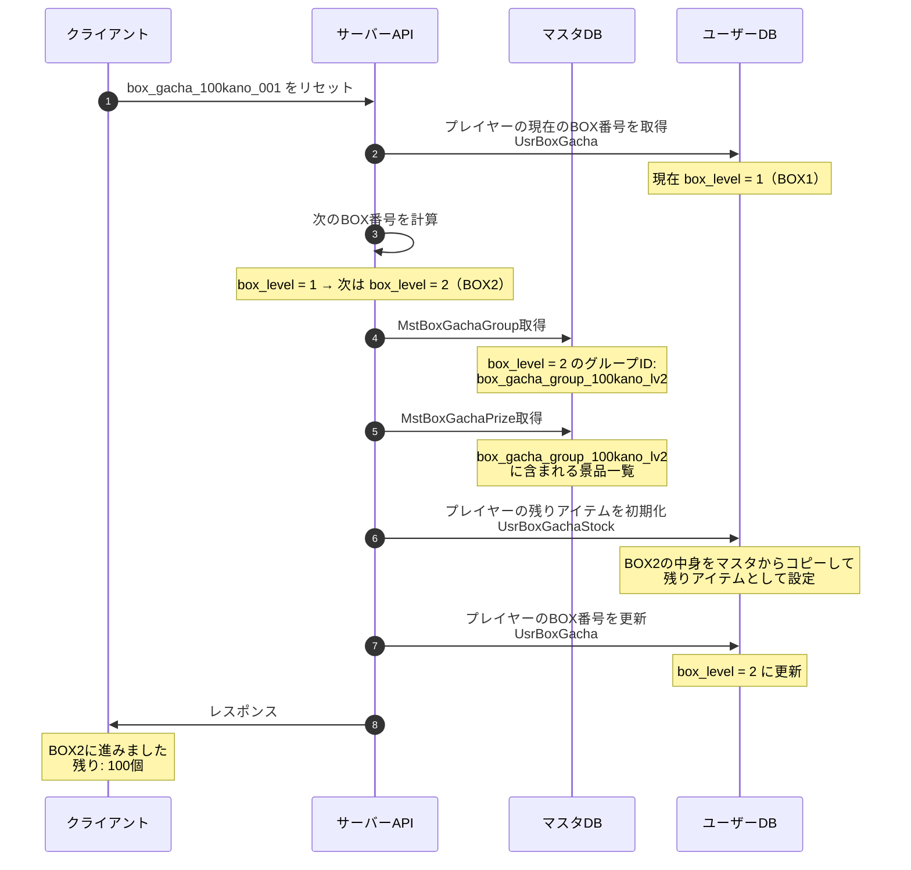
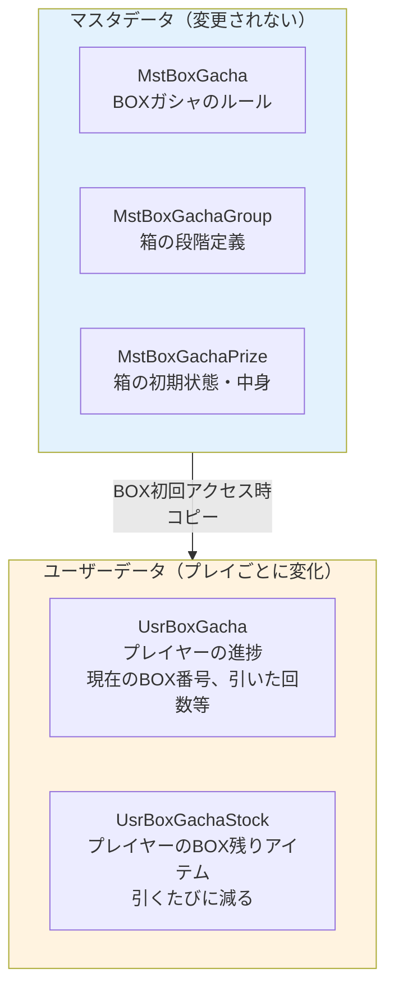
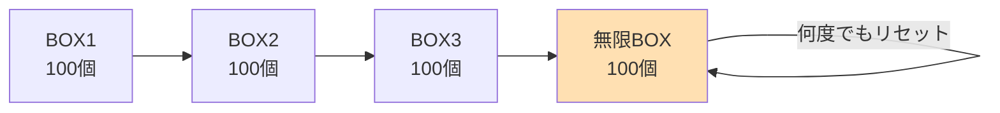
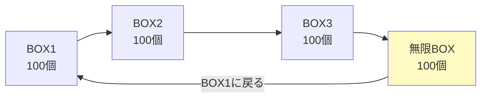
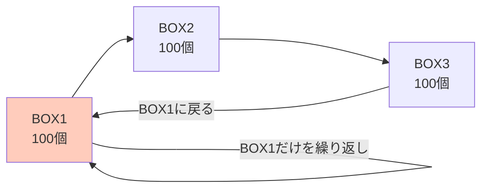
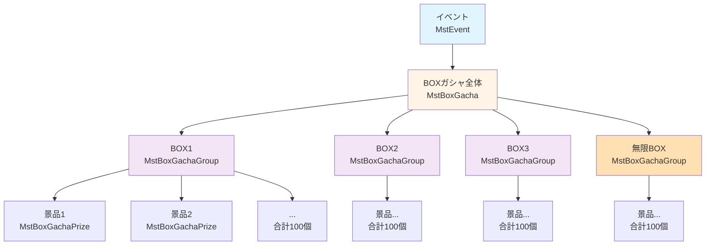

# BOXガシャ テーブル関係図

## 全体像



---

## データの流れ（プレイヤー視点）



---

## テーブル間のデータ参照の流れ

### パターン1: BOXガシャを引くとき



### パターン2: BOXをリセットするとき



---

## マスタデータとユーザーデータの関係



**ポイント:**
- マスタデータは「設計図」
- ユーザーデータは「プレイヤーごとの状態」
- BOX初回アクセス時、マスタの中身をコピーしてユーザーデータを作成
- プレイヤーがガシャを引くたびに、ユーザーデータの残りアイテムが減る

---

## 具体例: プレイヤーAさんの状態

### マスタデータ（全プレイヤー共通）
```
MstBoxGachaPrize（BOX1の初期状態）
┌──────────────────────────────────────┐
│ キャラA:  1個                        │
│ 強化石:  30個                        │
│ コイン:  20個                        │
│ 育成本:  49個                        │
│ ────────────────────────────────     │
│ 合計:   100個                        │
└──────────────────────────────────────┘
```

### プレイヤーAさんのデータ（Aさん専用）
```
UsrBoxGacha（Aさんの進捗）
┌──────────────────────────────────────┐
│ 現在のBOX: BOX1（box_level = 1）    │
│ 累計引き回数: 25回                  │
└──────────────────────────────────────┘

UsrBoxGachaStock（AさんのBOX1残りアイテム）
┌──────────────────────────────────────┐
│ キャラA:  1個 ← まだ引いてない     │
│ 強化石:  18個 ← 12個引いた（30→18）│
│ コイン:  13個 ← 7個引いた（20→13） │
│ 育成本:  43個 ← 6個引いた（49→43） │
│ ────────────────────────────────     │
│ 合計:   75個 ← 25個引いた（100→75）│
└──────────────────────────────────────┘
```

**Aさんの体験:**
- 25回引いて、まだキャラA（目玉）が出ていない
- 残り75個なので、「あと75回引けば必ずキャラAが手に入る」と分かる
- これが「天井の可視化」の仕組み

---

## ループタイプ別の動作

### loop_type = "Last"（最も一般的）



### loop_type = "All"（特殊ケース）



### loop_type = "First"（ほぼ使わない）



---

## まとめ

BOXガシャは以下の階層構造で管理されます：



各テーブルの役割：
- **MstBoxGacha**: ルールブック（コスト、ループ設定）
- **MstBoxGachaGroup**: 箱の段階表（BOX1、BOX2、BOX3、無限BOX）
- **MstBoxGachaPrize**: 箱の中身リスト（何が何個入っているか）

このシンプルな3テーブル構造で、プレイヤーに「天井が見える安心感」を提供できます！
