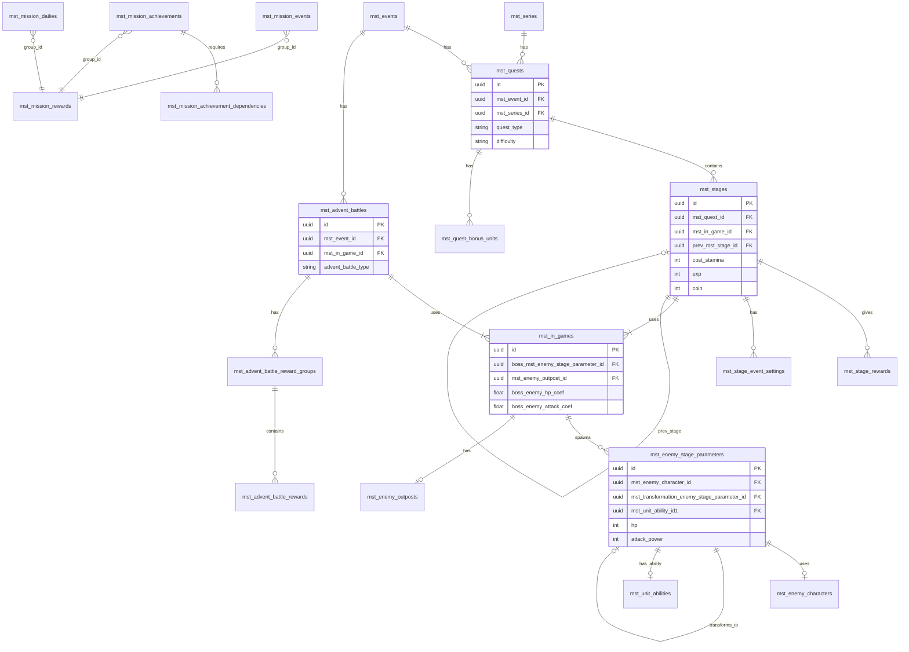
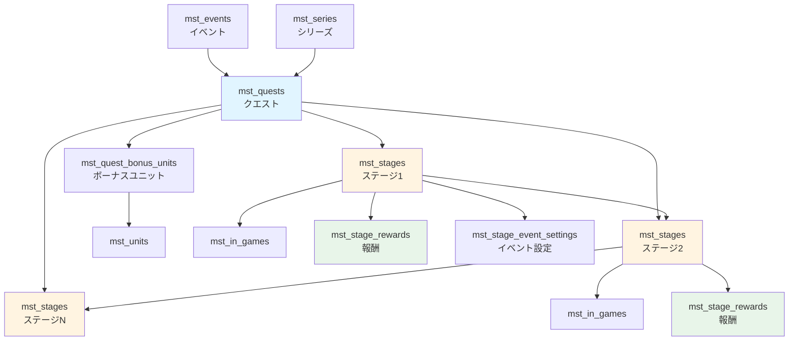
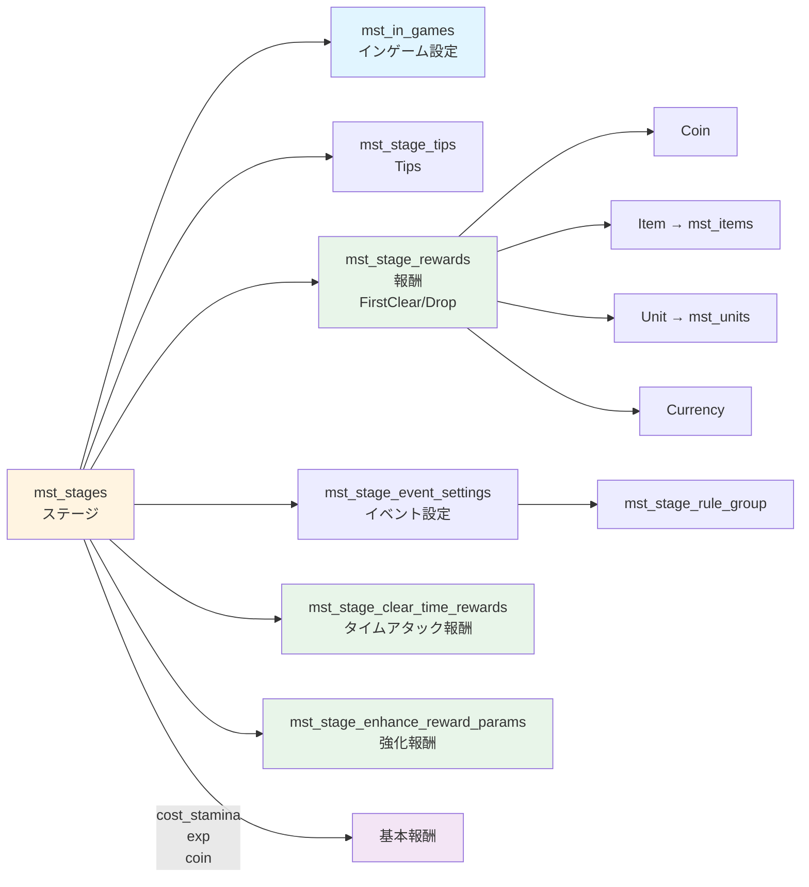
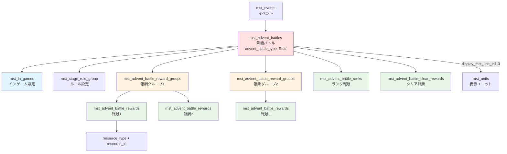
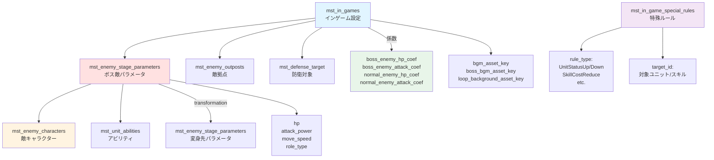
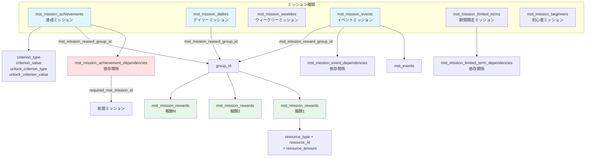
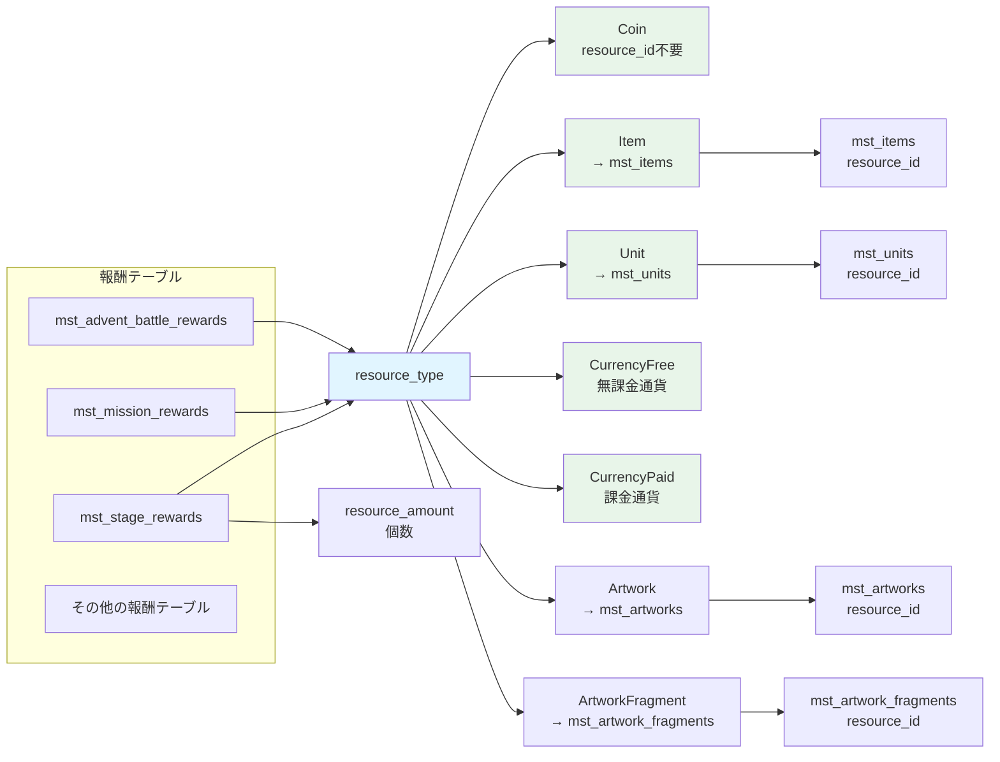

# インゲーム・ステージ・クエスト マスターテーブルリレーション

> 調査日: 2025-12-27
> 対象: glow-server, glow-masterdata

## 概要

インゲーム・ステージ・クエスト関連のマスターテーブル（mst_*, opr_*）のリレーション構造をまとめたドキュメントです。

## 全体像（主要テーブルのリレーション）



---

## テーブル一覧

### クエスト関連
- `mst_quests` - クエストマスター
- `mst_quests_i18n` - クエスト多言語
- `mst_quest_bonus_units` - クエストボーナスユニット
- `mst_quest_event_bonus_schedules` - イベントボーナススケジュール

### ステージ関連
- `mst_stages` - ステージマスター
- `mst_stages_i18n` - ステージ多言語
- `mst_stage_rewards` - ステージ報酬
- `mst_stage_event_settings` - イベントステージ設定
- `mst_stage_event_rewards` - イベントステージ報酬
- `mst_stage_clear_time_rewards` - クリアタイム報酬
- `mst_stage_enhance_reward_params` - 強化ステージ報酬パラメータ
- `mst_stage_end_conditions` - ステージ終了条件
- `mst_stage_tips` - ステージTips

### 降臨バトル関連
- `mst_advent_battles` - 降臨バトルマスター
- `mst_advent_battles_i18n` - 降臨バトル多言語
- `mst_advent_battle_rewards` - 降臨バトル報酬
- `mst_advent_battle_reward_groups` - 降臨バトル報酬グループ
- `mst_advent_battle_ranks` - 降臨バトルランク
- `mst_advent_battle_clear_rewards` - 降臨バトルクリア報酬

### インゲーム関連
- `mst_in_games` - インゲーム設定
- `mst_in_games_i18n` - インゲーム多言語
- `mst_in_game_special_rules` - インゲーム特殊ルール
- `mst_in_game_special_rule_unit_statuses` - 特殊ルールユニットステータス
- `mst_in_game_gimmick_objects` - ギミックオブジェクト

### 敵キャラ関連
- `mst_enemy_characters` - 敵キャラクターマスター
- `mst_enemy_characters_i18n` - 敵キャラクター多言語
- `mst_enemy_stage_parameters` - 敵ステージパラメータ
- `mst_enemy_outposts` - 敵拠点

### ミッション関連
- `mst_mission_achievements` - 達成ミッション
- `mst_mission_achievement_dependencies` - 達成ミッション依存関係
- `mst_mission_beginners` - 初心者ミッション
- `mst_mission_dailies` - デイリーミッション
- `mst_mission_daily_bonuses` - デイリーボーナス
- `mst_mission_weeklies` - ウィークリーミッション
- `mst_mission_events` - イベントミッション
- `mst_mission_event_dependencies` - イベントミッション依存関係
- `mst_mission_event_dailies` - イベントデイリーミッション
- `mst_mission_event_daily_bonuses` - イベントデイリーボーナス
- `mst_mission_event_daily_bonus_schedules` - イベントデイリーボーナススケジュール
- `mst_mission_limited_terms` - 期間限定ミッション
- `mst_mission_limited_term_dependencies` - 期間限定ミッション依存関係
- `mst_mission_rewards` - ミッション報酬

---

## 主要なリレーション構造

### 1. クエスト → ステージ



**主要なカラム:**
- mst_quests: `id`, `mst_event_id`, `mst_series_id`, `quest_type`, `difficulty`
- mst_stages: `id`, `mst_quest_id`, `mst_in_game_id`, `prev_mst_stage_id`
- mst_quest_bonus_units: `mst_quest_id`, `mst_unit_id`, `coin_bonus_rate`

---

### 2. ステージ → インゲーム・報酬



**報酬カテゴリ:**
- `FirstClear`: 初回クリア報酬
- `Drop`: ドロップ報酬（percentage で確率指定）

**resource_type の種類:**
- `Coin`, `Item`, `Unit`, `CurrencyFree`, `CurrencyPaid`, `Artwork`, `ArtworkFragment` など

---

### 3. 降臨バトル → インゲーム・報酬



**主要なカラム:**
- mst_advent_battles: `id`, `mst_event_id`, `mst_in_game_id`, `advent_battle_type`, `challengeable_count`, `initial_battle_point`
- mst_advent_battle_reward_groups: `mst_advent_battle_id`, `group_id`
- mst_advent_battle_rewards: `mst_advent_battle_reward_group_id`, `resource_type`, `resource_id`, `resource_amount`

---

### 4. インゲーム → 敵・ルール



**係数システム:**
- 基本パラメータ（hp, attack_power） × 係数（*_coef） = 実際のゲーム内パラメータ
- ボス敵と通常敵で別々に係数を設定可能

**変身システム:**
- `mst_transformation_enemy_stage_parameter_id`: 変身先の敵パラメータID
- `transformation_condition_type`: 変身条件（HP割合など）
- `transformation_condition_value`: 条件値

---

### 5. ミッション → 報酬



**ミッションの種類:**
- `achievements`: 達成ミッション（永続的）
- `dailies`: デイリーミッション（日次リセット）
- `weeklies`: ウィークリーミッション（週次リセット）
- `events`: イベントミッション（イベント期間限定）
- `limited_terms`: 期間限定ミッション
- `beginners`: 初心者ミッション

**依存関係システム:**
- 前提ミッションをクリアしないと解放されないミッションを定義
- dependencies テーブルで `mst_mission_id` → `required_mst_mission_id` の関係を管理

---

## リレーションパターンまとめ

### 1対多リレーション

| 親テーブル | 子テーブル | 外部キー |
|----------|----------|---------|
| mst_quests | mst_stages | mst_quest_id |
| mst_stages | mst_stage_rewards | mst_stage_id |
| mst_stages | mst_stage_event_settings | mst_stage_id |
| mst_advent_battles | mst_advent_battle_reward_groups | mst_advent_battle_id |
| mst_advent_battle_reward_groups | mst_advent_battle_rewards | mst_advent_battle_reward_group_id |
| mst_mission_achievements | mst_mission_achievement_dependencies | mst_mission_id |

### 多対1リレーション（参照）

| 子テーブル | 親テーブル | 外部キー |
|----------|----------|---------|
| mst_quests | mst_events | mst_event_id |
| mst_quests | mst_series | mst_series_id |
| mst_stages | mst_in_games | mst_in_game_id |
| mst_advent_battles | mst_in_games | mst_in_game_id |
| mst_in_games | mst_enemy_stage_parameters | boss_mst_enemy_stage_parameter_id |
| mst_enemy_stage_parameters | mst_enemy_characters | mst_enemy_character_id |
| mst_enemy_stage_parameters | mst_unit_abilities | mst_unit_ability_id1 |

### 自己参照リレーション

| テーブル | 自己参照キー | 用途 |
|---------|------------|------|
| mst_stages | prev_mst_stage_id | 前ステージ参照 |
| mst_enemy_stage_parameters | mst_transformation_enemy_stage_parameter_id | 変身先敵パラメータ |

---

## 報酬システムの設計

全ての報酬テーブルは以下の共通パターンを採用：



**報酬の共通カラム:**
- `resource_type` (enum): 報酬の種類
- `resource_id`: resource_typeに応じたマスターテーブルのID
- `resource_amount`: 個数

**resource_type の種類:**
- `Coin` → resource_id不要（ゲーム内コイン）
- `Item` → resource_id = mst_items.id
- `Unit` → resource_id = mst_units.id
- `CurrencyFree` → 無課金通貨
- `CurrencyPaid` → 課金通貨
- `Artwork` → resource_id = mst_artworks.id
- `ArtworkFragment` → resource_id = mst_artwork_fragments.id

---

## 特殊な設計パターン

### 1. グループID参照パターン

複数の報酬をグルーピングする際に使用：

```
mst_mission_rewards
  └─ group_id (同じグループIDで複数行)

mst_missions
  └─ mst_mission_reward_group_id (group_idを参照)
```

### 2. 係数（Coefficient）パターン

インゲーム設定で敵の強さを調整：

```
mst_in_games
  ├─ boss_enemy_hp_coef (ボスHP係数)
  ├─ boss_enemy_attack_coef (ボス攻撃力係数)
  ├─ normal_enemy_hp_coef (通常敵HP係数)
  └─ normal_enemy_attack_coef (通常敵攻撃力係数)
```

基本パラメータ × 係数 = 実際のゲーム内パラメータ

### 3. 依存関係パターン

ミッションの前提条件を管理：

```
mst_mission_achievement_dependencies
  ├─ mst_mission_id (対象ミッション)
  └─ required_mst_mission_id (前提ミッション)
```

### 4. i18n（多言語）パターン

テキストデータを別テーブルで管理：

```
mst_quests (基本データ)
  └─ id

mst_quests_i18n (多言語テキスト)
  ├─ quest_id → mst_quests.id
  ├─ locale (ja, en, etc.)
  └─ name, description
```

---

## 運営系テーブル（opr_*）

運営施策・期間限定データは `opr_` プレフィックスで管理：

- `opr_campaigns` - キャンペーン
- `opr_gachas` - ガチャ
- `opr_master_release_controls` - マスターデータリリース制御
- `opr_products` - 商品

これらは `mst_` テーブルから参照されることがあります（例: mst_stages → opr_campaigns）

---

## まとめ

### 主要な設計思想

1. **階層構造**: Quest → Stage → InGame → Enemy
2. **報酬の汎用性**: resource_type + resource_id で柔軟に報酬定義
3. **グループ化**: group_id で複数データをまとめて管理
4. **係数システム**: 敵の強さを柔軟に調整
5. **多言語対応**: i18nテーブルで言語別データを分離
6. **依存関係**: ミッションやステージの前提条件を明示的に管理

### テーブル数

- **クエスト系**: 4テーブル
- **ステージ系**: 9テーブル
- **降臨バトル系**: 6テーブル
- **インゲーム系**: 5テーブル
- **敵キャラ系**: 4テーブル
- **ミッション系**: 17テーブル

**合計**: 45テーブル（i18nテーブル含む）

---

## 参考情報

### スキーマファイル
- `/projects/glow-server/api/database/schema/exports/master_tables_schema.json`

### マスターデータCSV
- `/projects/glow-masterdata/*.csv`

### CSVテンプレート
- `/projects/glow-masterdata/sheet_schema/`
